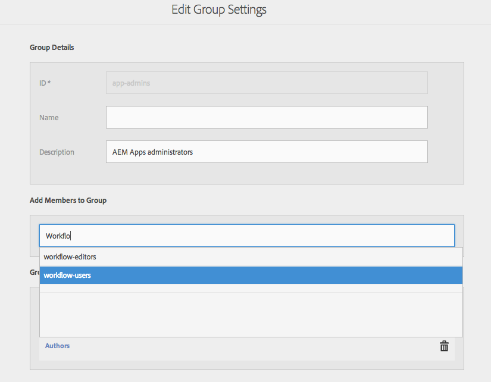

# Configurar usuarios y grupos de usuarios {#configure-your-users-and-user-groups}

>[!NOTE]
>
>Adobe recomienda el uso del Editor de SPA para proyectos que requieren una representación de cliente basada en el marco de aplicaciones de una sola página (por ejemplo, React). [Más información](/help/sites-developing/spa-overview.md).

En este capítulo se describen las funciones de usuario y cómo configurar los usuarios y grupos para que admitan la creación y la gestión de las aplicaciones móviles.

## Usuarios de aplicaciones y administración de grupos de AEM Mobile {#aem-mobile-application-users-and-group-administration}

Para ayudar a organizar y administrar el modelo de permisos de AEM aplicaciones, hay disponibles los dos grupos siguientes:

* administradores de aplicaciones para administradores de aplicaciones
* autores de aplicaciones para autores de aplicaciones

### Autores de contenido de aplicaciones de AEM Mobile (grupo de creación de aplicaciones) {#aem-mobile-application-content-authors-app-author-group}

Los miembros del grupo de creación de aplicaciones son responsables de la creación AEM contenido de aplicaciones móviles, incluidas páginas, texto, imágenes y vídeos.

#### Configuración de grupo: app-author {#group-configuration-app-authors}

1. Cree un nuevo grupo de usuarios llamado &#39;app-author&#39;:

   Vaya al Admin Console de usuarios: [http://localhost:4502/libs/granite/security/content/groupadmin.html](http://localhost:4502/libs/granite/security/content/groupadmin.html)

   Desde la consola de grupo de usuarios, seleccione el botón &#39;+&#39; para crear un grupo.

   Establezca el ID de este grupo en &#39;app-author&#39; para indicar que es un tipo específico de grupo de usuarios autores específico para la creación de aplicaciones móviles dentro de AEM.

1. Añadir miembro en grupo: Autores

   

   Añadir autores de aplicaciones al grupo Autores

1. Ahora que ha creado el grupo de usuarios autores de aplicaciones, puede agregar miembros individuales del equipo a este nuevo grupo a través de la [Consola de administración de usuarios](http://localhost:4502/libs/granite/security/content/useradmin.md).

   

   Editar grupos de usuarios

1. Vaya a la [consola de permisos](http://localhost:4502/useradmin) y agregue permisos para administrar cloudservices

   * (Leer) en /etc/cloudservices
   >[!NOTE]
   >
   >App Authors amplía el grupo predeterminado content-author (Autores) de AEM heredando así la capacidad de crear contenido en /content/phonegap

### Grupo de administradores de aplicaciones de AEM Mobile (grupo de administradores de aplicaciones) {#aem-mobile-application-administrators-group-app-admins-group}

Los miembros del grupo app-admins pueden crear contenido de aplicación con los mismos permisos incluidos con los autores de aplicaciones **AND**, además de ser responsables de:

* Configuración de los servicios en la nube de PhoneGap Build y Adobe Mobile Services en AEM
* Ensayo, publicación y borrado de las actualizaciones OTA de sincronización de contenido de la aplicación

>[!NOTE]
>
>Los permisos determinan la disponibilidad de algunas acciones de usuario en el Centro de comandos de la aplicación de AEM.
>
>Observará que algunas opciones no están disponibles para los creadores de aplicaciones que están disponibles para los administradores de aplicaciones.

#### Configuración de grupo: administradores de aplicaciones {#group-configuration-app-admins}

1. Cree un nuevo grupo llamado administradores de aplicaciones.
1. Añada los siguientes grupos en su nuevo grupo de administradores de aplicaciones:

   * content-author
   * flujos de trabajo-usuarios

   

1. Vaya a la [consola de permisos](http://localhost:4502/useradmin) y agregue permisos para administrar cloudservices

   * (Leer, Modificar, Crear, Eliminar, Replicar) en /etc/cloudservices/mobileservices
   * (Leer, Modificar, Crear, Eliminar, Replicar) en /etc/cloudservices/phonegap-build

1. En la misma consola de permisos, agregue permisos para realizar las actualizaciones de contenido de la aplicación en el escenario, publicarlas y borrarlas

   * (Leer, Modificar, Crear, Eliminar, Replicar) en /etc/packages/mobileapp
   * (Leer) en /var/contentsync

   >[!NOTE]
   >
   >La replicación de paquetes se utiliza para publicar actualizaciones de aplicaciones desde la instancia de autor para publicar la instancia

   >[!CAUTION]
   >
   >Se denegó el acceso a /var/contentsync a OOTB.
   >
   >Si se omite el permiso READ, los paquetes de actualización vacíos se pueden crear y replicar.

1. Añadir miembros a este grupo según sea necesario

## Permisos de mosaico de panel {#dashboard-tile-permissions}

Los mosaicos de panel pueden exponer diferentes acciones en función de los permisos que tenga el usuario. A continuación se describen las acciones disponibles para cada mosaico.

Además de estos permisos, también se puede mostrar u ocultar una acción en función de la configuración de la aplicación actual. Por ejemplo, no tiene sentido exponer la acción &#39;Compilación remota&#39; si no se ha asignado una configuración de nube PhoneGap a la aplicación. Estos se enumerarán a continuación en las secciones &#39;**Condición de configuración**&#39;.

### Administrar mosaico de aplicación {#manage-app-tile}

El mosaico no tiene acciones que requieran permisos, pero la página de detalles de la aplicación tiene las siguientes acciones:

* ** Edición para app-author y app-admin (Déclencheur de la interfaz de usuario - jcr:write - en /content/phonegap/{suffix})
* ** Descargar para app-author y app-admin (Déclencheur de la interfaz de usuario: en /content/phonegap/{suffix})

La siguiente imagen muestra las opciones de descarga y edición de una aplicación:

