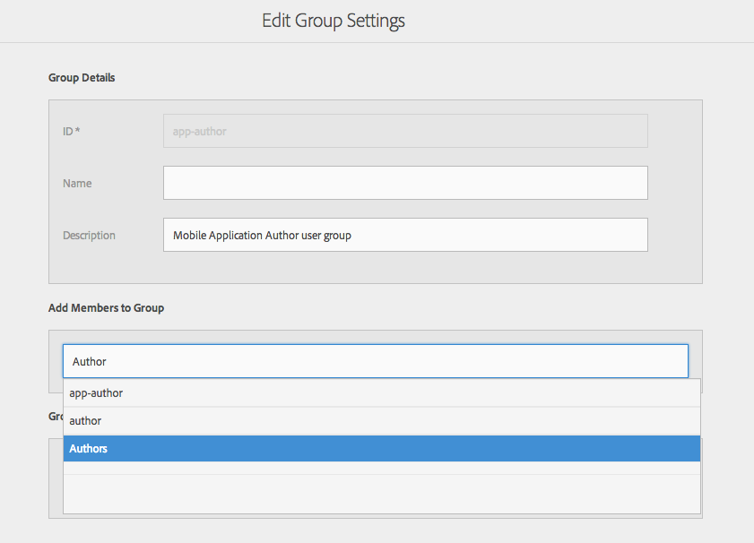
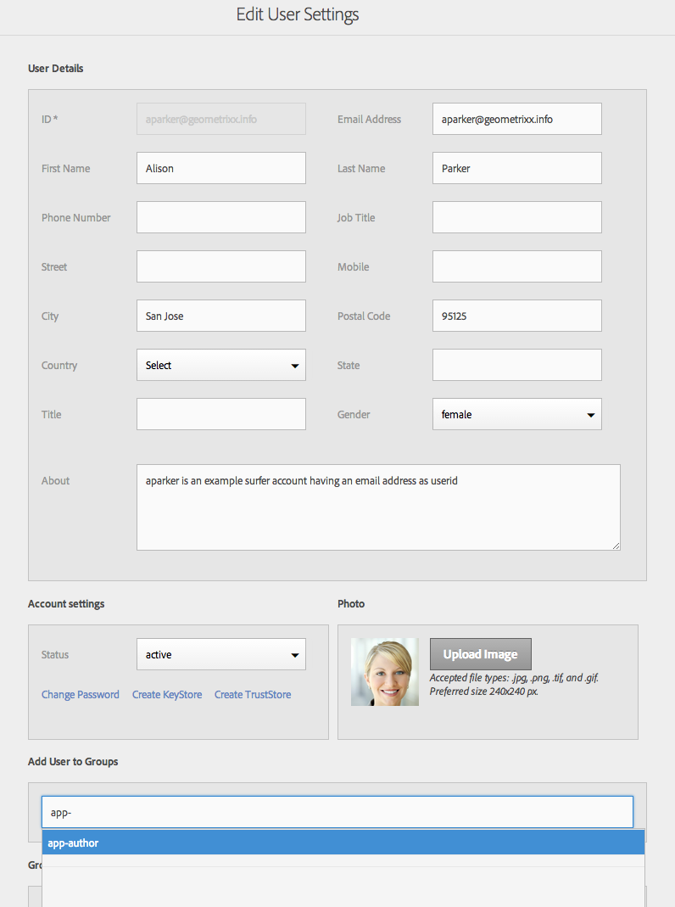
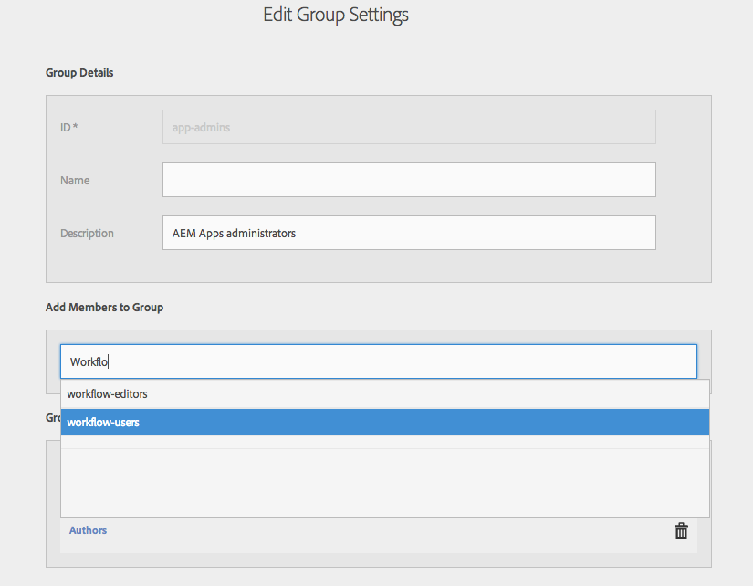
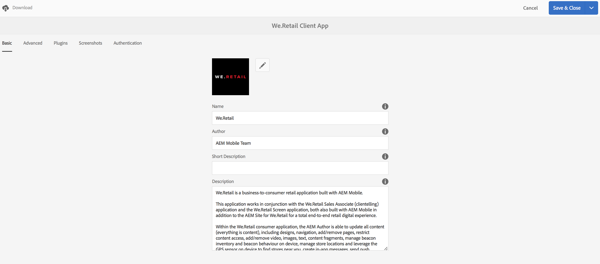

# Configuración de usuarios y grupos de usuarios {#configure-your-users-and-user-groups}

{{ue-over-mobile}}

En este capítulo se describen las funciones de usuario y cómo configurar los usuarios y grupos para que admitan la creación y administración de sus aplicaciones móviles.

## Administración de grupos y usuarios de aplicaciones AEM Mobile {#aem-mobile-application-users-and-group-administration}

Para ayudar a organizar y administrar el modelo de permisos para aplicaciones de AEM, están disponibles los dos grupos siguientes:

* administradores de aplicaciones para administradores de aplicaciones
* App-authors para autores de aplicaciones

### Autores de contenido de aplicaciones de AEM Mobile (grupo de autores de aplicaciones) {#aem-mobile-application-content-authors-app-author-group}

Los miembros del grupo de autores de aplicaciones son responsables de la creación de contenido de aplicaciones móviles de AEM, como páginas, textos, imágenes y vídeos.

#### Configuración de grupo: app-authors {#group-configuration-app-authors}

1. Cree un grupo de usuarios llamado &quot;autores de aplicaciones&quot;:

   Vaya a la Admin Console de usuario: [http://localhost:4502/libs/granite/security/content/groupadmin.html](http://localhost:4502/libs/granite/security/content/groupadmin.html)

   En la consola de grupos de usuarios, seleccione el botón &quot;+&quot; para crear un grupo.

   Establezca el ID de este grupo en &quot;autores de aplicaciones&quot; para indicar que es un tipo específico de grupo de usuarios de creación específico para crear aplicaciones móviles en AEM.

1. Añadir miembro al grupo: Autores

   

   Añadir autores de la aplicación al grupo Autores

1. Ahora que ha creado el grupo de usuarios de autores de aplicaciones, puede agregar integrantes individuales del equipo a este nuevo grupo a través de [User Admin Console](http://localhost:4502/libs/granite/security/content/useradmin.md).

   

   Editar grupos de usuarios

1. Vaya a la consola [Permisos](http://localhost:4502/useradmin) y agregue permisos para administrar cloudservices

   * (Lectura) en /etc/cloudservices

   >[!NOTE]
   >
   >Los autores de aplicaciones amplían el grupo predeterminado content-authors (Authors) de AEM, para que hereden la capacidad de crear contenido en /content/phonegap

### Grupo de administradores de aplicaciones de AEM Mobile (grupo de administradores de aplicaciones) {#aem-mobile-application-administrators-group-app-admins-group}

Los miembros del grupo de administradores de aplicaciones pueden crear contenido de aplicación con los mismos permisos incluidos con los autores de aplicaciones **Y**. Además, también son responsables de lo siguiente:

* Configuración de los servicios en la nube de PhoneGap Build y Adobe Mobile Services en AEM
* Ensayo, publicación y borrado de actualizaciones de OTA de sincronización de contenido de la aplicación

>[!NOTE]
>
>Los permisos determinan la disponibilidad de algunas acciones del usuario en el Centro de comandos de la aplicación de AEM.
>
>Tenga en cuenta que algunas opciones no están disponibles para los autores de aplicaciones que están disponibles para los administradores de aplicaciones.

#### Configuración de grupo: administradores de aplicaciones {#group-configuration-app-admins}

1. Cree un grupo llamado administradores de aplicaciones.
1. Añada los siguientes grupos al nuevo grupo de administradores de aplicaciones:

   * content-authors
   * workflow-users

   

1. Vaya a la consola [Permisos](http://localhost:4502/useradmin) y agregue permisos para administrar cloudservices

   * (Leer, Modificar, Crear, Eliminar, Replicar) en /etc/cloudservices/mobileservices
   * (Leer, Modificar, Crear, Eliminar, Replicar) en /etc/cloudservices/phonegap-build

1. En la misma consola Permisos, agregue permisos para ensayo, publicar y borrar actualizaciones de contenido de la aplicación

   * (Leer, Modificar, Crear, Eliminar, Replicar) en /etc/packages/mobileapp
   * (Lectura) en /var/contentsync

   >[!NOTE]
   >
   >La replicación de paquetes se utiliza para publicar actualizaciones de la aplicación de la instancia de autor a la instancia de publicación

   >[!CAUTION]
   >
   >El acceso a /var/contentsync se deniega de forma predeterminada.
   >
   >Si se omite el permiso READ, los paquetes de actualización vacíos se pueden crear y replicar.

1. Agregar miembros a este grupo según sea necesario

## Permisos del mosaico del panel {#dashboard-tile-permissions}

Los mosaicos del panel pueden exponer diferentes acciones en función de los permisos que tenga el usuario. A continuación se describen qué acciones están disponibles para cada mosaico.

Además de estos permisos, también se puede mostrar u ocultar una acción en función de cómo esté configurada la aplicación actual. Por ejemplo, no tiene sentido exponer la acción &quot;Compilación remota&quot; si no se ha asignado una configuración de nube de PhoneGap a la aplicación. Se enumeran a continuación en las secciones &#39;**Condición de configuración**&#39;.

### Administrar mosaico de aplicación {#manage-app-tile}

Actualmente, el mosaico no tiene acciones que requieran permisos. Sin embargo, la página de detalles de la aplicación tiene las siguientes acciones:

* *Editar* para app-author y app-admin (Déclencheur de interfaz de usuario - jcr:write - en /content/phonegap/{suffix})
* *Descargar* para app-author y app-admin (Déclencheur de la interfaz de usuario - en /content/phonegap/{suffix})

La siguiente imagen muestra las opciones de descarga y edición de una aplicación:

