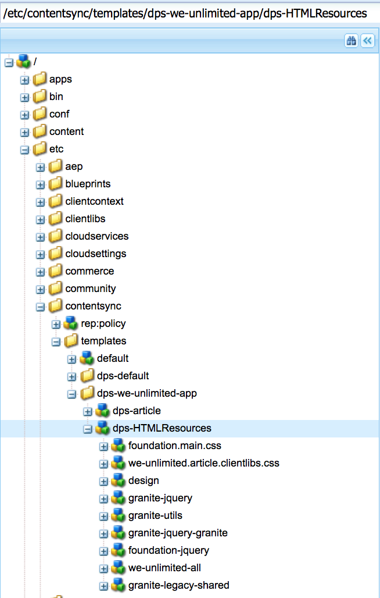

# Creación de la configuración de exportación de recursos compartidos{#creating-shared-resources-export-configuration}

>[!NOTE]
>
>Adobe recomienda utilizar el Editor de SPA para proyectos que requieren una representación del lado del cliente basada en el marco de aplicaciones de una sola página (por ejemplo, React). [Más información](/help/sites-developing/spa-overview.md).

>[!CAUTION]
>
>**Requisitos previos**:
>
>Antes de obtener información sobre la creación y modificación de recursos compartidos, consulte [Sincronización de contenido](/help/mobile/mobile-ondemand-contentsync.md) para comprender los conceptos básicos.

Los usuarios de AEM Mobile utilizan la sincronización de contenido para exportar contenido en directo a contenido estático para utilizarlo en aplicaciones móviles. Esta exportación se produce cuando el contenido se carga en Mobile On-Demand Services desde AEM Mobile.

La propiedad ***dps-exportTemplate*** mencionado en la tabla anterior, define la ruta a las configuraciones de exportación de la aplicación. Establezca esta propiedad para crear y modificar recursos compartidos.

En los siguientes recursos se describe la exportación de recursos compartidos desde Adobe Experience Manager (AEM) para cargarlos en AEM Mobile.

Recursos de HTML compartido permite que los artículos compartan recursos de HTML que, de lo contrario, tendrían que duplicarse para todos los artículos y pueden incluir iconos, fuentes, javascript y css.

La configuración de la sincronización de contenido se encuentra en **&lt;dps-exporttemplate>/dps-HTMLResources>** debe configurarse para exportar todo el contenido que se necesita en un artículo para la representación estática de la propiedad en el dispositivo.

>[!CAUTION]
>
>Puede realizar los pasos siguientes para ver recursos compartidos de ejemplo, solo si tiene:
>
>* se ha instalado el contenido de ejemplo
>* ejecución de AEM instancia
>* no hay contexto personalizado configurado o un puerto diferente
>

Para ver un recurso compartido de ejemplo, consulte los pasos a continuación:

1. Abra el CRXDE Lite en el servidor AEM.
1. Vaya a esta ruta *[/etc/contentsync/templates/dps-we-limited-app/dps-HTMLResources](http://localhost:4502/crx/de/index.jsp#/etc/contentsync/templates/dps-we-unlimited-app/dps-HTMLResources)*, para ver los recursos compartidos de ejemplo.

   Puede ver todas las propiedades necesarias para crear los recursos compartidos, como se muestra en la figura siguiente:

   

>[!NOTE]
>
>Los recursos compartidos deben cargarse o exportarse a AEM Mobile On-demand Services cuando cambie alguno de los recursos compartidos.
