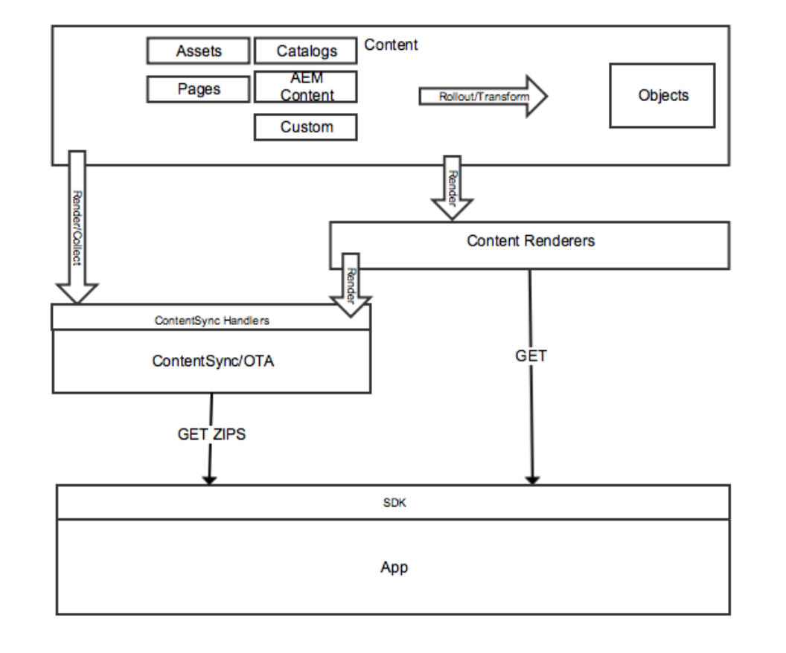

# Entrega de contenido{#content-delivery}

>[!NOTE]
>
>Adobe SPA recomienda utilizar el Editor de para proyectos que requieran una representación del lado del cliente basada en el marco de trabajo de la aplicación de una sola página (por ejemplo, React). [Más información](/help/sites-developing/spa-overview.md).

AEM Las aplicaciones móviles deben poder utilizar todo el contenido en los segmentos según sea necesario para ofrecer la experiencia de la aplicación a la que van dirigidas.

Esto incluye el uso de recursos, contenido del sitio, contenido de CaaS (aéreo) y contenido personalizado que puede tener su propia estructura.

>[!NOTE]
>
>**Contenido en el aire** puede provenir de cualquiera de los elementos anteriores mediante controladores ContentSync. Se puede utilizar para empaquetar y enviar por lotes mediante archivos zip y mantener las actualizaciones de dichos paquetes.

Existen tres tipos principales de material que los servicios de contenido ofrecen:

1. **Assets**
1. **Contenido de HTML empaquetado (HTML/CSS/JS)**
1. **Contenido independiente del canal**

## Assets {#assets}

AEM Las colecciones de recursos son construcciones de recursos que contienen referencias a otras colecciones.

Una colección de recursos se puede exponer a través de Content Services. La llamada a una colección de recursos en una solicitud devuelve un objeto que es una lista de recursos, incluidas sus direcciones URL. Se accede a los recursos a través de una dirección URL. La dirección URL se proporciona en un objeto. Por ejemplo:

* Una entidad de página devuelve el JSON (objeto de página) que incluye una referencia de imagen. La referencia de imagen es una dirección URL que se utiliza para obtener el binario de recursos de la imagen.
* Una solicitud de una lista de recursos en una carpeta devuelve el JSON con detalles sobre todas las entidades de esa carpeta. Esa lista es un objeto. El JSON tiene referencias de URL que se utilizan para obtener el binario de recursos para cada recurso de esa carpeta.

### Optimización de recursos {#asset-optimization}

Un valor clave de Content Services es la capacidad de devolver recursos optimizados para el dispositivo. Esto reduce las necesidades de almacenamiento del dispositivo local y mejora el rendimiento de la aplicación.

La optimización de recursos es una función del lado del servidor, basada en la información proporcionada en la solicitud de API. Siempre que sea posible, las representaciones de recursos deben almacenarse en caché para que las solicitudes similares no requieran la regeneración de la representación de recursos.

### Flujo de trabajo de recursos {#assets-workflow}

El flujo de trabajo de recursos es el siguiente:

1. AEM Referencia de recursos disponible de forma predeterminada en el uso de la
1. Crear una entidad de referencia de recurso a partir de su modelo
1. Editar entidad

   1. Elegir un recurso o una colección de recursos
   1. Personalizar el procesamiento de JSON

El diagrama siguiente muestra la **Flujo de trabajo de referencia de recursos**:

### Administración de recursos {#managing-assets}

AEM AEM Los servicios de contenido proporcionan acceso a recursos administrados por el usuario a los que no se puede hacer referencia a través de otro contenido de la administración de la.

#### Recursos administrados existentes {#existing-managed-assets}

Un usuario de AEM Sites y Assets está utilizando AEM Assets para administrar todo su material digital para todos los canales. Están desarrollando una aplicación móvil nativa y deben utilizar varios recursos administrados por AEM Assets. Por ejemplo, logotipos, imágenes de fondo e iconos de botón.

Actualmente se distribuyen por todo el repositorio de Assets. Los archivos a los que la aplicación debe hacer referencia se encuentran en los siguientes:

* /content/dam/geometrixx-outdoors/brand/logo_light.png
* /content/dam/geometrixx-outdoors/brand/logo_dark.png
* /content/dam/geometrixx-outdoors/styles/backgrounds/grey_blue.jpg
* /content/dam/geometrixx-outdoors/brand/icons/app/cart.png
* /content/dam/geometrixx-outdoors/brand/icons/app/home.png

#### Acceso a entidades de recursos CS {#accessing-cs-asset-entities}

AEM Dejemos de lado los pasos de cómo la página está disponible a través de la API por ahora (está cubierta por la descripción de la interfaz de usuario de) y supongamos que se ha hecho. Se han creado y agregado entidades de recursos al espacio &quot;appImages&quot;. Se han creado carpetas adicionales en el espacio con fines de organización. AEM Por lo tanto, las entidades de recursos se almacenan en el JCR de la como:

* /content/entities/appImages/logos/logo_light
* /content/entities/appImages/logos/logo_dark
* /content/entities/appImages/bkgnd/gray_blue
* /content/entities/appImages/icon/cart
* /content/entities/appImages/icon/home

#### Obtención de una lista de entidades de recursos disponibles {#getting-a-list-of-available-asset-entities}

Un desarrollador de aplicaciones puede obtener una lista de los recursos disponibles recuperando las entidades de los recursos. El extremo del espacio de Content Services puede proporcionar esa información a través del SDK de la API del servicio web.

El resultado sería un objeto en formato JSON que proporcionaría una lista de los recursos de la carpeta &quot;iconos&quot;.

#### Obtención de una imagen {#getting-an-image}

El JSON proporciona una URL para cada imagen generada por los servicios de contenido a la imagen.

Para obtener el binario de la imagen &quot;carrito&quot;, se vuelve a utilizar la biblioteca de cliente.

## Contenido de HTML empaquetado {#packaged-html-content}

Se necesita contenido HTML para los clientes que deben mantener la presentación del contenido. Esto resulta útil para las aplicaciones nativas que utilizan un contenedor web (como una vista web de Cordova) para mostrar el contenido.

AEM Los servicios de contenido proporcionan contenido de HTML a la aplicación móvil mediante la API de. AEM Los clientes que deseen exponer el contenido de la como HTML pueden crear una entidad de página del HTML AEM que apunte a la fuente de contenido de la.

Se tienen en cuenta las siguientes opciones:

* **Archivo zip:** Para tener la mejor oportunidad de mostrarse correctamente en el dispositivo, los recursos css de material, JavaScript, etc. a los que se hace referencia en la página se incluyen en un solo archivo comprimido con la respuesta. Las referencias de la página HTML se pueden ajustar para utilizar una ruta relativa a estos archivos.
* **Transmisión:** AEM Obtención de un manifiesto de los archivos necesarios de la documentación de la administración de archivos de. A continuación, utilice ese manifiesto para solicitar todos los archivos (HTML, CSS, JS, etc.) con solicitudes posteriores.

## Contenido independiente del canal {#channel-independent-content}

AEM El contenido independiente del canal es una forma de exponer construcciones de contenido de canal, como páginas, sin tener que preocuparse por el diseño, los componentes u otra información específica del canal.

AEM Estas entidades de contenido se generan mediante un modelo de contenido para traducir las estructuras de la a un formato JSON. AEM Los datos JSON resultantes contienen información sobre los datos del contenido que están disociados del repositorio de la. AEM Esto incluye la devolución de metadatos y vínculos de referencia a recursos, así como las relaciones entre estructuras de contenido, incluida la jerarquía de entidades.

### Administración de contenido independiente del canal {#managing-channel-independent-content}

El contenido puede llegar a la aplicación de varias formas.

1. ZIPS de contenido de GET AEM por medio de la técnica de sobreexposición de la vía aérea de la

   * Los controladores de sincronización de contenido pueden actualizar el paquete zip directamente o llamando a los procesadores de contenido existentes

      * Controladores de plataforma
      * AEM Manejadores de
      * Controladores personalizados

1. GET de contenido directamente mediante procesadores de contenido

   * Procesadores de Sling predeterminados de forma predeterminada
   * Procesadores de contenido de AEM Mobile/Content Services
   * Procesamientos personalizados
