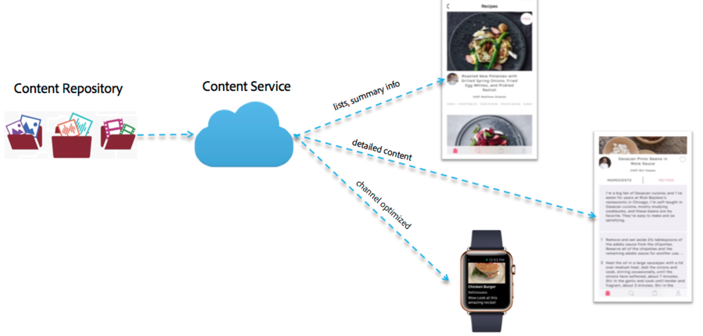

# Entrega de contenido{#content-delivery}

>[!NOTE]
>
>Adobe recomienda el uso del Editor de SPA para proyectos que requieren una representación de cliente basada en el marco de aplicaciones de una sola página (por ejemplo, React). [Más información](/help/sites-developing/spa-overview.md).

Las aplicaciones móviles deben poder utilizar todo el contenido de AEM según sea necesario para ofrecer la experiencia de aplicación de destino.

Esto incluye el uso de recursos, contenido del sitio, contenido de CaaS (sobre el aire) y contenido personalizado que puede tener su propia estructura.

>[!NOTE]
>
>**El contenido** sobre el aire puede provenir de cualquiera de los elementos anteriores a través de los controladores ContentSync. Se puede utilizar para empaquetar y enviar paquetes por lotes a través de zips, así como para mantener las actualizaciones de dichos paquetes.

Existen tres tipos principales de material que ofrece Content Services:

1. **Recursos**
1. **Contenido HTML empaquetado (HTML/CSS/JS)**
1. **Contenido independiente del canal**

## Recursos {#assets}

Las colecciones de recursos son construcciones AEM que contienen referencias a otras colecciones.

Una colección de recursos se puede exponer a través de Content Services. Al llamar a una colección de recursos en una solicitud, se devuelve un objeto que es una lista de los recursos, incluidas sus direcciones URL. Se accede a los recursos a través de una dirección URL. La dirección URL se proporciona en un objeto. Por ejemplo:

* Una entidad de página devuelve JSON (objeto de página) que incluye una referencia de imagen. La referencia de imagen es una URL que se utiliza para obtener el binario de recursos para la imagen.
* Una solicitud de una lista de recursos de una carpeta devuelve JSON con detalles sobre todas las entidades de esa carpeta. Esa lista es un objeto. El JSON tiene referencias URL que se utilizan para obtener el binario de recursos para cada recurso de esa carpeta.

### Optimización de recursos {#asset-optimization}

Un valor clave de Content Services es la capacidad de devolver recursos optimizados para el dispositivo. Esto reduce las necesidades locales de almacenamiento del dispositivo y mejora el rendimiento de la aplicación.

La optimización de recursos será una función del lado del servidor, basada en la información suministrada en la solicitud de API. Siempre que sea posible, las representaciones de recursos deben almacenarse en caché para que solicitudes similares no requieran una regeneración de la representación de recursos.

### Flujo de trabajo de recursos {#assets-workflow}

El flujo de trabajo de recursos es el siguiente:

1. Referencia de recursos disponible en AEM lista para usar
1. Crear entidad de referencia de recursos según su modelo
1. Editar entidad

   1. Seleccionar recurso o colección de recursos
   1. Personalización de la representación JSON

El diagrama siguiente muestra el flujo de trabajo de referencia de **recursos**:

### Administración de recursos {#managing-assets}

Los servicios de contenido proporcionan acceso a los recursos gestionados por AEM a los que no se puede hacer referencia a través de otro contenido de AEM.

#### Recursos gestionados existentes {#existing-managed-assets}

Un usuario existente de Recursos y sitios de AEM utiliza Recursos AEM para gestionar todo el material digital de todos los canales. Están desarrollando una aplicación móvil nativa y necesitan utilizar varios recursos gestionados por Recursos AEM. Por ejemplo logotipos, imágenes de fondo, iconos de botón, etc.

Actualmente, estos se distribuyen alrededor del repositorio de recursos. Los archivos a los que debe hacer referencia la aplicación se encuentran en:

* /content/dam/geometrixx-outdoors/brand/logo_light.png
* /content/dam/geometrixx-outdoors/brand/logo_dark.png
* /content/dam/geometrixx-outdoors/styles/backgrounds/gray_blue.jpg
* /content/dam/geometrixx-outdoors/brand/icons/app/cart.png
* /content/dam/geometrixx-outdoors/brand/icons/app/home.png

#### Acceso a entidades de recursos de CS {#accessing-cs-asset-entities}

Dejemos a un lado los pasos de cómo la página está disponible a través de la API por ahora (estará cubierta por la descripción de la interfaz de usuario de AEM) y supongamos que se ha realizado. Se han creado y agregado entidades de recursos al espacio &quot;appImages&quot;. Se crearon carpetas adicionales en el espacio para fines de organización. Por lo tanto, las entidades de recursos se almacenan en AEM JCR como:

* /content/entity/appImages/logos/logo_light
* /content/entity/appImages/logos/logo_dark
* /content/entity/appImages/bkgnd/gray_blue
* /content/entity/appImages/icons/cart
* /content/entity/appImages/icons/home

#### Obtención de una lista de entidades de recursos disponibles {#getting-a-list-of-available-asset-entities}

Un desarrollador de aplicaciones puede obtener una lista de los recursos disponibles, recuperando las entidades de recursos. El extremo de espacio de Content Services puede proporcionar esa información a través del SDK de la API de servicio web.

El resultado sería un objeto en formato JSON que proporcionaría una lista de los recursos de la carpeta &quot;icons&quot;.

#### Obtención de una imagen {#getting-an-image}

El JSON proporciona una URL para cada imagen, generada por Content Services para la imagen.

Para obtener el binario de la imagen &quot;carrito&quot;, se utiliza de nuevo la biblioteca cliente.

## Contenido HTML empaquetado {#packaged-html-content}

El contenido HTML es necesario para los clientes que necesitan mantener el diseño del contenido. Esto resulta útil para que las aplicaciones nativas que utilizan un contenedor web, como una vista web de Cordova, muestren el contenido.

Los servicios de contenido de AEM podrán proporcionar contenido HTML a la aplicación móvil mediante la API. Los clientes que deseen exponer contenido de AEM como HTML crearán una entidad de página HTML que señale al origen de contenido de AEM.

Se consideran las siguientes opciones:

* **** Archivo zip: Para tener la mejor oportunidad de mostrarse correctamente en el dispositivo, todo el material referenciado de la página: css, JavaScript, recursos, etc. - se incluirá en un solo archivo comprimido con la respuesta. Las referencias de la página HTML se ajustarán para utilizar una ruta relativa a estos archivos.
* **** Flujo continuo: Obtención de un manifiesto de los archivos necesarios desde AEM. A continuación, utilice ese manifiesto para solicitar todos los archivos (HTML, CSS, JS, etc.) con solicitudes posteriores.

## Contenido independiente del canal {#channel-independent-content}

El contenido independiente del canal es una forma de exponer las construcciones de contenido de AEM, como las páginas, sin preocuparse por el diseño, los componentes u otra información específica del canal.

Estas entidades de contenido se generan con un modelo de contenido para traducir las estructuras de AEM a un formato JSON. Los datos JSON resultantes contienen información sobre los datos del contenido, que se desvinculan del repositorio de AEM. Esto incluye devolver metadatos y vínculos de referencia de AEM a los recursos, así como las relaciones entre las estructuras de contenido, incluida la jerarquía de entidades.

### Administración del contenido independiente del canal {#managing-channel-independent-content}

El contenido puede acceder a la aplicación de varias formas.

1. OBTENER contenido ZIPS mediante AEM Over-the-Air

   * Los controladores de sincronización de contenido pueden actualizar el paquete zip directamente o llamando a los procesadores de contenido existentes

      * Controladores de plataforma
      * Controladores AEMM
      * Controladores personalizados

1. OBTENER contenido directamente a través de los procesadores de contenido

   * Representadores de Sling predeterminados listos para usar
   * Representadores de contenido de AEM Mobile/Content Services
   * Procesos personalizados

