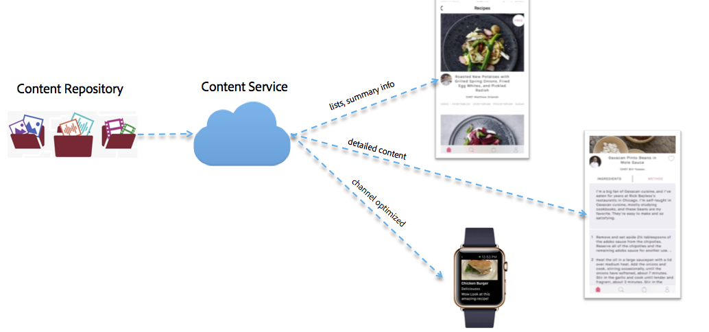

# Content Services{#content-services}

>[!NOTE]
>
>Adobe SPA recomienda utilizar el Editor de para proyectos que requieran una representación del lado del cliente basada en el marco de trabajo de la aplicación de una sola página (por ejemplo, React). [Más información](/help/sites-developing/spa-overview.md).

>[!CAUTION]
>
>La función Servicios de contenido está documentada únicamente con fines de vista previa.
>
>Está sujeto a cambios con el lanzamiento del paquete de servicio 1 de 6.3 GA.

AEM Mobile AEM Content Services es una función ligera para solicitar contenido que administra el usuario de forma independiente. AEM Esto proporciona a todos los desarrolladores de aplicaciones una forma de alto rendimiento de recuperar contenido sin tener que tener conocimientos profundos de repositorio de contenido (JCR) y marco de trabajo web (Sling). Permite que las aplicaciones solicitantes se disocien del repositorio de contenido.

AEM AEM Content Services introduce varias construcciones de nuevas que permiten a un desarrollador acceder a contenido administrado por el usuario sin tener conocimiento de la estructura del repositorio de ese contenido.

AEM Estas construcciones son necesarias para mantener la flexibilidad y permitir la expansión futura mediante la provisión de una capa de abstracción entre el contenido administrado por el usuario y las aplicaciones móviles que consumen el contenido. AEM AEM Esto permite que los servicios de contenido de la aplicación funcione como una capa de abstracción entre los requisitos de contenido de la aplicación nativa y el repositorio de contenido de la aplicación de la aplicación de la aplicación de la que se dispone en el sitio de la aplicación de la aplicación de la aplicación de la aplicación de la aplicación de la aplicación de contenido.

Los servicios de contenido pueden entregar el contenido como recursos, HTML empaquetado (HTML/CSS/JS) o como contenido independiente del canal.

>[!CAUTION]
>
>**Requisitos previos:**
>
>Antes de empezar a usar los servicios de contenido, asegúrese de habilitar el indicador Servicios de contenido. Para habilitar la creación y administración de modelos en la aplicación, habilite los modelos de datos en el Explorador de configuración.
>
>Consulte **[Administración de servicios de contenido](/help/mobile/developing-content-services.md)** y el [Explorador de configuración](/help/sites-administering/configurations.md) para obtener más información.

Después de establecer el indicador Servicios de contenido y de habilitar los modelos de datos en el Explorador de configuración, consulte los recursos siguientes para empezar a utilizar los servicios de contenido de AEM Mobile. Familiarícese con los Conceptos de servicios de contenido como administración de modelos, administración de entidades seguida de entrega/representación de contenido para los servicios de contenido de AEM Mobile.

* Modelos en el repositorio
* Procesamiento y entrega
