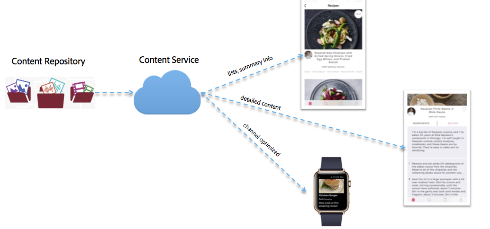

# Servicios de contenido{#content-services}

{{ue-over-mobile}}

>[!CAUTION]
>
>La función Servicios de contenido está documentada únicamente con fines de vista previa.
>
>Está sujeto a cambios con el lanzamiento del paquete de servicio 1 de 6.3.

AEM Mobile Content Services es una función ligera para solicitar contenido que administra AEM. Esto proporciona a todos los desarrolladores de aplicaciones una forma de alto rendimiento de recuperar contenido sin tener que tener conocimientos profundos del repositorio de contenido (JCR) y el marco web (Sling) de AEM. Permite que las aplicaciones solicitantes se disocien del repositorio de contenido.

Content Services presenta varias construcciones de AEM nuevas que permiten a un desarrollador acceder a contenido administrado por AEM sin conocer la estructura del repositorio de ese contenido.

Estas construcciones son necesarias para mantener la flexibilidad y permitir una futura expansión mediante la provisión de una capa de abstracción entre el contenido administrado por AEM y las aplicaciones móviles que consumen el contenido. Esto permite que AEM Content Services funcione como una capa de abstracción entre los requisitos de contenido de la aplicación nativa y el repositorio de contenido de AEM.

Los servicios de contenido pueden entregar el contenido como recursos, HTML empaquetado (HTML/CSS/JS) o como contenido independiente del canal.

>[!CAUTION]
>
>**Requisitos previos:**
>
>Antes de empezar a usar los servicios de contenido, asegúrese de habilitar el indicador Servicios de contenido. Para habilitar la creación y administración de modelos en la aplicación, habilite los modelos de datos en el Explorador de configuración.
>
>Consulte **[Administración de servicios de contenido](/help/mobile/developing-content-services.md)** y la documentación de [Explorador de configuración](/help/sites-administering/configurations.md) para obtener más información.

Después de establecer el indicador Servicios de contenido y de habilitar los modelos de datos en el Explorador de configuración, consulte los recursos siguientes para empezar a utilizar los servicios de contenido de AEM Mobile. Familiarícese con los Conceptos de servicios de contenido como administración de modelos, administración de entidades seguida de entrega/representación de contenido para los servicios de contenido de AEM Mobile.

* Modelos en el repositorio
* Procesamiento y entrega
