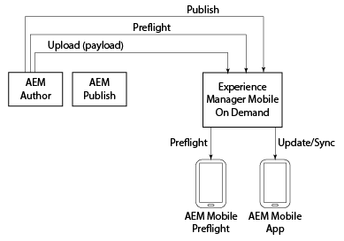

# AEM Mobile On-Demand{#aem-mobile-on-demand}

{{ue-over-mobile}}

>[!NOTE]
>
>Si no usa Adobe Experience Manager (AEM) como fuente de administración de contenido, consulte la [Ayuda de AEM Mobile On-demand Services](https://helpx.adobe.com/digital-publishing-solution/topics.html).

AEM proporciona varias herramientas que le permiten integrar el contenido en aplicaciones móviles.

El diagrama siguiente ilustra cómo los distintos componentes de AEM Mobile y On-Demand Services encajan para ofrecer contenido a las aplicaciones móviles.

La aplicación AEM Preflight puede considerarse un entorno de prueba para previsualizar la aplicación y el contenido antes de publicarla, mientras que la aplicación de AEM Mobile es la última creada para su distribución.

>[!NOTE]
>
>Para obtener información detallada acerca de la aplicación Preflight, consulte [Uso de la aplicación Preflight de AEM](https://helpx.adobe.com/digital-publishing-solution/help/preflight-app.html) en la Ayuda de AEM Mobile On-demand Services.

>[!NOTE]
>
>En el diagrama anterior, la instancia de publicación de AEM no es necesaria para un escenario de implementación típico en AEM Mobile On-demand Services.

## Inicio de una nueva aplicación móvil {#starting-a-new-mobile-app}

AEM Mobile es solo uno de los pilares que conforman la plataforma completa de AEM.

El inicio de una nueva experiencia de aplicación de AEM Mobile requiere una cohesión de funciones antes de que esté lista para la edición de contenido. Las siguientes funciones proporcionan un punto de partida para crear una aplicación de AEM Mobile:

* **Administrador**
* **Desarrollador**
* **Autor**

>[!NOTE]
>
>Antes de trabajar con AEM Mobile y seguir los pasos de esta guía de introducción, los usuarios deben estar familiarizados con AEM. Conozca los conceptos básicos de AEM [aquí](/help/sites-deploying/deploy.md).

### Explicación del panel de aplicaciones de AEM Mobile {#understanding-the-aem-mobile-application-dashboard}

Antes de comprender las funciones y responsabilidades, el usuario debe conocer a fondo **AEM Mobile Control Center** o **Application Dashboard**. Haga clic [aquí](/help/mobile/mobile-apps-ondemand-application-dashboard.md) para obtener información detallada.

### Administrador de AEM {#aem-administrator}

Un ***administrador de AEM*** es responsable de agregar una aplicación al catálogo de AEM Mobile, ya sea creando una aplicación con el asistente para la creación o importando una aplicación existente. Los administradores de AEM que crean una aplicación con el *asistente para la creación de aplicaciones* de AEM Mobile suelen seleccionar una de las plantillas de aplicaciones deseadas de las muestras de referencia listas para usar de Adobe o (normalmente) una plantilla de aplicación personalizada creada por *desarrolladores de AEM.*

Un administrador de AEM es responsable de las siguientes tareas al crear una aplicación con AEM Mobile On-demand Services:

* [Configuración de AEM Mobile](/help/mobile/aem-mobile-setup.md)
* [Configuración de los usuarios y grupos de usuarios](/help/mobile/aem-mobile-configure-users.md)
* [Vista previa con comprobación preliminar](/help/mobile/aem-mobile-manage-ondemand-services.md)
* [Administración de servicios de contenido](/help/mobile/developing-content-services.md)

Para comenzar con las funciones y responsabilidades de un administrador, consulte [Administración de contenido para usar AEM Mobile On-demand Services](/help/mobile/aem-mobile.md).

## AEM Developer {#aem-developer}

Un **desarrollador de AEM** amplía y crea plantillas web y componentes personalizados para permitir que *AEM Author *cree experiencias móviles hermosas y atractivas. Estas plantillas y componentes no solo están optimizadas para el mundo de las aplicaciones móviles, sino que se comunican tanto con el dispositivo como con el servidor de AEM (cualquier servidor remoto) a los puntos finales de servicios omnicanal. *Autores de AEM* utilizan el editor de contenido integrado de AEM para crear experiencias enriquecidas y relevantes en la aplicación, incluida la integración con el resto de Adobe Experience Cloud.

Un desarrollador de AEM es responsable de las siguientes tareas al crear una aplicación con AEM Mobile On-demand Services:

* [Plantillas y componentes de aplicación](/help/mobile/app-templates-and-components1.md)
* [Móvil con sincronización de contenido](/help/mobile/mobile-ondemand-contentsync.md)
* [Propiedades de contenido y exportación de contenido](/help/mobile/on-demand-content-properties-exporting.md)
* [Desarrollo de AEM Mobile Content Services](/help/mobile/developing-content-services.md)

Para empezar a usar las funciones y responsabilidades de Desarrollador, consulte [Desarrollo del contenido de AEM para AEM Mobile On-demand Services](/help/mobile/aem-mobile-on-demand.md).

>[!NOTE]
>
>La función *AEM developer* no comienza ni finaliza con el desarrollo de plantillas y componentes. Un *desarrollador de AEM* puede crear una aplicación completamente nueva en lugar de extender el ejemplo de implementación de referencia listo para usar.

## AEM Author {#aem-author}

Un ***autor de AEM* (o *experto en marketing*)**&#x200B;usa las plantillas y los componentes personalizados desarrollados o listos para usar para agregar y editar páginas, arrastrar y soltar componentes y agregar medios de todos los tipos desde DAM, incluidas imágenes, vídeos y fragmentos de texto (fragmentos de contenido). *Autores de AEM* utilizan el editor de contenido integrado de AEM para crear experiencias enriquecidas y relevantes en la aplicación, incluida la integración con el resto de Adobe Experience Cloud.

Un autor de AEM debe comprender los siguientes temas al crear una aplicación con AEM Mobile On-demand Services:

* [AEM Mobile Application Dashboard](/help/mobile/mobile-apps-ondemand-application-dashboard.md)
* [Acciones de creación y configuración de aplicaciones](/help/mobile/mobile-apps-ondemand-application-create-configure-action.md)
* [Configuración de nube](/help/mobile/mobile-on-demand-associating-an-on-demand-app-to-cloud-configuration.md)
* [Administración de contenido](/help/mobile/mobile-apps-ondemand-manage-content-ondemand.md)
* [Información general de servicios de contenido](/help/mobile/develop-content-as-a-service.md)

Para comenzar con las funciones y responsabilidades de un autor, consulte [Creación de contenido de AEM para la aplicación de AEM Mobile On-demand Services](/help/mobile/mobile-apps-ondemand.md).

>[!NOTE]
>
>Un autor de AEM también es responsable de configurar los derechos, crear tarjetas y diseños y enviar notificaciones push. Además, para obtener más información sobre los métodos para crear contenido, administrar artículos y colecciones, crear titulares, tarjetas y diseños en AEM Mobile, consulte [AEM Mobile On-Demand Portal](https://helpx.adobe.com/digital-publishing-solution/topics.html#dynamicpod_reference_2).
