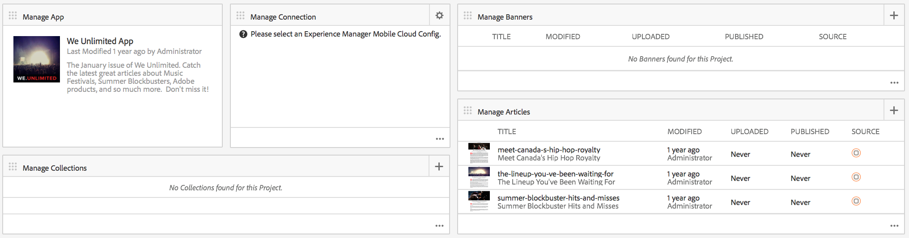

# Panel de aplicaciones de AEM Mobile {#aem-mobile-application-dashboard}

>[!NOTE]
>
>Adobe recomienda el uso del Editor de SPA para proyectos que requieren una representación de cliente basada en el marco de aplicaciones de una sola página (por ejemplo, React). [Más información](/help/sites-developing/spa-overview.md).

Puede administrar el contenido de la aplicación y de la aplicación móvil desde el panel de aplicaciones de AEM Mobile o desde el centro de control.

Puede explorar cada mosaico en el Centro de control para ver o editar los detalles haciendo clic en el botón &#39;...&#39; en la esquina inferior derecha.

>[!NOTE]
>
>Puede reorganizar el orden de los mosaicos haciendo clic en el icono de agarrador del mosaico (9 puntos superior izquierdo). El cambio de orden es específico del usuario, diferente para usuarios individuales.

La administración del contenido de la aplicación requiere un esfuerzo colectivo de los desarrolladores, autores de contenido y administradores. Los autores manipulan las páginas, que a su vez se basan en plantillas y componentes generados por los desarrolladores de la aplicación.

Por último, los administradores publican estratégicamente el contenido actualizado de la aplicación.

## El icono Administrar aplicación {#the-manage-app-tile}

El icono **Administrar aplicación** muestra la información de la aplicación disponible:

* Título
* Descripción
* Icono
* Última modificación
* Última modificación realizada por

## El icono Administrar conexión {#the-manage-connection-tile}

El mosaico **Administrar conexión** muestra la información de conexión de On-Demand Services de AEM Mobile:

* Nombre de configuración de nube
* Nombre e ID del proyecto
* Estado de la conexión

>[!NOTE]
>
>Haga clic en el engranaje en la parte superior derecha para configurar una nube móvil bajo demanda.
>
>Consulte [Configuración de Mobile On-Demand Services](/help/mobile/mobile-on-demand-associating-an-on-demand-app-to-cloud-configuration.md) para obtener más información.

## Administración de entidades {#managing-entities}

Estos tres mosaicos proporcionan información general sobre el estado del contenido de una aplicación:

* **titulares**
* **artículos**
* **colecciones**

Cada mosaico puede expandirse para proporcionar una vista de lista más detallada haciendo clic en los puntos suspensivos (...) en la esquina inferior derecha. Estas vistas de lista proporcionan una forma alternativa de acceder a acciones comunes de Mobile On Demand, como eliminar, cargar y editar propiedades.

### Mosaico Administrar pancartas {#the-manage-banners-tile}

El mosaico **Administrar pancartas** le permite administrar el contenido de un letrero. Se muestra la siguiente información para una pancarta:

* imagen
* **TÍTULO**: nombre del letrero
* **MODIFICADO**: última modificación en AEM
* **CARGADO**: última carga desde AEM
* **PUBLICADO**: última solicitud publicada de AEM
* **FUENTE**: origen (AEM local o remoto desde Mobile On Demand)

La siguiente imagen muestra el mosaico **Administrar pancartas** en el panel de aplicaciones de AEM Mobile:

>[!NOTE]
>
>Consulte **[Administración de letreros](/help/mobile/mobile-on-demand-managing-banners.md)**para crear, eliminar o actualizar los letreros.

### Mosaico Administrar artículos {#the-manage-articles-tile}

El mosaico **Administrar artículos** permite administrar el contenido de un artículo. Se muestra la siguiente información para un artículo:

* imagen
* **TÍTULO**: nombre del artículo
* **MODIFICADO**: última modificación en AEM
* **CARGADO**: última carga desde AEM
* **PUBLICADO**: última solicitud publicada de AEM
* **FUENTE**: origen (AEM local o remoto desde Mobile On-Demand)

La siguiente imagen muestra el mosaico **Administrar artículos** en el panel de aplicaciones de AEM Mobile:

>[!NOTE]
>
>Consulte [**Administración de artículos **](/help/mobile/mobile-on-demand-managing-articles.md)para crear, eliminar o actualizar los artículos.

### El icono Administrar colecciones {#the-manage-collections-tile}

El mosaico **Administrar colecciones** le permite administrar el contenido de una colección. Se muestra la siguiente información para una colección:

* imagen
* **TÍTULO**: nombre de la colección
* **MODIFICADO**: última modificación en AEM
* **CARGADO**: última carga desde AEM
* **PUBLICADO**: última solicitud publicada de AEM
* **FUENTE**: origen (AEM local o remoto desde Mobile On-Demand)

La siguiente imagen muestra el mosaico **Administrar colecciones** en el panel de aplicaciones de AEM Mobile:

>[!NOTE]
>
>Consulte **[Administración de colecciones](/help/mobile/mobile-on-demand-managing-collections.md)**para crear, eliminar o actualizar las colecciones.

### Pasos siguientes {#the-next-steps}

Una vez que esté familiarizado con el panel de la aplicación, consulte los siguientes recursos para crear una aplicación móvil:

* [Acciones de creación y configuración de aplicaciones](/help/mobile/mobile-apps-ondemand-application-create-configure-action.md)
* [Asociación de una aplicación bajo demanda a una configuración de nube](/help/mobile/mobile-on-demand-associating-an-on-demand-app-to-cloud-configuration.md)
* [Acciones de administración de contenido](/help/mobile/mobile-apps-ondemand-manage-content-ondemand.md)

### Additional Resources {#additional-resources}

Para obtener más información sobre las funciones y responsabilidades de un administrador y un desarrollador, consulte los siguientes recursos:

* [Desarrollo de contenido de AEM para los servicios bajo demanda de AEM Mobile](/help/mobile/aem-mobile-on-demand.md)
* [Administración de contenido para utilizar los servicios bajo demanda de AEM Mobile](/help/mobile/aem-mobile.md)

