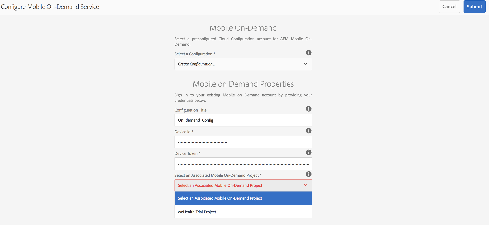

# Configuración de nube{#cloud-configuration}

>[!NOTE]
>
>Adobe recomienda el uso del Editor de SPA para proyectos que requieren una representación de cliente basada en el marco de aplicaciones de una sola página (por ejemplo, React). [Más información](/help/sites-developing/spa-overview.md).

La asociación de una aplicación bajo demanda a una configuración de nube permite a Adobe Experience Manager (AEM) comunicarse directamente con un proyecto alojado de Mobile On-Demand estableciendo un vínculo bidireccional. Al vincular su aplicación a un proyecto de Mobile On-Demand, podrá crear contenido, como artículos, pancartas y colecciones dentro de AEM, pero también podrá utilizarlo en Mobile On-Demand.

A partir de ahí, se puede publicar, previsualizar y administrar el contenido. También puede importar contenido de Mobile On-Demand existente en AEM y realizar ediciones de contenido.

## Configuración de la nube {#setting-up-cloud-configuration}

>[!CAUTION]
>
>Antes de empezar a configurar la configuración de nube para la aplicación bajo demanda, debe estar familiarizado con AEM Mobile Provisioning y Configuring AEM Mobile On-Demand Services Client.
>
>Para obtener más información, consulte [Configuración de los servicios](/help/mobile/aem-mobile-setup.md) bajo demanda de AEM Mobile en la sección Administración.

Para configurar Mobile On-Demand Cloud Services, haga clic en el engranaje superior situado en la esquina superior derecha del mosaico **Administrar conexión** del tablero de aplicaciones.

Debe estar familiarizado con el panel de la aplicación y los mosaicos disponibles. Consulte el panel de la aplicación [AEM Mobile](/help/mobile/mobile-apps-ondemand-application-dashboard.md) para obtener más información.

### Configuración del vínculo a la configuración de nube {#setting-up-link-to-cloud-configuration}

>[!CAUTION]
>
>Asegúrese de tener una configuración de cliente y nube bajo demanda existente.
>
>Para obtener más información, consulte [Configuración de los servicios](/help/mobile/aem-mobile-setup.md) bajo demanda de AEM Mobile en la sección Administración.

En los pasos siguientes se describe la configuración del vínculo a la configuración de nube:

1. En **Mobile**, elija **Aplicaciones** y, a continuación, su aplicación móvil bajo demanda en el catálogo.
1. Haga clic en el icono de engranaje en el mosaico **Administrar conexión** .

   

1. Introduzca la configuración existente o cree una nueva introduciendo el Título **de** configuración, el Id **** de dispositivo y el autentificador **** del dispositivo.

   

1. Una vez verificados el ID **del** dispositivo y el autentificador **del** dispositivo, elija el proyecto bajo demanda en la lista.

   Haga clic en **Enviar**.

   

   El mosaico **Administrar conexión** muestra la configuración de la nube.

   

   >[!CAUTION]
   >
   >Si intenta cambiar el proyecto al que está asociada esta aplicación mientras cambia de proyecto en el tablero, recibirá una advertencia para los problemas de integridad del contenido, como se muestra en la figura siguiente:

   

### Pasos siguientes {#the-next-steps}

Una vez configurada la configuración de nube para la aplicación, consulte los siguientes recursos para administrar el contenido:

* [Administración de artículos](/help/mobile/mobile-on-demand-managing-articles.md)
* [Administración de pancartas](/help/mobile/mobile-on-demand-managing-banners.md)
* [Administración de colecciones](/help/mobile/mobile-on-demand-managing-collections.md)
* [Carga de recursos compartidos](/help/mobile/mobile-on-demand-shared-resources.md)
* [Publicación/Cancelación de la publicación del contenido](/help/mobile/mobile-on-demand-publishing-unpublishing.md)
* [Vista previa con verificación previa](/help/mobile/aem-mobile-manage-ondemand-services.md)
