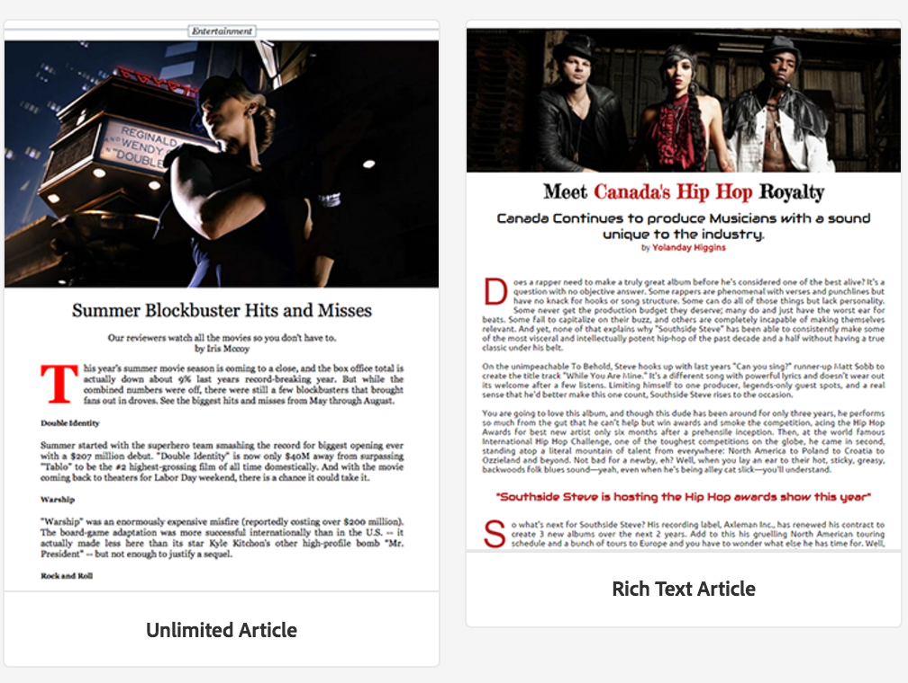

# Crear y agregar plantillas y componentes {#creating-and-adding-templates-and-components}

{{ue-over-mobile}}

AEM Mobile On-Demand proporciona una plantilla de aplicación completamente configurada, una plantilla de artículo y componentes de artículo.

La aplicación We.Unlimited es una plantilla de ejemplo que representa el shell de una aplicación de AEM Mobile On-Demand totalmente configurable y manejable.

Al seleccionar esta plantilla de muestra al crear una aplicación, se muestra un panel con numerosas funciones de AEM Mobile.

>[!NOTE]
>
>Para administrar el contenido de su aplicación y su aplicación móvil desde el Centro de control de aplicaciones de AEM Mobile, consulte [Panel de aplicaciones de AEM Mobile](/help/mobile/mobile-apps-ondemand-application-dashboard.md).

## Creación de plantillas de aplicación {#creating-app-templates}

Una plantilla de aplicación se utiliza para crear una aplicación y actúa como una colección de plantillas de página y componentes que representan una línea de base o una base de una aplicación. La plantilla elimina algunas propiedades fundamentales para guiar a la aplicación de la manera adecuada. En general, un cliente no crearía demasiadas aplicaciones en total.

AEM Las plantillas de aplicación ofrecen una forma sencilla de utilizar los diseños existentes creados por desarrolladores y utilizados para la creación de nuevas aplicaciones dentro de los programas de desarrollo de aplicaciones de la aplicación de la aplicación de la aplicación de la aplicación de la aplicación de la aplicación de la aplicación de la aplicación de la aplicación de la aplicación de la aplicación de la aplicación de la aplicación de la aplicación de la aplicación de la aplicación.

Al crear una aplicación basada en la plantilla de otra aplicación, obtiene una aplicación con un punto de partida representativo de la aplicación en la que se creó.

Pasos para crear una aplicación basada en una plantilla de aplicación:

1. Vaya al catálogo de aplicaciones de AEM Mobile: *&lt;server-url>/aem/apps.html/content/mobileapps*
1. Seleccione **Crear** > **Aplicación** como se muestra a continuación

Una vez creada una aplicación con esta plantilla, puede agregar artículos, titulares y colecciones a la aplicación. Para volver a visitar, crear artículos, titulares y colecciones, vea [Acciones de administración de contenido](/help/mobile/mobile-apps-ondemand-manage-content-ondemand.md).

>[!NOTE]
>
>AEM También puede seleccionar una plantilla de aplicación de ejemplo, por ejemplo, la aplicación **We.Unlimited**, que un desarrollador de aplicaciones puso a su disposición. Si utiliza esta plantilla de ejemplo para su aplicación, obtendrá algunos artículos y colecciones de ejemplo para trabajar. Tendrá la opción de utilizar las plantillas y los componentes de ejemplo, personalizar los existentes o crear nuevos para la aplicación.

>[!CAUTION]
>
>Estableciendo la propiedad ***redirectTarget***
>
>Al utilizar una de las plantillas de aplicación, el desarrollador define el contenido de la aplicación. Sin embargo, el desarrollador debe saber dónde se crea la aplicación en el jcr y el valor de la propiedad ***redirectTarget***.
>
>***redirectTarget*** se calcula como parte de la operación Crear aplicación y trata de resolver una ruta si hay una propiedad redirectTarget disponible como parte de la plantilla de aplicación y el valor de redirectTarget se define como relativo. Cuando el proceso Crear aplicación encuentra un valor relativo para redirectTarget en la plantilla de aplicación, el valor se anexa a la ubicación resuelta de donde se creó la aplicación.
>
>Por ejemplo, si una plantilla de aplicación define ***redirectTarget*** con un valor de &quot;*language-masters/en*&quot; y la aplicación se creó en &quot;*/content/mobileapps/fooApp*&quot;, el valor final de redirectTarget después de crear la aplicación será &quot;*/content/mobileapps/fooApp/language-masters/en*&quot;.
>

## Creación de plantillas de contenido {#creating-content-templates}

Cada tipo de entidad tiene dos plantillas predeterminadas. Estos son:

* **Plantillas predeterminadas:** utilizadas para la creación de contenido con propiedades/estructura predeterminadas aplicables
* **Plantillas importadas:** utilizadas para importar contenido de AEM Mobile con propiedades/estructura predeterminadas aplicables

### Plantillas de artículo {#article-templates}

El artículo de Unlimited es una plantilla de muestra que representa un diseño de artículo típico de AEM Mobile On-Demand.

1. En **Administrar artículos**, seleccione **+** para crear un artículo. Puede elegir entre **Artículo sin límite** o **Artículo de texto enriquecido**. La siguiente imagen muestra la opción que le permite elegir entre cualquiera de estas dos plantillas de artículo.

1. Haga clic en **Siguiente** para definir los metadatos del artículo, como Nombre/Título del artículo, Descripción, Autor, Resumen, Departamento, Imagen en miniatura, Acceso al artículo, etc.
1. Haga clic en **Siguiente** para rellenar las propiedades del anuncio.
1. Haga clic en **Siguiente** para ingresar la imagen del artículo o la imagen de medios sociales
1. Haga clic en **Siguiente** para elegir un vínculo de colección al que se vinculará este nuevo artículo.
1. Haz clic en **Siguiente** para ingresar los detalles del uso compartido en medios sociales.
1. Haga clic en **Crear** para finalizar el proceso de creación de un artículo con el ejemplo. Haga clic en **Listo** o en **Editar artículo** para editar las propiedades de este artículo.

### Agregar componentes al artículo {#adding-components-to-article}

Una vez creado, un autor puede editar el contenido de un artículo añadiendo componentes como texto e imágenes. AEM Los artículos son una extensión de las plantillas de página de la página de.

Seleccione un artículo que desee editar y luego haga clic en **Editar** para agregar componentes al artículo.

 

Elija &#39;**+**&#39; en el panel izquierdo para agregar componentes al artículo.

### Creación de plantillas listas para usar {#creating-out-of-the-box-templates}

No hay plantillas de artículos listas para usar; sin embargo, hay una plantilla predeterminada que las plantillas personalizadas deben ampliar. Consulte [Ejemplo de plantilla de artículos](http://localhost:4502/crx/de/index.jsp#/apps/geometrixx-unlimited-app/templates/article) de la aplicación de Geometrixx Unlimited.

AEM Las propiedades clave más allá de las propiedades requeridas de la plantilla de normal incluyen:

***dps-resourceType=&quot;dps:Article&quot;***

AEM Esta propiedad garantiza que la página de destino de la página se reconozca como una página de artículo de destino de AEM Mobile.

AEM De acuerdo con las plantillas de la plantilla, puede agregar cualquier propiedad predeterminada o nodo secundario al ***jcr:content*** de la plantilla.

### Plantillas de banner y colección {#banner-and-collection-templates}

>[!CAUTION]
>
>Los titulares y las colecciones no tienen contenido, por lo que su creación no admite plantillas personalizadas.

## Crear y agregar componentes {#creating-and-adding-components}

Los componentes utilizan y permiten el acceso a los widgets, que se utilizan para representar el contenido.

AEM En el repositorio de código se incluye un componente simple, cuyo origen se puede encontrar en la sección de componentes de la interfaz de usuario de. Posteriormente, también se puede abrir localmente en CRXDE Lite.

>[!NOTE]
>
>Actualmente no hay componentes listos para usar proporcionados para AEM Mobile.
>

Puede añadir componentes a la página. Cualquier componente se puede utilizar en una aplicación de AEM Mobile, pero cuando se aplica, es posible que no se represente correctamente.

Sin embargo, es posible que los componentes personalizados no se exporten y carguen en AEM Mobile On-demand Services AEM correctamente sin un controlador de sincronización de contenido de exportación personalizado que se procese en la.

AEM Una vez que el componente ya se ha incluido en una página de creación, junto con otros componentes de bloque de creación, puede agregar otro componente a la página o editar uno existente.

**Para agregar otro componente a la página:**

1. Elija esa página y asegúrese de que está en el modo de edición, a través del menú desplegable en la parte superior derecha del encabezado del editor
1. Cambie el panel lateral utilizando el icono situado más a la izquierda en el encabezado del editor
1. Seleccione la ficha **Componentes**
1. Arrastre y suelte uno de los componentes disponibles en la página

**Para editar un componente existente:**

1. Elija esa página, asegúrese de que está en modo **Editar** y seleccione el componente
1. Seleccione el icono de la llave inglesa para configurar el componente

>[!NOTE]
>
>AEM Puede crear un componente y personalizarlo con [Desarrollo con el CRXDE Lite &#x200B;](/help/sites-developing/developing-with-crxde-lite.md). Una vez que haya personalizado el componente existente según sus necesidades, puede agregarlo en su página utilizando la opción **Editar** en **Administrar artículos**, como se muestra en la figura anterior.

>[!NOTE]
>
>Consulte [Prácticas recomendadas para el desarrollo de plantillas y componentes](/help/mobile/best-practices-aem-mobile.md) en AEM Mobile.

### Pasos siguientes {#the-next-steps}

* [Uso de propiedades de contenido para exportar contenido](/help/mobile/on-demand-content-properties-exporting.md)
* [Móvil con sincronización de contenido](/help/mobile/mobile-ondemand-contentsync.md)
