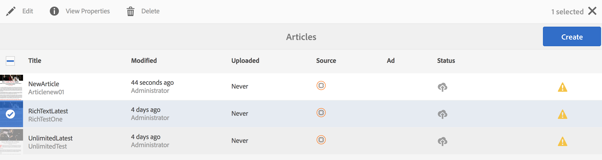

# Creación y adición de plantillas y componentes {#creating-and-adding-templates-and-components}

>[!NOTE]
>
>Adobe recomienda el uso del Editor de SPA para proyectos que requieren una representación de cliente basada en el marco de aplicaciones de una sola página (por ejemplo, React). [Más información](/help/sites-developing/spa-overview.md).

AEM Mobile On-Demand proporciona una plantilla de aplicación totalmente configurada, una plantilla de artículo y componentes de artículo.

La aplicación We.Unlimited es una plantilla de ejemplo que representa el shell de una aplicación On-Demand de AEM Mobile totalmente configurable y administrable.

Al seleccionar esta plantilla de ejemplo al crear una aplicación nueva, se ofrece un panel con muchas funciones de AEM Mobile.

>[!NOTE]
>
>Para gestionar el contenido de la aplicación y de la aplicación móvil desde el Centro de control de aplicaciones de AEM Mobile, consulte el panel de control de aplicaciones de [AEM Mobile](/help/mobile/mobile-apps-ondemand-application-dashboard.md).

## Creación de plantillas de aplicación {#creating-app-templates}

Una plantilla de aplicación se utiliza para crear una aplicación nueva y actúa como una colección de plantillas de página y componentes que representan una línea de base o una base de una aplicación. La plantilla marca algunas propiedades fundamentales para dirigir la aplicación de la forma adecuada. En general, un cliente no crearía demasiadas aplicaciones en total.

Las plantillas de aplicación proporcionan una manera sencilla de aprovechar los diseños existentes creados por los desarrolladores, que se utilizan para crear nuevas aplicaciones en AEM.

Al crear una aplicación nueva basada en la plantilla de otra aplicación, obtendrá una aplicación que tenga un punto de partida representativo de la aplicación desde la que se creó.

Pasos para crear una aplicación nueva basada en una plantilla de aplicación:

1. Vaya al catálogo de aplicaciones de AEM Mobile: *&lt;server-url>/aem/apps.html/content/mobileapps*
1. Seleccione **Crear** —> **Aplicación** como se muestra a continuación

Una vez que haya creado una aplicación con esta plantilla, podrá añadir artículos, pancartas y colecciones a la aplicación. Para volver a visitar, crear artículos, pancartas y colecciones, consulte Acciones [de administración de](/help/mobile/mobile-apps-ondemand-manage-content-ondemand.md)contenido.

>[!NOTE]
>
>Como alternativa, también puede seleccionar una plantilla de aplicación de ejemplo, por ejemplo, la aplicación **We.Unlimited** , que un desarrollador de AEM pone a su disposición. Si utiliza esta plantilla de ejemplo para su aplicación, obtendrá algunos artículos y colecciones de muestra en los que trabajar. Tendrá la opción de utilizar las plantillas y los componentes de ejemplo, personalizar los existentes o crear otros nuevos para su aplicación.

>[!CAUTION]
>
>Definición de la propiedad ***redirectTarget***
>
>Mientras utiliza una de las plantillas de aplicación, el desarrollador define el contenido de la aplicación. Sin embargo, el desarrollador debe saber dónde se crea la aplicación en el jcr y el valor de la propiedad ***redirectTarget*** .
>
>El ***redirectTarget*** se calcula como parte de la operación de creación de la aplicación e intenta resolver una ruta, si hay una propiedad redirectTarget disponible como parte de la plantilla de la aplicación y el valor de redirectTarget se define como relativo. Cuando el proceso de creación de la aplicación encuentra un valor relativo para redirectTarget en la plantilla de la aplicación, el valor se anexa a la ubicación resuelta de donde se creó la aplicación.
>
>Por ejemplo, si una plantilla de aplicación define un ***redirectTarget*** con el valor &quot;*language-masters/en*&quot; y la aplicación se creó en &quot;*/content/mobileapps/fooApp*&quot;, el valor final para redirectTarget después de crear la aplicación será &quot;*/content/mobileapps/fooApp/language-masters/es*&quot;.

## Creación de plantillas de contenido {#creating-content-templates}

Cada tipo de entidad tiene dos plantillas listas para usar. Estos son:

* **** Plantillas predeterminadas: se utiliza para la creación de contenido con propiedades/estructura predeterminadas aplicables
* **** Plantillas importadas: se utiliza para importar contenido de AEM Mobile con las propiedades/estructura predeterminadas aplicables

### Plantillas de artículo {#article-templates}

El artículo ilimitado es una plantilla de ejemplo que representa un diseño de artículo bajo demanda típico de AEM Mobile.

1. Haga clic en **+** en **Administrar artículos** para crear un nuevo artículo. Puede elegir un artículo **** ilimitado o un artículo **de texto** enriquecido. La siguiente imagen muestra la opción que le permite elegir entre cualquiera de estas dos plantillas de artículo.

1. Haga clic en **Siguiente** para definir los metadatos del artículo, como Nombre o título del artículo, Descripción, Autor, Síntesis, Departamento, Imagen en miniatura, Acceso al artículo, etc.
1. Haga clic en **Siguiente** para completar las Propiedades del anuncio.
1. Haga clic en **Siguiente** para introducir la imagen del artículo o la imagen de los medios sociales
1. Haga clic en **Siguiente** para elegir un vínculo de colección a este nuevo artículo.
1. Haga clic en **Siguiente** para introducir los detalles de uso compartido en redes sociales.
1. Haga clic en **Crear** para finalizar el proceso de creación de un artículo con el ejemplo. Puede hacer clic en **Finalizado** o en **Editar artículo** para editar las propiedades de este artículo.

### Adición de componentes al artículo {#adding-components-to-article}

Una vez creado, un autor puede editar el contenido de un artículo agregando componentes como texto e imágenes. Los artículos son una extensión de las plantillas de página de AEM.

Seleccione un artículo que desee editar y haga clic en **Editar** para agregar componentes al artículo.

 

Elija &#39;**+**&#39; en el panel izquierdo para añadir componentes al artículo.

### Creación de plantillas integradas {#creating-out-of-the-box-templates}

No hay plantillas de artículo integradas, pero hay una plantilla predeterminada que las plantillas personalizadas deben ampliarse. Consulte el ejemplo [de plantilla de](http://localhost:4502/crx/de/index.jsp#/apps/geometrixx-unlimited-app/templates/article)artículo de aplicación ilimitada de Geometrixx.

Entre las propiedades clave más allá de la plantilla normal de AEM se incluyen:

***dps-resourceType=&quot;dps:Article&quot;***

Esta propiedad garantiza que la página de AEM se reconozca como página de artículos con destino a AEM Mobile.

Según las plantillas de AEM, puede añadir cualquier propiedad o nodo secundario predeterminados a ***jcr:content*** de la plantilla.

### Plantillas de pancarta y colección {#banner-and-collection-templates}

>[!CAUTION]
>
>Los letreros y las colecciones no tienen contenido, por lo que su creación no admite plantillas personalizadas.

## Creación y adición de componentes {#creating-and-adding-components}

Los componentes utilizan y permiten el acceso a los widgets, que se utilizan para representar el contenido.

Se incluye un componente sencillo en el repositorio de código, cuya fuente se encuentra en AEM. Posteriormente, también se puede abrir localmente en CRXDE Lite.

>[!NOTE]
>
>Actualmente no hay componentes integrados para AEM Mobile.

Puede agregar componentes a la página. Es posible que cualquier componente se pueda utilizar en una aplicación de AEM Mobile pero, cuando se aplique, no se represente correctamente.

Sin embargo, es posible que los componentes personalizados no exporten ni carguen correctamente a AEM Mobile On-Demand Services sin un controlador de sincronización de contenido de exportación personalizado que se procese en AEM.

Una vez que el componente ya se haya incluido en una página de AEM, junto con otros componentes de bloque de creación, puede añadir otro componente a la página o editar uno existente.

**Para agregar otro componente a la página:**

1. Elija esa página y asegúrese de que está en el modo de edición, mediante el menú desplegable en la parte superior derecha del encabezado del Editor
1. Alternar el panel lateral con el icono situado más a la izquierda en el encabezado del Editor
1. Select the **Components** tab
1. Arrastre y suelte uno de los componentes disponibles en la página

**Para editar un componente existente:**

1. Elija esa página y asegúrese de que se encuentra en el modo de **edición** y seleccione el componente
1. Toque el icono de la llave inglesa para configurar el componente

>[!NOTE]
>
>Puede crear un componente en AEM y personalizarlo mediante [Desarrollo con CRXDE Lite](/help/sites-developing/developing-with-crxde-lite.md). Una vez que haya personalizado el componente existente como sus necesidades, puede agregarlo a la página mediante la opción **Editar** en **Administrar artículos** , como se muestra en la figura anterior.

>[!NOTE]
>
>Consulte Prácticas [recomendadas para el desarrollo](/help/mobile/best-practices-aem-mobile.md) de plantillas y componentes en AEM Mobile.

### Pasos siguientes {#the-next-steps}

* [Uso de las propiedades del contenido para exportar contenido](/help/mobile/on-demand-content-properties-exporting.md)
* [Móvil con sincronización de contenido](/help/mobile/mobile-ondemand-contentsync.md)