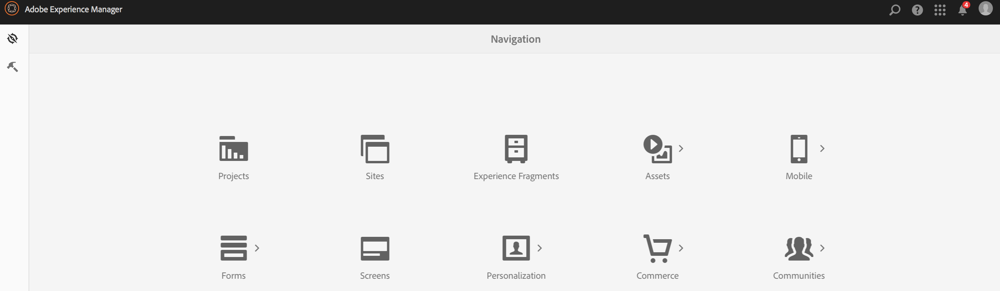
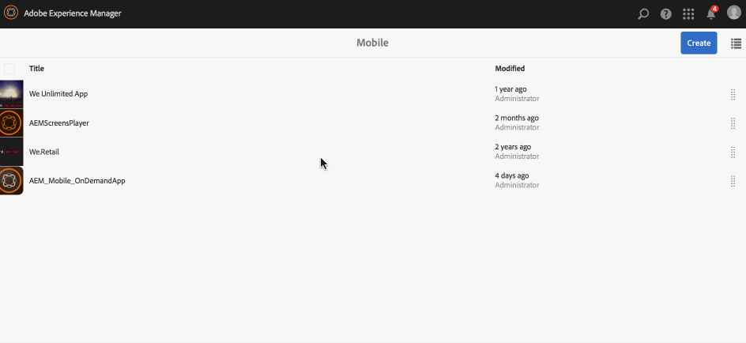

# Definiciones de aplicaciones{#app-definitions}

>[!NOTE]
>
>Adobe recomienda utilizar el Editor de SPA para proyectos que requieren una representación del lado del cliente basada en el marco de aplicaciones de una sola página (por ejemplo, React). [Más información](/help/sites-developing/spa-overview.md).

Las definiciones de aplicación permiten identificar qué espacios y otras configuraciones son adecuados para la aplicación. Las definiciones de aplicación permiten al usuario agregar espacio, sin tener que volver a compilar la aplicación. La definición de la aplicación se actualiza y eso incluye la información de cualquier espacio nuevo.

>[!NOTE]
>
>Las definiciones de aplicación están vinculadas a una aplicación, por lo que requieren la creación de una aplicación en la consola de aplicación de AEM Mobile.

## Creación de una nueva definición de aplicación {#creating-a-new-app-definition}

1. Choose **Móvil** de la Consola de navegación de AEM.

   

1. Choose **Aplicaciones** from **Móvil** y haga clic en **Crear.**

   Choose **Aplicación** y escriba los detalles para crear la nueva aplicación.

   

### Pasos siguientes {#the-next-steps}

Una vez que conozca las definiciones de aplicación, obtenga más información sobre los siguientes recursos de creación:

* [Importar una aplicación híbrida existente](/help/mobile/phonegap-adding-content-to-imported-app.md)
* [Crear una aplicación nueva mediante el asistente Crear aplicación](/help/mobile/phonegap-create-new-app.md)
* [Content Services](/help/mobile/develop-content-as-a-service.md)

## Recursos adicionales {#additional-resources}

Para obtener más información sobre las funciones y responsabilidades de un administrador y un desarrollador, consulte los siguientes recursos:

* [Desarrollo para Adobe PhoneGap Enterprise con AEM](/help/mobile/developing-in-phonegap.md)
* [Administración de contenido para Adobe PhoneGap Enterprise con AEM](/help/mobile/administer-phonegap.md)
