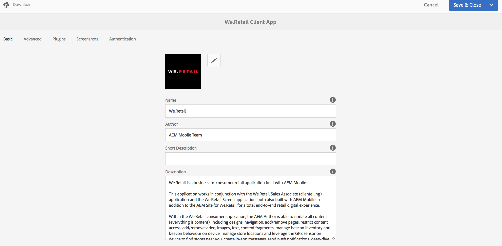
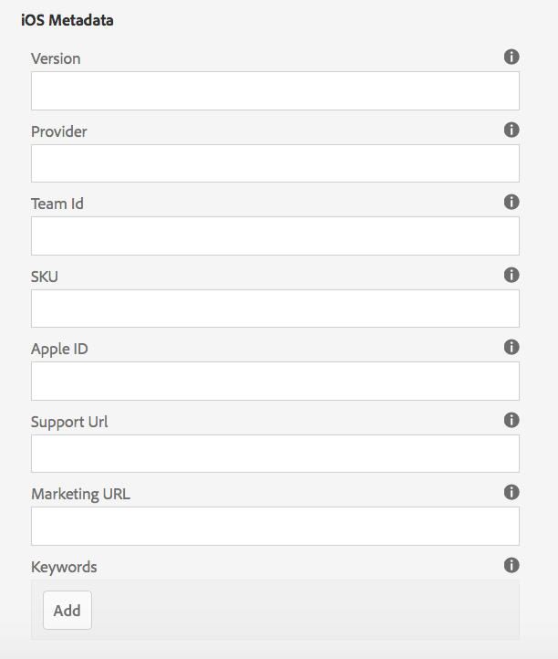

# Administrar mosaico de aplicación{#manage-app-tile}

>[!NOTE]
>
>Adobe recomienda utilizar el Editor de SPA para proyectos que requieren una representación del lado del cliente basada en el marco de aplicaciones de una sola página (por ejemplo, React). [Más información](/help/sites-developing/spa-overview.md).

La variable **Administrar aplicación** El mosaico en el panel de la aplicación permite modificar los detalles de la aplicación. Para abrir la página Detalles, haga clic en el vínculo Administrar detalles de la aplicación . Desde la página Administrar aplicación puede editar la configuración de la aplicación PhoneGap (config.xml) y preparar la aplicación para su envío a las distintas tiendas de aplicaciones.


## Información sobre la gestión de mosaicos de aplicaciones {#understanding-the-manage-app-tile}

Puede explorar en profundidad cada mosaico en la **Administrar aplicación** mosaico para ver o editar detalles haciendo clic en el botón &#39;...&#39; en la esquina inferior derecha.

### La ficha Básico {#the-basic-tab}

Puede editar el **Nombre**, **Autor**, **Descripción breve** y **Descripción** para su aplicación desde esta pestaña.



### La pestaña Avanzadas {#the-advanced-tab}

Cada plataforma de aplicación móvil describe qué datos se recopilan y se segmenta específicamente en cada almacén de aplicaciones.

Las plataformas mostradas están impulsadas por el contenido de PhoneGap config.xml:

```xml
<widget>
<gap:platform name="ios"/>
<gap:platform name="android"/>
</widget>
```

Cada tienda de aplicaciones de proveedor, como Apple App Store o Google Play Store, por ejemplo, requiere una o más capturas de pantalla de la aplicación móvil para mostrar los detalles de la aplicación a los clientes. Estas capturas de pantalla pueden tener requisitos estrictos sobre dimensiones y contenido (básicamente deben representar realmente la aplicación). AEM aplicaciones proporciona asistencia para seleccionar y administrar estas capturas de pantalla para las plataformas admitidas y ver las dimensiones del puerto según lo requiera el almacén de aplicaciones de cada proveedor.

>[!NOTE]
>
>La aplicación AEM Verify permite enviar capturas de pantalla directamente a los detalles de la aplicación en AEM.
>
>Consulte [Inicio rápido móvil para AEM verificación](/help/mobile/phonegap-mobile-quickstart.md) para obtener más información.


### Metadatos {#metadata}

>[!NOTE]
>
>Una vez que esté familiarizado con el **Administrar aplicación** mosaico, consulte [Edición de metadatos de aplicaciones](/help/mobile/phonegap-editmetadata.md) para ver y editar los metadatos.

#### Metadatos comunes {#common-metadata}

Cada aplicación debe tener metadatos asociados que ayuden a configurar diferentes aspectos de la aplicación. La página Administrar aplicación está separada en dos áreas diferentes relacionadas con la recopilación de metadatos. Metadatos específicos de la plataforma y metadatos comunes.

Hay una configuración común y metadatos para todas las plataformas.

En esta sección, define la URL del servidor de actualización de contenido, la página de aterrizaje para la aplicación móvil, la versión de PhoneGap para la compilación, la versión de la aplicación, el nombre, la descripción y mucho más.

**Versión de la aplicación** es la versión de trabajo de la aplicación. Una práctica recomendada habitual es utilizar una notación con 3 decimales y comenzar por debajo de 1.0.0 antes de su primera versión.

**Versión de PhoneGap** es la versión en la que desea compilar la aplicación con PhoneGap. Una práctica recomendada es mantenerse al día con la versión actual para asegurarse de obtener las últimas y buenas funciones y correcciones de errores.

**URL del servidor de actualización de contenido** es la dirección URL que utilizará la aplicación para solicitar actualizaciones de ContentSync. Debe establecerse en la URL de su Dispatcher o, si no utiliza un Dispatcher, en una de las instancias de publicación que se utilizará para ofrecer actualizaciones de ContentSync a su aplicación.


>[!NOTE]
>
>Esta sección puede aparecer vacía a menos que haya datos rellenando los campos.
>
>En la parte superior de la vista de detalles, verá Versión de la aplicación, Versión de PhoneGap y URL de actualización, cada uno de estos valores se puede configurar en la sección Metadatos comunes . Sin embargo, el ID de aplicación no se puede editar.

#### Metadatos de la plataforma {#platform-metadata}

Todas las plataformas definidas en PhoneGap config.xml pueden contener propiedades de plataforma personalizadas. Un desarrollador de AEM debe contribuir con la estructura de contenido para capturar estas propiedades. Se puede encontrar un ejemplo proporcionado de propiedades específicas de la plataforma para iOS.

Los metadatos de todas las plataformas configuradas ahora se muestran al mismo tiempo en la ficha Avanzadas del mosaico Administrar aplicación .

>[!NOTE]
>
>Las secciones de metadatos de plataforma no son utilizadas por PhoneGap durante una compilación de CLI o PhoneGap remoto, sino que AEM intenta capturar metadatos para plataformas que se puedan usar más adelante cuando se envían al almacén de aplicaciones del proveedor de destino.

En plataformas que AEM no entienden, un desarrollador de AEM puede ampliar la interfaz de usuario para capturar estos metadatos que posteriormente se pueden exportar y utilizar durante el proceso de envío de la aplicación.

#### Metadatos de iOS {#ios-metadata}

Apple AppStore requiere metadatos adicionales para enviar la aplicación para su distribución. La sección de metadatos de iOS intenta recopilar la información necesaria que puede utilizar la herramienta iTMSTransporter de Apple para publicar los metadatos en la cuenta de desarrollador de Apple asociada.

Para obtener los metadatos específicos de Apple, primero debe crear la aplicación en [https://itunesconnect.apple.com](https://itunesconnect.apple.com/). Al crear la aplicación, Apple generará los metadatos necesarios en la sección de metadatos de iOS si desea utilizar la herramienta Apple iTMSTransporter para validar y cargar los metadatos en itunesconnect.apple.com. Si solo desea obtener los metadatos que desea recopilar, no necesariamente debe rellenar los metadatos específicos de iOS. Aún puede exportar los metadatos que combinarán el iOS y los metadatos comunes y recopilar todas las capturas de pantalla en un archivo zip que se puede descargar en cualquier momento.

El archivo zip descargado contiene un archivo itmsp que se puede inspeccionar para buscar metadata.xml. El archivo itmsp contiene los metadatos exportados (dentro del archivo metadata.xml), junto con todas las capturas de pantalla asociadas.

La funcionalidad de exportación se utiliza para proporcionar una forma cómoda de recopilar las capturas de pantalla y los metadatos que se pueden pasar al editor de la aplicación para su entrada en el almacén de aplicaciones específico del proveedor.



#### Metadatos de Android {#android-metadata}

Al seleccionar la plataforma Android, no hay metadatos personalizados que se puedan configurar en este momento. Al hacer clic en el botón de descarga como archivo zip se generará con un archivo de propiedades que contiene todos los metadatos y las capturas de pantalla asociadas.

La funcionalidad de exportación se utiliza para proporcionar una forma cómoda de recopilar las capturas de pantalla y los metadatos que se pueden pasar al editor de la aplicación para su entrada en el almacén de aplicaciones específico del proveedor.


### URL de servidor de actualización de contenido {#content-update-server-url}

Una de las características clave de AEM aplicaciones es la capacidad de solicitar contenido nuevo a través de ContentSync, donde el contenido puede ser recursos html, páginas, vídeo, imágenes, texto, etc. Una vez que un autor de contenido ha actualizado el contenido y luego lo publica, el servidor hace que la actualización de contenido esté disponible para que la aplicación móvil la descargue.

La propiedad URL del servidor de actualización de contenido es la URL que debe señalar a una instancia de publicación; directamente o a través de Dispatcher o CDN. El formato de la URL es simplemente:

`https://[hostname]:[port]`

>[!NOTE]
>
>Si la instancia del servidor Autor se está replicando en varias instancias del servidor de publicación (arquitectura común para AEM), cada servidor de publicación tendrá el mismo contenido de actualización porque la actualización se creó en el autor y se replicó en todas las instancias de publicación. Básicamente, el balanceo de carga y el failover son totalmente compatibles.

### La pestaña Plugins {#the-plugins-tab}

La variable **Complementos** describe los complementos asociados a su aplicación. Esta información se utilizará para recuperar el complemento apropiado durante una compilación.


### La pestaña Capturas de pantalla {#the-screenshots-tab}

La variable **Capturas de pantalla** muestra las resoluciones de captura de pantalla admitidas en diferentes plataformas.


>[!NOTE]
>
>Para agregar y eliminar capturas de pantalla, consulte [Edición de metadatos de aplicaciones](/help/mobile/phonegap-editmetadata.md).

### La pestaña Autenticación {#the-authentication-tab}

La variable **Autenticación** le permite seleccionar un cliente de OAuth para asociarlo a su aplicación y permite a un desarrollador utilizar la autenticación OAuth de Adobe Experience Manager.


### Pasos siguientes {#the-next-steps}

Una vez que sepa cómo administrar el mosaico de la aplicación en el panel de la aplicación, consulte los siguientes recursos para otras funciones de creación:

* [Edición de metadatos de aplicaciones](/help/mobile/phonegap-editmetadata.md)
* [Definiciones de aplicaciones](/help/mobile/phonegap-app-definitions.md)
* [Creación de una nueva aplicación mediante el asistente Crear aplicación](/help/mobile/phonegap-create-new-app.md)
* [Importar una aplicación híbrida existente](/help/mobile/phonegap-adding-content-to-imported-app.md)
* [Content Services](/help/mobile/develop-content-as-a-service.md)

### Recursos adicionales {#additional-resources}

Para obtener más información sobre las funciones y responsabilidades de un administrador y desarrollador, consulte los siguientes recursos:

* [Desarrollo para Adobe PhoneGap Enterprise con AEM](/help/mobile/developing-in-phonegap.md)
* [Administración de contenido para Adobe PhoneGap Enterprise con AEM](/help/mobile/administer-phonegap.md)
