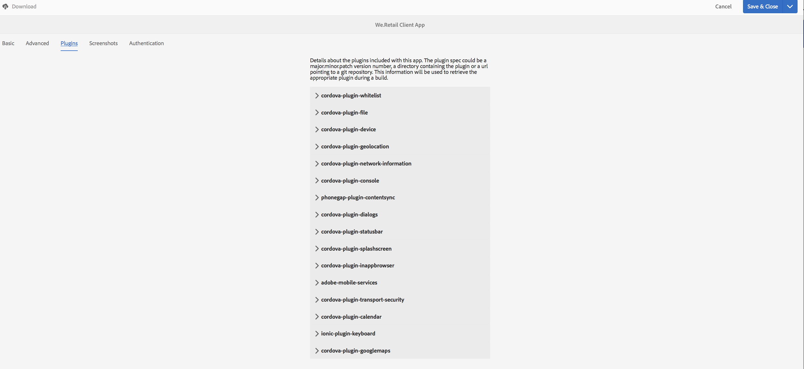
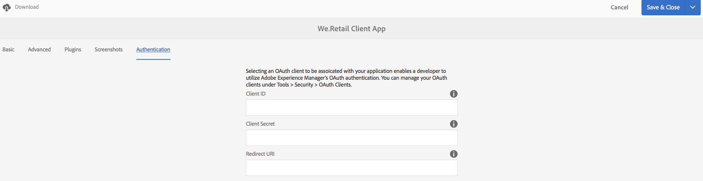

# Administrar mosaico de aplicación{#manage-app-tile}

>[!NOTE]
>
>Adobe SPA recomienda utilizar el Editor de para proyectos que requieran procesamiento del lado del cliente basado en el marco de trabajo de la aplicación de una sola página (por ejemplo, React). [Más información](/help/sites-developing/spa-overview.md).

El **Administrar aplicación** El mosaico del tablero de la aplicación permite modificar los detalles de la aplicación. Para abrir la página Detalles, haga clic en el vínculo de detalles del mosaico Administrar aplicación. Desde la página Administrar aplicación puede editar la configuración de la aplicación PhoneGap (config.xml) y preparar la aplicación para su envío a las distintas tiendas de aplicaciones.


## Explicación del mosaico Administrar aplicación {#understanding-the-manage-app-tile}

Puede explorar en profundidad cada mosaico del **Administrar aplicación** mosaico para ver o editar detalles haciendo clic en &quot;...&quot; en la esquina inferior derecha.

### La pestaña Básico {#the-basic-tab}

Puede editar la variable **Nombre**, **Autor**, **Descripción breve**, y el **Descripción** para su aplicación desde esta pestaña.


### La pestaña Avanzadas {#the-advanced-tab}

Cada plataforma de aplicación móvil describe qué datos se recopilan y se dirigen específicamente a cada almacén de aplicaciones.

Las plataformas mostradas dependen del contenido config.xml de PhoneGap:

```xml
<widget>
<gap:platform name="ios"/>
<gap:platform name="android"/>
</widget>
```

Cada tienda de aplicaciones de proveedores, como Apple App Store o Google Play Store, por ejemplo, requiere una o más capturas de pantalla de la aplicación móvil para mostrar los detalles de la aplicación a los clientes. Estas capturas de pantalla pueden tener requisitos estrictos en cuanto a dimensiones y contenido (básicamente, deben representar realmente la aplicación). AEM Las aplicaciones de AppMeasurement proporcionan asistencia para seleccionar y administrar estas capturas de pantalla para las plataformas admitidas y ver las dimensiones de puerto según lo requerido por la tienda de aplicaciones de cada proveedor.

>[!NOTE]
>
>AEM AEM La aplicación Verificar la permite enviar capturas de pantalla directamente a los detalles de la aplicación en la.
>
>Consulte [AEM Quickstart móvil para la verificación de la](/help/mobile/phonegap-mobile-quickstart.md) para obtener más información.


### Metadatos {#metadata}

>[!NOTE]
>
>Una vez que conozca el **Administrar aplicación** mosaico, consulte [Edición de metadatos de aplicación](/help/mobile/phonegap-editmetadata.md) para ver y editar los metadatos.

#### Metadatos comunes {#common-metadata}

Cada aplicación debe tener metadatos asociados que ayuden a configurar diferentes aspectos de la aplicación. La página Administrar aplicación está separada en dos áreas diferentes relacionadas con la recopilación de metadatos. Metadatos específicos de la plataforma y metadatos comunes.

Hay configuraciones y metadatos comunes en todas las plataformas.

En esta sección puede definir la URL de Content Update Server, la página de aterrizaje de la aplicación móvil, la versión de PhoneGap para la compilación, la versión de la aplicación, el nombre, la descripción, etc.

**Versión de aplicación** es la versión de trabajo de la aplicación. La práctica recomendada habitual es utilizar una notación de 3 decimales y comenzar por debajo de 1.0.0 antes de la primera versión.

**Versión de PhoneGap** es la versión en la que se desea compilar la aplicación con PhoneGap. La práctica recomendada es mantenerse al día con la versión actual para asegurarse de obtener las últimas y buenas funciones y correcciones de errores.

**URL del servidor de actualización de contenido** es la dirección URL que la aplicación utilizará para solicitar actualizaciones de ContentSync. Se debe establecer en la dirección URL de Dispatcher o, si no utiliza un Dispatcher, en una de las instancias de publicación que se utilizará para publicar actualizaciones de ContentSync en la aplicación.


>[!NOTE]
>
>Esta sección puede aparecer vacía a menos que haya datos rellenando los campos.
>
>En la parte superior de la vista de detalles, verá Versión de la aplicación, Versión de PhoneGap y Actualizar URL. Cada uno de estos valores se puede establecer en la sección Metadatos comunes. Sin embargo, el ID de aplicación no se puede editar.

#### Metadatos de plataforma {#platform-metadata}

Cada plataforma definida en el archivo config.xml de PhoneGap puede contener propiedades de plataforma personalizadas. AEM Un desarrollador de debe contribuir con la estructura de contenido para capturar estas propiedades. Se puede encontrar un ejemplo proporcionado de propiedades específicas de la plataforma para iOS.

Los metadatos de todas las plataformas configuradas ahora se muestran al mismo tiempo en la pestaña Avanzadas del mosaico Administrar aplicación.

>[!NOTE]
>
>AEM PhoneGap no utiliza las secciones de metadatos de plataforma durante una compilación de CLI o PhoneGap remota, sino que intenta capturar metadatos para plataformas de modo que se puedan utilizar posteriormente al enviarlos al almacén de aplicaciones del proveedor de destino.

AEM AEM En el caso de las plataformas que no comprende el usuario, un desarrollador de aplicaciones aún puede ampliar la interfaz de usuario para capturar estos metadatos, que luego se pueden exportar y utilizar durante el proceso de envío de la aplicación.

#### Metadatos de iOS {#ios-metadata}

Apple AppStore requiere metadatos adicionales para enviar la solicitud para su distribución. La sección de metadatos de iOS intenta recopilar la información necesaria que puede utilizar la herramienta iTMSTransporter de Apple para publicar los metadatos en la cuenta del desarrollador de Apple asociado.

Para obtener los metadatos específicos de Apple, primero debe crear la aplicación en [https://itunesconnect.apple.com](https://itunesconnect.apple.com/). Al crear la aplicación, Apple genera los metadatos requeridos por la sección de metadatos de iOS si desea utilizar la herramienta Apple iTMSTransporter para validar y cargar los metadatos en itunesconnect.apple.com. Si solo desea obtener los metadatos que desea recopilar, no es necesario que rellene los metadatos específicos de iOS. Puede seguir exportando los metadatos que combinarán el iOS y los metadatos comunes, y recopilando todas las capturas de pantalla en un archivo zip que se puede descargar en cualquier momento.

El archivo zip descargado contiene un archivo itmsp que se puede inspeccionar para buscar el archivo metadata.xml. El archivo itmsp contiene los metadatos exportados (dentro del archivo metadata.xml ), junto con todas las capturas de pantalla asociadas.

La funcionalidad de exportación se utiliza para proporcionar una forma cómoda de recopilar las capturas de pantalla y los metadatos que se pueden pasar al editor de la aplicación para su entrada en el almacén de aplicaciones específico del proveedor.


#### Metadatos de Android {#android-metadata}

Al seleccionar la plataforma de Android, no hay metadatos personalizados en este punto que se puedan configurar. Al hacer clic en el botón de descarga como archivo zip, se generará un archivo de propiedades que contiene todos los metadatos y las capturas de pantalla asociadas.

La funcionalidad de exportación se utiliza para proporcionar una forma cómoda de recopilar las capturas de pantalla y los metadatos que se pueden pasar al editor de la aplicación para su entrada en el almacén de aplicaciones específico del proveedor.


### URL de servidor de actualización de contenido {#content-update-server-url}

AEM Una de las características clave de las aplicaciones de la es la capacidad de tener una aplicación móvil para solicitar nuevo contenido a través de ContentSync, donde el contenido puede ser recursos HTML, páginas, vídeo, imágenes, texto y más. Una vez que un autor de contenido ha actualizado el contenido y luego lo publica, el servidor hace que la actualización de contenido esté disponible para que la aplicación móvil la descargue.

La propiedad URL del servidor de actualización de contenido es la dirección URL que debe señalar a una instancia de publicación; directamente o a través de Dispatcher o CDN. El formato de la dirección URL es simplemente el siguiente:

`https://[hostname]:[port]`

>[!NOTE]
>
>AEM Si la instancia del servidor de creación se está replicando en varias instancias del servidor de publicación (arquitectura común para las instancias de publicación), cada servidor de publicación tendrá el mismo contenido de actualización porque la actualización se crea en el autor y se replica en todas las instancias de publicación. Básicamente, el equilibrio de carga y la conmutación por error son totalmente compatibles.

### La pestaña Plugins {#the-plugins-tab}

El **Complementos** describe los complementos asociados a su aplicación. Esta información se utilizará para recuperar el complemento adecuado durante la compilación.



### La pestaña Capturas de pantalla {#the-screenshots-tab}

El **Capturas de pantalla** La pestaña muestra las resoluciones de captura de pantalla admitidas en diferentes plataformas.


>[!NOTE]
>
>Para agregar y eliminar capturas de pantalla, consulte [Edición de metadatos de aplicación](/help/mobile/phonegap-editmetadata.md).

### La pestaña Autenticación {#the-authentication-tab}

El **Autenticación** permite seleccionar un cliente de OAuth asociado a la aplicación y permite al desarrollador utilizar la autenticación OAuth de Adobe Experience Manager.



### Pasos siguientes {#the-next-steps}

Una vez que haya aprendido a administrar el mosaico de la aplicación en el panel de aplicaciones, consulte los siguientes recursos para otras funciones de creación:

* [Edición de metadatos de aplicación](/help/mobile/phonegap-editmetadata.md)
* [Definiciones de aplicación](/help/mobile/phonegap-app-definitions.md)
* [Crear una aplicación nueva mediante el Asistente para crear aplicación](/help/mobile/phonegap-create-new-app.md)
* [Importar una aplicación híbrida existente](/help/mobile/phonegap-adding-content-to-imported-app.md)
* [Content Services](/help/mobile/develop-content-as-a-service.md)

### Recursos adicionales {#additional-resources}

Para obtener más información sobre las funciones y responsabilidades de un administrador y un desarrollador, consulte los recursos siguientes:

* [Desarrollo para Adobe PhoneGap AEM Enterprise con](/help/mobile/developing-in-phonegap.md)
* [Administración de contenido para Adobe PhoneGap AEM Enterprise con el servicio de administración de](/help/mobile/administer-phonegap.md)
