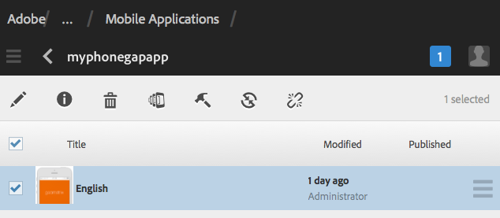

# Creación y edición de aplicaciones mediante la consola de aplicaciones{#creating-and-editing-apps-using-the-apps-console}

>[!NOTE]
>
>Adobe SPA recomienda utilizar el Editor de para proyectos que requieran una representación del lado del cliente basada en el marco de trabajo de la aplicación de una sola página (por ejemplo, React). [Más información](/help/sites-developing/spa-overview.md).

AEM El proceso de desarrollo de aplicaciones móviles reconoce que los usuarios con diferentes conocimientos contribuyen al desarrollo de aplicaciones móviles. El siguiente mapa del proceso ilustra el orden general en el que los autores de contenido y los desarrolladores de aplicaciones realizan las tareas.

La información sobre cómo realizar las tareas del experto en marketing aparece en esta página. Para obtener información sobre las tareas de desarrollador, consulte Creación de aplicaciones de PhoneGap.

## La estructura de las aplicaciones móviles {#the-structure-of-mobile-applications}

AEM Mobile proporciona el modelo de aplicación de PhoneGap para la creación de aplicaciones móviles. El modelo define la estructura de las aplicaciones que crea. Las aplicaciones constan de los siguientes elementos:

* La página raíz.
* Las variaciones de idioma de la aplicación.
* La página de inicio de la variación de idioma.

### La raíz de una aplicación de PhoneGap {#the-root-of-a-phonegap-app}

AEM La página raíz de las aplicaciones móviles que cree en aparece en la consola Aplicaciones.

La página raíz se almacena debajo de la propiedad Ruta de destino de la aplicación especificada al crear la aplicación (la ruta predeterminada es /content/phonegap/apps). El nombre de página es la propiedad Name de la aplicación. Por ejemplo, la dirección URL predeterminada de la página raíz del sitio denominado `myphonegapapp` es `http://localhost:4502/content/phonegap/apps/myphonegapapp.html`.

### La variación de idioma de una aplicación de PhoneGap {#the-language-variation-of-a-phonegap-app}

Las primeras páginas secundarias de la página raíz son las variaciones de idioma de la aplicación. El nombre de cada página es el idioma para el que se crea la aplicación. Por ejemplo, inglés es el nombre de la variación en inglés de la aplicación.

**Nota:** El modelo predeterminado de PhoneGap crea solamente una aplicación en inglés. El desarrollador puede modificar el modelo para que pueda crear más variaciones de idioma.

La página de idioma tiene dos propósitos:

* El contenido de la página es la página de inicio para la variación de idioma de la aplicación.
* Las propiedades de la página controlan varios aspectos del diseño de la aplicación, como la dirección URL que se utiliza para solicitar actualizaciones de contenido y la información sobre la conexión a la compilación en la nube y la integración de Adobe Analytics Services.

### La página de inicio {#the-home-page}

La página principal o la página index.html de una variación de idioma de una aplicación aparece cuando se abre la aplicación. La página de inicio proporciona a los usuarios un menú de vínculos a varias páginas de la aplicación. El sistema de párrafos permite agregar componentes a la página para crear contenido.

## Creación de una aplicación móvil {#creating-a-mobile-application}

Las aplicaciones móviles se basan en un modelo que define una estructura de página y propiedades. Puede configurar las siguientes propiedades de la aplicación:

* **Título:** El título de la aplicación.
* **Ruta de destino:** Ubicación en el repositorio donde se almacena la aplicación. Deje el valor predeterminado para crear una ruta basada en el nombre de la aplicación.

* **Nombre:** El valor predeterminado es el valor de la propiedad Título con caracteres de espacio eliminados. El nombre se utiliza dentro de CQ para hacer referencia a la aplicación, por ejemplo, para el nodo del repositorio que representa la aplicación.
* **Descripción:** Una descripción de la aplicación.
* **URL del servidor:** URL que proporciona actualizaciones de contenido de transmisión (OTA) a la aplicación. El valor predeterminado es la URL del servidor de publicación de la instancia que se utiliza para crear una aplicación (tomada del servicio externalizador). Tenga en cuenta que debe ser una instancia del servidor de publicación en lugar de un autor, lo que requiere autenticación.

También puede proporcionar un archivo de imagen para utilizarlo como miniatura de la aplicación, seleccionar la configuración de PhoneGap Build que desea utilizar y seleccionar la configuración de análisis de aplicaciones móviles que desea utilizar. Esta imagen solo se utiliza como miniatura para representar la aplicación móvil dentro de la consola de aplicaciones móviles en Experience Manager.

Existen pestañas adicionales (y opcionales) para crear un servicio en la nube e integrar el complemento SDK de Adobe Mobile Services en su aplicación.

* Generar: Haga clic en Administrar configuraciones y configure el servicio de compilación de build.phonegap.com aquí. A continuación, en la lista desplegable, podrá seleccionar el servicio en la nube de PhoneGap Build recién creado.
* Analytics: haga clic en Administrar configuraciones y configure el servicio en la nube de [Adobe Mobile Services SDK](https://experienceleague.adobe.com/docs/mobile-services/using/home.html). A continuación, en la lista desplegable, podrá seleccionar el Mobile Service recién creado para integrarlo en su aplicación móvil.

>[!NOTE]
>
>AEM Los desarrolladores pueden utilizar el Starter Kit de PhoneGap de la aplicación de la aplicación para crear aplicaciones y añadirlas a la consola.

El siguiente procedimiento utiliza la interfaz de usuario táctil para crear una aplicación móvil.

1. En el carril, haga clic en Aplicaciones.
1. Haga clic en el icono Create.

   

1. (Opcional) En la pestaña Avanzado, proporcione una descripción para la aplicación y cambie la dirección URL del servidor si es necesario.
1. (Opcional) Si utiliza PhoneGap Build para compilar la aplicación, en la pestaña Generar, seleccione la Configuración que desea utilizar.

   Para crear una configuración de PhoneGap Build, haga clic en Administrar configuraciones.

1. (Opcional) Si utiliza el SiteCatalyst para rastrear la actividad de la aplicación, en la pestaña Analytics, seleccione la configuración que desea utilizar.

   Para crear una configuración de aplicación móvil, haga clic en Administrar configuraciones.

1. (Opcional) Para proporcionar un icono de aplicación, haga clic en el botón Examinar, seleccione el archivo de imagen del sistema de archivos y haga clic en Abrir.
1. Haga clic en Crear.

### Cambiar las propiedades de una aplicación móvil {#changing-the-properties-of-a-mobile-application}

Después de crear una aplicación móvil, puede cambiar las propiedades.

#### Cambiar el título, la descripción y el icono {#change-the-title-description-and-icon}

1. En el carril, haga clic en Aplicaciones.
1. Seleccione la aplicación que desea configurar y haga clic en el icono Ver propiedades de página.

   

1. Para cambiar los valores de las propiedades, haga clic en el icono Edit.

   

1. Configure las propiedades Básico y Avanzado y, a continuación, haga clic en el icono Listo.

   

#### Configurar una variación de idioma de la aplicación {#configure-a-language-variation-of-the-application}

1. En el carril, haga clic en Aplicaciones.
1. Haga clic para explorar en profundidad la aplicación móvil que desea editar en el Admin Console de aplicaciones. Seleccione la versión de idioma de la aplicación que desea configurar y haga clic en el icono Ver propiedades de la aplicación.

   

1. Para cambiar los valores de las propiedades, haga clic en el icono Edit.

   

1. Configure las propiedades en las pestañas Básico, Avanzado, Generar y Analytics y, a continuación, haga clic en el icono Listo.

   

### Creación del contenido de una aplicación móvil {#authoring-the-content-of-a-mobile-application}

Después de crear la aplicación móvil, agregue el contenido que se utiliza como interfaz de usuario de la aplicación.

1. En el carril, haga clic en Aplicaciones.
1. Haga clic en la aplicación y, a continuación, en inglés.
1. Edite la página de inicio o agregue páginas secundarias según sea necesario.

### Mover contenido a aplicaciones móviles {#moving-content-to-mobile-applications}

AEM La caché de sincronización de contenido de la instancia de publicación de la se utiliza como repositorio de contenido para aplicaciones móviles:

* El contenido de la caché de sincronización de contenido se incluye en la aplicación cuando los desarrolladores la compilan.
* El contenido de la caché está disponible para las aplicaciones móviles instaladas para actualizar el contenido de la aplicación.

Las aplicaciones móviles incluyen un comando Actualizaciones que descarga e instala el contenido actualizado de la aplicación. Cuando una instancia de aplicación envía una solicitud de actualización, la sincronización de contenido determina qué contenido ha cambiado desde la última vez que se actualizó o instaló la aplicación y proporciona el nuevo contenido.

Para que el contenido actualizado esté disponible para las aplicaciones, actualice la caché de sincronización de contenido. La primera vez que actualice la caché, se agregará todo el contenido publicado. Las actualizaciones posteriores agregan solo el contenido publicado que ha cambiado desde la actualización anterior.

La sincronización de contenido también realiza un seguimiento de cuándo se producen las actualizaciones. Con esta información, la sincronización de contenido puede determinar qué actualización de caché se enviará a una aplicación móvil.

Realice el siguiente procedimiento en la instancia en la que desea actualizar la caché. Por ejemplo, si la aplicación solicita actualizaciones desde la instancia de publicación, realice el procedimiento en la instancia de publicación.

1. En el carril, haga clic en Aplicaciones y, a continuación, haga clic en la aplicación.
1. Seleccione la página de bienvenida y, a continuación, haga clic en el icono Actualizar caché.

   

### Uso de plantillas de aplicación {#using-app-templates}

AEM Esta es una función que está disponible con el paquete de funciones 2 de Apps 6.1 y proporciona una manera fácil de usar las plantillas de aplicación existentes para la creación de nuevas aplicaciones dentro de la aplicación de.

¿Qué es una plantilla de aplicación? Considérelo como una colección de plantillas de página y componentes que representan una línea de base o una base de una aplicación.
Al crear una aplicación basada en la plantilla de otra aplicación, obtiene una aplicación con un punto de partida representativo de la aplicación en la que se creó.

Debe tener una plantilla de aplicación móvil existente (o una aplicación instalada que tenga una plantilla de aplicación) para utilizar esta función.

AEM El último paquete de muestras de aplicaciones para la versión 6.1 incluye una versión actualizada de la aplicación de Geometrixx con una plantilla de aplicación de. Como alternativa, puede instalar el StarterKit, que también proporciona una plantilla.

Pasos para crear una aplicación basada en una plantilla de aplicación:

1. AEM Asegúrese de que tiene instalados los paquetes de funciones y muestras de referencia más recientes para Aplicaciones de la versión 6.1.
1. Haga clic en Aplicaciones en el carril izquierdo.

1. Haga clic en el botón + Crear en la parte superior y seleccione Crear aplicación.
1. Una vez que se le presente la lista de plantillas de aplicación, seleccione una:

1. Haga clic en Siguiente.
1. Proporcione un ID de aplicación y un Título, pero tal vez también desee incluir un Nombre y una Descripción.

   1. AEM Además, puede proporcionar un PNG (formato de icono de PhoneGap compatible) como icono al examinar los recursos de la.
   1. Recuerde que puede editar todos estos campos después de crear la aplicación en el mosaico Administrar aplicación. A excepción del ID de la aplicación, una vez establecido el ID de la aplicación, no puede cambiarlo.

1. Haga clic en el botón Crear . Se le presentarán dos opciones, Listo (volver a la vista Catálogo de aplicaciones) o Administrar aplicación (abre el panel de aplicaciones).
1. Una vez creada, debería ver la nueva aplicación en el catálogo de aplicaciones:

1. Haga clic en la aplicación para abrirla y habrá creado correctamente una nueva aplicación basada en la plantilla de una aplicación existente.

>[!NOTE]
>
>Si desinstala el paquete de aplicación de referencia de los Geometrixx Outdoors AEM de y hace que se cree una aplicación basada en su plantilla, dicha aplicación dejará de funcionar. La aplicación de Geometrixx Outdoors se puede eliminar, pero la plantilla de la aplicación debe permanecer si la utilizan otras aplicaciones móviles.

## Exploración de la aplicación de Geometrixx Outdoors de ejemplo {#exploring-the-sample-geometrixx-outdoors-app}

La aplicación para Geometrixx Outdoors es una aplicación de PhoneGap de ejemplo que muestra las funciones del modelo de aplicación PhoneGap predeterminado y los componentes móviles de ejemplo.

Para abrir la aplicación, en el carril, haga clic en Aplicaciones móviles y, a continuación, seleccione Aplicación de Geometrixx Outdoors.

### Funciones comunes de la página: aplicación móvil de Geometrixx {#common-page-features-geometrixx-mobile-app}

Cada página de la aplicación móvil incluye las siguientes funciones:

* Botón Atrás para volver a la página principal. El botón Atrás no aparece en la página Inicio.
* Un carril fungible que ofrece un menú de comandos y vínculos:

   * Abra la página Ubicaciones.
   * Abra el carro de compras.
   * Iniciar sesión.
   * Actualice la aplicación.

* El sistema de párrafos, para agregar componentes y crear contenido.

### Página principal - Aplicación móvil de Geometrixx {#the-home-page-geometrixx-mobile-app}

El contenido de la página de inicio consta de las siguientes herramientas de navegación:

* Componente de lista de menús que proporciona vínculos a las páginas secundarias Engranaje, Revisiones, Noticias y Acerca de nosotros.
* Componente de carrusel de barrido que muestra las páginas secundarias.

### La página de engranajes: aplicación móvil de Geometrixx {#the-gear-page-geometrixx-mobile-app}

La página Engranaje proporciona a los usuarios acceso a las páginas de producto. Un componente de lista de menús proporciona acceso a las páginas secundarias de la página de engranaje. Las páginas secundarias son categorías de productos que incluye el sitio web.

* Temporada
* Ropa
* Sexo
* Actividad

Cada página de categoría utiliza la misma estructura de contenido que la página de engranaje. El carrusel proporciona acceso a páginas secundarias que son subcategorías de productos. Las páginas de subcategorías contienen listas de productos que proporcionan vínculos a páginas de productos.

### La página Productos: Aplicación móvil de Geometrixx {#the-products-page-geometrixx-mobile-app}

La página Productos y su jerarquía de páginas secundarias implementan un sistema de clasificación para las páginas de productos. Las páginas más bajas de cada rama de la jerarquía son una página de producto que contiene un componente de producto ng.

La página Productos no está disponible para los usuarios de la aplicación. La página Engranaje proporciona acceso a cada página de producto.

### Página de críticas: aplicación móvil de Geometrixx {#the-reviews-page-geometrixx-mobile-app}

Contiene un botón Atrás. El sistema de párrafos permite añadir componentes.

Al utilizar la aplicación, la página Revisiones está disponible en el carrusel de la página en inglés.

### La página de noticias - Aplicación móvil de Geometrixx {#the-news-page-geometrixx-mobile-app}

Contiene un botón Atrás. El sistema de párrafos permite añadir componentes.

Al utilizar la aplicación, la página Noticias está disponible en el carrusel de la página en inglés.

### La página Acerca de nosotros - Aplicación móvil de Geometrixx {#the-about-us-page-geometrixx-mobile-app}

La página Acerca de nosotros contiene varios componentes Fila de dos columnas. Cada columna contiene un componente Imagen o Texto. Los componentes son editables, y el sistema de párrafos permite añadir componentes.

Al utilizar la aplicación, la página Acerca de nosotros está disponible en el carrusel de la página en inglés.

### Página Ubicaciones: Aplicación Móvil De Geometrixx {#the-locations-page-geometrixx-mobile-app}

La página Ubicaciones contiene un componente Ubicaciones.

Al utilizar la aplicación, la página Ubicaciones está disponible en la lista de menús de la página en inglés.

## Componentes móviles de muestra {#sample-mobile-components}

Varios componentes están disponibles inmediatamente en Sidekick al crear las páginas de una aplicación móvil. Los componentes pertenecen al grupo de componentes PhoneGap.

### Carrusel de barrido {#swipe-carousel}

El componente Carrusel de barrido es una herramienta para mostrar y navegar por las páginas del sitio. El componente incluye un carrusel que recorre las imágenes de las páginas por encima de una lista de vínculos de página. Edite el componente para especificar las páginas que desea exponer y el comportamiento del carrusel.

Tenga en cuenta que las imágenes aparecen en el carrusel para páginas asociadas a una imagen de una manera específica. Cuando las páginas no están asociadas a imágenes, solo aparece la lista de vínculos.

**Pestaña Propiedades de carrusel**

Configure el comportamiento del carrusel:

* Velocidad de reproducción: tiempo en milisegundos que se muestra cada imagen antes de mostrar la siguiente.
* Tiempo de transición: duración en milisegundos de la animación para transiciones de imagen.
* Estilo de controles: tipo de controles que se proporcionan para desplazarse entre imágenes.

**Ficha Propiedades de lista**

Especifique cómo se genera la lista de páginas:

* Lista de creación que utiliza: método que se utiliza para especificar las páginas que se incluirán en el carrusel. Consulte Creación de la lista de páginas.
* Ordenar por: seleccione una propiedad de página para utilizarla para ordenar la lista de páginas. Por ejemplo, seleccione jcr:title para ordenar las páginas alfabéticamente por su título.
* Límite: Número máximo de páginas que se incluirán. Esta propiedad es adecuada para los métodos basados en búsquedas de creación de la lista de páginas.

#### Creación de la lista de páginas {#building-the-page-list}

El componente Carrusel de barrido proporciona los siguientes valores para la propiedad Generar lista utilizando. El cuadro de diálogo de edición cambia según el valor seleccionado:

**Páginas secundarias**

El componente enumera todas las páginas secundarias de una página específica. Después de seleccionar este valor, seleccione la página en la ficha Páginas secundarias o especifique ningún valor para enumerar las páginas secundarias de la página actual.

**Lista fija**

Especifique una lista de páginas de inclusión. Después de seleccionar este valor, configure la lista en la ficha Lista fija que aparece al seleccionar Lista fija:

* Para agregar una página, haga clic en Agregar elemento y busque la página.
* Utilice los iconos de flecha arriba y abajo para mover la página dentro de la lista.
* Haga clic en el botón Eliminar para eliminar una página de la lista.

La propiedad Ordenar por no afecta al orden de las listas fijas.

**Buscar**

Rellene la lista con los resultados de una búsqueda de palabras clave. La búsqueda se realiza en los elementos secundarios de una página que especifique:

1. Para especificar la página raíz de la búsqueda, utilice la propiedad Start In para seleccionar la ruta de la página. No especifique ninguna ruta de acceso para buscar debajo de la página actual.
1. En la propiedad Buscar consulta, escriba las palabras clave de búsqueda.

**Búsqueda avanzada**

Rellene la lista con una consulta [Querybuilder](/help/sites-developing/querybuilder-api.md).

### Imagen {#image}

Añada una imagen al contenido de la aplicación.

### Texto {#text}

Añada texto enriquecido al contenido de la aplicación.

### Ubicaciones de las tiendas {#store-locations}

El componente Ubicaciones de almacenamiento proporciona a los usuarios herramientas para encontrar salidas comerciales:

* Búsqueda
* Listas de ubicaciones que están cerca o distantes de las coordenadas GPS del dispositivo.

El componente requiere que el repositorio contenga información de ubicación para cada almacén. Las ubicaciones de muestra se instalan en el nodo /etc/commerce/locations/adobe. 

### Fila de dos columnas {#two-column-row}

Permite añadir componentes en paralelo a una página.

