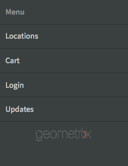

# Creación y edición de aplicaciones con la consola Aplicaciones{#creating-and-editing-apps-using-the-apps-console}

>[!NOTE]
>
>Adobe recomienda el uso del Editor de SPA para proyectos que requieren una representación de cliente basada en el marco de aplicaciones de una sola página (por ejemplo, React). [Más información](/help/sites-developing/spa-overview.md).

El proceso de desarrollo de aplicaciones móviles de AEM reconoce que los usuarios con diferentes conocimientos contribuyen al desarrollo de aplicaciones móviles. El siguiente mapa de procesos ilustra el orden general en el que los autores de contenido y los desarrolladores de aplicaciones realizan las tareas.

En esta página se muestra información sobre cómo realizar las tareas de Marketer. Para obtener información sobre las tareas de desarrollador, consulte Creación de aplicaciones PhoneGap.

## La estructura de las aplicaciones móviles {#the-structure-of-mobile-applications}

AEM Mobile proporciona el modelo de la aplicación Phonegap para crear aplicaciones móviles. El modelo define la estructura de las aplicaciones que se crean. Las solicitudes constan de los siguientes elementos:

* La página raíz.
* Las variaciones de idioma de la aplicación.
* Página principal de la variación de idioma.

### La raíz de una aplicación de PhoneGap {#the-root-of-a-phonegap-app}

La página raíz de las aplicaciones móviles que crea en AEM aparece en la consola Aplicaciones.

La página raíz se almacena debajo de la propiedad Ruta de destino de la aplicación que se especificó al crear la aplicación (la ruta predeterminada es /content/phonegap/apps). El nombre de la página es la propiedad Name de la aplicación. Por ejemplo, la dirección URL predeterminada de la página raíz del sitio denominado `myphonegapapp` es `http://localhost:4502/content/phonegap/apps/myphonegapapp.html`.

### La variación de idioma de una aplicación PhoneGap {#the-language-variation-of-a-phonegap-app}

Las primeras páginas secundarias de la página raíz son las variaciones de idioma de la aplicación. El nombre de cada página es el idioma en el que se crea la aplicación. Por ejemplo, inglés es el nombre de la variación en inglés de la aplicación.

**** Nota: El modelo predeterminado de PhoneGap solo crea una aplicación en inglés. El desarrollador puede modificar el modelo para que pueda crear más variaciones de idioma.

La página de idioma sirve para dos propósitos:

* El contenido de la página es la página de paso para la variación de idioma de la aplicación.
* Las propiedades de página controlan varios aspectos de diseño de la aplicación, como la URL que se va a utilizar para solicitar actualizaciones de contenido, e información sobre la conexión a la compilación en la nube y la integración de Adobe Analytics Services.

### La página principal {#the-home-page}

Cuando se abre la aplicación, aparece la página de inicio o index.html de una variación de idioma de una aplicación. La página de inicio proporciona a los usuarios un menú de vínculos a varias páginas de la aplicación. El sistema de párrafos permite agregar componentes a la página para crear contenido.

## Creación de una aplicación móvil {#creating-a-mobile-application}

Las aplicaciones móviles se basan en un modelo que define una estructura de página y propiedades. Puede configurar las siguientes propiedades de la aplicación:

* **** Título: El título de la aplicación.
* **** Ruta de destino: Ubicación en el repositorio donde se almacena la aplicación. Deje el valor predeterminado para crear una ruta basada en el nombre de la aplicación.

* **** Nombre: El valor predeterminado es el valor de la propiedad Title con caracteres de espacio eliminados. El nombre se utiliza dentro de CQ para hacer referencia a la aplicación, por ejemplo para el nodo de repositorio que representa la aplicación.
* **** Descripción: Descripción de la aplicación.
* **** URL del servidor: La URL que proporciona actualizaciones de contenido de Over-the-Air (OTA) a la aplicación. El valor predeterminado es la URL del servidor de publicación de la instancia que se utiliza para crear una aplicación (tomada del servicio de externalización). Tenga en cuenta que debe ser una instancia de servidor de publicación en lugar de un autor, lo que requiere autenticación.

También puede proporcionar un archivo de imagen para utilizarlo como miniatura de la aplicación, seleccionar la configuración de PhoneGap Build que se va a utilizar y seleccionar la configuración de análisis de aplicaciones móviles que se va a usar. Esta imagen solo se utiliza como miniatura para representar la aplicación móvil en la consola de aplicaciones móviles de Experience Manager.

Existen fichas adicionales (y opcionales) para crear el servicio en la nube e integrar el complemento SDK de Adobe Mobile Services en la aplicación.

* Generar: Haga clic en Administrar configuraciones y configure el servicio de compilación build.phonegap.com aquí. A continuación, desde la lista desplegable podrá seleccionar el servicio en la nube PhoneGap recién creado.
* Analytics: Haga clic en administrar configuraciones y configure el servicio en la nube del SDK [de](https://marketing.adobe.com/developer/en_US/get-started/mobile/c-measuring-mobile-applications) Adobe Mobile Services. A continuación, desde la lista desplegable, podrá seleccionar el servicio móvil recién creado para integrarlo en su aplicación móvil.

>[!NOTE]
>
>Los desarrolladores pueden utilizar el kit de inicio de AEM PhoneGap para crear aplicaciones y agregarlas a la consola.

El siguiente procedimiento utiliza la IU táctil para crear una aplicación móvil.

1. En el carril, haga clic en Aplicaciones.
1. Toque o haga clic en el icono Crear.

   

1. (Opcional) En la ficha Avanzadas, proporcione una descripción para la aplicación y cambie la URL del servidor si es necesario.
1. (Opcional) Si utiliza PhoneGap Build para compilar la aplicación, en la ficha Generar, seleccione la Configuración que desee utilizar.

   Para crear una configuración de compilación de PhoneGap, haga clic en Administrar configuraciones.

1. (Opcional) Si utiliza SiteCatalyst para rastrear la actividad de la aplicación, en la ficha Análisis, seleccione la configuración que desee utilizar.

   Para crear una configuración de aplicación móvil, haga clic en Administrar configuraciones.

1. (Opcional) Para proporcionar un icono de aplicación, haga clic en el botón Examinar, seleccione el archivo de imagen en el sistema de archivos y haga clic en Abrir.
1. Haga clic en Crear.

### Cambio de las propiedades de una aplicación móvil {#changing-the-properties-of-a-mobile-application}

Después de crear una aplicación móvil, puede cambiar las propiedades.

#### Cambiar el título, la descripción y el icono {#change-the-title-description-and-icon}

1. En el carril, toque o haga clic en Aplicaciones.
1. Seleccione la aplicación que desea configurar y haga clic en el icono Ver propiedades de la página.

   

1. Para cambiar los valores de las propiedades, toque o haga clic en el icono Editar.

   

1. Configure las propiedades Básico y Avanzado y, a continuación, toque o haga clic en el icono Finalizado.

   

#### Configurar una variación de idioma de la aplicación {#configure-a-language-variation-of-the-application}

1. En el carril, toque o haga clic en Aplicaciones.
1. Haga clic para explorar en profundidad la aplicación móvil que desea editar en la consola de administración de aplicaciones. Seleccione la versión de idioma de la aplicación para configurarla y haga clic en el icono Ver propiedades de la aplicación.

   

1. Para cambiar los valores de las propiedades, toque o haga clic en el icono Editar.

   

1. Configure las propiedades en las fichas Básico, Avanzado, Generar y Análisis y, a continuación, toque o haga clic en el icono Listo.

   

### Creación del contenido de una aplicación móvil {#authoring-the-content-of-a-mobile-application}

Después de crear la aplicación móvil, agregue el contenido que se utiliza como interfaz de usuario de la aplicación.

1. En el carril, toque o haga clic en Aplicaciones.
1. Toque o haga clic en la aplicación y, a continuación, toque o haga clic en inglés.
1. Edite la página principal o agregue las páginas secundarias según sea necesario.

### Traslado de contenido a aplicaciones móviles {#moving-content-to-mobile-applications}

La caché de sincronización de contenido de la instancia de publicación de AEM se utiliza como repositorio de contenido para aplicaciones móviles:

* El contenido de la caché de sincronización de contenido se incluye en la aplicación cuando los desarrolladores la compilan.
* El contenido de la caché está disponible para las aplicaciones móviles instaladas para actualizar el contenido de la aplicación.

Las aplicaciones móviles incluyen un comando de actualizaciones que descarga e instala el contenido de la aplicación actualizado. Cuando una instancia de aplicación envía una solicitud de actualización, la sincronización de contenido determina qué contenido ha cambiado desde la última vez que se actualizó o instaló la aplicación y proporciona el nuevo contenido.

Para que el contenido actualizado esté disponible para las aplicaciones, actualice la caché de sincronización de contenido. La primera vez que actualice la caché, se añadirá todo el contenido publicado. Las actualizaciones posteriores solo agregan el contenido publicado que ha cambiado desde la actualización anterior.

La sincronización de contenido también realiza un seguimiento cuando se producen las actualizaciones. Con esta información, la sincronización de contenido puede determinar qué actualización de caché se enviará a una aplicación móvil.

Realice el siguiente procedimiento en la instancia donde desee actualizar la caché. Por ejemplo, si la aplicación solicita actualizaciones desde la instancia de publicación, realice el procedimiento en la instancia de publicación.

1. En el carril, toque o haga clic en Aplicaciones y, a continuación, toque o haga clic en la aplicación.
1. Seleccione la página de bienvenida y, a continuación, toque o haga clic en el icono Actualizar caché.

   

### Uso de plantillas de aplicación {#using-app-templates}

Esta función está disponible con el paquete de funciones 2 de la aplicación 6.1 y ofrece una forma sencilla de aprovechar las plantillas de aplicación existentes para crear nuevas aplicaciones en AEM.

¿Qué es una plantilla de aplicación? Considérela como una colección de plantillas de página y componentes que representan una línea de base o una base de una aplicación.
Al crear una aplicación nueva basada en la plantilla de otra aplicación, obtendrá una aplicación que tenga un punto de partida representativo de la aplicación desde la que se creó.

Debe tener una plantilla de aplicación móvil existente (o una aplicación instalada que tenga una plantilla de aplicación) para utilizar esta función.

El último paquete de ejemplos de aplicaciones AEM 6.1 incluye una versión actualizada de la aplicación Geometrixx con una plantilla de aplicación. También puede instalar StarterKit, que también proporciona una plantilla.

Pasos para crear una aplicación nueva basada en una plantilla de aplicación:

1. Asegúrese de tener instalado el paquete de funciones y ejemplos de referencia de AEM Apps 6.1 más reciente
1. Haga clic en Aplicaciones desde el carril izquierdo.

1. Haga clic en el botón + Crear en la parte superior y seleccione Crear aplicación.
1. Una vez que se le presente la lista de plantillas de aplicación, seleccione una:

1. Haga clic en Siguiente.
1. Proporcione un título y un ID de la aplicación, pero puede que también desee incluir un nombre y una descripción.

   1. Además, puede proporcionar un formato PNG (formato de icono PhoneGap admitido) como icono navegando por los recursos de AEM.
   1. Recuerde que puede editar todos estos campos una vez creada la aplicación en el mosaico Administrar aplicación. Con la excepción del ID de la aplicación, una vez configurado el ID de la aplicación no podrá cambiarlo.

1. Haga clic en el botón crear y se le presentarán dos opciones: Listo (volver a la vista de catálogo de aplicaciones) o Administrar aplicación (abre el tablero de la aplicación).
1. Una vez creada, debería ver la nueva aplicación en el catálogo de aplicaciones:

1. Haga clic en la aplicación para abrirla. Ha creado correctamente una aplicación nueva basada en la plantilla de una aplicación existente.

>[!NOTE]
>
>Si desinstala el paquete de la aplicación de referencia de Geometrixx Outdoors desde AEM y tiene una aplicación creada a partir de su plantilla, dicha aplicación dejará de funcionar. La aplicación Geometrixx Outdoors se puede eliminar, pero la plantilla de la aplicación debe permanecer si la utilizan otras aplicaciones móviles.

## Exploración de la aplicación de ejemplo de Geometrixx Outdoors {#exploring-the-sample-geometrixx-outdoors-app}

La aplicación Geometrixx Outdoors es una aplicación PhoneGap de muestra que muestra las características del modelo predeterminado de la aplicación PhoneGap y los componentes móviles de muestra.

Para abrir la aplicación, en el carril haga clic en Aplicaciones móviles y, a continuación, seleccione Aplicación de Geometrixx Outdoors.

### Funciones comunes de la página: Aplicación móvil Geometrixx {#common-page-features-geometrixx-mobile-app}

Cada página de la aplicación móvil incluye las siguientes funciones:

* Botón Atrás para volver a la página principal. Tenga en cuenta que el botón Atrás no aparece en la página de inicio.
* Un carril expansible que ofrece un menú de comandos y vínculos:

   * Abra la página Ubicaciones.
   * Abra el carro de compras.
   * Inicie sesión.
   * Actualice la aplicación.

* Sistema de párrafos para añadir componentes y crear contenido.

### Página principal - Aplicación móvil Geometrixx {#the-home-page-geometrixx-mobile-app}

El contenido de la página principal consta de las siguientes herramientas de navegación:

* Componente Lista de menús que proporciona vínculos a las páginas secundarias Engranaje, Reseñas, Noticias y Sobre la empresa.
* Componente Carrusel de barrido que muestra las páginas secundarias.

### Página de engranaje - Aplicación móvil Geometrixx {#the-gear-page-geometrixx-mobile-app}

La página Engranaje proporciona a los usuarios acceso a las páginas de productos. Un componente Lista de menús proporciona acceso a las páginas secundarias de la página Engranaje. Las páginas secundarias son categorías de productos que presenta el sitio web.

* Temporada
* Vestimenta
* Sexo
* Actividad

Cada página de categoría utiliza la misma estructura de contenido que la página Engranaje. El carrusel proporciona acceso a páginas secundarias que son subcategorías de productos. Las páginas de subcategorías contienen listas de productos que proporcionan vínculos a páginas de productos.

### Página Productos - Aplicación móvil Geometrixx {#the-products-page-geometrixx-mobile-app}

La página Productos y su jerarquía de páginas secundarias implementan un sistema de clasificación para las páginas de productos. Las páginas más bajas de cada rama de la jerarquía es una página de productos que contiene un componente de producto ng.

La página Productos no está disponible para los usuarios de la aplicación. La página Engranaje proporciona acceso a cada página de producto.

### Página Revisiones: Aplicación Móvil Geometrixx {#the-reviews-page-geometrixx-mobile-app}

Contiene un botón Atrás. El sistema de párrafos permite añadir componentes.

Al utilizar la aplicación, la página Revisiones está disponible en el carrusel de la página en inglés.

### Página de noticias - Aplicación móvil Geometrixx {#the-news-page-geometrixx-mobile-app}

Contiene un botón Atrás. El sistema de párrafos permite añadir componentes.

Al utilizar la aplicación, la página Noticias está disponible en el carrusel de la página en inglés.

### Página Información sobre la empresa: Aplicación móvil Geometrixx {#the-about-us-page-geometrixx-mobile-app}

La página Acerca de nosotros contiene varios componentes de Fila de dos columnas. Cada columna contiene un componente Imagen o Texto. Los componentes son editables y el sistema de párrafos permite añadir componentes.

Al utilizar la aplicación, la página Información sobre la empresa está disponible en el carrusel de la página en inglés.

### Página Ubicaciones - Aplicación móvil de Geometrixx {#the-locations-page-geometrixx-mobile-app}

La página Ubicaciones contiene un componente Ubicaciones.

Al utilizar la aplicación, la página Ubicaciones está disponible en la lista de menús de la página Inglés.

## Componentes móviles de muestra {#sample-mobile-components}

Hay varios componentes disponibles inmediatamente en la barra de tareas al crear las páginas de una aplicación móvil. Los componentes pertenecen al grupo de componentes PhoneGap.

### Carrusel de barrido {#swipe-carousel}

El componente Carrusel de barrido es una herramienta para mostrar y navegar por las páginas del sitio. El componente incluye un carrusel que recorre las imágenes de las páginas encima de una lista de vínculos de página. Edite el componente para especificar las páginas que se van a mostrar y el comportamiento del carrusel.

Tenga en cuenta que las imágenes aparecen en el carrusel para las páginas asociadas a una imagen de una forma específica. Cuando las páginas no están asociadas con imágenes, solo aparece la lista de vínculos.

**Ficha Propiedades del carrusel**

Configure el comportamiento del carrusel:

* Velocidad de reproducción: Tiempo en milisegundos que se muestra cada imagen antes de mostrar la siguiente imagen.
* Tiempo de transición: Duración en milisegundos de la animación para transiciones de imagen.
* Estilo de controles: Tipo de controles que se proporcionan para el desplazamiento entre imágenes.

**Ficha Propiedades de lista**

Especifique cómo se genera la lista de páginas:

* Generar lista usando: Método que se utiliza para especificar las páginas que se incluirán en el carrusel. Consulte Generación de la lista de páginas.
* Ordenar por: Seleccione una propiedad de página para utilizarla para ordenar la lista de páginas. Por ejemplo, seleccione jcr:title para ordenar las páginas alfabéticamente por título.
* Límite: El número máximo de páginas que se van a incluir. Esta propiedad es adecuada para métodos basados en búsquedas para generar la lista de páginas.

#### Generación de la lista de páginas {#building-the-page-list}

El componente Carrusel de barrido proporciona los siguientes valores para la propiedad Build List Using. El cuadro de diálogo de edición cambia según el valor seleccionado:

**Páginas secundarias**

El componente enumera todas las páginas secundarias de una página específica. Después de seleccionar este valor, seleccione la página en la ficha Páginas secundarias o especifique ningún valor para enumerar los elementos secundarios de la página actual.

**Lista fija**

Especifique una lista de páginas de inclusión. Después de seleccionar este valor, configure la lista en la ficha Lista fija que aparece al seleccionar Lista fija:

* Para agregar una página, haga clic en Agregar elemento y luego busque la página.
* Utilice los iconos de flecha arriba y abajo para mover la página dentro de la lista.
* Haga clic en el botón Eliminar para eliminar una página de la lista.

La propiedad Ordenar por no afecta al orden de las listas fijas.

**Buscar**

Rellene la lista utilizando los resultados de una búsqueda de palabras clave. La búsqueda se realiza en los elementos secundarios de una página que especifique:

1. Para especificar la página raíz de la búsqueda, utilice la propiedad Iniciar en para seleccionar la ruta de la página. No especifique ninguna ruta para buscar debajo de la página actual.
1. En la propiedad Consulta de búsqueda, introduzca las palabras clave de búsqueda.

**Búsqueda avanzada**

Rellene la lista con una consulta [de QueryBuilder](/help/sites-developing/querybuilder-api.md) .

### Imagen {#image}

Agregue una imagen al contenido de la aplicación.

### Texto {#text}

Agregue texto enriquecido al contenido de la aplicación.

### Ubicaciones de almacenes de campañas {#store-locations}

El componente Ubicaciones de la tienda proporciona a los usuarios herramientas para encontrar puntos de venta comerciales:

* Búsqueda
* Lista de ubicaciones cercanas o distantes a las coordenadas GPS del dispositivo.

El componente requiere que el repositorio contenga información de ubicación para cada almacén. Las ubicaciones de muestra se instalan en el nodo /etc/commerce/locations/adobe. 

### Fila de dos columnas {#two-column-row}

Permite agregar componentes en paralelo a una página.

