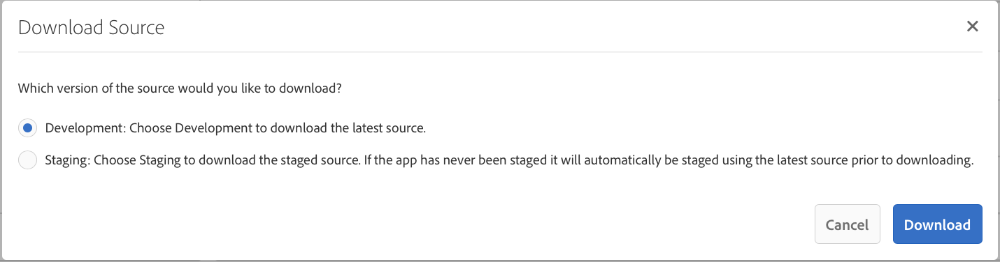

# Desarrollo de aplicaciones con la CLI de PhoneGap{#developing-apps-with-phonegap-cli}

>[!NOTE]
>
>Adobe recomienda el uso del Editor de SPA para proyectos que requieren una representación de cliente basada en el marco de aplicaciones de una sola página (por ejemplo, React). [Más información](/help/sites-developing/spa-overview.md).

En cualquier momento, como desarrollador, puede ejecutar la aplicación en un dispositivo o en un emulador, siempre que haya configurado el entorno de desarrollo.

Para ejecutar los siguientes ejemplos necesitará un sistema que ejecute OSx (Mac) con Xcode o un sistema Mac/Win/Linux con el SDK de Android instalado.

## Bootstrap su entorno de desarrollo {#bootstrap-your-development-environment}

[Configuración de la CLI de PhoneGap](https://docs.phonegap.com/en/4.0.0/guide_cli_index.md.html#The%20Command-Line%20Interface)

Para iOS: Para desarrollar iPhone y iPad, necesita el IDE Xcode de Apple.

* Descárguelo gratis [aquí](https://developer.apple.com/xcode/downloads/).
* [Guía de la plataforma PhoneGap iOS](https://docs.phonegap.com/en/4.0.0/guide_platforms_ios_index.md.html#iOS%20Platform%20Guide)

Para Android: Para desarrollarse para iPhone y iPad, necesita el Android Stuido IDE de Google.

* Descárguelo gratis [aquí](https://developer.android.com/sdk/index.html).
* [Guía de la plataforma PhoneGap Android](https://docs.phonegap.com/en/4.0.0/guide_platforms_android_index.md.html#Android%20Platform%20Guide)

## Descargar la fuente {#download-the-source}

Una vez que haya superado con éxito el entorno de desarrollo, descargue la fuente desde el icono de compilación de aplicaciones de AEM:

* Haga clic en el escaparate de mosaico del PhoneGap Build.


* Haga clic en Descargar fuente.
* Seleccione el origen que desee en el modal Descargar origen.



>[!NOTE]
>
>El origen de desarrollo contiene el estado más reciente de la aplicación, al tiempo que incluye cambios no escalonados. Utilice el origen Ensayo para crear candidatos a la versión para enviarlos a los proveedores del almacén de aplicaciones.
>
>Si nunca realiza la etapa de la aplicación, al seleccionar Ensayo se déclencheur el flujo de trabajo de ensayo (sugerencia: esto se mostrará como una aplicación escalonada en la aplicación PhoneGap Enterprise Viewer (disponible en AppStore y Google PlayStore).

* Haga clic en Descargar y guarde el ZIP en su equipo.
* Extraiga el archivo zip descargado en su área de trabajo.

## Genere y cargue la aplicación (desde el origen) {#build-and-load-the-app-from-source}

La CLI de PhoneGap puede crear un proyecto de plataforma, compilar el origen e implementar la aplicación en un único comando.

>[!NOTE]
>
>Puede realizar todos estos pasos por separado, consulte [Documentos de CLI de PhoneGap](https://phonegap.com/blog/2014/11/13/phonegap-cli-3-6-3/).

1. Asegúrese de haber instalado la CLI de PhoneGap, consulte arriba.
1. En una ventana de consola (o terminal), navegue al directorio raíz del origen extraído.
1. Introduzca el siguiente comando:

```xml
phonegap run android

// -- or -- //

phonegap run ios
```

>[!NOTE]
>
>Si tiene problemas en este momento, vuelva a lo básico para solucionar problemas -
>
>1. Crear una nueva carpeta (prueba de mkdir)
>1. Navegar a esta nueva carpeta (prueba de CD)
>1. Ejecutar &#39;phonegap create helloWorld&#39;
>1. Navegar a helloWorld (cd helloWorld)
>1. Ejecute &#39;phonegap run android (o reemplace android con ios como se ha indicado anteriormente).
>1. El emulador abrirá la ejecución de la aplicación PhoneGap recién creada, diciendo &quot;Preparado para el dispositivo&quot; si el puente de JavaScript a nativo está operativo.

>
>
Esto comprobará que el entorno de desarrollo de la CLI de PhoneGap está activo y funcionando correctamente.

## Depurar JavaScript con la depuración de Safari e IOS {#debug-javascripts-with-safari-and-ios-debug}

Puede depurar los JavaScript de la aplicación con las herramientas de desarrollador de Safari, del mismo modo que lo haría con una aplicación web.

## Habilitar las herramientas para desarrolladores de Safari {#enable-safari-developer-tools}

Para habilitar las herramientas del desarrollador:

* Abrir las preferencias de Safari

   * Haga clic en Safari en la barra de menús
   * Haga clic en Preferencias

* Haga clic en Avanzadas en la ventana Preferencias


* Marque &quot;Mostrar el menú Revelar en la barra de menús&quot;
* Cerrar la ventana Preferencias

## Conectar Safari a iOS {#connect-safari-to-ios}

Puede conectar Safari a un dispositivo iOS o a un emulador.

* En una ventana de consola, navegue al directorio raíz del origen extraído.
* Introduzca el siguiente comando para iniciar la aplicación en el dispositivo o emulador.

```xml
phonegap run <platform> --device

// -- or -- //

phonegap run <platform> --emulator
```

* Abrir Safari
* Haga clic en Desarrollar en la barra de menús
* Seleccionar submenú del simulador de iOS
* Haga clic en home.html


## Depurar JavaScript con el inspector web de Safari {#debug-javascript-with-safari-s-web-inspector}

Puede establecer puntos de interrupción en cualquier lugar del origen. Al interactuar con el emulador o el dispositivo, la ejecución de la aplicación se detendrá en esos puntos de interrupción. Puede realizar un paso a través de la ejecución e inspeccionar los valores en las variables.

* Haga clic en Recursos en la ventana Inspector de Web
* Navegue por el árbol de origen y haga clic en el archivo de origen deseado
* Haga clic en el número de línea adyacente para agregar un punto de interrupción
* Interactuar con el dispositivo o emulador


* Utilice los botones de control para continuar la ejecución, pasar el ratón por encima, entrar y salir de los métodos:


>[!NOTE]
>
>Para ver los valores de las variables, en el método actual, pase el ratón.

## Pasos siguientes {#the-next-steps}

Una vez que haya aprendido acerca del desarrollo de aplicaciones con la CLI de PhoneGap, consulte [Acceso a funciones del dispositivo](/help/mobile/phonegap-access-device-features.md).
