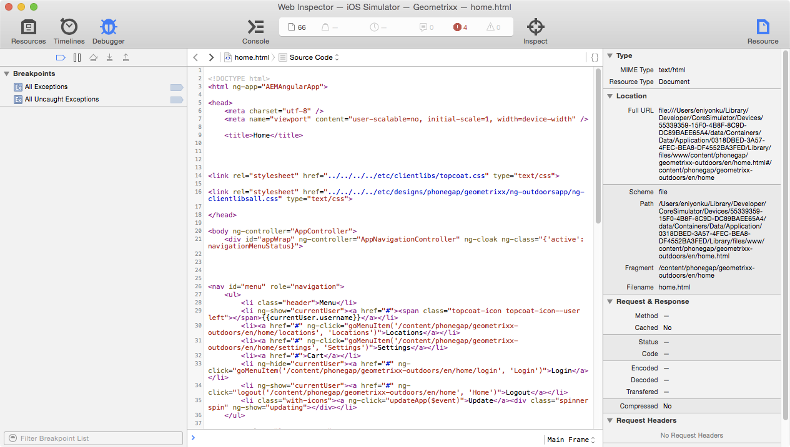

# Desarrollo de aplicaciones con CLI de PhoneGap{#developing-apps-with-phonegap-cli}

{{ue-over-mobile}}

En cualquier momento dado, como desarrollador, puede ejecutar la aplicación en un dispositivo o en un emulador, siempre y cuando haya configurado el entorno de desarrollo.

Para ejecutar los siguientes ejemplos, necesita un sistema que ejecute macOS X con Xcode o un sistema Mac/Win/Linux con Android™ SDK instalado.

## Bootstrap de su entorno de desarrollo {#bootstrap-your-development-environment}

Configurar la CLI de PhoneGap (`https://docs.phonegap.com/en/4.0.0/guide_cli_index.md.html#The%20Command-Line%20Interface`)

Para iOS: Para desarrollar para iPhones y iPads, necesita el IDE Xcode de Apple.

* Descárguelo [aquí](https://idmsa.apple.com/IDMSWebAuth/signin?appIdKey=891bd3417a7776362562d2197f89480a8547b108fd934911bcbea0110d07f757&amp;path=%2Fdownload%2F&amp;rv=1) gratis.
* Guía de la plataforma PhoneGap iOS (`https://docs.phonegap.com/en/4.0.0/guide_platforms_ios_index.md.html#iOS%20Platform%20Guide`)

Para Android™: Para desarrollar para iPhone y iPads, necesita Android™ Studio IDE de Google.

* Descárguelo [aquí](https://developer.android.com/studio) gratis.
* Guía de la plataforma PhoneGap Android™ (`https://docs.phonegap.com/en/4.0.0/guide_platforms_android_index.md.html#Android%20Platform%20Guide`)

## Descargar Source {#download-the-source}

AEM Cuando haya arrancado correctamente su entorno de desarrollo, descargue el origen desde el mosaico de creación de la aplicación de la aplicación de la:

* Haga clic en las comillas angulares desplegables del mosaico PhoneGap Build.


* Haga clic en Descargar Source.
* Seleccione el origen que desee en el modal Descargar Source.


>[!NOTE]
>
>La fuente de desarrollo contiene el estado más reciente de la aplicación, aunque incluye cambios no clasificados. Utilice la fuente de ensayo para crear candidatos de versión para enviarlos a proveedores de tiendas de aplicaciones.
>
>Si nunca almacena en zona intermedia la aplicación, al seleccionar déclencheur de ensayo en el flujo de trabajo de ensayo (sugerencia: se muestra como una aplicación almacenada en zona intermedia en la aplicación Enterprise Viewer de PhoneGap disponible en AppStore y Google PlayStore).

* Haga clic en Descargar y guarde el ZIP en el equipo.
* Extraiga el archivo zip descargado en el espacio de trabajo.

## Generar y cargar la aplicación (desde el origen) {#build-and-load-the-app-from-source}

La CLI de PhoneGap puede crear un proyecto de plataforma, compilar el origen e implementar la aplicación en un solo comando.

>[!NOTE]
>
>Puede realizar todos estos pasos por separado; consulte los documentos de CLI de PhoneGap (`https://phonegap.com/blog/2014/11/13/phonegap-cli-3-6-3/`).

1. Asegúrese de que ha instalado la CLI de PhoneGap; consulte lo anterior.
1. En una ventana de consola (o terminal), vaya al directorio raíz del origen extraído.
1. Introduzca el siguiente comando:

```xml
phonegap run android

// -- or -- //

phonegap run ios
```

>[!NOTE]
>
>Si tiene problemas en este punto, vuelva a Conceptos básicos para solucionar los problemas -
>
>1. Crear una carpeta (prueba mkdir)
>1. Vaya a esta nueva carpeta (prueba de CD)
>1. Ejecutar `phonegap create helloWorld`
>1. Navegar a helloWorld (cd helloWorld)
>1. Ejecute `phonegap run android` (o reemplace Android™ con iOS como se ha indicado anteriormente).
>1. El emulador se abre ejecutando la aplicación PhoneGap recién creada y dice &quot;Dispositivo listo&quot; si la JavaScript Bridge a nativa está operativa.
>
>Esta solución de problemas verifica que el entorno de desarrollo de la CLI de PhoneGap se esté ejecutando correctamente.

## Depurar JavaScript con Safari y IOS Debug {#debug-javascripts-with-safari-and-ios-debug}

Puede depurar el JavaScript de su aplicación con las herramientas para desarrolladores de Safari, del mismo modo que lo haría con una aplicación web.

## Habilitar las herramientas para desarrolladores de Safari {#enable-safari-developer-tools}

Para habilitar las herramientas para desarrolladores:

* Abrir las preferencias de Safari

   * Haga clic en Safari en la barra de menús
   * Haga clic en Preferencias

* Haga clic en Avanzadas en la ventana Preferencia


* Marque &quot;Mostrar el menú Desarrollo en la barra de menús&quot;
* Cierre la ventana Preferencia

## Conexión de Safari a iOS {#connect-safari-to-ios}

Puede conectar Safari a un dispositivo o emulador de iOS.

* En una ventana de la consola, vaya al directorio raíz del origen extraído.
* Introduzca el siguiente comando para poder iniciar la aplicación en su dispositivo o emulador.

```xml
phonegap run <platform> --device

// -- or -- //

phonegap run <platform> --emulator
```

* Abrir Safari
* Haga clic en Desarrollo en la barra de menús
* Submenú Seleccionar iOS Simulator
* Haga clic en home.html



## Depurar JavaScript con el Inspector web de Safari {#debug-javascript-with-safari-s-web-inspector}

Puede establecer puntos de interrupción en cualquier lugar del origen. Al interactuar con el emulador o el dispositivo, la ejecución de la aplicación se detiene en esos puntos de interrupción. Puede recorrer paso a paso la ejecución de e inspeccionar los valores de las variables.

* Haga clic en Recursos en la ventana Inspector Web
* Navegue por el árbol de origen y haga clic en el archivo de origen deseado
* Haga clic en el número de línea situado junto a un punto de interrupción
* Interactuar con dispositivo o emulador


* Utilice los botones de control para continuar la ejecución, pasar por encima de los métodos, entrar en ellos y salir de ellos:


>[!NOTE]
>
>Para ver los valores de las variables en el método actual, pase el ratón por encima.

## Pasos siguientes {#the-next-steps}

Después de haber aprendido a desarrollar aplicaciones con la CLI de PhoneGap, vea [Acceso a las características del dispositivo](/help/mobile/phonegap-access-device-features.md).
