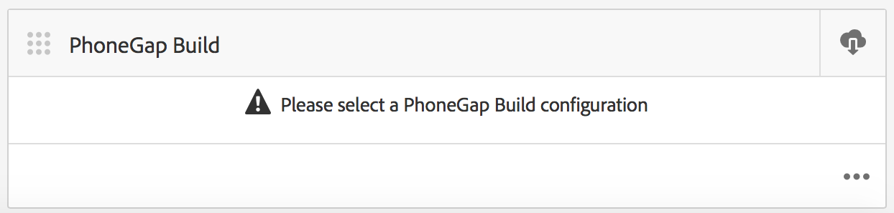

# Creación de aplicaciones móviles{#authoring-mobile-applications}

>[!NOTE]
>
>Adobe recomienda utilizar el Editor de SPA para proyectos que requieren una representación del lado del cliente basada en el marco de aplicaciones de una sola página (por ejemplo, React). [Más información](/help/sites-developing/spa-overview.md).

El panel de AEM Mobile le permite crear, crear e implementar su aplicación móvil, crear, eliminar y editar metadatos de la aplicación. Una vez que la aplicación esté activa, puede analizar los análisis de la aplicación, incluidas las métricas de ciclo de vida y uso, para mejorar la conversión del cliente y la lealtad de marca.

Para crear la aplicación de AEM Mobile, consulte la [Creación de aplicaciones móviles](/help/mobile/building-app-mobile-phonegap.md) página.

Para configurar el entorno y empezar, consulte [Administración de AEM para usar AEM PhoneGap Enterprise](/help/mobile/administer-phonegap.md).

## El catálogo de aplicaciones de AEM Mobile {#the-aem-mobile-apps-catalog}

La variable [Catálogo de aplicaciones de AEM Mobile](http://localhost:4502/aem/apps.html/content/phonegap) muestra toda la aplicación móvil administrada en AEM.

Piense en este catálogo como la &quot;página de aterrizaje&quot; para AEM Mobile, donde los administradores pueden iniciar una nueva aplicación de AEM Mobile creando una aplicación basada en una plantilla o cargando una aplicación existente ya iniciada por un desarrollador de móviles.

Siga estos pasos para llegar a la página de aterrizaje del catálogo de aplicaciones:

1. Vaya a **Navegación** y, a continuación, elija **Móvil**.

1. Choose **Aplicaciones** para abrir el catálogo de aplicaciones.

## El panel de aplicaciones de AEM Mobile {#the-aem-mobile-app-dashboard}

Al seleccionar una aplicación de AEM Mobile en el catálogo, se muestra su panel. Aquí puede administrar su aplicación, ver estadísticas, crear, implementar y administrar el contenido de su aplicación móvil.

Puede expandir a cada mosaico en el panel de AEM Mobile para ver o editar los detalles haciendo clic en el icono &quot;...&quot; en la esquina inferior derecha.

### El mosaico Administrar aplicación {#the-manage-app-tile}

El mosaico Administrar aplicación muestra el icono de la aplicación, el nombre, la descripción y las plataformas admitidas, y llama a casa para obtener actualizaciones en la dirección URL y la información de la versión. Puede profundizar en este mosaico para editar y mantener la Configuración de la aplicación PhoneGap (config.xml) y, preparar la aplicación para su envío a los diferentes almacenes de aplicaciones para su distribución.

Haga clic en [here](/help/mobile/phonegap-app-details-tile.md) para obtener más información.

### Mosaico Administrar contenido de página {#the-manage-page-content-tile}

El contenido se puede crear, actualizar y eliminar en AEM Mobile del mismo modo que se hace en AEM Sites. La variable **Administrar mosaico de contenido de página** muestra el número de páginas de contenido administrado y las últimas modificaciones. Puede explorar en profundidad el contenido para crear, copiar, mover, eliminar y actualizar páginas haciendo clic en cada registro del mosaico. Una vez que el contenido se haya actualizado, puede enviar una actualización de contenido a sus clientes a través del **Mosaico Administrar paquetes de contenido .**

### El mosaico Administrar paquetes de contenido {#the-manage-content-packages-tile}

Una vez que haya agregado o modificado el contenido a través del mosaico Administrar contenido de la página , podrá insertar esos cambios en los clientes con una actualización de la versión de contenido .

El paquete de contenido permite al Autor de aplicaciones AEM administrar el contenido de la página en AEM y, hacer que su equipo de desarrollo realice cambios en la aplicación de shell de PhoneGap (es decir, en el marco de la aplicación o la infraestructura) y, a continuación, enviar esos cambios a sus clientes rápidamente y sin necesidad de solicitar a un desarrollador que vuelva a enviarlos a las distintas tiendas para su distribución.

El paquete de contenido crea un archivo ZIP, denominado paquete de versión de contenido, para cada actualización. Estos paquetes contienen recursos html y páginas html que se generan al procesar la aplicación y son lo suficientemente inteligentes como para empaquetar solo los archivos que se han modificado desde la última actualización.

El mosaico Administrar paquete de contenido **Tipo** muestra &quot;Aplicación&quot; para indicar el contenido del shell de la aplicación, por ejemplo el marco o la infraestructura de la aplicación administrada por un desarrollador o, &quot;Contenido&quot;, que representa el contenido de la página administrado por el autor del contenido.

El contenido se puede representar como un idioma o como una parte concreta de la aplicación en la que la aplicación consume varios paquetes de la versión de contenido. La elección de cómo empaquetar el contenido es flexible y está totalmente a la altura de cómo desea administrar el contenido para su aplicación.

La variable **Modificado** indica cuándo se modificaron las páginas más recientemente.

La variable **Ensayo** muestra cuándo se creó la última actualización de contenido. Para crear una actualización de contenido y realizar los cambios, abra cualquier registro del mosaico y cree una actualización.

La variable **Publicado** muestra cuándo se publicó la última actualización de contenido y cuándo los clientes la pusieron a disposición del cliente. Para publicar contenido, primero debe realizar el escenario de ese contenido y, después, publicar la actualización explorando en este mosaico y publicando desde la consola de detalles de la versión de contenido .

 

Este icono representa un paquete de la versión de contenido para el shell de la aplicación

Estos iconos representan un paquete de la versión de contenido para el contenido de la aplicación

### El mosaico del PhoneGap Build {#the-phonegap-build-tile}

La variable **Mosaico de PhoneGap Build** se conecta con [https://build.phonegap.com](https://build.phonegap.com) para crear y alojar compilaciones remotas. Una vez compilada, la compilación está disponible como descarga o directamente en el dispositivo a través de un código QR.

Como alternativa, puede descargar la fuente del dispositivo para compilar localmente a través del [CLI de PhoneGap](https://docs.phonegap.com/en/3.5.0/guide_cli_index.md.html).

### Mosaico Métricas {#the-metrics-tile}

>[!CAUTION]
>
>El mosaico Métricas solo se muestra después de configurar el servicio en la nube.
>
>Consulte [Configurar el Cloud Service de Adobe Mobile Services](/help/mobile/configure-adobe-mobile-cloud-service.md) para obtener más información.

AEM Mobile se integra con Adobe Analytics mediante [SDK de Adobe Mobile Services](https://experienceleague.adobe.com/docs/mobile.html?lang=en) (AMS).

Centro de control **Mosaico de métricas** muestra un resumen de análisis extraído de AMS para su aplicación. Puede explorar en profundidad el panel de análisis haciendo clic en el en la parte inferior derecha.

### Mosaico Administrar contenido de entidad {#the-manage-entity-content-tile}

El mosaico Administrar contenido de entidad le permite agregar y administrar definiciones de aplicación. Las definiciones de aplicación permiten identificar qué espacios (y otras configuraciones) son adecuados para la aplicación. De este modo, se puede añadir un nuevo espacio, sin tener que volver a compilar la aplicación. La definición de la aplicación se actualiza y eso incluye la información de cualquier espacio nuevo.

Haga clic en [here](/help/mobile/phonegap-app-definitions.md) para crear y administrar las definiciones de la aplicación.

Puede explorar en profundidad el panel de contenido de la entidad de administración haciendo clic en el botón ... en la parte inferior derecha.

#### Recursos adicionales {#additional-resources}

Para obtener más información sobre las funciones y responsabilidades de un administrador y desarrollador, consulte los siguientes recursos:

* [Desarrollo para Adobe PhoneGap Enterprise con AEM](/help/mobile/developing-in-phonegap.md)
* [Administración de contenido para Adobe PhoneGap Enterprise con AEM](/help/mobile/administer-phonegap.md)
