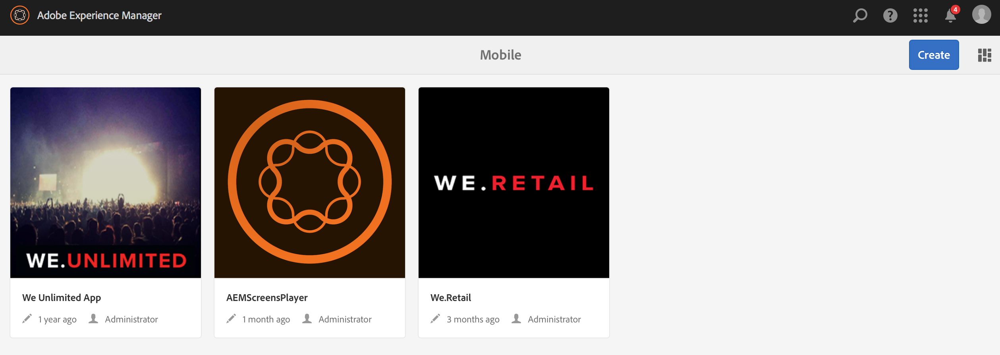

# Creación de aplicaciones móviles{#authoring-mobile-applications}

>[!NOTE]
>
>Adobe recomienda el uso del Editor de SPA para proyectos que requieren una representación de cliente basada en el marco de aplicaciones de una sola página (por ejemplo, React). [Más información](/help/sites-developing/spa-overview.md).

El Panel de AEM Mobile le permite crear, crear e implementar su aplicación móvil, crear, eliminar y editar los metadatos de la aplicación. Una vez que la aplicación esté activa, puede analizar el análisis de la aplicación, incluidas las métricas de uso y ciclo de vida, para mejorar la conversión del cliente y la lealtad de la marca.

Para crear la aplicación de AEM Mobile, consulte la página [Creación de aplicaciones móviles](/help/mobile/building-app-mobile-phonegap.md).

Para configurar el entorno y comenzar, consulte [Administración de AEM para usar AEM PhoneGap Enterprise](/help/mobile/administer-phonegap.md).

## El catálogo de aplicaciones de AEM Mobile {#the-aem-mobile-apps-catalog}

El [Catálogo de aplicaciones de AEM Mobile](http://localhost:4502/aem/apps.html/content/phonegap) muestra toda la aplicación móvil administrada en AEM.

Considere este catálogo como la &quot;página de aterrizaje&quot; para AEM Mobile, en la que los administradores pueden crear una nueva aplicación de AEM Mobile a partir de una plantilla o cargando una aplicación existente ya iniciada por un desarrollador móvil.

Siga estos pasos para acceder a la página de aterrizaje del catálogo de aplicaciones:

1. Vaya a **Navegación** y, a continuación, elija **Móvil**.

1. Elija **Aplicaciones** para abrir el catálogo de aplicaciones.

## El Panel de aplicaciones de AEM Mobile {#the-aem-mobile-app-dashboard}

Al seleccionar una aplicación de AEM Mobile del catálogo, se mostrará su panel. Aquí puede administrar la aplicación, las estadísticas de vista, crear, implementar y administrar el contenido de la aplicación móvil.

Puede expandirse a cada mosaico del Panel de AEM Mobile para realizar vistas o editar los detalles haciendo clic en el botón &#39;...&#39; en la esquina inferior derecha.

### El icono Administrar aplicación {#the-manage-app-tile}

El icono Administrar mosaico de aplicaciones muestra el icono de la aplicación, el nombre, la descripción, las plataformas admitidas y la llamada a casa para obtener información sobre la versión y la URL de las actualizaciones. Puede profundizar en este mosaico para editar y mantener la Configuración de la aplicación PhoneGap (config.xml) y preparar la aplicación para su envío a los distintos almacenes de aplicaciones para su distribución.

Haga clic [aquí](/help/mobile/phonegap-app-details-tile.md) para obtener más detalles.

### El icono Administrar contenido de página {#the-manage-page-content-tile}

El contenido puede crearse, actualizarse y eliminarse en AEM Mobile de la misma manera que lo hace en AEM Sites. El **icono Administrar contenido de página** muestra el número de páginas de contenido administrado y modificadas por última vez. Puede profundizar en el contenido para crear, copiar, mover, eliminar y actualizar páginas haciendo clic en cada registro del mosaico. Una vez actualizado el contenido, puede insertar una actualización de contenido para sus clientes a través del **mosaico Administrar paquetes de contenido.**

### El icono Administrar paquetes de contenido {#the-manage-content-packages-tile}

Una vez que haya agregado o modificado el contenido a través del icono Administrar contenido de página, podrá insertar estos cambios en los clientes con una actualización de la versión de contenido.

Content Package permite al autor de la aplicación AEM administrar el contenido de la página en AEM y, que su equipo de desarrollo realice cambios en la aplicación de shell de PhoneGap (es decir, el marco de aplicaciones o la infraestructura) y, a continuación, envíe esos cambios a sus clientes rápidamente y sin necesidad de solicitar a un desarrollador que vuelva a enviarlos a las distintas tiendas para su distribución.

Content Package crea un archivo ZIP, considerado un paquete de revisión de contenido, para cada actualización. Estos paquetes contienen recursos HTML y páginas HTML que se generan al procesar la aplicación y son lo suficientemente inteligentes como para empaquetar solo los archivos que se han modificado desde la última actualización.

La columna Administrar el icono de contenido del icono **Tipo** mostrará &quot;Aplicación&quot; para indicar el contenido del shell de la aplicación, por ejemplo, el marco o la infraestructura de la aplicación administrada por un desarrollador o, &quot;Contenido&quot;, que representa el contenido de la página administrado por el autor del contenido.

El contenido se puede representar como un idioma o como una parte concreta de la aplicación en la que la aplicación consume varios paquetes de la versión de contenido. La elección de cómo empaqueta el contenido está diseñada para ser flexible y para adaptarse a la forma en que desee administrar el contenido de su aplicación.

La columna **Modificada** indica cuándo se modificaron las páginas más recientemente.

La columna **Ensayo** muestra cuándo se creó la última actualización de contenido. Para crear una nueva actualización de contenido y realizar los cambios, abra cualquier registro del mosaico y cree una nueva actualización.

La columna **Publicada** muestra cuándo se publicó la última actualización de contenido y cuándo los clientes pueden utilizarla. Para publicar contenido, primero debe realizar la fase de ese contenido y, a continuación, publicar la actualización mediante la exploración en profundidad en este mosaico y la publicación desde la consola de detalles de la publicación de contenido.

 

Este icono representa un paquete de la versión de contenido para el shell de la aplicación

Estos iconos representan un paquete de la versión de contenido para el contenido de la aplicación

### El mosaico del PhoneGap Build {#the-phonegap-build-tile}

El **icono de PhoneGap Build** se conecta con [https://build.phonegap.com](https://build.phonegap.com) para crear y alojar buids remotos. Una vez compilada, la compilación está disponible como descarga o directamente en el dispositivo a través de un código QR.

Como alternativa, puede descargar el origen del dispositivo para compilar localmente a través de la [CLI de PhoneGap](https://docs.phonegap.com/en/3.5.0/guide_cli_index.md.html).

### El mosaico de métricas {#the-metrics-tile}

>[!CAUTION]
>
>El mosaico Métricas se muestra únicamente después de configurar el servicio en la nube.
>
>Consulte [Configuración del Cloud Service de Adobe Mobile Services](/help/mobile/configure-adobe-mobile-cloud-service.md) para obtener más información.

AEM Mobile se integra con Adobe Analytics mediante [Adobe Mobile Services SDK](https://www.adobe.com/ca/solutions/digital-marketing/mobile-services/app-sdk.html) (AMS).

El icono **Mosaico de métricas** del Centro de control muestra un resumen de los análisis extraídos de AMS para la aplicación. Puede explorar el panel de análisis haciendo clic en el botón &#39;...&#39; en la parte inferior derecha.

### El icono Administrar contenido de entidad {#the-manage-entity-content-tile}

El icono Administrar contenido de entidad le permite agregar y administrar definiciones de aplicación. Las definiciones de aplicación permiten identificar qué espacios (y otras configuraciones) son adecuados para la aplicación. De este modo, se puede añadir un nuevo espacio, sin tener que volver a compilar la aplicación. La definición de la aplicación se actualiza y eso incluirá la información de los nuevos espacios.

Haga clic [aquí](/help/mobile/phonegap-app-definitions.md) para crear y administrar las definiciones de la aplicación.

Puede explorar el panel de contenido de la entidad de administración haciendo clic en el botón &#39;...&#39; en la parte inferior derecha.

#### Recursos adicionales {#additional-resources}

Para obtener más información sobre las funciones y responsabilidades de un administrador y un desarrollador, consulte los siguientes recursos:

* [Desarrollo para Adobe PhoneGap Enterprise con AEM](/help/mobile/developing-in-phonegap.md)
* [Administración de contenido para Adobe PhoneGap Enterprise con AEM](/help/mobile/administer-phonegap.md)

