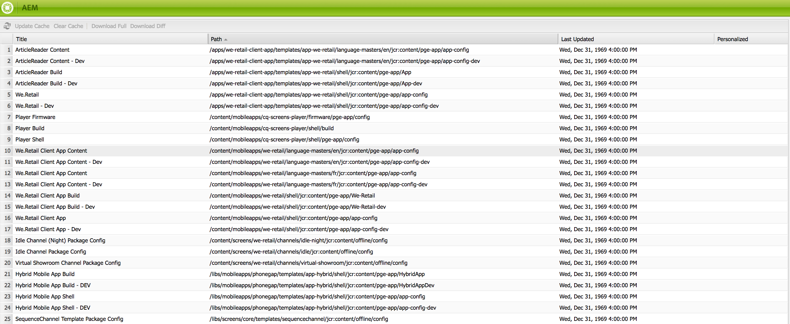

# Móvil con sincronización de contenido{#mobile-with-content-sync}

>[!NOTE]
>
>Adobe recomienda utilizar el Editor de SPA para proyectos que requieren una representación del lado del cliente basada en el marco de aplicaciones de una sola página (por ejemplo, React). [Más información](/help/sites-developing/spa-overview.md).

>[!NOTE]
>
>Este documento forma parte del [Introducción a AEM Mobile](/help/mobile/getting-started-aem-mobile.md) Guía, punto de partida recomendado para la referencia de AEM Mobile.

Utilice la sincronización de contenido para empaquetar contenido de modo que se pueda utilizar en aplicaciones móviles nativas. Las páginas creadas en AEM pueden utilizarse como contenido de aplicación, incluso cuando el dispositivo esté sin conexión. Además, dado que AEM páginas se basan en estándares web, funcionan en plataformas cruzadas que permiten incrustarlas en cualquier envoltorio nativo. Esta estrategia reduce el esfuerzo de desarrollo y le permite actualizar fácilmente el contenido de la aplicación.

>[!NOTE]
>
>Las aplicaciones PhoneGap que crea con AEM herramientas ya están configuradas para usar AEM páginas como contenido a través de la sincronización de contenido.

El marco de sincronización de contenido crea un archivo que contiene el contenido web. El contenido puede ser cualquier cosa, desde páginas simples, imágenes, archivos PDF o aplicaciones web completas. La API de sincronización de contenido proporciona acceso al archivo de archivo desde aplicaciones móviles o procesos de compilación para que el contenido se pueda recuperar e incluir en la aplicación.

La siguiente secuencia de pasos ilustra un caso de uso típico de la sincronización de contenido:

1. El AEM desarrollador crea una configuración de sincronización de contenido que especifica el contenido que se va a incluir.
1. El marco de sincronización de contenido recopila y almacena en caché el contenido.
1. En un dispositivo móvil, la aplicación móvil se inicia y solicita contenido al servidor, que se entrega en un archivo ZIP.
1. El cliente descomprime el contenido ZIP en el sistema de archivos local. La estructura de carpetas del archivo ZIP simula las rutas que un cliente (por ejemplo, un explorador) solicitaría normalmente desde el servidor.
1. El cliente abre el contenido en un navegador integrado o lo utiliza de otra manera.
1. Posteriormente, el cliente solicita el contenido actualizado desde el servidor. El marco de sincronización de contenido ofrece actualizaciones incrementales para reducir el tamaño y el tiempo de descarga, lo que puede ser importante para dispositivos móviles debido al ancho de banda limitado o a los volúmenes de datos.

>[!NOTE]
>
>Para obtener más información sobre las directrices para el desarrollo de los controladores de sincronización de contenido, consulte los controladores de aplicaciones predeterminados. [Desarrollo de los controladores de sincronización de contenido](/help/mobile/contentsync-app-handlers.md).

## Configuración del contenido de sincronización de contenido {#configuring-the-content-sync-content}

Cree una configuración de sincronización de contenido para especificar el contenido del archivo ZIP que se entrega al cliente. Puede crear cualquier cantidad de configuraciones de sincronización de contenido. Cada configuración tiene un nombre para fines de identificación.

Para crear una configuración de sincronización de contenido, agregue una `cq:ContentSyncConfig` al repositorio, con la variable `sling:resourceType` propiedad establecida en `contentsync/config`. La variable `cq:ContentSyncConfig` puede estar ubicado en cualquier parte del repositorio, pero el nodo debe ser accesible para los usuarios de la instancia de publicación de AEM. Por lo tanto, debe añadir el nodo siguiente `/content`.

Para especificar el contenido del archivo ZIP de sincronización de contenido, agregue nodos secundarios al nodo cq:ContentSyncConfig . Las siguientes propiedades de cada nodo secundario identifican un elemento de contenido que se va a incluir y cómo se procesa al agregarlo:

* `path`: La ubicación del contenido.
* `type`: Nombre del tipo de configuración que se utiliza para procesar el contenido. Hay varios tipos disponibles que se describen en Tipos de configuración.

Consulte Ejemplo de configuración de sincronización de contenido .

Después de crear la configuración de sincronización de contenido, esta aparece en la consola de sincronización de contenido.

>[!NOTE]
>
>El marco de sincronización de contenido no comprueba que las dependencias de los recursos y los archivos relacionados con el diseño se incluyan en los paquetes de sincronización de contenido. Asegúrese de incluir todos los archivos necesarios en el archivo ZIP.

### Configuración del acceso a las descargas de sincronización de contenido {#configuring-access-to-content-sync-downloads}

Especifique un usuario o grupo que pueda descargar desde la sincronización de contenido. Puede configurar el usuario o grupo predeterminado que se puede descargar de todas las cachés de sincronización de contenido, así como anular el predeterminado y configurar el acceso para una configuración específica de sincronización de contenido.

Cuando AEM está instalado, los miembros del grupo de administradores pueden descargar desde la sincronización de contenido de forma predeterminada.

### Configuración del acceso predeterminado para las descargas de sincronización de contenido {#setting-the-default-access-for-content-sync-downloads}

El servicio Day CQ Content Sync Manager controla el acceso a la sincronización de contenido. Configure este servicio para especificar el usuario o grupo que puede descargar de la sincronización de contenido de forma predeterminada.

Si [configuración del servicio mediante la consola web](/help/sites-deploying/configuring-osgi.md#osgi-configuration-with-the-web-console), escriba el nombre del usuario o grupo como valor de la propiedad Autorizable de caché de reserva.

Si [configurar en el repositorio](/help/sites-deploying/configuring-osgi.md#osgi-configuration-in-the-repository), utilice la siguiente información sobre el servicio:

* PID: com.day.cq.contentsync.impl.ContentSyncManagerImpl
* Nombre de la propiedad: contentsync.fallback.authorizable

#### Anulación del acceso de descarga para una caché de sincronización de contenido {#overriding-download-access-for-a-content-sync-cache}

Para configurar el acceso de descarga para una configuración específica de la sincronización de contenido, agregue la siguiente propiedad a la variable `cq:ContentSyncConfig` nodo:

* Nombre: autorizable
* Tipo: Cadena
* Valor: Nombre del usuario o grupo que puede descargar.

Por ejemplo, la aplicación permite a los usuarios instalar actualizaciones directamente desde la sincronización de contenido. Para permitir que todos los usuarios descarguen la actualización, establezca el valor de la propiedad autorizable en `everyone`.

Si la variable `cq:ContentSyncConfig` no tiene ninguna propiedad autorizable, el usuario o grupo predeterminado configurado para la propiedad Autorizable de caché de reserva del servicio Day CQ Content Sync Manager determina quién puede descargar.

### Configuración del usuario para actualizar una caché de sincronización de contenido {#configuring-the-user-for-updating-a-content-sync-cache}

Cuando un usuario realiza una actualización de la caché de sincronización de contenido, una cuenta de usuario específica realiza la acción en nombre del usuario. El usuario anónimo actualiza todas las cachés de sincronización de contenido de forma predeterminada.

Puede anular el usuario predeterminado y especificar un usuario o grupo que actualice una caché de sincronización de contenido específica.

Para anular el usuario predeterminado, especifique un usuario o grupo que realice actualizaciones para una configuración específica de Content Sync añadiendo la siguiente propiedad al nodo cq:ContentSyncConfig :

* Nombre: updateuser
* Tipo: Cadena
* Valor: Nombre del usuario o grupo que puede realizar las actualizaciones.

Si el nodo cq:ContentSyncConfig no tiene una propiedad updateuser, el usuario anónimo predeterminado actualiza la caché.

### Tipos de configuración {#configuration-types}

El procesamiento puede abarcar desde la renderización de JSON simple hasta la representación completa de páginas, incluidos sus recursos a los que se hace referencia. Esta sección enumera los tipos de configuración disponibles y sus parámetros específicos:

**copy** Simplemente copie archivos y carpetas.

* **ruta** - Si la ruta apunta a un solo archivo, solo se copia el archivo. Si apunta a una carpeta (esto incluye los nodos de página), todos los archivos y carpetas de abajo se copiarán.

**contenido** Procesar contenido mediante el procesamiento de solicitudes estándar de Sling.

* **ruta** : Ruta al recurso que debería ser salida.
* **Extensión** : Extensión que debe utilizarse en la solicitud. Los ejemplos comunes son *html* y *json*, pero cualquier otra extensión es posible.

* **selector** : selectores opcionales separados por puntos. Los ejemplos comunes son *touch* para procesar versiones móviles de una página o *infinity* para la salida JSON.

**clientlib** Empaquete una biblioteca de cliente JavaScript o CSS.

* **ruta** : ruta a la raíz de la biblioteca del cliente.
* **Extensión** - Tipo de biblioteca de cliente. Esto debe establecerse como *js* o *css* por el momento.

* **includeFolders** - El tipo es una matriz de cadenas, y permite al usuario especificar carpetas adicionales para analizar en la biblioteca del cliente para recuperar archivos (como fuentes personalizadas).

**activos**

Recopile las representaciones originales de los recursos.

* **ruta** : Ruta a una carpeta de recursos debajo de /content/dam.
* **representaciones** - El tipo es una matriz de cadenas, que permite al usuario especificar qué representaciones utilizar en lugar de la imagen predeterminada. La siguiente lista resume algunas representaciones predeterminadas, pero también puede utilizar cualquier representación creada por el flujo de trabajo:

   * *la imagen original*
   * *cq5dam.thumbnail.48.48.png*
   * *cq5dam.thumbnail.319.319.png*
   * *cq5dam.thumbnail.140.100.png*
   * *cq5dam.web.1280.1280.png*

**image** Recopile una imagen.

* **ruta** : ruta a un recurso de imagen.

El tipo de imagen se utiliza para incluir el logotipo de We.Retail en el archivo zip.

**páginas** Procese AEM páginas y recopile recursos a los que se hace referencia.

* **ruta** : Ruta a una página.
* **Extensión** : Extensión que debe utilizarse en la solicitud. Para las páginas esto casi siempre *html*, pero otras aún son posibles.

* **selector** : selectores opcionales separados por puntos. Los ejemplos comunes son *touch* para procesar versiones móviles de una página.

* **deep** - Propiedad booleana opcional que determina si también se deben incluir páginas secundarias. El valor predeterminado es *true.*

* **includeImages** - Propiedad booleana opcional que determina si se deben incluir imágenes. El valor predeterminado es *true*.
De forma predeterminada, solo se tienen en cuenta para la inclusión los componentes de imagen con un tipo de recurso de base/componentes/imagen. Para agregar más tipos de recursos, configure la variable **Controlador de actualización de páginas de CQ WCM de día** en la consola web.

**reescribir** El nodo de reescritura define cómo se reescriben los vínculos en la página exportada. Los vínculos reescritos pueden apuntar a los archivos incluidos en el archivo zip o a los recursos del servidor.

La variable `rewrite` El nodo debe estar situado debajo de la variable `page` nodo .

La variable `rewrite` puede tener una o más de las siguientes propiedades:

* `clientlibs`: reescribe las rutas clientlibs.

* `images`: reescribe las rutas de las imágenes.
* `links`: reescribe las rutas de los vínculos.

Cada propiedad puede tener uno de los siguientes valores:

* `REWRITE_RELATIVE`: reescribe la ruta con una posición relativa al archivo .html de la página en el sistema de archivos.

* `REWRITE_EXTERNAL`: reescribe la ruta señalando al recurso en el servidor, utilizando la AEM [Servicio externalizador](/help/sites-developing/externalizer.md).

El servicio de AEM llamado **PathRewriterTransformerFactory** permite configurar los atributos html específicos que se reescribirán. El servicio se puede configurar en la consola web y tiene una configuración para cada propiedad de la variable `rewrite` nodo: `clientlibs`, `images` y `links`.

Esta función se agregó en la AEM 5.5.

### Ejemplo de configuración de sincronización de contenido {#example-content-sync-configuration}

El listado siguiente muestra un ejemplo de configuración para la sincronización de contenido.

```java
+ weretail_go [cq:ContentSyncConfig]
  - sling:resourceType = "contentsync/config"

  + etc.designs.default [nt:unstructured]
    - path = "/etc/designs/default"
    - type = "copy"

  + etc.designs.mobile [nt:unstructured]
    - path = "/etc/designs/mobile"
    - type = "copy"

  + events.plist [nt:unstructured]
    - path = "/content/weretail_mobile/en/events/jcr:content/par/events"
    - type = "content"
    - extension = "plist"

  + events.touch.html [nt:unstructured]
    - path = "/content/weretail_mobile/en/events"
    - type = "pages"
    - extension = "html"
    - selector = "touch"

  + logo [nt:unstructured]
    - path = "/etc/designs/mobile/jcr:content/mobilecontentpage/logo"
    - type = "logo"

  + manifest [nt:unstructured]
    - indexPage = "/content/weretail_mobile/en/events.touch.html"
    - metadataPlist = "/content/weretail_mobile/en/events/_jcr_content/par/events.plist"

  + ...
```

**etc.designs.default y etc.designs.mobile** Las dos primeras entradas de la configuración deberían ser bastante obvias. Como vamos a incluir varias páginas móviles, necesitamos los archivos de diseño relacionados debajo de /etc/designs. Y como no se requiere un procesamiento adicional, la copia es suficiente.

**events.plist** Esta entrada es un poco especial. Como se menciona en la introducción, la aplicación debe proporcionar una vista de mapa con marcadores de las ubicaciones de los eventos. Proporcionaremos la información de ubicación necesaria como archivo independiente en formato PLIST. Para que esto funcione, el componente de lista de eventos que se utiliza en la página de índice tiene un script llamado plist.jsp. Esta secuencia de comandos se ejecuta cuando se solicita el recurso del componente con la extensión .plist. Como de costumbre, la ruta de los componentes se proporciona en la propiedad path y el tipo se establece en content, ya que queremos aprovechar el procesamiento de solicitudes de Sling.

**events.touch.html** A continuación, aparecen las páginas reales que se mostrarán en la aplicación. La propiedad path se establece en la página raíz del evento. También se incluirán todas las páginas de eventos debajo de esa página, ya que la propiedad deep tiene el valor predeterminado true. Utilizamos las páginas como tipo de configuración, para que se incluyan todas las imágenes u otros archivos a los que se pueda hacer referencia desde una imagen o un componente de descarga en una página. Además, al configurar el selector táctil se obtiene una versión móvil de las páginas. La configuración en el paquete de características contiene más entradas de este tipo, pero se quedan fuera por simplicidad aquí.

**logo** El tipo de configuración del logotipo no se ha mencionado hasta ahora y no es de los tipos integrados. Sin embargo, el marco de sincronización de contenido se puede ampliar en cierta medida y este es un ejemplo de ello, que se tratará en la siguiente sección.

**manifest** A menudo es deseable incluir algún tipo de metadatos en el archivo zip, como la página de inicio del contenido, por ejemplo. Sin embargo, codificar dicha información impide que pueda cambiarla más adelante. El marco de sincronización de contenido admite este caso de uso buscando un nodo de manifiesto en la configuración, que simplemente se identifica con el nombre y no requiere un tipo de configuración. Cada propiedad definida en ese nodo en particular se agrega a un archivo , que también se denomina manifiesto y reside en la raíz del archivo zip.

En el ejemplo, la página de lista de eventos debe ser la página inicial. Esta información se proporciona en la variable **indexPage** y por lo tanto puede cambiarse fácilmente en cualquier momento. Una segunda propiedad define la ruta de acceso del *events.plist* archivo. Como veremos más adelante, la aplicación cliente ahora puede leer el manifiesto y actuar según él.

Tan pronto como se haya configurado la configuración, el contenido se puede descargar con un navegador o con cualquier otro cliente HTTP, o si está desarrollando para iOS, puede utilizar la biblioteca de cliente de WAppKitSync dedicada. La ubicación de descarga está formada por la ruta de la configuración y el *.zip* , por ejemplo, al trabajar con una instancia de AEM local: *https://localhost:4502/content/weretail_go.zip*

### La consola de sincronización de contenido {#the-content-sync-console}

La consola de sincronización de contenido enumera todas las configuraciones de sincronización de contenido en el repositorio (todos los nodos del tipo `cq:ContentSyncConfig`) y para cada configuración le permite hacer lo siguiente:

* Actualice la caché.
* Borre la caché.
* Descargue un zip completo.
* Descargue un zip de comparación de diferencias entre ahora y una fecha y hora específicas.

Puede resultar útil para el desarrollo y la solución de problemas.

Se puede acceder a la consola en:

`https://localhost:4502/libs/cq/contentsync/content/console.html`

Tiene el siguiente aspecto:



### Ampliación del marco de sincronización de contenido {#extending-the-content-sync-framework}

Aunque el número de opciones de configuración ya es bastante amplio, es posible que no cubra todos los requisitos de su caso de uso específico. Esta sección describe los puntos de extensión del marco de sincronización de contenido y cómo crear tipos de configuración personalizados.

Para cada tipo de configuración, hay un *Controlador de actualización de contenido*, que es una fábrica de componentes OSGi registrada para ese tipo específico. Estos controladores recopilan contenido, lo procesan y lo añaden a una caché que mantiene el marco de sincronización de contenido. Implemente la siguiente interfaz o clase base abstracta:

* `com.day.cq.contentsync.handler.ContentUpdateHandler` - Interfaz que todos los administradores de actualizaciones necesitan implementar
* `com.day.cq.contentsync.handler.AbstractSlingResourceUpdateHandler` - Una clase abstracta que simplifica la renderización de recursos mediante Sling

Registre su clase como fábrica de componentes OSGi e impleméntelo en el contenedor OSGi en un paquete. Esto se puede hacer utilizando la variable [Complemento Maven SCR](https://felix.apache.org/site/apache-felix-maven-scr-plugin.html) mediante etiquetas o anotaciones JavaDoc. El siguiente ejemplo muestra la versión de JavaDoc:

```java
/*
 * @scr.component metatype="no"
 * factory="com.day.cq.contentsync.handler.ContentUpdateHandler/customtype"
 */
public class CustomTypeUpdateHandler implements ContentUpdateHandler {
    // add your code here
}

/*
 * @scr.component metatype="no" inherit="true"
 * factory="com.day.cq.contentsync.handler.ContentUpdateHandler/othertype"
 */
public class OtherTypeUpdateHandler extends AbstractSlingResourceUpdateHandler {
    // add your code here
}
```

Observe que la variable *fábrica* la definición contiene la interfaz común y el tipo personalizado separados por barras. Esta estrategia permite que el marco de sincronización de contenido encuentre y cree una instancia de su clase personalizada, ya que reconoce el tipo personalizado en una entrada de configuración. La siguiente sección ofrece un ejemplo concreto de un controlador de actualización personalizado.

>[!CAUTION]
>
>Al crear la clase base AbstractSlingResourceUpdateHandler, debe agregar la variable *heredar* definición. De lo contrario, el contenedor OSGi no establecerá las referencias requeridas que se declaran en la clase base.

### Implementación de un controlador de actualización personalizado {#implementing-a-custom-update-handler}

Cada página de Mobile de We.Retail contiene un logotipo en la esquina superior izquierda que nos gustaría incluir en el archivo zip, por supuesto. Sin embargo, para la optimización de la caché, AEM no hace referencia a la ubicación real del archivo de imagen en el repositorio, lo que nos impide usar simplemente el **copy** tipo de configuración. Lo que necesitamos hacer en su lugar es proveer nuestro propio **logo** tipo de configuración que hace que la imagen esté disponible en la ubicación solicitada por AEM. El siguiente listado de código muestra la implementación completa del controlador de actualización de logotipo:

#### LogoUpdateHandler.java {#logoupdatehandler-java}

```java
package com.day.cq.wcm.apps.weretail.impl;

import javax.jcr.Node;
import javax.jcr.RepositoryException;
import javax.jcr.Session;

import org.apache.sling.api.resource.Resource;
import org.apache.sling.api.resource.ResourceResolver;
import org.apache.sling.jcr.resource.JcrResourceResolverFactory;

import com.day.cq.commons.jcr.JcrUtil;
import com.day.cq.contentsync.config.ConfigEntry;
import com.day.cq.contentsync.handler.ContentUpdateHandler;
import com.day.cq.wcm.foundation.Image;
import com.day.text.Text;

/**
 * The <code>LogoUpdateHandler</code> is used to update the content sync cache
 * with a page logo added using a logo component.
 *
 * @scr.component metatype="no"
 * factory="com.day.cq.contentsync.handler.ContentUpdateHandler/logo"
 */
public class LogoUpdateHandler implements ContentUpdateHandler {

    private static final Logger log = LoggerFactory.getLogger(LogoUpdateHandler.class);

    /** @scr.reference policy="static" */
    protected JcrResourceResolverFactory resolverFactory;

    public boolean updateCacheEntry(ConfigEntry configEntry, Long lastUpdated, String configCacheRoot, Session admin, Session session) {
        ResourceResolver resolver = resolverFactory.getResourceResolver(admin);
        Resource resource = resolver.getResource(configEntry.getContentPath());

        Image img = new Image(resource);
        img.setItemName(Image.NN_FILE, "image");
        img.setItemName(Image.PN_REFERENCE, "imageReference");
        img.setSelector("img");

        try {
            if(img.getLastModified() == null || lastUpdated < img.getLastModified().getTime().getTime()) {
                String src = img.getSrc();
                String parentPath = configCacheRoot + Text.getRelativeParent(src, 1);

                Node parent = JcrUtil.createPath(parentPath, "sling:Folder", admin);
                Node image = resolver.getResource(resource.getPath() + "/image").adaptTo(Node.class);
                JcrUtil.copy(image, parent, Text.getName(src));

                admin.save();

                return true;
            }
        } catch (RepositoryException e) {
            log.error("Unexpected error while updating logo: ", e);
        }

        return false;
    }
}
```

La variable `LogoUpdateHandler` implementa el `ContentUpdateHandler` interfaz `updateCacheEntry(ConfigEntry, Long, String, Session, Session)` , que toma una serie de argumentos:

* A `ConfigEntry` que proporciona acceso a la entrada de configuración, para la que se llama a este controlador, y a sus propiedades.
* A `lastUpdated` marca de tiempo que indica la última vez que la sincronización de contenido actualizó su caché. El controlador no debe actualizar el contenido que no se haya modificado después de esa marca de tiempo.
* A `configCacheRoot` que especifica la ruta raíz de la caché. Todos los archivos actualizados deben almacenarse debajo de esta ruta para agregarlos al archivo zip.
* Sesión administrativa que debe utilizarse para todas las operaciones de repositorio relacionadas con la caché.
* Sesión de usuario que puede utilizarse para actualizar contenido en el contexto de un determinado usuario y, por lo tanto, proporcionar una especie de contenido personalizado.

Para implementar el controlador personalizado, primero cree una instancia de la clase Image basada en el recurso proporcionado en la entrada de configuración. Básicamente es el mismo procedimiento que el componente del logotipo real en nuestras páginas. Se asegura de que la ruta de destino de la imagen sea la misma que la que se hace referencia desde una página.

A continuación, compruebe si el recurso se modificó desde la última actualización. Las implementaciones personalizadas deben evitar actualizaciones innecesarias de la caché y devolver false si no cambia nada. Si se modificó el recurso, copie la imagen en la ubicación de destino esperada en relación con la raíz de la caché. Finalmente, `true` para indicar a la infraestructura que la caché se ha actualizado.

## Uso del contenido en el cliente {#using-the-content-on-the-client}

Para utilizar contenido en una aplicación móvil proporcionada por Content Sync, debe solicitar contenido a través de una conexión HTTP o HTTPS. Como resultado, el contenido recuperado (empaquetado en un archivo ZIP) se puede extraer y almacenar localmente en el dispositivo móvil. Tenga en cuenta que el contenido no solo se refiere a los datos, sino también a la lógica, es decir, a aplicaciones web completas; de este modo, el usuario móvil puede ejecutar las aplicaciones web recuperadas y los datos correspondientes incluso sin conectividad de red.

La sincronización de contenido ofrece contenido de forma inteligente: Solo se entregan los cambios de datos realizados desde la última sincronización de datos exitosa, lo que reduce el tiempo necesario para la transferencia de datos. En la primera ejecución de una aplicación, se solicitan cambios de datos desde el 1 de enero de 1970, mientras que posteriormente solo se solicitan los datos que hayan cambiado desde la última sincronización correcta. AEM utiliza un marco de comunicación del cliente para iOS a fin de simplificar la comunicación y la transferencia de datos, de modo que se requiera una cantidad mínima de código nativo para habilitar una aplicación web basada en iOS.

Todos los datos transferidos se pueden extraer en la misma estructura de directorios; no se requieren pasos adicionales (por ejemplo, comprobaciones de dependencias) al extraer datos. En el caso de iOS, todos los datos se almacenan en una subcarpeta dentro de la carpeta Documents de la aplicación iOS.

Ruta de ejecución típica de una aplicación AEM Mobile basada en iOS:

* El usuario inicia la aplicación en el dispositivo iOS.
* La aplicación intenta conectarse a AEM servidor y solicita cambios en los datos desde la última vez que se ejecutó.
* El servidor recupera los datos en cuestión y los comprime en un archivo.
* Los datos se devuelven al dispositivo cliente, donde se extraen en la carpeta de documentos.
* UIWebView inicia/actualiza el componente.

Si no se pudo establecer una conexión, se mostrarán los datos descargados previamente.

### Cómo avanzar {#getting-ahead}

Para obtener más información sobre las funciones y responsabilidades de un administrador y desarrollador, consulte los siguientes recursos:

* [Creación para Adobe PhoneGap Enterprise con AEM](/help/mobile/phonegap.md)
* [Administración de contenido para Adobe PhoneGap Enterprise con AEM](/help/mobile/administer-phonegap.md)
