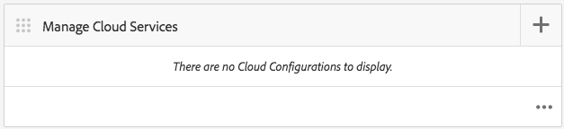

# Seguimiento del rendimiento de las aplicaciones con Adobe Mobile Analytics{#track-app-performance-with-adobe-mobile-analytics}

>[!NOTE]
>
>Adobe recomienda el uso del Editor de SPA para proyectos que requieren una representación de cliente basada en el marco de aplicaciones de una sola página (por ejemplo, React). [Más información](/help/sites-developing/spa-overview.md).

Desea aumentar las conversiones y la lealtad de los clientes.

Desea ofrecer experiencias relevantes y atractivas a sus clientes.

¿Qué hace su aplicación de AEM Mobile para sus campañas de marketing?

¿Cómo puede ajustar las aplicaciones móviles para ofrecer la mejor experiencia a los usuarios?

Con Adobe Mobile Services, puede obtener información sobre cómo utilizan sus aplicaciones móviles los usuarios mediante el seguimiento del uso, los bloqueos de aplicaciones, los detalles del dispositivo y muchas otras métricas críticas para sus aplicaciones móviles.

Adobe Experience Manager Mobile ofrece un vistazo a los detalles del análisis de dispositivos móviles directamente desde el panel de aplicaciones de AEM Mobile. El icono **Métricas** móviles del tablero proporciona análisis en tiempo real de la aplicación móvil, lo que permite a los desarrolladores, autores y administradores obtener una visión rápida del estado de la aplicación móvil. En las portadas que alimentan el análisis se encuentra el SDK de [Adobe Mobile Analytics](https://www.adobe.com/ca/solutions/digital-analytics/mobile-web-apps-analytics.html) . El SDK de Adobe Mobile Analytics se puede conectar a las aplicaciones de forma nativa o mediante un complemento de puente PhoneGap para las vistas web. Las métricas se recopilan y almacenan en caché en el dispositivo hasta que se conecta el dispositivo, en el que los datos se envían a Adobe Mobile Services Cloud para informes y análisis.

El SDK de Adobe Mobile Analytics proporciona lo siguiente:

1. **Recopilación de datos para canales** móviles: recopile datos completos para sus aplicaciones y sitios web móviles en todos los sistemas operativos principales.
1. **Análisis** de participación móvil: comprenda la participación del usuario en la aplicación móvil, el sitio web o el vídeo, incluida la frecuencia con la que los consumidores inician el canal, si realizan compras en él y mucho más.
1. **Tableros e informes** de aplicaciones móviles: obtenga informes de uso que incluyan métricas del ciclo vital para sus aplicaciones y métricas del almacén de aplicaciones: consulte las tendencias de los usuarios, inicios, duración media de la sesión, duración de la retención y bloqueos.
1. **Análisis** de campañas móviles: cuantifique la eficacia de campañas específicas para dispositivos móviles como SMS, anuncios de búsqueda móvil, anuncios en pantalla para dispositivos móviles y códigos QR.
1. **Análisis** de geolocalización: busque dónde inician e interactúan los usuarios con sus experiencias móviles mediante la ubicación GPS o puntos de interés.
1. **Análisis** de rutas: vea cómo los usuarios navegan por la aplicación para determinar qué pantallas y elementos de la interfaz de usuario atraen a los usuarios y cuáles provocan que éstos abandonen la aplicación.

En esta sección se describe cómo los desarrolladores [de](#developers) AEM pueden aprender a instrumentar las aplicaciones de AEM Mobile con el seguimiento de análisis.

Por último, los administradores [de](#administrators) AEM aprenden a:

* crear un servicio en la nube para Adobe Mobile Services
* crear una configuración de servicio móvil y asociar un grupo de informes
* asociar la configuración del servicio móvil a una aplicación móvil
* ver métricas a través del Centro de comandos de las aplicaciones de AEM
* asignar la configuración del SDK de AMS a la aplicación móvil

## Para desarrolladores: Integrar Analytics en la aplicación {#for-developers-integrate-analytics-into-your-app}

**** Requisito previo: Los administradores de AEM deben configurar la configuración de nube de Adobe Mobile Services, [como se describe a continuación](#amscloudserviceconfig).

Los desarrolladores son responsables de [añadir análisis a una aplicación](/help/mobile/phonegap-add-analytics-to-apps.md) de AEM Mobile según sea necesario para realizar un seguimiento, informar y comprender cómo los usuarios interactúan con el contenido de su aplicación móvil, así como para medir métricas clave del ciclo vital, como inicios, tiempo en la aplicación y tasa de bloqueo.

## Para administradores: Configuración del servicio de nube de Adobe Mobile Services {#for-administrators-configure-the-adobe-mobile-services-cloud-service}

Para aprovechar Adobe Mobile Services, debe configurar el servicio de nube de AEM Adobe Mobile Services con la información de cuenta de Adobe Analytics. El Centro de comandos de aplicaciones proporciona un mosaico **Analizar métricas** en el que puede crear y asociar el servicio en la nube con la aplicación móvil.

Para configurar el servicio en la nube en la aplicación móvil, haga clic en el icono de engranaje situado en el mosaico Analizar métricas.

Al hacer clic en el icono de engranaje en el mosaico Analizar métricas se abrirá el cuadro de diálogo modal &#39;Configurar análisis de Mobile Services&#39;. Seleccione la configuración en la lista desplegable &#39;Seleccionar una configuración de Mobile Service&#39;. Si necesita crear una nueva configuración, haga clic en el botón de la llave inglesa.

Para crear un servicio en la nube de Adobe Mobile Services, hay que seguir dos pasos: la conexión al servicio y la selección del grupo de informes que se asignará a la configuración.

Para comenzar, haga clic en el botón &#39;+&#39; en el mosaico Administrar servicios de nube del tablero.

Al hacer clic en el botón &#39;**+**&#39;, se mostrará el asistente **Agregar servicio** de nube.

Seleccione o cree una nueva configuración de servicio móvil rellenando los campos obligatorios como se muestra a continuación. El administrador de AEM necesitará esta información para crear correctamente la conexión a Adobe Mobile Services.

Una vez que haya completado la configuración de la cuenta de Mobile Services, se le pedirá que seleccione una aplicación. Al hacerlo, conecta los informes de análisis de Adobe Mobile Service con esa aplicación.

Seleccione el servicio móvil deseado y haga clic en &#39;Actualizar&#39; para asignar la configuración del servicio móvil y cerrar el cuadro de diálogo.

Ahora que ha asociado la configuración del servicio móvil a la aplicación de AEM Mobile, el mosaico empezará a recuperar los datos de la métrica y a empezar a generar informes.

### Archivo de configuración del SDK de Adobe Mobile Services {#adobe-mobile-services-sdk-config-file}

En este momento, la aplicación móvil está asociada a un servicio en la nube, pero la aplicación móvil aún no sabe cómo comunicar las métricas móviles recopiladas a Adobe Analytics. Para conectar la aplicación móvil a Adobe Analytics, el archivo de configuración del SDK de Adobe Mobile Services debe agregarse a Adobe Experience Manager.

En el mosaico Analizar métricas, haga clic en el icono de flecha para mostrar las entradas del menú Descargar/Cargar configuración del SDK de AMS.

El primer paso es obtener la configuración del SDK de Adobe Mobile Services, si hace clic en &quot;Descargar configuración del SDK de AMS&quot; se le redirigirá al sitio web de Adobe Mobile Services desde donde puede descargar el archivo de configuración. Una vez obtenido el archivo ADBMobileConfig.json, haga clic en &quot;Cargar configuración del SDK de AMS&quot; para cargar el archivo de configuración en AEM.

Haga clic en el botón &#39;Cargar configuración de aplicación de Adobe Mobile Services&#39;, busque el archivo ADBMobileConfig.json y, a continuación, haga clic en &#39;Cargar&#39;.

Ahora que la aplicación móvil tiene acceso al archivo ADBMobileConfig.json, tiene los conocimientos sobre cómo comunicarse con Adobe Analytics y empezar a generar informes sobre el valor de las métricas importantes que le ayudarán a mejorar el éxito de sus aplicaciones.

## ¿Qué sigue? {#what-s-next}

1. [Inicio de la experiencia con la aplicación de AEM Mobile](/help/mobile/starting-aem-phonegap-app.md)
1. [Gestión del contenido de mi aplicación](/help/mobile/phonegap-manage-app-content.md)
1. [Generar mi aplicación](/help/mobile/building-app-mobile-phonegap.md)
1. [Rastree el rendimiento de mi aplicación con Adobe Mobile Analytics](/help/mobile/phonegap-intro-to-app-analytics.md)
1. [Ofrezca una experiencia de aplicación personalizada con Adobe Target](/help/mobile/phonegap-aem-mobile-content-personalization.md)
1. [Enviar mensajes importantes a mis usuarios](/help/mobile/phonegap-push-notifications.md)