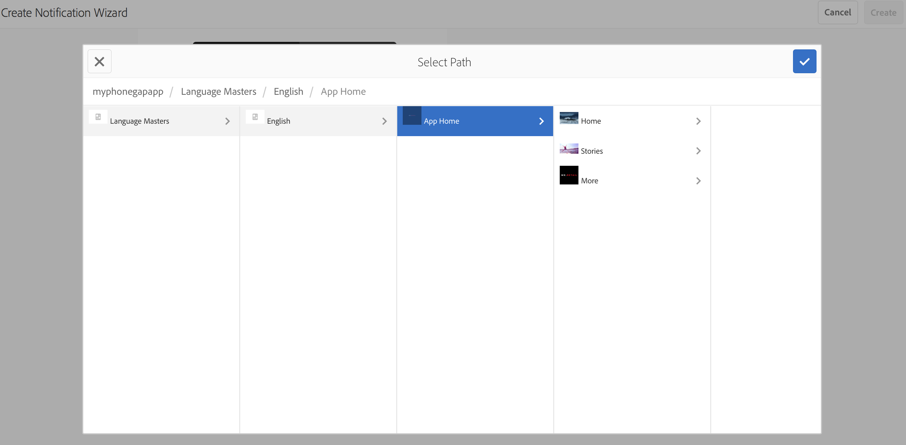

# Notificaciones push{#push-notifications}

>[!NOTE]
>
>Adobe recomienda utilizar el Editor de SPA para proyectos que requieren una representación del lado del cliente basada en el marco de aplicaciones de una sola página (por ejemplo, React). [Más información](/help/sites-developing/spa-overview.md).

Poder alertar instantáneamente a los usuarios de la aplicación de AEM Mobile con notificaciones importantes es crucial para el valor de una aplicación móvil y sus campañas de marketing. Aquí describimos los pasos que se deben seguir para permitir que la aplicación reciba notificaciones push y cómo configurar y enviar mensajes push desde AEM Mobile a la aplicación instalada por teléfono. Además, en esta sección se describe cómo configurar la variable [Enlaces profundos](#deeplinking) para las notificaciones push.

>[!NOTE]
>
>*Las notificaciones push no están garantizadas para la entrega; son más como anuncios. Se realiza un mejor esfuerzo para asegurarse de que todos los usuarios los reciban, pero no son un mecanismo de entrega garantizado. Además, el tiempo para enviar una notificación push puede variar de menos de un segundo a media hora.*

El uso de notificaciones push con AEM requiere algunas tecnologías diferentes. En primer lugar, se debe utilizar un proveedor de servicios de notificaciones push para administrar notificaciones y dispositivos (AEM aún no lo hace). Hay dos proveedores configurados de forma predeterminada con AEM: [Servicio de notificaciones simples de Amazon](https://aws.amazon.com/sns/) (o SNS) y [Pushwoosh](https://www.pushwoosh.com/). En segundo lugar, la tecnología push para el sistema operativo móvil determinado debe pasar por el servicio adecuado: Servicio de notificaciones push (o APNS) de Apple para dispositivos iOS; y Google Cloud Messaging (o GCM) para dispositivos Android. Aunque AEM no se comunica directamente con estos servicios específicos de la plataforma, AEM debe proporcionar parte de la información de configuración relacionada junto con las notificaciones para que estos servicios ejecuten la notificación push.

Una vez instalado y configurado (como se explica a continuación), funciona de esta manera:

1. Se crea una notificación push en AEM y se envía al proveedor de servicios (Amazon SNS o Pushwoosh).
1. El proveedor de servicios lo recibe y lo envía al proveedor principal (APNS o GCM).
1. El proveedor principal envía la notificación a todos los dispositivos registrados para esa notificación push. Para cada dispositivo utiliza la red de datos móviles o WiFi, la que esté disponible actualmente en el dispositivo.
1. La notificación se muestra en el dispositivo si la aplicación para la que está registrado no se está ejecutando. Un usuario que toca la notificación iniciará la aplicación y mostrará la notificación dentro de la aplicación. En caso de que la aplicación ya se esté ejecutando, solo se mostrará la notificación en la aplicación.

Esta versión de AEM es compatible con dispositivos móviles iOS y Android.

## Información general y procedimiento {#overview-and-procedure}

Para utilizar notificaciones push en una aplicación de AEM Mobile, se deben seguir los siguientes pasos de alto nivel.

Normalmente, un desarrollador de AEM:

1. Regístrese en los servicios de mensajería de Apple y Google
1. Regístrese con un servicio de mensajería push y configúrelo
1. Añadir compatibilidad push a la aplicación
1. Preparar un teléfono para realizar pruebas

Mientras que un administrador AEM:

1. Configuración de push en aplicaciones AEM
1. Generar e implementar la aplicación
1. Enviar una notificación push
1. Configuración de la vinculación profunda *(opcional)*

### Paso 1: Regístrese en los servicios de mensajería de Apple y Google {#step-register-with-apple-and-google-messaging-services}

#### Uso del servicio de notificaciones push de Apple (APNS) {#using-the-apple-push-notification-service-apns}

Vaya a la página de Apple . [here](https://developer.apple.com/library/ios/documentation/NetworkingInternet/Conceptual/RemoteNotificationsPG/Chapters/ApplePushService.html) para familiarizarse con el servicio de notificaciones push de Apple.

Para utilizar APNS, necesitará un **Certificado** (un archivo .cer), una notificación push **Clave privada** (un archivo .p12) y **Contraseña de clave privada** de Apple. Se pueden encontrar instrucciones sobre cómo hacerlo [here](https://developer.apple.com/library/ios/documentation/NetworkingInternet/Conceptual/RemoteNotificationsPG/Chapters/ProvisioningDevelopment.html).

#### Uso del servicio Google Cloud Messaging (GCM) {#using-the-google-cloud-messaging-gcm-service}

>[!NOTE]
>
>Google está reemplazando GCM con un servicio similar llamado Firebase Cloud Messaging (FCM). Para obtener más información sobre FCM, haga clic en [here](https://developers.google.com/cloud-messaging/faq).

Vaya a la página de Google . [here](https://developer.android.com/google/gcm/index.html) para familiarizarse con Google Cloud Messaging para Android.

Debe seguir los pasos [here](https://developer.android.com/google/gcm/gs.html) a **Creación de un proyecto de API de Google**, **Habilitar el servicio GCM** y **Obtener una clave de API**. Necesitará la variable **Clave de API** para enviar notificaciones push a dispositivos Android. Además, registre su **Número de proyecto**, que a veces también se denomina **Id. del remitente GCM**.

Los siguientes pasos muestran un método diferente para crear claves de API de GCM:

1. Inicie sesión en google y vaya a la [Página de desarrollador de Google](https://developers.google.com/mobile/add?platform=android&amp;cntapi=gcm).
1. Elija la aplicación de la lista (o cree una nueva).
1. En Nombre del paquete de Android, introduzca su ID de aplicación, por ejemplo: `com.adobe.cq.mobile.weretail.outdoorsapp`. (Si eso no funciona, vuelva a intentarlo con &quot;test.test&quot;).
1. Haga clic en **Continuar con la selección y configuración de servicios**
1. Seleccione Mensajería en la nube y, a continuación, haga clic en **Habilitar Google Cloud Messaging**.
1. A continuación, se muestran la nueva clave de API de servidor y el ID de remitente (nuevo o existente).

>[!NOTE]
>
>Registre la clave de API del servidor. Este valor se introduce en el sitio del proveedor push.

### Paso 2: Registro y configuración de un servicio de mensajería push {#step-register-and-configure-a-push-messaging-service}

AEM está configurado para utilizar uno de los tres servicios para las notificaciones push:

* SNS de Amazon
* Pushwoosh
* Adobe Mobile Services

*SNS de Amazon* y *Pushwoosh* las configuraciones le permiten enviar mensajes insertados desde dentro de AEM pantallas.

*Adobe Mobile Services* permite configurar y enviar notificaciones push desde Adobe Mobile Services con una cuenta de Adobe Analytics (pero la aplicación debe crearse con este conjunto de configuración para habilitar las notificaciones push de AMS).

#### Uso del servicio de mensajería SNS de Amazon {#using-the-amazon-sns-messaging-service}

>[!NOTE]
>
>*Encontrará información sobre Amazon SNS y un vínculo para crear una nueva cuenta de AWS [here](https://aws.amazon.com/sns/). Puede obtener una cuenta gratuita durante un año.*

Si no desea utilizar Amazon SNS, puede omitir estos pasos.

Siga estos pasos para configurar Amazon SNS para notificaciones push:

1. **Regístrese en Amazon SNS**

   1. Registre su Id De Cuenta. El formato debe ser de doce dígitos sin espacios ni guiones, es decir &quot;123456789012&quot;.
   1. Asegúrese de que se encuentra en la región &quot;us-east&quot; o &quot;eu&quot;, ya que un paso posterior (Creación de grupos de identidades) requiere uno de ellos.
   1. Después de registrarse, inicie sesión en la consola de administración y seleccione [SNS](https://console.aws.amazon.com/sns/) (Servicio de notificaciones push). Haga clic en &quot;Introducción&quot; si aparece.

1. **Crear clave de acceso e ID**

   1. Haga clic en su nombre de inicio de sesión en la parte superior derecha de la pantalla y seleccione Credenciales de seguridad en el menú.
   1. Haga clic en Teclas de acceso y, en el espacio siguiente, haga clic en **Crear nueva clave de acceso**.
   1. Haga clic en **Mostrar clave de acceso** y copie y guarde el ID de clave de acceso y la clave de acceso secreta que se muestran. Si elige la opción para descargar las claves, obtendrá un archivo csv que contiene esos mismos valores.
   1. En esta página se pueden administrar otros certificados relacionados con la seguridad y otros.

   >[!NOTE]
   >
   >Se puede usar una clave de acceso para varias aplicaciones.

   Para las organizaciones que usan una cuenta &quot;AWS Sandbox&quot;, los pasos son muy similares y se describen aquí:

   1. Haga clic en su nombre de inicio de sesión en la parte superior derecha de la pantalla y seleccione My Security Credentials en el menú.
   1. Haga clic en Usuarios en la lista izquierda de acciones y elija su nombre de usuario.
   1. Haga clic en la pestaña Credenciales de seguridad .
   1. Desde aquí puede ver sus claves y crear claves nuevas. Guarde las claves para usarlas más adelante.

1. **Crear un tema**

   1. Haga clic en **Crear tema** y elija un nombre de tema. Registre todos los campos, como ARN del tema, Propietario del tema, Región y Nombre para mostrar.
   1. Haga clic en **Otras acciones de tema** > **Editar directiva de tema**. En **Permitir que estos usuarios se suscriban a este tema**, seleccione **Todos.**
   1. Haga clic en **Actualizar directiva**.

   >[!NOTE]
   >
   >Puede crear varios temas para distintos escenarios, como desarrollo, prueba, demostración, etc. El resto de la configuración de SNS puede seguir siendo la misma. Cree la aplicación con el tema diferente; las notificaciones push enviadas a ese tema solo las recibirá la aplicación creada con ese tema.

1. **Creación de aplicaciones de plataforma**

   1. Haga clic en Aplicaciones y, a continuación, en Crear aplicación de plataforma . Elija un nombre y seleccione una plataforma (APNS para iOS, GCM para Android). Según la plataforma, se deberán rellenar otros campos:

      1. Para APNS, se debe introducir un archivo P12, una contraseña, un certificado y una clave privada. Estos deberían haberse obtenido en el paso *Uso del servicio de notificaciones push de Apple (APNS)* arriba.
      1. Para GCM, se debe introducir una clave de API. Esto debería haberse obtenido en el paso *Uso del servicio Google Cloud Messaging (GCM)* arriba.
   1. Repita el paso anterior una vez para cada plataforma que admita. Para poder insertar tanto iOS como Android, se deben crear dos aplicaciones de plataforma.

1. **Crear un grupo de identidades**

   1. Uso [Cognito](https://console.aws.amazon.com/cognito) para crear un grupo de identidades, que almacenará datos básicos de usuarios no autenticados. Tenga en cuenta que, en este momento, solo las regiones &quot;us-east&quot; y &quot;eu&quot; son compatibles con Amazon Cognito.
   1. Asígnele un nombre y marque la casilla &quot;Habilitar acceso a identidades no autenticadas&quot;.
   1. En la página siguiente (&quot;*Las identidades de Cognito requieren acceso a sus recursos*&quot;) haga clic en Permitir.
   1. En la parte superior derecha de la página, haga clic en el vínculo &quot;*Editar grupo de identidades&quot;*. Se muestra el ID del grupo de identidades. Guarde este texto para más adelante.
   1. En la misma página, elija la lista desplegable junto a &quot;Función no autenticada&quot; y asegúrese de que tiene la función Cognito_&lt;pool name=&quot;&quot;>UnauthRole seleccionado. Guarde los cambios.

1. **Configurar el acceso**

   1. Inicie sesión en [Administración de identidad y acceso](https://console.aws.amazon.com/iam/home) (IAM)
   1. Seleccionar funciones
   1. Haga clic en la función creada en el paso anterior, llamada Cognito_&lt;youridentitypoolname>Unauth_Role. Registre el &quot;Rol ARN&quot; mostrado.
   1. Abra &quot;Directivas en línea&quot; si aún no está abierto. Debería ver una directiva con un nombre como oneClick_Cognito_&lt;youridentitypoolname>Unauth_Role_1234567890123.
   1. Haga clic en &quot;Editar directiva&quot;. Reemplace el contenido del documento de directiva con este fragmento de JSON:

   <table>
    <tbody>
     <tr>
     <td>
 
 
{
 
 "Versión": "2012-10-17",
 
 "Declaración": [
 
 {
 
 "Acción": [
 
 "mobileanalytics:PutEvents",
 
 "cognito-sync:*",
 
 "SNS:CreatePlatformEndpoint",
 
 "SNS:Subscribe"
 
 ],
 
 "Efecto": "Permitir",
 
 "Recurso": [
 
 "*"
 
 ]
 
 }
 
 ]
 
}
 
 
 </td>
     </tr>
    </tbody>
    </table>

   1. Haga clic en **Aplicar directiva**

#### Uso del servicio de mensajería Pushwoosh {#using-the-pushwoosh-messaging-service}

Si no desea utilizar Pushwoosh, puede omitir este paso.

Para usar Pushwoosh:

1. **Regístrese en Pushwoosh**

   1. Vaya a pushwoosh.com y cree una nueva cuenta.

1. **Creación de un token de acceso de API**

   1. En el sitio de Pushwoosh, vaya al elemento de menú Acceso a la API para generar un token de acceso a la API. Tendrá que registrar esto de forma segura.

1. **Crear una aplicación nueva**

   1. Para la compatibilidad con Android, debe proporcionar la clave de API de GCM.
   1. Al configurar la aplicación, elija Cordova como marco.
   1. Para la compatibilidad con iOS, debe proporcionar el archivo de certificado (.cer), el certificado push (.p12) y la contraseña de clave privada; deberían haberse obtenido del sitio APNS de Apple. Para Framework, seleccione Cordova.
   1. Pushwoosh generará un ID de aplicación para esa aplicación, en el formato &quot;XXXXX-XXXXX&quot;, donde cada X es un valor hexadecimal (de 0 a F).

>[!NOTE]
>
>*Si se configura una segunda aplicación en AEM con el mismo ID de aplicación (y otros valores relacionados: Token de acceso a la API y el ID de GCM), cualquier notificación push enviada a través de la segunda aplicación AEM irá a cualquier otra aplicación con ese ID de aplicación.*

### Paso 3: Añadir compatibilidad push a la aplicación {#step-add-push-support-to-the-app}

#### Agregar configuración de ContentSync {#add-contentsync-configuration}

Cree dos nodos de contenido (uno en app-config y otro en app-config-dev) llamados notificationsConfig:

* /content/`<your app>`/shell/jcr:content/page-app/app-config-dev/notificationsConfig
* /content/`<your app>`/shell/jcr:content/page-app/app-config/notificationsConfig

Con estas propiedades (archivos .content.xml) :
&lt;jcr:root xmlns:jcr=&quot; &lt;span id=&quot; translate=&quot;no&quot; />https://www.jcp.org/jcr/1.0](https://www.jcp.org/jcr/1.0)&quot; xmlns:nt=&quot; [https://www.jcp.org/jcr/nt/1.0](https://www.jcp.org/jcr/nt/1.0)&quot; jcr:primaryType=&quot;nt:unstructured&quot; excludeProperties=&quot;[appAPIAccessToken]&quot; path=&quot;../../../.../..&quot;
[
targetRootDirectory=&quot;www&quot; type=&quot;notificationsconfig&quot;/>

>[!NOTE]
>
>El controlador de sincronización de contenido busca esos nodos y, si no están presentes, no escribe el archivo page-notifications-config.json.

#### Agregar bibliotecas de cliente {#add-client-libraries}

Las bibliotecas de cliente de notificaciones push deben agregarse a la aplicación siguiendo estos pasos:

En CRXDE Lite:

1. Vaya a */etc/designs/phonegap/&lt;app name=&quot;&quot;>/clientlibsall.*
1. Haga doble clic en la sección incrustar del panel de propiedades.
1. En el cuadro de diálogo que aparece, agregue una nueva biblioteca de cliente haciendo clic en el botón + .
1. En el nuevo campo de texto, añada &quot;cq.mobile.push&quot; y haga clic en Aceptar.
1. Añada otra llamada cq.mobile.push.amazon y haga clic en Aceptar.
1. Guarde los cambios.

>[!NOTE]
>
>Si las notificaciones push se eliminan o no se usan por consideraciones de espacio en la aplicación y para evitar mensajes de error de la consola, elimine estos clientlibs de la aplicación.

### Paso 4: Preparación de un teléfono para pruebas {#step-prepare-a-phone-for-testing}

>[!NOTE]
>
>*Para las notificaciones push, debe realizar pruebas en un dispositivo real, ya que los emuladores no pueden recibir notificaciones push.*

#### iOS {#ios}

Para iOS, deberá usar un equipo Mac OS y unirse a la [Programa para desarrolladores de iOS](https://developer.apple.com/programs/ios/). Algunas corporaciones tienen licencias corporativas que pueden estar disponibles para todos los desarrolladores.

Con XCode 8.1, antes de utilizar las notificaciones push debe ir a la pestaña Funcionalidades del proyecto y activar la opción Notificaciones push .

#### Android {#android}

Para instalar la aplicación en un teléfono Android mediante CLI (consulte a continuación: **Paso 6: Creación e implementación de la aplicación**), primero debe poner el teléfono en &quot;modo desarrollador&quot;. Consulte [Activación de las opciones del desarrollador en el dispositivo](https://developer.android.com/tools/device.html#developer-device-options) para obtener más información sobre cómo hacerlo.

### Paso 5: Configuración de push en aplicaciones AEM {#step-configure-push-on-aem-apps}

Antes de crear e implementar en el dispositivo móvil configurado, debe configurar la configuración de notificación para el servicio de mensajería que ha decidido utilizar.

1. Cree los grupos de autorización adecuados para las notificaciones push.
1. Inicie sesión en AEM como el usuario apropiado, haga clic en la ficha Aplicaciones .
1. Haga clic en la aplicación.
1. Busque el mosaico Administrar Cloud Services y haga clic en el lápiz para modificar las configuraciones de nube.
1. Seleccione Conexión Amazon SNS, Conexión Pushwoosh o Adobe Mobile Services como configuración de notificación.
1. Introduzca las propiedades del proveedor y haga clic en Enviar para guardarlas y en Listo. No se verifican de forma remota en esta fase, excepto en el caso de AMS.
1. Ahora debería ver la configuración que acaba de introducir en el mosaico Administrar Cloud Services .

### Paso 6: Generar e implementar la aplicación {#step-build-and-deploy-the-app}

**Nota:** Consulte también nuestras instrucciones [here](/help/mobile/building-app-mobile-phonegap.md) al crear aplicaciones de PhoneGap.

Existen dos formas de crear e implementar la aplicación mediante PhoneGap.

**Nota:** Para las pruebas de notificaciones push, los emuladores no serán suficientes porque las notificaciones push utilizan un protocolo distinto entre el proveedor push (Apple o Google) y el dispositivo. El hardware y los emuladores actuales de Mac/PC no son compatibles con esto.

1. *PhoneGap Build* es un servicio ofrecido por PhoneGap que creará su aplicación en sus servidores y le permitirá descargarla directamente en su dispositivo. Consulte la [documentación del PhoneGap Build](https://build.phonegap.com/) para aprender a configurar y utilizar PhoneGap Build.

1. *Interfaz de línea de comandos de PhoneGap* (CLI) le permite utilizar un completo conjunto de comandos de PhoneGap en la línea de comandos para crear, depurar e implementar su aplicación. Consulte la [Documentación para desarrolladores de PhoneGap](https://docs.phonegap.com/en/edge/guide_cli_index.md.html#The%20Command-Line%20Interface) para aprender a configurar y utilizar la CLI de PhoneGap.

### Paso 7: Enviar una notificación push {#step-send-a-push-notification}

Para crear una nueva notificación y enviarla, siga estos pasos.

1. Creación de una nueva notificación

   * En el panel de la aplicación de AEM Mobile, busque el mosaico Notificaciones push .
   * En el menú de la esquina superior derecha, elija &quot;Crear&quot;. Tenga en cuenta que este botón no estará disponible hasta que se configure la nube por primera vez.
   * En el Asistente para crear notificaciones, introduzca un título y un mensaje y, a continuación, haga clic en el botón &quot;Crear&quot;. La notificación ya está lista para enviarse inmediatamente o más tarde. Se puede editar y el mensaje o el título se pueden cambiar y guardar.

1. Enviar la notificación

   * En el panel Aplicaciones , busque el mosaico Notificaciones push .
   * Seleccione la notificación o haga clic en el botón de detalles en la parte inferior derecha (. . .), para mostrar la lista de notificaciones. Esta lista también indica si una notificación está lista para enviarse, si ya se ha enviado o si se ha producido un error durante el envío.
   * Seleccione la casilla de una notificación (solo) y haga clic en el botón &quot;Enviar notificación&quot; situado encima de la lista. Tendrá la oportunidad de &quot;Cancelar&quot; o &quot;Enviar&quot; la notificación en el cuadro de diálogo que aparece.

1. Tratamiento de los resultados

   * Si el servicio de notificaciones push (Amazon SNS o Pushwoosh) recibe la solicitud de envío, la confirma como válida y la envía a los proveedores nativos (APNS y GCM) correctamente, el cuadro de diálogo de envío se cerrará sin ningún mensaje. En la lista de notificaciones, el estado de esa notificación se enumera como Enviado.
   * Si la notificación push falla, el cuadro de diálogo mostrará un mensaje que indicará el problema. En la lista de notificaciones, el estado de esa notificación aparece como Error, pero si el problema se corrige, la notificación se puede enviar de nuevo. En caso de error, debe aparecer información de error adicional en el registro de errores del servidor.
   * Tenga en cuenta que existen algunas diferencias entre las plataformas entre las notificaciones push de iOS y Android. Entre ellos:

      * La creación con CLI iniciará la aplicación después de implementarla en Android. En iOS, debe iniciarlo manualmente. Dado que el paso de registro push se produce al inicio, las aplicaciones de Android pueden recibir notificaciones push de inmediato (ya que se habrán iniciado y registrado), mientras que las aplicaciones de iOS no.
      * En Android, el texto del botón Aceptar está en mayúsculas (y en cualquier otro botón añadido en la notificación en la aplicación), mientras que en iOS no lo está.

Para las notificaciones push de AMS, las notificaciones deben estar compuestas y enviadas desde el servidor AMS. AMS proporciona funciones de notificación push adicionales, además de las proporcionadas por las notificaciones AEM con AWS y Pushwoosh.

>[!NOTE]
>
>*Las notificaciones push no están garantizadas para la entrega; son más como anuncios. Se realiza un mejor esfuerzo para asegurarse de que todos lo escuchen, pero no son un mecanismo de entrega garantizado. Además, el tiempo para enviar una notificación push puede variar de menos de un segundo a media hora.*

### Configuración de vínculos profundos con notificaciones push {#configuring-deep-linking-with-push-notifications}

¿Qué es la vinculación profunda? En el contexto de una notificación push, es un medio para permitir que una aplicación se abra o se dirija (si está abierta) a una ubicación especificada dentro de la aplicación.

¿Cómo funciona? El autor de una notificación push agrega opcionalmente una etiqueta de botón (p. ej. &quot;¡Muéstrame!&quot;) a la notificación y elige la página que desea vincular en la notificación, a través de un explorador de rutas visuales. Cuando se envía, la pulsación se produce de la forma normal, excepto que en el mensaje en la aplicación, el botón Aceptar se reemplaza por el botón &quot;Rechazar&quot; y el nuevo botón especificado (&quot;Mostrar&quot;) también aparece. Al hacer clic en el nuevo botón, la aplicación pasará a la página especificada dentro de la aplicación. Al hacer clic en Rechazar , se descartará el mensaje.

Si la aplicación no está abierta, el sombreado aparecerá como de costumbre. Si se realiza una acción en la notificación a la sombra, se abrirá la aplicación y, a continuación, se presentarán al usuario los botones de vínculo profundo basados en lo configurado en la notificación push.

Cree la notificación y añada un texto de botón y una ruta de vínculo para el vínculo profundo opcional:

>[!CAUTION]
>
>.Para acceder al mosaico de notificaciones push en el tablero, siga los pasos a continuación.

1. Haga clic en la edición en la esquina superior derecha del **Administrar Cloud Services** mosaico.

   

1. Seleccione el **Conexión Pushwoosh**. Haga clic en **Siguiente**.

   

1. Introduzca los detalles de las propiedades y haga clic en **Submit**.

   

   Una vez que envíe la configuración, **Notificaciones push** el mosaico se muestra en el tablero.

   

### Crear asistente de notificación {#create-notification-wizard}

Una vez que la variable **Notificaciones push** El mosaico se muestra en el tablero, utilice el asistente crear notificación para añadir el contenido:

1. Haga clic en el símbolo add en la esquina superior derecha del **Notificaciones push** para abrir el **Asistente para crear notificaciones**.

   

1. Al hacer clic en el icono Examinar de la ruta del vínculo, se muestra al usuario la estructura de contenido de la aplicación.

   Una vez seleccionada la ruta, haga clic en el icono de verificación.

   

   >[!NOTE]
   >
   >El texto del botón de vínculo está limitado a 20 caracteres.
   >
   >Si el usuario final no tiene la última versión de la aplicación y la ruta vinculada no está disponible, confirmar la acción del vínculo profundo llevará al usuario a la página principal de la aplicación.

1. Introduzca la variable **Detalles de texto** en el **Asistente para crear notificaciones** y haga clic en **Crear**.

   

   Para abrir los detalles, haga clic en la notificación push creada en la **Notificaciones push** mosaico.

   Puede editar propiedades, enviar notificaciones o eliminar la notificación.

   

>[!NOTE]
>
>**Información adicional**:
>
>Pushwoosh y Amazon SNS no serán compatibles después de la versión 6.4 y estarán disponibles como complemento del paquete compartido.

### Pasos siguientes {#the-next-steps}

Una vez que conozca los detalles sobre las notificaciones push para su aplicación, consulte [Personalización del contenido de AEM Mobile](/help/mobile/phonegap-aem-mobile-content-personalization.md).
