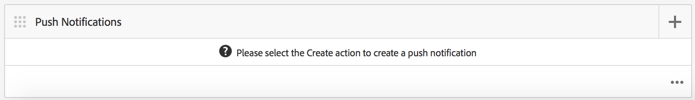

# Notificaciones push{#push-notifications}

{{ue-over-mobile}}

Poder alertar instantáneamente a los usuarios de aplicaciones móviles de Adobe Experience Manager AEM () con notificaciones importantes es crucial para el valor de una aplicación móvil y sus campañas de marketing. Aquí se describen los pasos que debe seguir para permitir que la aplicación reciba notificaciones push. También aprenderá a configurar y enviar mensajes push desde AEM Mobile a la aplicación instalada en el teléfono. Además, en esta sección se describe cómo configurar la función [vinculación profunda](#deeplinking) para las notificaciones push.

>[!NOTE]
>
>*Las notificaciones push no se garantizan con la entrega; se parecen más a los anuncios. Se hace el mejor esfuerzo para asegurarse de que todos los usuarios los reciban, pero no se trata de un mecanismo de envío garantizado. Además, el tiempo para entregar una notificación push puede variar desde menos de un segundo hasta media hora.*

AEM El uso de notificaciones push con requiere varias tecnologías diferentes. AEM En primer lugar, se debe utilizar un proveedor de servicios de notificaciones push para administrar notificaciones y dispositivos (aún no lo hace, por el momento). AEM Hay dos proveedores configurados de forma predeterminada con el servicio de notificaciones simples [Amazon](https://aws.amazon.com/sns/) (o SNS) y [Pushwoosh](https://www.pushwoosh.com/). En segundo lugar, la tecnología push para el sistema operativo móvil determinado debe pasar por el servicio adecuado: el servicio de notificaciones push de Apple (o APNS) para dispositivos iOS y la mensajería de Google Cloud (o GCM) para dispositivos Android™. AEM AEM Aunque no se comunica directamente con estos servicios específicos de la plataforma, el usuario debe proporcionar cierta información de configuración relacionada junto con las notificaciones para que estos servicios ejecuten la notificación push.

Una vez instalado y configurado (como se explica a continuación), funciona de esta manera:

1. AEM Se crea una notificación push en el y se envía al proveedor de servicios (Amazon SNS o Pushwoosh).
1. El proveedor de servicios lo recibe y lo envía al proveedor principal (APNS o GCM).
1. El proveedor principal inserta la notificación en todos los dispositivos registrados para esa notificación push. Para cada dispositivo, utiliza la red de datos móviles o WiFi, la que esté disponible en el dispositivo.
1. La notificación se muestra en el dispositivo si la aplicación para la que está registrada no se está ejecutando. Un usuario que pulsa la notificación inicia la aplicación y muestra la notificación dentro de la aplicación. En caso de que la aplicación ya se esté ejecutando, solo se mostrará la notificación dentro de la aplicación.

AEM Esta versión de es compatible con dispositivos móviles iOS y Android™.

## Información general y procedimiento {#overview-and-procedure}

Para utilizar notificaciones push en una aplicación de AEM Mobile, se deben realizar los siguientes pasos generales.

Normalmente, un desarrollador Experience Manager hace lo siguiente:

1. Regístrese en los servicios de mensajería de Apple y Google
1. Regístrese en un servicio de mensajería push y configúrelo
1. Añadir la compatibilidad push a la aplicación
1. Preparar un teléfono para probarlo

Mientras que un Experience Manager Administrator hace lo siguiente:

1. AEM Configuración de notificaciones push en aplicaciones de
1. Creación e implementación de la aplicación
1. Enviar una notificación push
1. Configurar vinculación profunda *(opcional)*

### Paso 1: Regístrese en los servicios de mensajería de Apple y Google {#step-register-with-apple-and-google-messaging-services}

#### Uso del servicio de notificaciones push de Apple (APNS) {#using-the-apple-push-notification-service-apns}

Vaya a la página de Apple [aquí](https://developer.apple.com/documentation/usernotifications#//apple_ref/doc/uid/TP40008194-CH8-SW1) para familiarizarse con el servicio de notificaciones push de Apple.

Para usar APNS, necesitas un archivo de **certificado** (un archivo .cer), una **clave privada** (un archivo .p12) y una **contraseña de clave privada** de Apple. Encontrará instrucciones sobre cómo hacerlo [aquí](https://developer.apple.com/library/archive/documentation/NetworkingInternet/Conceptual/RemoteNotificationsPG/).

#### Uso del servicio Google Cloud Messaging (GCM) {#using-the-google-cloud-messaging-gcm-service}

>[!NOTE]
>
>Google está reemplazando GCM con un servicio similar llamado Firebase Cloud Messaging (FCM). Para obtener más información sobre FCM, haga clic [aquí](https://firebase.google.com/docs/cloud-messaging/).

Vaya a la página de Google [aquí](https://developer.android.com/google/gcm/index.html) para familiarizarse con Google Cloud Messaging para Android™.

[Siga estos pasos](https://developer.android.com/google/gcm/gs.html) para **Crear un proyecto de API de Google**, **Habilitar el servicio GCM** y **Obtener una clave de API**. Necesita la **clave API** para enviar notificaciones push a dispositivos Android™. Además, registre su **número de proyecto**, también conocido como **Id. de remitente de GCM**.

Los siguientes pasos muestran un método diferente de crear claves de API GCM:

1. Inicie sesión en Google y vaya a la [página para desarrolladores de Google](https://developers.google.com/mobile/add?platform=android&amp;cntapi=gcm).
1. Elija su aplicación en la lista (o cree una).
1. En Nombre del paquete de Android™, escriba el identificador de la aplicación, es decir, `com.adobe.cq.mobile.weretail.outdoorsapp`. (Si esto no funciona, inténtelo de nuevo con &quot;test.test&quot;).
1. Haga clic en **Continuar para elegir y configurar los servicios**
1. Seleccione Mensajería en la nube y luego haga clic en **Habilitar mensajería en la nube de Google**.
1. A continuación, se mostrarán la nueva clave de API de servidor y el ID de remitente (nuevo o existente).

>[!NOTE]
>
>Registre la clave de API del servidor. Este valor se introduce en el sitio del proveedor push.

### Paso 2: Registro y configuración de un servicio de mensajería push {#step-register-and-configure-a-push-messaging-service}

AEM Se configura para que utilice uno de los tres servicios de notificaciones push:

* SNS de Amazon
* Pushwoosh
* Adobe Mobile Services

Las configuraciones de *Amazon AEM SNS* y *Pushwoosh* le permiten enviar mensajes insertados desde pantallas de la.

La configuración de *Adobe Mobile Services* le permite configurar y enviar notificaciones push desde Adobe Mobile Services con una cuenta de Adobe Analytics (pero la aplicación debe crearse con este conjunto de configuración para habilitar las notificaciones push de AMS).

#### Uso del servicio de mensajería SNS de Amazon {#using-the-amazon-sns-messaging-service}

>[!NOTE]
>
>*Encontrará información sobre SNS de Amazon y un vínculo para crear una cuenta de AWS [aquí](https://aws.amazon.com/sns/). Puedes obtener una cuenta gratuita por un año.*

Si no desea utilizar SNS de Amazon, puede omitir estos pasos.

Siga estos pasos para configurar Amazon SNS para notificaciones push:

1. **Registrarse con SNS de Amazon**

   1. Registre su ID de cuenta. El formato debe ser de 12 dígitos sin espacios ni guiones, es decir, &quot;123456789012&quot;.
   1. Asegúrese de que se encuentra en la región &quot;us-east&quot; o &quot;eu&quot;, ya que un paso posterior (Creación del grupo de identidad) requiere uno de ellos.
   1. Después de registrarse, inicie sesión en la consola de administración y seleccione [SNS](https://console.aws.amazon.com/sns/) (servicio de notificaciones push). Haga clic en &quot;Comenzar&quot; si aparece.

1. **Crear clave de acceso e ID**

   1. Haga clic en el nombre de inicio de sesión en la parte superior derecha de la pantalla y seleccione Credenciales de seguridad en el menú.
   1. Haga clic en Claves de acceso y, en el espacio siguiente, haga clic en **Crear nueva clave de acceso**.
   1. Haga clic en **Mostrar clave de acceso**, y copie y guarde el identificador de clave de acceso y la clave de acceso secreta que se muestran. Si elige la opción para descargar las claves, obtendrá un archivo CSV que contiene esos mismos valores.
   1. En esta página se pueden administrar otros certificados relacionados con la seguridad y otros.

   >[!NOTE]
   >
   >Se puede usar una clave de acceso para varias aplicaciones.

   Para las organizaciones que utilizan una cuenta de &quot;zona protegida de AWS&quot;, los pasos son similares y se describen a continuación:

   1. Haga clic en su nombre de inicio de sesión en la parte superior derecha de la pantalla y elija Mis credenciales de seguridad en el menú.
   1. Haga clic en Usuarios en la lista izquierda de acciones y elija su nombre de usuario.
   1. Haga clic en la ficha Credenciales de seguridad.
   1. Desde aquí, verá sus claves y creará nuevas claves. Guarde las claves para usarlas más adelante.

1. **Crear un tema**

   1. Haga clic en **Crear tema** y elija un nombre de tema. Registre todos los campos, como ARN del tema, Propietario del tema, Región y Nombre para mostrar.
   1. Haga clic en **Otras acciones de tema** > **Editar directiva de tema**. En **Permitir que estos usuarios se suscriban a este tema**, seleccione **Todos.**
   1. Haga clic en **Actualizar directiva**.

   >[!NOTE]
   >
   >Puede crear varios temas para diferentes escenarios, como desarrollo, prueba y demostración. El resto de la configuración de SNS puede seguir siendo la misma. Cree la aplicación con otro tema; las notificaciones push enviadas a ese tema solo las recibirá la aplicación creada con ese tema.

1. **Crear aplicaciones de plataforma**

   1. Haga clic en Aplicaciones y, a continuación, en Crear aplicación de plataforma. Elija un nombre y seleccione una plataforma (APNS para iOS, GCM para Android™). Según la plataforma. se deben rellenar otros campos:

      1. Para APNS, se debe introducir un archivo P12, una contraseña, un certificado y una clave privada. Se deberían haber obtenido en el paso *Uso del servicio de notificaciones push de Apple (APNS)* anterior.
      1. Para GCM, se debe introducir una clave de API. Esto debería haberse obtenido en el paso *Uso del servicio Google Cloud Messaging (GCM)* anterior.

   1. Repita el paso anterior una vez para cada plataforma compatible. Para poder insertar iOS y Android™, se deben crear dos aplicaciones de plataforma.

1. **Crear un grupo de identidad**

   1. Use [Cognito](https://console.aws.amazon.com/cognito) para crear un grupo de identidad, que almacenará datos básicos de usuarios no autenticados. Tenga en cuenta que actualmente solo las regiones &quot;us-east&quot; y &quot;eu&quot; son compatibles con Amazon Cognito.
   1. Asigne un nombre y marque la casilla de &quot;Habilitar el acceso a identidades no autenticadas&quot;.
   1. En la página siguiente (&quot;*Sus identidades de Cognito requieren acceso a sus recursos*&quot;), haga clic en Permitir.
   1. En la parte superior derecha de la página, haga clic en el vínculo &quot;*Editar grupo de identidad&quot;*. Se muestra el ID del grupo de identidad. Guarde este texto para más adelante.
   1. En la misma página, elija la lista desplegable junto a &quot;Función no autenticada&quot; y asegúrese de que tiene la función Cognito_&lt;nombre de grupo>UnauthRole seleccionada. Guarde los cambios.

1. **Configurar acceso**

   1. Inicie sesión en [Identity and Access Management](https://console.aws.amazon.com/iam/home) (IAM).
   1. Seleccione Roles.
   1. Haga clic en la función creada en el paso anterior, llamada Cognito_&lt;yourIdentityPoolName>Unauth_Role. Registre el &quot;ARN de la función&quot; mostrado.
   1. Abra &quot;Directivas en línea&quot; si aún no lo está. Debería ver una directiva con un nombre como oneClick_Cognito_&lt;yourIdentityPoolName>Unauth_Role_1234567890123.
   1. Haga clic en &quot;Editar política&quot;. Reemplace el contenido del documento de política por este fragmento de JSON:

   <table>
    <tbody>
     <tr>
     <td>
 
 
{
 
 "Versión": "17-10-2012",
 
 "Instrucción": [
 
 {
 
 "Acción": [
 
 "mobileanalytics:PutEvents",
 
 "cognito-sync:*",
 
 "SNS:CreatePlatformEndpoint",
 
 "SNS:Suscribirse"
 
 ],
 
 "Efecto": "Permitir",
 
 "Recurso": [
 
 "*"
 
 ]
 
 }
 
 ]
 
}
 
 
 </td>
     </tr>
    </tbody>
    </table>

   1. Haga clic en **Aplicar directiva**.

#### Uso del servicio de mensajería de Pushwoosh {#using-the-pushwoosh-messaging-service}

Si no desea utilizar Pushwoosh, puede omitir este paso.

Para usar Pushwoosh:

1. **Registrarse en Pushwoosh**

   1. Vaya a pushwoosh.com y cree una cuenta.

1. **Crear un token de acceso de API**

   1. En el sitio de Pushwoosh, vaya al elemento de menú Acceso a API para generar un token de acceso a API. Registre este token de forma segura.

1. **Crear una aplicación**

   1. Para que Android™ sea compatible, debe proporcionar la clave de API GCM.
   1. Al configurar la aplicación, elija Cordova como marco de trabajo.
   1. Para que sea compatible con iOS, debe proporcionar el archivo de certificado (.cer), el certificado push (.p12) y la contraseña de clave privada; estos deben haberse obtenido del sitio APNS de Apple. Para Framework, elija Cordova.
   1. Pushwoosh generará un ID de aplicación para esa aplicación, con el formato &quot;XXXXX-XXXXX&quot;, donde cada X es un valor hexadecimal (0 a F).

>[!NOTE]
>
>AEM AEM *Si se configura una segunda aplicación en la aplicación con el mismo ID de aplicación (y otros valores relacionados: Token de acceso de API e Id de GCM), cualquier notificación push enviada a través de la segunda aplicación en la que se configure el ID de aplicación se enviará a cualquier otra aplicación con ese ID de aplicación.*

### Paso 3: Agregar compatibilidad push a la aplicación {#step-add-push-support-to-the-app}

#### Añadir configuración de ContentSync {#add-contentsync-configuration}

Cree dos nodos de contenido (uno en app-config y otro en app-config-dev) llamados notificationsConfig:

* /content/`<your app>`/shell/jcr:content/page-app/app-config-dev/notificationsConfig
* /content/`<your app>`/shell/jcr:content/page-app/app-config/notificationsConfig

Con estas propiedades (archivos .content.xml):
&lt;jcr:root xmlns:jcr=&quot; [https://developer.adobe.com/experience-manager/reference-materials/spec/jcr/1.0/index.html](https://developer.adobe.com/experience-manager/reference-materials/spec/jcr/1.0/index.html)&quot; xmlns:nt=&quot; [https://developer.adobe.com/experience-manager/reference-materials/spec/jcr/1.0/index.html](https://developer.adobe.com/experience-manager/reference-materials/spec/jcr/1.0/index.html)&quot;
jcr:primaryType=&quot;nt:unstructured&quot;
excludeProperties=&quot;[appAPIAccessToken]&quot;
path=&quot;../../../...&quot;
targetRootDirectory=&quot;www&quot;
type=&quot;notificationsconfig&quot;/>

>[!NOTE]
>
>El controlador de sincronización de contenido busca esos nodos y, si no están allí, no escribe el archivo page-notifications-config.json.

#### Añadir bibliotecas de cliente {#add-client-libraries}

Las bibliotecas de cliente de notificaciones push deben agregarse a la aplicación siguiendo estos pasos:

En el CRXDE Lite:

1. Vaya a */etc/designs/phonegap/&lt;app name>/clientlibsall.*
1. Haga doble clic en la sección incrustar del panel de propiedades.
1. En el cuadro de diálogo que aparece, agregue una biblioteca de cliente haciendo clic en el botón +.
1. En el nuevo campo de texto, añada &quot;cq.mobile.push&quot; y haga clic en Aceptar.
1. Agregue uno más llamado cq.mobile.push.amazon y haga clic en Aceptar.
1. Guarde los cambios.

>[!NOTE]
>
>Si las notificaciones push se eliminan o no se utilizan, por cuestiones de espacio en la aplicación y para evitar mensajes de error de la consola, elimine estos clientlibs de la aplicación.

### Paso 4: Preparar un teléfono para pruebas {#step-prepare-a-phone-for-testing}

>[!NOTE]
>
>*Para las notificaciones push, debe realizar la prueba en un dispositivo real, ya que los emuladores no pueden recibir notificaciones push.*

#### IOS {#ios}

Para iOS, usa un equipo macOS y únete al [Programa para desarrolladores de iOS](https://developer.apple.com/programs/ios/). Algunas corporaciones tienen licencias corporativas que pueden estar disponibles para todos los desarrolladores.

Con XCode 8.1, antes de utilizar las notificaciones push debe ir a la pestaña Funcionalidades del proyecto y activar la opción Notificaciones push.

#### Android™ {#android}

Para instalar la aplicación en un teléfono Android™ mediante CLI (consulte lo siguiente: **Paso 6 - Creación e implementación de la aplicación**), primero debe poner el teléfono en &quot;modo de desarrollador&quot;. Consulte [Activación de las opciones para desarrolladores en el dispositivo](https://developer.android.com/tools/device.html#developer-device-options) para obtener más información al respecto.

### AEM Paso 5: Configuración de push en aplicaciones de {#step-configure-push-on-aem-apps}

Antes de crear e implementar en el dispositivo móvil configurado, debe configurar los ajustes de notificación del servicio de mensajería que decidió utilizar.

1. Cree los grupos de autorización adecuados para las notificaciones push.
1. AEM Inicie sesión en la pestaña Aplicaciones, haga clic en la pestaña Aplicaciones, que es el usuario adecuado.
1. Haga clic en la aplicación.
1. Busque el mosaico Administrar Cloud Service y haga clic en el lápiz para modificar las configuraciones de la nube.
1. Seleccione Conexión de Amazon SNS, Conexión Pushwoosh o Adobe Mobile Services como la configuración de notificación.
1. Introduzca las propiedades del proveedor y haga clic en Enviar para guardarlas y en Listo. No se verifican a distancia en esta fase, excepto si hay AMS.
1. Ahora debería ver la configuración que acaba de introducir en el mosaico Administrar Cloud Service.

### Paso 6: Creación e implementación de la aplicación {#step-build-and-deploy-the-app}

**Nota:** Consulte las instrucciones [aquí](/help/mobile/building-app-mobile-phonegap.md) sobre cómo generar aplicaciones de PhoneGap.

Existen dos maneras de crear e implementar la aplicación mediante PhoneGap.

**Nota:** Para las pruebas de notificaciones push, los emuladores no serán suficientes porque las notificaciones push utilizan un protocolo distinto entre el proveedor push (Apple o Google) y el dispositivo. El hardware y los emuladores actuales de Mac/PC no son compatibles con esto.

1. *PhoneGap Build* es un servicio ofrecido por PhoneGap que compilará tu aplicación en sus servidores y te permitirá descargarla directamente en tu dispositivo. Consulte la documentación del PhoneGap Build en `https://build.phonegap.com/` para obtener información sobre cómo configurar y utilizar el PhoneGap Build.

1. *Interfaz de línea de comandos de PhoneGap* (CLI) le permite utilizar un completo conjunto de comandos de PhoneGap en su línea de comandos para generar, depurar e implementar su aplicación. Consulte la documentación para desarrolladores de PhoneGap (`https://docs.phonegap.com/en/edge/guide_cli_index.md.html#The%20Command-Line%20Interface`) para obtener información sobre cómo configurar y utilizar la CLI de PhoneGap.

### Paso 7: Envío de una notificación push {#step-send-a-push-notification}

Para crear y enviar una notificación, siga estos pasos.

1. Creación de una notificación

   * En el tablero de su aplicación de AEM Mobile, busque el mosaico Notificaciones push.
   * En el menú de la esquina superior derecha, seleccione &quot;Crear&quot;. Este botón no está disponible hasta que se establece por primera vez la configuración de la nube.
   * En el Asistente para crear notificaciones, introduzca un título y un mensaje y, a continuación, haga clic en el botón &quot;Crear&quot;. La notificación ya está lista para enviarse inmediatamente o más tarde. Se puede editar, y el mensaje o el título se pueden cambiar y guardar.

1. Envío de la notificación

   * En el panel Aplicaciones, busque el mosaico Notificaciones push.
   * Seleccione la notificación o haga clic en el botón de detalles en la parte inferior derecha (. ). .), para mostrar la lista de notificaciones. Esta lista también indica si una notificación está lista para enviarse, si ya se ha enviado o si se ha producido un error durante la entrega.
   * Seleccione la casilla de verificación de una notificación (solo) y haga clic en el botón &quot;Enviar notificación&quot; situado encima de la lista. Tiene la oportunidad de &quot;Cancelar&quot; o &quot;Enviar&quot; la notificación en el cuadro de diálogo que aparece.

1. Tratamiento de los resultados

   * Si el servicio de notificaciones push (Amazon SNS o Pushwoosh) recibe la solicitud de envío, la confirma como válida y la envía a los proveedores nativos (APNS y GCM) correctamente, el cuadro de diálogo Enviar se cierra sin ningún mensaje. En la lista de notificaciones, el estado de esa notificación se muestra como Enviado.
   * Si el envío push falla, el cuadro de diálogo muestra un mensaje que indica el problema. En la lista de notificaciones, el estado de esa notificación se muestra como Error, pero si se corrige el problema, se puede volver a enviar la notificación. Si se produce un error, debería aparecer información adicional sobre el error en el registro de errores del servidor.
   * Tenga en cuenta que existen algunas diferencias de plataforma entre las notificaciones push de iOS y Android™. Entre ellos:

      * La generación con CLI inicia la aplicación después de implementarla en Android™. En iOS, debe iniciarlo manualmente. Dado que el paso de registro push se produce al inicio, las aplicaciones de Android™ pueden recibir notificaciones push inmediatamente (porque ya se ha iniciado y registrado), mientras que las aplicaciones de iOS no pueden.
      * En Android™, el texto del botón Aceptar aparece en mayúsculas (y en cualquier otro botón añadido en la notificación en la aplicación), mientras que en iOS no lo está.

Para las notificaciones push de AMS, las notificaciones deben redactarse y enviarse desde el servidor de AMS. AEM AMS proporciona funciones de notificación push adicionales, además de las proporcionadas por las notificaciones de con AWS y Pushwoosh.

>[!NOTE]
>
>*Las notificaciones push no se garantizan con la entrega; se parecen más a los anuncios. Se hace el mejor esfuerzo para asegurarse de que todo el mundo lo escuche, pero no son un mecanismo de envío garantizado. Además, el tiempo para entregar una notificación push puede variar desde menos de un segundo hasta media hora.*

### Configuración de la vinculación profunda con notificaciones push {#configuring-deep-linking-with-push-notifications}

¿Qué es la vinculación profunda? En el contexto de una notificación push, permite abrir o dirigir una aplicación (si está abierta) a una ubicación especificada dentro de la aplicación.

¿Cómo funciona? El autor de una notificación push agrega opcionalmente una etiqueta de botón (es decir, &quot;¡Mostrarme!&quot;) a la notificación y elige la página que desean vincular en la notificación, a través de un explorador de rutas visual. Cuando se envía, la notificación push se produce normalmente, excepto en el mensaje en la aplicación, en el que el botón Aceptar se sustituye por el botón &quot;Descartar&quot; y se especifica el nuevo botón (&quot;Mostrar&quot;) también aparece. Al hacer clic en el botón nuevo, la aplicación se dirige a la página especificada de la aplicación. Al hacer clic en Descartar, se expulsa el mensaje.

Si la aplicación no está abierta, la sombra aparece con normalidad. Al realizar una acción en la notificación en la sombra, se abre la aplicación y, a continuación, se presentan al usuario los botones de vínculo profundo según lo configurado en la notificación push.

Cree la notificación, añada un texto de botón y una ruta de vínculo para el vínculo profundo opcional:

>[!CAUTION]
>
>Para acceder al mosaico Notificación push en el panel, siga los pasos a continuación.

1. Haga clic en Editar en la esquina superior derecha del mosaico **Administrar Cloud Service**.

   

1. Seleccione la **conexión de Pushwoosh**. Haga clic en **Siguiente**.

   

1. Escriba los detalles de las propiedades y haga clic en **Enviar**.

   

   Una vez que envíe la configuración, el mosaico **Notificaciones push** se mostrará en el panel.

   

### Crear asistente de notificación {#create-notification-wizard}

Una vez que el mosaico **Notificaciones push** se muestre en el panel, use el asistente para crear notificaciones para agregar el contenido:

1. Haga clic en el símbolo Add en la esquina superior derecha del mosaico **Notificaciones push** para abrir el **Asistente para crear notificaciones**.

   

1. Al hacer clic en el icono de examinar en la ruta de vínculo, se presenta al usuario la estructura de contenido de la aplicación.

   Una vez seleccionada la ruta, haga clic en el icono de verificación.

   

   >[!NOTE]
   >
   >El texto del botón de vínculo está limitado a 20 caracteres.
   >
   >Si el usuario final no tiene la última versión de la aplicación y la ruta vinculada no está disponible, la confirmación de la acción del vínculo profundo lleva al usuario a la página principal de la aplicación.

1. Escriba **Detalles de texto** en el **Asistente para crear notificaciones** y haga clic en **Crear**.

   

   Abra los detalles haciendo clic en la notificación push que creó desde el mosaico **Notificaciones push**.

   Puede editar propiedades, enviar notificaciones o eliminar la notificación.

   

>[!NOTE]
>
>**Información adicional**:
>
>Pushwoosh y Amazon SNS no serán compatibles después de la versión 6.4 y estarán disponibles como complemento en Uso compartido de paquetes.

### Pasos siguientes {#the-next-steps}

Una vez que sepa los detalles de las notificaciones push para su aplicación, consulte [Personalization de contenido de AEM Mobile](/help/mobile/phonegap-aem-mobile-content-personalization.md).
