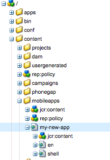

# Estructurar una aplicación{#structure-an-app}

>[!NOTE]
>
>Adobe recomienda el uso del Editor de SPA para proyectos que requieren una representación de cliente basada en el marco de aplicaciones de una sola página (por ejemplo, React). [Más información](/help/sites-developing/spa-overview.md).

Un proyecto de AEM Mobile incluye un conjunto diverso de tipos de contenido, como páginas, bibliotecas de clientes JavaScript y CSS, componentes de AEM reutilizables, configuraciones de Content Sync y contenido del shell de la aplicación PhoneGap. Basar su nueva aplicación de AEM Mobile en el [Starter Kit](https://github.com/Adobe-Marketing-Cloud-Apps/aem-phonegap-starter-kit) es una buena forma de incorporar todos los tipos de contenido a nuestra estructura recomendada para facilitar la portabilidad y el mantenimiento a largo plazo.

## Contenido de la página {#page-content}

Las páginas de la aplicación deben estar situadas debajo de /content/mobileapps para que la consola de AEM Mobile las reconozca.

Según la convención de AEM, la primera página de la aplicación debe ser una redirección a uno de sus elementos secundarios, que sirve como idioma predeterminado de la aplicación (en tanto en los casos de Geometrixx como de Starter Kit). La página de configuración regional de nivel superior suele heredar del componente básico &#39;splash-page&#39; (/libs/mobileapps/components/splash-page) que se encarga de la inicialización necesaria para admitir la instalación de actualizaciones de sincronización de contenido sobre el contenido (el código contentInit se encuentra en /etc/clientlibs/mobile/content-sync/js/contentInit.js).

## Plantillas y componentes {#templates-and-components}

La plantilla y el código de componente de la aplicación deben encontrarse en /apps/&lt;nombre de marca>/&lt;nombre de la aplicación>. De conformidad con la convención, debe colocar la plantilla y el código de componente en /apps/&lt;nombre de marca>/&lt;nombre de la aplicación>. Este patrón debe ser conocido por los desarrolladores que ya han trabajado con el sitio en AEM. Generalmente se sigue porque /apps/ está bloqueado de forma predeterminada en el acceso anónimo en las instancias de publicación. En consecuencia, el código JSP sin procesar está oculto para los posibles atacantes.

Las plantillas específicas de la aplicación se pueden configurar para que solo se presenten mediante el nodo de propiedades de la propia plantilla y estableciendo su valor en &#39;/content/mobileapps(/). `allowedPaths`&amp;ast;)?&#39; - o incluso algo más específico si la plantilla solo debería utilizarse para una sola aplicación. Las propiedades `allowedParents` y `allowedChildren` también se pueden aprovechar para obtener un control detallado de qué plantillas estarán disponibles para un autor en función del lugar en el que se esté creando la nueva página.

Al crear un nuevo componente de página de aplicación desde cero, se recomienda establecer su propiedad en &#39;mobileapps/components/angular/ng-page&#39; `sling:resourceSuperType` . Esto configurará la página para la creación y el procesamiento como una aplicación de una sola página y le permitirá superponer cualquier archivo .jsp que su componente deba cambiar. Dado que ng-page no incluye ningún marco de interfaz de usuario, un desarrollador normalmente terminará superponiendo (al menos) &#39;template.jsp&#39; (superpuesto desde /libs/mobileapps/components/angular/ng-page/template.jsp).

Los componentes de página autorizados, que desean aprovechar AngularJS, tienen un `sling:resourceSuperType` componente equivalente ubicado en /libs/mobileapps/components/angular/ng-component que se puede superponer y personalizar del mismo modo.

## JavaScript y CSS Clientlibs {#javascript-and-css-clientlibs}

Cuando se trata de bibliotecas de cliente, hay algunas opciones disponibles para el desarrollador de dónde colocarlas en el repositorio. Se ofrece la siguiente pauta de orientación, pero no es un requisito difícil.

Si el código de cliente puede mantenerse por su cuenta y no se relaciona con un componente específico de la aplicación, lo que significa que puede reutilizarse en otras aplicaciones, se recomienda almacenarlo en /etc/clientlibs/&lt;nombre de marca>/&lt;nombre de biblioteca>. Por otro lado, si la clientlib es específica de una sola aplicación, puede anidarla como un elemento secundario del nodo de diseño de la aplicación; /etc/designs/phonegap/&lt;nombre de marca>/&lt;nombre de aplicación>/clientlibs. La categoría de clientlib no debe ser utilizada por otras bibliotecas y debe utilizarse para incrustar otras bibliotecas según sea necesario. Si sigue estos patrones, el desarrollador no tendrá que agregar nuevas configuraciones de sincronización de contenido cada vez que se agregue una biblioteca de cliente a la aplicación, sino que simplemente actualizará la propiedad &#39;embeds&#39; de la clientlib de diseño de la aplicación. Por ejemplo, observe el nodo de configuración Geometrixx clientlibs-all Content Sync en /content/phonegap/geometrixx-outdoors/en/jcr:content/pge-app/app-config/clientlibs-all.

Si el código de cliente está estrechamente vinculado a un componente específico, colóquelo en una biblioteca de cliente anidada debajo de la ubicación del componente en /apps/ e incruste su categoría en la clientlib &#39;design&#39; de la aplicación.

## PhoneGap Configuration {#phonegap-configuration}

Cada aplicación de AEM Mobile contiene un directorio que aloja los archivos de configuración utilizados por la interfaz [de línea de](https://github.com/phonegap/phonegap-cli) comandos de PhoneGap y la compilación [de](https://build.phonegap.com/) PhoneGap para convertir el contenido web en una aplicación ejecutable. En el ejemplo de Geometrixx, por ejemplo, este directorio (/content/phonegap/geometrixx-outdoors/shell/jcr:content/page-app/app-content) se encuentra como parte del shell; una decisión de diseño tomada por el hecho de que solo contiene contenido que no se puede actualizar de forma instantánea, como complementos que se ocupan de las API de dispositivo y la configuración de la propia aplicación.

En este directorio también encontrará varios enlaces [de](https://cordova.apache.org/docs/en/edge/guide_appdev_hooks_index.md.html#Hooks%20Guide) Cordova que pueden utilizarse para instalar complementos, colocar archivos de recursos en sus ubicaciones específicas de la plataforma y otras acciones que deben ejecutarse como parte de la compilación. Nota: como alternativa a descargar cada complemento como parte de la compilación, puede seguir el patrón de la aplicación Kitchen Sink e [incluir código](https://github.com/blefebvre/aem-phonegap-kitchen-sink/tree/master/content/src/main/content/jcr_root/content/phonegap/kitchen-sink/shell/_jcr_content/pge-app/app-content/phonegap/plugins) fuente del complemento con el resto del proyecto de la aplicación.

## Pasos siguientes {#the-next-steps}

Una vez que conozca la Estructura de la aplicación, consulte [Creación y edición de aplicaciones mediante la consola](/help/mobile/phonegap-apps-console.md)de la aplicación.
