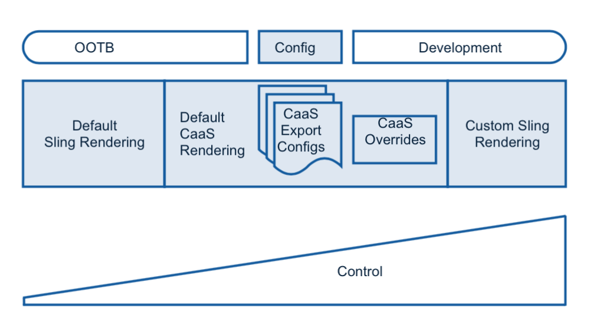

# Renderización y entrega{#rendering-and-delivery}

>[!NOTE]
>
>Adobe recomienda utilizar el Editor de SPA para proyectos que requieren una representación del lado del cliente basada en el marco de aplicaciones de una sola página (por ejemplo, React). [Más información](/help/sites-developing/spa-overview.md).

AEM contenido se puede procesar fácilmente mediante [Sling Default Servlets](https://sling.apache.org/documentation/bundles/rendering-content-default-get-servlets.html) para procesar [JSON](https://sling.apache.org/documentation/bundles/rendering-content-default-get-servlets.html#default-json-rendering) y otros formatos.

Estos procesadores listos para usar normalmente recorren el repositorio y devuelven contenido tal cual.

AEM, a través de Sling, también admite el desarrollo e implementación de procesadores de Sling personalizados para tomar el control total del esquema y el contenido procesados.

Los procesadores predeterminados de servicios de contenido llenan la brecha entre los valores predeterminados de Sling predeterminados y el desarrollo personalizado, lo que permite la personalización y el control de muchos aspectos del contenido representado sin desarrollo.

En el diagrama siguiente se muestra la renderización de los servicios de contenido.

## Solicitud de JSON {#requesting-json}

Utilice **&lt;RESOURCE.caas[.&lt;export-config>.][&lt;export-config>.** jsonto para solicitar JSON.]

<table>
 <tbody>
  <tr>
   <td>RECURSO</td>
   <td>un recurso de entidad en /content/entities  o   un recurso de contenido en /content</td>
  </tr>
  <tr>
   <td>EXPORT-CONFIG</td>
   <td>
<strong>OPCIONAL</strong>  
 
una configuración de exportación que se encuentra en /apps/mobileapps/caas/exportConfigs/EXPORT-CONFIG    Si se omite, se aplicará la configuración de exportación predeterminada 
 </td>
  </tr>
  <tr>
   <td>DEPTH-INT</td>
   <td><strong></strong>    Recursión OPTIONALdepth para la renderización de elementos secundarios como se utiliza en la renderización de Sling</td>
  </tr>
 </tbody>
</table>

## Creación de configuraciones de exportación {#creating-export-configs}

Se pueden crear configuraciones de exportación para personalizar la renderización JSON.

Puede crear un nodo de configuración en */apps/mobileapps/caas/exportConfigs.*

| Nombre de nodo | Nombre de la configuración (para el selector de renderización) |
|---|---|
| jcr:primaryType | nt:unstructured |

La tabla siguiente muestra las propiedades de Exportar configuraciones:

<table>
 <tbody>
  <tr>
   <td><strong>Nombre</strong></td>
   <td><strong>Tipo</strong></td>
   <td><strong>Predeterminado (si, no establecido)</strong></td>
   <td><strong>Value</strong></td>
   <td><strong>Descripción</strong></td>
  </tr>
  <tr>
   <td>includeComponents</td>
   <td>Cadena[]</td>
   <td>incluir todo</td>
   <td>sling:resourceType</td>
   <td>excluir detalles de nodos con sling:resourceType especificado de la exportación JSON</td>
  </tr>
  <tr>
   <td>excludeComponents</td>
   <td>Cadena[]</td>
   <td>excluir nada</td>
   <td>sling:resourceType</td>
   <td>incluir detalles solo para nodos con sling:resourceType especificado de la exportación JSON</td>
  </tr>
  <tr>
   <td>excludePropertyPrefixes</td>
   <td>Cadena[]</td>
   <td>excluir nada</td>
   <td>Prefijos de propiedad</td>
   <td>excluir propiedades que comiencen con prefijos especificados de la exportación JSON</td>
  </tr>
  <tr>
   <td>excludeProperties</td>
   <td>Cadena[]</td>
   <td>excluir nada</td>
   <td>Nombres de propiedades</td>
   <td>excluir propiedades especificadas de la exportación JSON</td>
  </tr>
  <tr>
   <td>includeProperties</td>
   <td>Cadena[]</td>
   <td>incluir todo</td>
   <td>Nombres de propiedades</td>
   <td>
si excludePropertyPrefixes set  esto incluye propiedades especificadas a pesar de que coinciden con el prefijo que se excluye,
 
else (excluir propiedades ignoradas) solo incluye estas propiedades
 </td>
  </tr>
  <tr>
   <td>includeChildren</td>
   <td>Cadena[]</td>
   <td>incluir todo</td>
   <td>nombres secundarios</td>
   <td>excluir elementos secundarios especificados de la exportación JSON</td>
  </tr>
  <tr>
   <td>excludeChildren</td>
   <td>Cadena[]    </td>
   <td>excluir nada</td>
   <td>nombres secundarios</td>
   <td>incluir solo elementos secundarios especificados de la exportación de JSON, excluir otros</td>
  </tr>
  <tr>
   <td>changeProperties</td>
   <td>Cadena[]    </td>
   <td>cambiar el nombre de nada</td>
   <td>&lt;actual_property_name&gt;,&lt;replacement_property_name&gt;</td>
   <td>cambiar el nombre de las propiedades mediante reemplazos</td>
  </tr>
 </tbody>
</table>

### Anulaciones de exportación de tipo de recurso {#resource-type-export-overrides}

Cree un nodo de configuración en */apps/mobileapps/caas/exportConfigs.*

| name | resourceTypeOverrides |
|---|---|
| jcr:primaryType | nt:unstructured |

La tabla siguiente muestra las propiedades:

<table>
 <tbody>
  <tr>
   <td><strong>Nombre</strong></td>
   <td><strong>Tipo</strong></td>
   <td><strong>Predeterminado (si, no establecido)</strong></td>
   <td><strong>Valor</strong></td>
   <td><strong>Descripción</strong></td>
  </tr>
  <tr>
   <td>&lt;selector_to_inc&gt;</td>
   <td>Cadena[] </td>
   <td>-</td>
   <td>sling:resourceType</td>
   <td>Para los siguientes tipos de recursos de Sling, no devuelva la exportación predeterminada de JavaScript de CaaS.  Devolver una exportación json del cliente representando el recurso como;   &lt;resource&gt;.&lt;selector_to_inc&gt;.json </td>
  </tr>
 </tbody>
</table>

### Configuraciones de exportación de servicios de contenido existentes {#existing-content-services-export-configs}

Los servicios de contenido incluyen dos configuraciones de exportación:

* predeterminado (no se ha especificado ninguna configuración)
* página (para procesar páginas del sitio)

#### Configuración de exportación predeterminada {#default-export-configuration}

La configuración de exportación predeterminada de los servicios de contenido se aplicará si se especifica una configuración en el URI solicitado.

&lt;resource>.caas[.&lt;depth-int>].json

<table>
 <tbody>
  <tr>
   <td><strong>Nombre</strong></td>
   <td><strong>Valor</strong></td>
  </tr>
  <tr>
   <td>excludeProperties</td>
   <td> </td>
  </tr>
  <tr>
   <td>excludePropertyPrefixes</td>
   <td>jcr:,sling:,cq:,oak:,pge-</td>
  </tr>
  <tr>
   <td>includeProperties</td>
   <td>jcr:text,text  jcr:title,title  jcr:description,description  jcr:lastModified,lastModified  cq:tags,tags  cq:lastModified,lastModified</td>
  </tr>
  <tr>
   <td>includeComponents</td>
   <td> </td>
  </tr>
  <tr>
   <td>excludeComponents</td>
   <td> </td>
  </tr>
  <tr>
   <td>includeChildren</td>
   <td> </td>
  </tr>
  <tr>
   <td>excludeChildren</td>
   <td> </td>
  </tr>
  <tr>
   <td>Anulaciones de JSON de Sling</td>
   <td>foundation/components/image  wcm/foundation/components/image  mobileapps/caas/components/data/contentReference  mobileapps/caas/components/data/assetlist</td>
  </tr>
 </tbody>
</table>

#### Configuración de exportación de página {#page-export-configuration}

Esta configuración amplía el valor predeterminado para incluir la agrupación de elementos secundarios en un nodo secundario.

&lt;site_page>.caas.page[.&lt;depth-int>].json

### Recursos adicionales {#additional-resources}

Consulte los siguientes recursos para obtener más información sobre temas adicionales en Servicios de contenido:

* [Desarrollo de modelos](/help/mobile/administer-mobile-apps.md)
* [Creación de servicios de contenido](/help/mobile/develop-content-as-a-service.md)
* [Administración de servicios de contenido](/help/mobile/developing-content-services.md)

