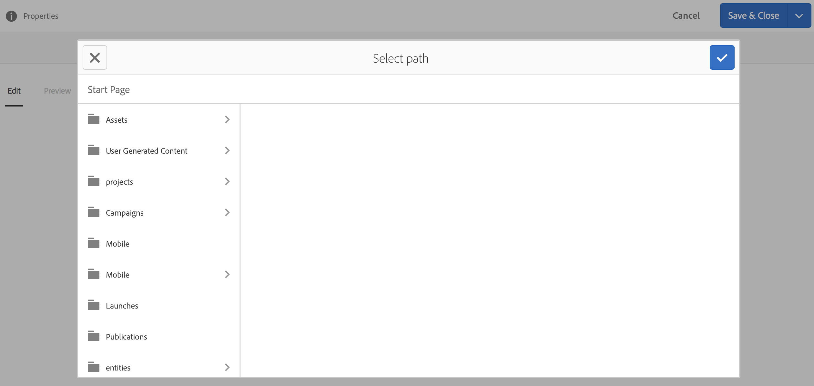

# Espacios y entidades{#spaces-and-entities}

>[!NOTE]
>
>Adobe recomienda utilizar el Editor de SPA para proyectos que requieren una representación del lado del cliente basada en el marco de aplicaciones de una sola página (por ejemplo, React). [Más información](/help/sites-developing/spa-overview.md).

Un espacio es una ubicación conveniente para almacenar entidades que se exponen a través de la API de REST de Content Services. Esto resulta especialmente útil porque una aplicación (o cualquier canal) se puede asociar a muchas entidades. Forzar a las entidades a que estén dentro de un espacio fuerza la mejor práctica de agrupar los requisitos de una aplicación. De forma opcional, puede asociar una aplicación en AEM con un pequeño número de espacios.

>[!NOTE]
>
>Para que algo esté disponible para cualquier canal de Content Services, debe estar dentro de un espacio.

## Creación de un espacio {#creating-a-space}

Si el usuario desea exponer un conjunto de contenido y recursos a una aplicación móvil, crea el espacio mediante el panel de AEM Mobile.

Por primera vez, el usuario que no ha configurado los servicios de contenido para trabajar con espacios, el panel de AEM Mobile muestra solo Aplicaciones después de seleccionar **Servicios de contenido**.

>[!CAUTION]
>
>**Requisitos previos para añadir un espacio**
>
>Marque la **Habilitar AEM servicios de contenido** para trabajar con Spaces y habilitarlo en el panel de aplicaciones de AEM Mobile.
>
>Consulte [Administración de servicios de contenido](/help/mobile/developing-content-services.md) para obtener más información.

Una vez configurados Espacios en el tablero, siga estos pasos para crear Espacios:

1. Choose **Espacios** de Content Services.

   

1. Choose **Crear** para crear un espacio. Entrar **Título**, **Nombre** y **Descripción** para el espacio.

   Haga clic en **Crear**.

   

## Administración de un espacio {#managing-a-space}

Una vez creado un espacio, haga clic en a la izquierda para administrar el espacio en la lista.

Puede ver las propiedades del espacio, eliminar el espacio o publicar el espacio y su contenido en una instancia de publicación AEM.

**Visualización y edición de propiedades de un espacio**

1. Seleccione el espacio de la lista
1. Choose **Propiedades** desde la barra de herramientas
1. Haga clic en **Cerrar** when done

**Publicación de un espacio** Cuando se publica un espacio, también se publican todas las carpetas y entidades de ese espacio.

1. Seleccione el espacio haciendo clic en su icono de la lista Consola de espacio
1. Choose **Árbol de publicación**

>[!NOTE]
>
>Puede **Cancelar la publicación** un Espacio, que elimina el espacio de la instancia de publicación.
>
>La siguiente imagen ilustra las acciones que se pueden realizar después de publicar el espacio.

## Uso de carpetas en un espacio {#working-with-folders-in-a-space}

Los espacios pueden incluir carpetas para ayudar a organizar mejor el contenido y los recursos del espacio. Los usuarios pueden crear su propia jerarquía en un espacio.

### Creación de una carpeta {#creating-a-folder}

1. Haga clic en el espacio de la lista en la consola de espacio y haga clic en **Crear carpeta**

   

1. Introduzca la variable **Título**, **Nombre,** y **Descripción** para la carpeta

   

1. Haga clic en **Crear** para crear la carpeta en un espacio

## Copiar idioma {#language-copy}

>[!CAUTION]
>
>La copia de idioma no es completamente funcional para esta versión. Solo configura la estructura.

La variable **Copia de idioma** permite a los autores copiar su copia maestra de idioma y, a continuación, crear un proyecto y un flujo de trabajo para traducir automáticamente el contenido. Copia de idioma crea la estructura correcta. Una vez que añada una carpeta en un espacio, puede añadir la copia de idioma al espacio.

>[!NOTE]
>
>Se recomienda que cualquier contenido que se pueda traducir se coloque en el nodo Copia de idioma.

### Adición de una copia de idioma {#adding-language-copy}

1. Una vez que haya creado espacio, haga clic en ese espacio para crear una copia de idioma.

   Haga clic en **Crear** y elija **Copia de idioma**.

   

   >[!NOTE]
   >
   >Los nodos de copia de idioma solo pueden existir como secundarios directos del espacio.

1. Choose **Idioma del paquete de contenido&amp;ast;** e introduzca la variable **Título&amp;ast;** en **Crear copia de idioma** diálogo.

   Haga clic en **Crear**.

   

1. Una vez creada una copia de idioma, esta aparece en el espacio de **Maestros de idiomas**.

   

   >[!NOTE]
   >
   >Select **Maestros de idiomas** para ver las carpetas de copia de idioma.

### Eliminación de una carpeta del espacio {#removing-a-folder-from-the-space}

1. Seleccione la carpeta de la lista de contenido del espacio
1. Haga clic en **Eliminar** desde la barra de herramientas

   >[!NOTE]
   >
   >Para desplazarse a una carpeta y ver su contenido o añadir una subcarpeta o entidad, haga clic en el título de la carpeta en la lista de contenido del espacio.

## Uso de entidades en un espacio {#working-with-entities-in-a-space}

Las entidades representan el contenido que se expone a través del extremo del servicio web. Las entidades se almacenan en espacios para que se puedan encontrar fácilmente y se mantengan independientes de la estructura del repositorio de AEM que alberga su contenido relacionado.

Puede que desee agrupar entidades en una recopilación lógica. Para ello, puede crear cualquier número de carpetas.

Si los elementos secundarios de entidad, que son otras entidades, se recopilan para el modelado de datos, el usuario desarrollador puede crear &quot;modelos de grupo&quot; específicos a partir del tipo de modelo &quot;grupo de entidades&quot;, que se proporciona de forma predeterminada.

>[!NOTE]
>
>Las entidades siempre están asociadas a un espacio, por lo que se accede a la mayoría de la interfaz de usuario de la entidad a través de la consola de espacio.

### Creación de una entidad {#creating-an-entity}

1. Abra la consola Espacio y haga clic en el título del espacio.

   De forma opcional, puede desplazarse a la carpeta haciendo clic en el título de la carpeta de la lista.

   

1. Elija el modelo para la entidad. Este es el tipo de entidad que desea crear. Haga clic en Siguiente.

   

   >[!NOTE]
   >
   >Tiene la opción de elegir el **Modelo de recursos**, **Modelo de páginas** o un modelo de tipo de entidad creado anteriormente.
   >
   >Consulte [Creación de un modelo](/help/mobile/administer-mobile-apps.md), para crear su entidad personalizada.

1. Escriba un **Título**, **Nombre**, **Descripción** y **Etiquetas** para la entidad. Haga clic en **Crear**.

   

   Una vez finalizado, la entidad aparece en los descendientes de su espacio.

### Edición de una entidad {#editing-an-entity}

1. Una vez creada una entidad, vaya a la carpeta o el espacio y elija la entidad en la consola Espacio para editarla.

   

1. Seleccione una entidad para editarla y haga clic en **Editar**.

   

   >[!CAUTION]
   >
   >Según la plantilla que elija para crear la entidad, la interfaz de usuario será diferente para ambas, para editar y ver las propiedades de la entidad. Consulte los pasos a continuación para obtener más información.

   ***Si elige la plantilla para crear la entidad como modelos de recursos***, haciendo clic en **Editar** le permite agregar recursos como se muestra en la figura siguiente:

   

   También puede hacer clic en **Vista previa** para ver el vínculo json.

   

   ***Si elige la plantilla para crear la entidad como Modelos de página***, haciendo clic en **Editar** le permite agregar recursos como se muestra en la figura siguiente:

   

   Haga clic en el icono de la sección **Ruta** para agregar un recurso

   

   >[!NOTE]
   >
   >Una vez agregada una entidad, debe guardarse para que funcione el vínculo Preview . Para ver la vista previa, haga clic en **Guardar**. Al hacer clic en el botón **Vista previa** muestra el json del recurso añadido, como se muestra en la figura siguiente:

   

   >[!NOTE]
   >
   >Cuando haya terminado de agregar recursos a la entidad, puede elegir **Guardar** para guardar los cambios o elegir **Guardar y cerrar** para guardar y redirigir a la lista de la consola espacial en la que se definen las entidades.

   Además, seleccione una entidad de la lista de la consola espacial y haga clic en **Propiedades** para ver y editar las propiedades de una entidad definida.

   

   Puede editar el título, la descripción, las etiquetas y añadir los recursos a la entidad.

   

### Eliminación de una entidad {#removing-an-entity}

1. Seleccione la entidad en la lista de contenido de espacio

   

1. Haga clic en **Eliminar** en la barra de herramientas para eliminar la entidad específica del espacio

### Publicación de una entidad {#publishing-an-entity}

Tiene la opción de elegir **Árbol de publicación** o **Publicación rápida** para publicar la entidad.

1. Seleccione una entidad de la lista de la consola de espacio y haga clic en **Publicar árbol **para publicar esa entidad y sus elementos secundarios.

   

   **O bien**,

   Haga clic en **Publicación rápida** para publicar esa entidad específica.
