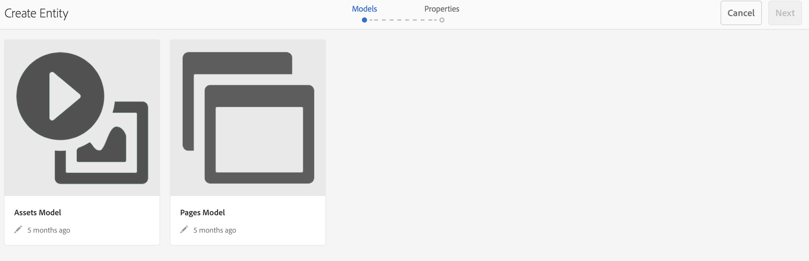
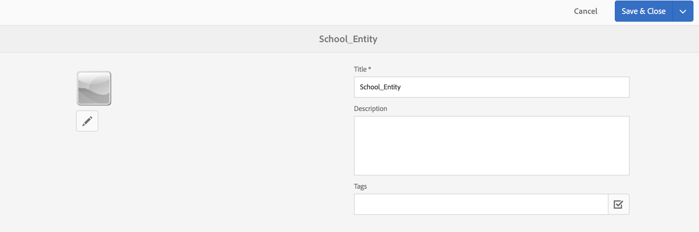

# Espacios y entidades{#spaces-and-entities}

{{ue-over-mobile}}

Un espacio es una ubicación conveniente para almacenar entidades que se exponen a través de la API de REST de servicios de contenido. Esto resulta especialmente útil porque una aplicación (o cualquier canal) puede asociarse con muchas entidades. Forzar a las entidades a estar dentro de un espacio fuerza la práctica recomendada de agrupar los requisitos de una aplicación. AEM De forma opcional, puede asociar una aplicación en la aplicación con un pequeño número de espacios.

>[!NOTE]
>
>Para que algo esté disponible para cualquier canal desde Content Services, debe estar en un espacio.

## Creación de un espacio {#creating-a-space}

Si el usuario desea exponer un conjunto de contenido y recursos a una aplicación móvil, crea el espacio mediante el tablero de AEM Mobile.

Por primera vez un usuario que no ha configurado los servicios de contenido para trabajar con espacios, el panel de AEM Mobile solo muestra las aplicaciones después de seleccionar **Servicios de contenido**.

>[!CAUTION]
>
>**Requisitos previos para agregar un espacio**
>
>AEM Marque **Habilitar servicios de contenido de** para trabajar con espacios y habilitarlo en el panel de aplicaciones de AEM Mobile.
>
>Consulte [Administración de servicios de contenido](/help/mobile/developing-content-services.md) para obtener más información.

Una vez configurados los espacios en el panel, siga estos pasos para crear espacios:

1. Elija **espacios** en los servicios de contenido.

   

1. Elija **Crear** para crear un espacio. Escriba **Título**, **Nombre** y **Descripción** para el espacio.

   Haga clic en **Crear**.

   

## Administración de un espacio {#managing-a-space}

Después de crear un espacio, haga clic en la izquierda para administrar el espacio en la lista.

AEM Puede ver las propiedades del espacio, eliminarlo o publicar el espacio y su contenido en una instancia de publicación de la publicación de la aplicación de la aplicación de la aplicación de la aplicación de la aplicación de la aplicación de la aplicación de la aplicación de publicación de la aplicación.

**Propiedades de visualización y edición de un espacio**

1. Seleccione el espacio de la lista
1. Elija **Propiedades** en la barra de herramientas
1. Haga clic en **Cerrar** cuando haya terminado

**Publicar un espacio** Cuando se publica un espacio, también se publican todas las carpetas y entidades de ese espacio.

1. Seleccione el espacio haciendo clic en su icono en la lista de la consola de espacio
1. Elegir **árbol de Publish**

>[!NOTE]
>
>Puede **Cancelar la publicación** de un espacio, lo cual elimina el espacio de la instancia de publicación.
>
>La siguiente imagen ilustra las acciones que se pueden realizar, después de publicar el espacio.

## Trabajar con carpetas en un espacio {#working-with-folders-in-a-space}

Los espacios pueden incluir carpetas para ayudar a organizar aún más el contenido y los recursos del espacio. Los usuarios pueden crear su propia jerarquía en un espacio.

### Creación de una carpeta {#creating-a-folder}

1. Haga clic en el espacio de la lista en la consola del espacio y haga clic en **Crear carpeta**

   

1. Escriba **Title**, **Name,** y **Description** para la carpeta

   

1. Haga clic en **Crear** para crear la carpeta en un espacio

## Copia de idioma {#language-copy}

>[!CAUTION]
>
>La copia de idioma no es completamente funcional para esta versión. Solo configura la estructura.

La característica **Copia de idioma** permite a los autores copiar su copia de idioma principal y luego crear un proyecto y un flujo de trabajo para traducir automáticamente el contenido. La copia de idioma crea la estructura correcta. Una vez añadida una carpeta en un espacio, puede añadir Copia de idioma al espacio.

>[!NOTE]
>
>Se recomienda que cualquier contenido que se pueda traducir se coloque en el nodo Copia de idioma.

### Adición de copia de idioma {#adding-language-copy}

1. Una vez creado el espacio, haga clic en él para crear una copia de idioma.

   Haga clic en **Crear** y elija **Copia de idioma**.

   

   >[!NOTE]
   >
   >Los nodos de copia de idioma sólo pueden existir como secundarios directos del espacio.

1. Elija **Idioma del paquete de contenido&amp;ast;** e introduzca el **Título&amp;ast;** en el cuadro de diálogo **Crear copia de idioma**.

   Haga clic en **Crear**.

   

1. Una vez creada una copia de idioma, aparecerá en su espacio en **Idioma principal**.

   

   >[!NOTE]
   >
   >Seleccione **Maestros de idioma** para ver las carpetas de copia de idioma.

### Eliminación de una carpeta del espacio {#removing-a-folder-from-the-space}

1. Seleccione la carpeta de la lista de contenido de espacio
1. Haga clic en **Eliminar** en la barra de herramientas

   >[!NOTE]
   >
   >Para desplazarse a una carpeta y ver su contenido o agregar una subcarpeta o entidad, haga clic en el título de la carpeta en la lista de contenido del espacio.

## Uso de entidades en un espacio {#working-with-entities-in-a-space}

Las entidades representan el contenido que se expone a través del extremo del servicio web. AEM Las entidades se almacenan en espacios, de modo que se pueden encontrar fácilmente y se mantienen independientes de la estructura de repositorio de la que contiene su contenido relacionado.

Es posible que desee agrupar las entidades en una recopilación lógica. Para ello, puede crear cualquier número de carpetas.

Si se recopilan elementos secundarios de entidad, que son otras entidades, para el modelado de datos, el usuario desarrollador puede crear &quot;Modelos de grupo&quot; específicos a partir del tipo de modelo &quot;Grupo de entidad&quot;, siempre de forma predeterminada.

>[!NOTE]
>
>Las entidades siempre están asociadas a un espacio, por lo que se accede a la mayor parte de la interfaz de usuario de la entidad a través de la consola del espacio.

### Creación de una entidad {#creating-an-entity}

1. Abra la consola Espacio y haga clic en el título del espacio.

   Si lo desea, puede desplazarse a la carpeta haciendo clic en el título de la carpeta en la lista.

   

1. Elija el modelo para la entidad. Este es el tipo de entidad que desea crear. Haga clic en Siguiente.

   

   >[!NOTE]
   >
   >Tiene la opción de elegir el **Modelo Assets**, el **Modelo de páginas** o un modelo del tipo de entidad que creó anteriormente.
   >
   >Consulte [Creación de un modelo](/help/mobile/administer-mobile-apps.md) para crear su entidad personalizada.

1. Escriba un **Título**, **Nombre**, **Descripción** y **Etiquetas** para la entidad. Haga clic en **Crear**.

   

   Una vez finalizado, la entidad aparecerá en los descendientes del espacio.

### Edición de una entidad {#editing-an-entity}

1. Una vez creada una entidad, vaya a la carpeta o al espacio y elija la entidad de la consola Espacio que desea editar.

   

1. Seleccione una entidad para editarla y haga clic en **Editar**.

   

   >[!CAUTION]
   >
   >Según la plantilla que elija para crear la entidad, la interfaz de usuario será diferente para ambos, para editar y ver las propiedades de la entidad. Consulte los pasos a continuación para obtener más información.

   ***Si elige la plantilla para crear la entidad como modelos de Assets***, al hacer clic en **Editar** podrá agregar recursos como se muestra en la figura siguiente:

   

   También puede hacer clic en **Vista previa** para ver el vínculo json.

   

   ***Si elige la plantilla para crear la entidad como modelos de páginas***, al hacer clic en **Editar** podrá agregar recursos como se muestra en la figura siguiente:

   

   Haga clic en el icono en **Ruta** para agregar un recurso

   

   >[!NOTE]
   >
   >Una vez añadida una entidad, debe guardarse para que funcione el vínculo Vista previa. Para ver la vista previa, haz clic en **Guardar**. Al hacer clic en **Vista previa** se muestra el json del recurso agregado, como se muestra en la figura siguiente:

   

   >[!NOTE]
   >
   >Cuando haya terminado de agregar recursos a su entidad, puede elegir **Guardar** para guardar los cambios o elegir **Guardar y cerrar** para guardar y redirigir a la lista de la consola de Space donde se definen las entidades.

   Además, seleccione una entidad de la lista de la consola de espacio y haga clic en **Propiedades** para ver y editar las propiedades de una entidad definida.

   

   Puede editar el título, la descripción, las etiquetas y añadir los recursos a su entidad.

   

### Eliminación de una entidad {#removing-an-entity}

1. Seleccione la entidad de la lista de contenido de espacio

   

1. Haga clic en **Eliminar** en la barra de herramientas para eliminar la entidad específica del espacio

### Publicación de una entidad {#publishing-an-entity}

Tiene la opción de elegir **Publish Tree** o **Quick Publish** para publicar su entidad.

1. Seleccione una entidad de la lista de la consola de espacio y haga clic en **Árbol de Publish **para publicar esa entidad y sus hijos.

   

   **O**,

   Haga clic en **Quick Publish** para publicar esa entidad específica.
