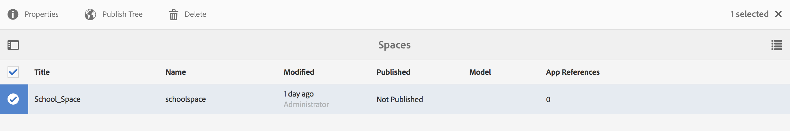

# Espacios y entidades{#spaces-and-entities}

>[!NOTE]
>
>Adobe recomienda el uso del Editor de SPA para proyectos que requieren una representación de cliente basada en el marco de aplicaciones de una sola página (por ejemplo, React). [Más información](/help/sites-developing/spa-overview.md).

Un espacio es una ubicación conveniente para almacenar entidades expuestas a través de la Content Services REST API. Esto resulta especialmente útil porque una aplicación (o cualquier canal) se puede asociar con muchas entidades. Forzar a las entidades a estar dentro de un espacio fuerza la mejor práctica de agrupar los requisitos de una aplicación. Opcionalmente, puede asociar una aplicación en AEM con un pequeño número de espacios.

>[!NOTE]
>
>Para hacer que algo esté disponible para cualquier canal desde Content Services, debe estar en un espacio.

## Creación de un espacio {#creating-a-space}

Si el usuario desea exponer un montón de contenido y recursos a una aplicación móvil, crea el espacio mediante el panel de AEM Mobile.

Para el primer usuario, que no ha configurado los servicios de contenido para trabajar con espacios, el panel de AEM Mobile muestra solo las aplicaciones después de seleccionar **Content Services**.

>[!CAUTION]
>
>**Requisitos previos para agregar un espacio**
>
>Seleccione **Activar AEM Content Services** para que funcione con Spaces y actívelo en el panel de la aplicación de AEM Mobile.
>
>Consulte [Administración de servicios](/help/mobile/developing-content-services.md) de contenido para obtener más información.

Una vez configurados los espacios en el tablero, siga estos pasos para crear espacios:

1. Elija **Espacios** en Content Services.

   

1. Elija **Crear** para crear un espacio. Introduzca **Título**, **Nombre** y **Descripción** para el espacio.

   Haga clic en **Crear**.

   

## Administración de un espacio {#managing-a-space}

Una vez creado un espacio, haga clic en el lado izquierdo para administrarlo.

Puede ver las propiedades del espacio, eliminarlo o publicar el espacio y su contenido en una instancia de publicación de AEM.

**Visualización y edición de propiedades de un espacio**

1. Seleccione el espacio de la lista
1. Choose **Properties** from the toolbar
1. Haga clic en **Cerrar** cuando termine

**Publicación de un espacio** Cuando se publica un espacio, también se publican todas las carpetas y entidades de ese espacio.

1. Seleccione el espacio haciendo clic en su icono en la lista Consola de espacio
1. Elegir árbol **de publicación**

>[!NOTE]
>
>Puede **Cancelar la publicación** de un espacio, que quita el espacio de la instancia de publicación.
>
>La siguiente imagen ilustra las acciones que se pueden realizar después de publicar el espacio.

## Uso de carpetas en un espacio {#working-with-folders-in-a-space}

Los espacios pueden incluir carpetas para ayudar a organizar mejor el contenido y los recursos del espacio. Los usuarios pueden crear su propia jerarquía en un espacio.

### Creación de una carpeta {#creating-a-folder}

1. Haga clic en el espacio de la lista en la consola de espacio y haga clic en **Crear carpeta**

   

1. Introduzca el **Título**, **** Nombre y **Descripción** de la carpeta

   

1. Haga clic en **Crear** para crear la carpeta en un espacio

## Copia de idioma {#language-copy}

>[!CAUTION]
>
>La copia de idioma no es completamente funcional para esta versión. Solamente configura la estructura.

La función de copia **de** idioma permite a los autores copiar su copia de idioma principal y, a continuación, crear un proyecto y un flujo de trabajo para traducir automáticamente el contenido. La copia de idioma crea la estructura correcta. Una vez agregada una carpeta en un espacio, puede agregar la copia de idioma a su espacio.

>[!NOTE]
>
>Se recomienda colocar cualquier contenido que pueda traducirse en el nodo Copia de idioma.

### Adición de una copia de idioma {#adding-language-copy}

1. Una vez que haya creado espacio, haga clic en ese espacio para crear una copia del idioma.

   Haga clic en **Crear** y elija **Copiar** idioma.

   

   >[!NOTE]
   >
   >Los nodos de copia de idioma sólo pueden existir como elementos secundarios directos del espacio.

1. **** Elija **Content Package Language&amp;ast; e introduzca el** Título&amp;Último; en el cuadro de diálogo **Crear copia** de idioma.

   Haga clic en **Crear**.

   

1. Una vez que haya creado una copia de idioma, aparecerá en su espacio en **Idiomas Maestros**.

   

   >[!NOTE]
   >
   >Seleccione **Maestro** de idioma para ver las carpetas de copia de idioma.

### Eliminación de una carpeta del espacio {#removing-a-folder-from-the-space}

1. Seleccione la carpeta en la lista de contenido de espacio
1. Haga clic en **Eliminar** en la barra de herramientas

   >[!NOTE]
   >
   >Para desplazarse a una carpeta y ver su contenido o agregar una subcarpeta o entidad, haga clic en el título de la carpeta en la lista de contenido del espacio.

## Uso de entidades en un espacio {#working-with-entities-in-a-space}

Las entidades representan el contenido expuesto a través del extremo del servicio Web. Las entidades se almacenan en espacios para que se puedan encontrar fácilmente y se mantengan independientes de la estructura de repositorio de AEM que contiene el contenido relacionado.

Es posible que desee agrupar entidades en alguna recopilación lógica. Para ello, puede crear cualquier número de carpetas.

Si los elementos secundarios de entidad, que son otras entidades, se recopilan para el modelado de datos, el usuario desarrollador puede crear &quot;Modelos de grupo&quot; específicos a partir del tipo de modelo &quot;Grupo de entidades&quot;, proporcionado de forma predeterminada.

>[!NOTE]
>
>Las entidades siempre están asociadas con un espacio, por lo que se accede a la mayoría de la interfaz de usuario de la entidad a través de la consola espacial.

### Creación de una entidad {#creating-an-entity}

1. Abra la consola Espacio y haga clic en el título del espacio.

   Si lo desea, puede desplazarse a la carpeta haciendo clic en el título de la carpeta en la lista.

   

1. Elija el modelo para la entidad. Es el tipo de entidad que desea crear. Haga clic en Siguiente.

   

   >[!NOTE]
   >
   >Tiene la opción de elegir el modelo **de** recursos, el modelo **de** páginas o un modelo de entidad que haya creado anteriormente.
   >
   >Consulte [Creación de un modelo](/help/mobile/administer-mobile-apps.md)para crear la entidad personalizada.

1. Introduzca un **Título**, **Nombre**, **Descripción** y **Etiquetas** para la entidad. Haga clic en **Crear**.

   

   Una vez que haya terminado, la entidad aparecerá en los descendientes de su espacio.

### Edición de una entidad {#editing-an-entity}

1. Una vez que haya creado una entidad, vaya a la carpeta o al espacio y elija su entidad en la consola Espacio para editarla.

   

1. Seleccione una entidad para editarla y haga clic en **Editar**.

   

   >[!CAUTION]
   >
   >Según la plantilla que elija para crear la entidad, la interfaz de usuario será diferente para ambas, para editar y ver las propiedades de la entidad. Consulte los pasos a continuación para obtener más detalles.

   ***Si elige la plantilla para crear la entidad como modelos*** de recursos, al hacer clic en **Editar** podrá agregar recursos como se muestra en la figura siguiente:

   

   También puede hacer clic en **Vista previa** para ver el vínculo json.

   

   ***Si elige la plantilla para crear la entidad como Modelos*** de páginas, al hacer clic en **Editar** podrá agregar recursos como se muestra en la figura siguiente:

   

   Haga clic en el icono de la **ruta** para agregar un recurso

   

   >[!NOTE]
   >
   >Una vez agregada una entidad, debe guardarse para que funcione el vínculo Vista previa. Para ver la vista previa, haga clic en **Guardar**. Al hacer clic en la **vista previa** se muestra el archivo del recurso agregado, como se muestra en la figura siguiente:

   

   >[!NOTE]
   >
   >Cuando haya terminado de agregar recursos a la entidad, puede elegir **Guardar** para guardar los cambios o elegir **Guardar y cerrar** para guardar y redirigir a la lista de la consola Espacio donde se definen las entidades.

   Además, seleccione una entidad en la lista de la consola de espacio y haga clic en **Propiedades** para ver y editar las propiedades de una entidad definida.

   

   Puede editar el título, la descripción y las etiquetas, así como agregar los recursos a la entidad.

   

### Eliminación de una entidad {#removing-an-entity}

1. Seleccione la entidad en la lista de contenido de espacio

   

1. Haga clic en **Eliminar** de la barra de herramientas para eliminar la entidad específica del espacio

### Publicación de una entidad {#publishing-an-entity}

Tiene la opción de elegir **Publicar árbol** o **Publicación** rápida para publicar su entidad.

1. Seleccione una entidad en la lista de la consola de espacio y haga clic en **Árbol de publicación **para publicar esa entidad y sus elementos secundarios.

   

   **O bien**,

   Haga clic en **Publicación** rápida para publicar esa entidad específica.
