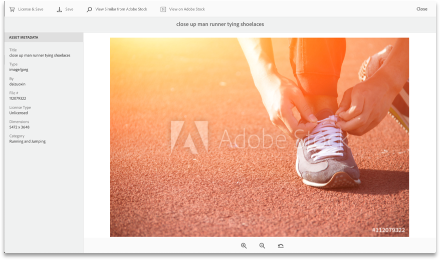

# Notas de versión de AEM Assets{#aem-assets-release-notes}

Estas son las principales funciones y los aspectos destacados de la versión AEM 6.5 Assets.

## Integración con Adobe Creative Cloud y flujos de trabajo creativos {#integration-with-adobe-creative-cloud-and-creative-workflows}

AEM ofrece varias formas de integración con Adobe Creative Cloud y permite compartir recursos para usarlos en flujos de trabajo en los que los equipos creativos, de marketing o de negocios colaboran estrechamente. AEM 6.5 continúa mejorando la integración y la optimiza para ofrecer más oportunidades y agilizar los métodos existentes.

Continúe leyendo para conocer las capacidades e integraciones específicas de AEM 6.5 que puede aprovechar para mejorar sus casos de uso de velocidad de contenido.

### Adobe Asset Link {#aal}

Adobe Asset Link consolida la colaboración entre los expertos creativos y los especialistas en mercadotecnia en el proceso de creación de contenido. Los expertos creativos pueden acceder al contenido almacenado en Adobe Experience Manager Assets (AEM Assets), sin necesidad de dejar de usar las aplicaciones con las que están más familiarizados. Los expertos creativos pueden explorar, buscar, retirar y registrar recursos sin problemas mediante el panel de control de las aplicaciones de Photoshop, Illustrator e InDesign.

Adobe Asset Link forma parte de la oferta de [Adobe Creative Cloud para empresas](https://www.adobe.com/creativecloud/business/enterprise.html). Para obtener más información, incluida la configuración necesaria de la implementación de AEM, consulte [Adobe Asset Link](https://helpx.adobe.com/enterprise/using/adobe-asset-link.html).

### Integración con Adobe Stock {#stock}

Su organización puede utilizar su plan empresarial de Adobe Stock en Recursos AEM para garantizar que los recursos con licencia estén disponibles en general para sus proyectos creativos y de marketing. Puede encontrar, previsualizar y conceder licencias rápidamente para los recursos de Adobe Stock que se guardan en AEM, utilizando las potentes capacidades DAM de AEM.

El servicio Adobe Stock proporciona a diseñadores y empresas acceso a millones de fotos, vectores, ilustraciones, vídeos, plantillas y recursos 3D de alta calidad, verificados y libres de derechos de autor para todos sus proyectos creativos.

Para obtener más información, consulte [Uso de recursos de Adobe Stock en AEM Assets](/help/assets/aem-assets-adobe-stock.md).

Vista previa de la imagen y la licencia de Adobe Stock en AEM Assets

Búsqueda y filtrado de imágenes con licencia de Adobe Stock en AEM

### Dynamic references in Adobe InDesign {#dynamic-references-in-indesign}

Los recursos de AEM Assets utilizados en los archivos de Adobe InDesign son dinámicos. Las referencias se actualizan automáticamente si los recursos mencionados se mueven en la jerarquía JCR. Para obtener más información, consulte [Gestión de recursos compuestos](/help/assets/managing-linked-subassets.md).

## Capacidades de Brand Portal {#brand-portal-capabilities}

AEM Assets Brand Portal le ayuda a adquirir, controlar y distribuir de forma eficaz y segura los recursos aprobados a agencias o proveedores externos y a usuarios de negocios internos en todos los dispositivos. Asimismo, le permite mejorar la eficiencia del uso compartido de recursos, acelera el tiempo de comercialización de esos recursos y elimina el riesgo de uso indebido y los accesos no autorizados.

Para obtener más información, consulte [Novedades de Brand Portal](https://helpx.adobe.com/experience-manager/brand-portal/using/whats-new.html).

## Recursos de red {#connectedassets}

En las grandes empresas se puede distribuir la infraestructura necesaria para crear sitios web. A veces, las capacidades de creación de sitios web y los recursos digitales necesarios residen en distintos silos.

AEM Sites ofrece capacidades de crear páginas web, y AEM Assets es el sistema de gestión de recursos digitales (DAM) que proporciona los recursos necesarios para los sitios web. AEM ahora es compatible con el caso de uso anterior mediante la integración de AEM Sites y AEM Assets.

Para obtener más información, consulte [Uso de recursos de un recurso conectado](/help/assets/use-assets-across-connected-assets-instances.md).

Arrastrar y soltar los recursos DAM desde una instancia de AEM en la página Sites de una instancia de AEM diferente

## Dynamic Media {#dynamic-media}

Dynamic Media ofrece la creación y entrega mejorada de medios enriquecidos en AEM Assets para impulsar experiencias de vanguardia que sean inmersivas y estén personalizadas. Al cargar un único recurso maestro de alta calidad y utilizar nuestros visores y procesamiento avanzados en la nube, puede distribuir cualquier combinación de representaciones sobre la marcha para admitir la estrategia de medios de su organización.

Para obtener más información sobre las nuevas funciones de Dynamic Media, consulte las [Notas de versión de Dynamic Media](https://marketing.adobe.com/resources/help/en_US/s7/release_notes/).

### Compatibilidad con vídeos 360 {#video-support}

Gestione sus archivos de vídeo 360 directamente en AEM utilizando los visores de vanguardia de Dynamic Media para ofrecer experiencias de realidad virtual en los equipos de escritorio, dispositivos móviles y auriculares de realidad virtual. Para obtener más información, consulte [Uso de vídeos 360](/help/assets/360-video.md).

### Miniaturas de vídeo personalizadas {#custom-video-thumbnails}

Ahora puede personalizar las miniaturas de sus recursos de vídeo utilizando fotogramas del propio vídeo u otro contenido almacenado en DAM. Para obtener instrucciones adicionales, consulte [Acerca de las miniaturas de vídeo](/help/assets/video.md#about-video-thumbnails-in-dynamic-media-scene-mode).

### Mejoras de accesibilidad {#accessibility-enhancements}

Los visores de Dynamic Media ahora admiten funciones mejoradas de accesibilidad como compatibilidad con Aria, lectores de pantallas y texto alternativo. Para obtener información adicional, consulte [Notas de versión de los visores de Dynamic Media](https://marketing.adobe.com/resources/help/en_US/s7/viewers_ref/index.html).

## Mejora de la opción de búsqueda {#search-experience-enhancement}

A partir de AEM 6.5, los especialistas en marketing pueden descubrir los recursos deseados con mayor rapidez desde la página de resultados de búsqueda. Las facetas de búsqueda se actualizan con el número de recursos incluso antes de aplicar el filtro de búsqueda. Ver la cantidad esperada con el filtro ayuda a los usuarios a navegar a través de los resultados de búsqueda de forma eficaz. Para obtener más información, consulte [Buscar recursos en AEM](../assets/search-assets.md).

Ver el número de recursos sin filtrar los resultados de búsqueda en las facetas de búsqueda.

## Mejora de la capacidad de uso {#usability-enhancement}

Ahora puede seleccionar todos los recursos de una carpeta o de un resultado de búsqueda en un solo paso. Esto le permite administrar varios recursos rápidamente. La casilla de verificación selecciona todos los recursos que se ajustan al escenario; por ejemplo, un resultado de búsqueda y no solo los recursos visibles en la interfaz AEM.

Utilice la opción Seleccionar todo para seleccionar todos los recursos en un clic.

## Mejoras en los metadatos {#metadata-enhancements}

Assets le permite crear esquemas de metadatos para carpetas de recursos, que definen el diseño y los metadatos mostrados en las páginas de propiedades de las carpetas. Ahora puede asignar un esquema de metadatos de carpeta a una carpeta existente o al crear una carpeta nueva. Para obtener más información, consulte [Esquema de metadatos de carpeta](/help/assets/folder-metadata-schema.md).

Al especificar los metadatos en cascada, las opciones se pueden cargar desde un archivo JSON en tiempo de ejecución, en lugar de escribir manualmente en el formulario. Para obtener más información, consulte [Metadatos en cascada](/help/assets/cascading-metadata.md).

## Mejoras en los informes {#reporting-enhancements}

Los fragmentos de contenido y los vínculos compartidos ahora se incluyen en el informe de recursos descargados. Para obtener más información, consulte los [informes de recursos](/help/assets/asset-reports.md).
