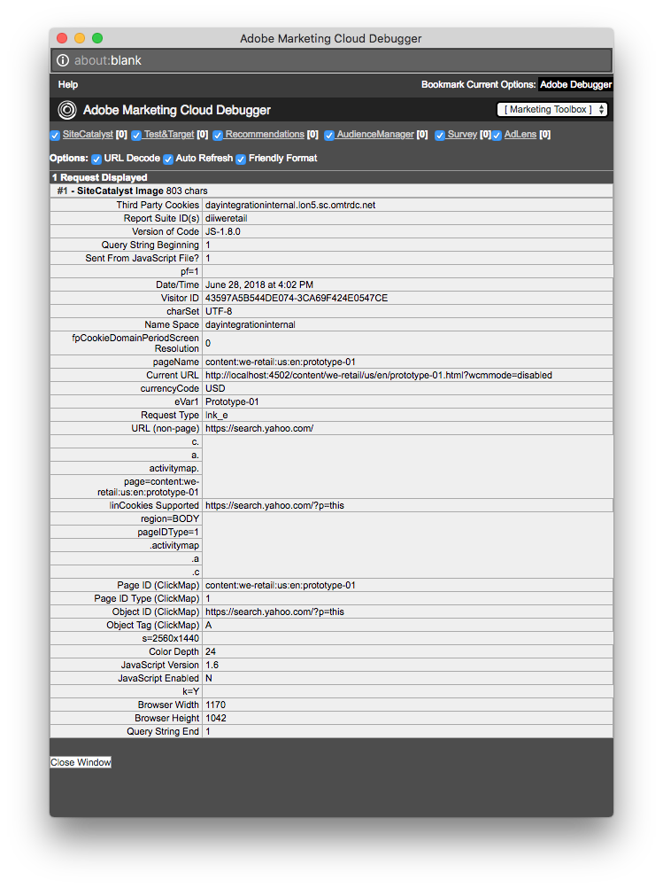

# Configuración del seguimiento de vínculos para Adobe Analytics{#configuring-link-tracking-for-adobe-analytics}

Cuando los usuarios hacen clic en los vínculos de las páginas del sitio web, puede capturar la información relacionada en Adobe Analytics. Por ejemplo: utilice el seguimiento de vínculos para conocer la forma en que los usuarios interactúan con el sitio, rastrear las descargas de archivos y rastrear los vínculos de salida.

## Configuración del seguimiento de vínculos para un Adobe Analytics Framework {#configuring-link-tracking-for-an-adobe-analytics-framework}

1. Utilizando **Navegación**, vaya a la sección **Implementación**, **Cloud Services** a **Adobe Analytics**.

1. Mediante **Mostrar configuraciones**, abra el marco de trabajo de Adobe Analytics requerido.
1. Expanda la sección **Configuración del seguimiento de vínculos** y configúrela según sea necesario (esta página proporciona más detalles):

   

## Seguimiento de descargas de archivos {#tracking-file-downloads}

Configure el marco de trabajo de Adobe Analytics para que los archivos descargados de las páginas asociadas se rastreen automáticamente como descargas en Adobe Analytics. Cuando se habilita el seguimiento de descargas, solo se realiza el seguimiento de los tipos de archivo que se especifiquen.

Las descargas de los siguientes tipos de archivo se rastrean de forma predeterminada:

* exe
* zip
* wav
* mp3
* mov
* mpg
* avi
* wmv
* doc
* pdf
* xls

Por ejemplo: con el seguimiento de descargas habilitado para archivos PDF, siempre que los usuarios hagan clic en vínculos a archivos PDF, se realizará un seguimiento de la descarga del PDF.

Las propiedades de seguimiento de descarga de la estructura se implementan como código en el archivo `analytics.sitecatalyst.js` que se genera para una página. El siguiente ejemplo de código representa la configuración predeterminada del seguimiento de descarga:

```
s.trackDownloadLinks= true;
s.linkDownloadFileTypes= 'exe,zip,wav,mp3,mov,mpg,avi,wmv,doc,pdf,xls';
```

Para habilitar el seguimiento de descargas para el marco de trabajo de Adobe Analytics:

1. [Abra el marco de Adobe Analytics y expanda la sección](#configuring-link-tracking-for-an-adobe-analytics-framework) Configuración del seguimiento de vínculos.
1. Habilitar **Seguimiento de descargas**.
1. En el cuadro **Descargar tipos de archivo**, escriba las extensiones de nombre de archivo para los tipos de archivos que desee rastrear.

## Seguimiento de vínculos externos {#tracking-external-links}

Puede rastrear los clics de los vínculos externos (vínculos de salida) en las páginas.

Para rastrear vínculos externos para su entorno de Adobe Analytics:

1. [Abra el marco de trabajo de Adobe Analytics y expanda la sección **** Configuración del seguimiento de vínculos](#configuring-link-tracking-for-an-adobe-analytics-framework).
1. Configure las siguientes propiedades según sus necesidades.

Propiedades para el seguimiento cuando se hace clic en vínculos externos:

* **Rastrear**
externosHabilita el seguimiento de vínculos externos.

* **Filtros**
 externos (opcional) Define filtros para la coincidencia de las direcciones URL externas de los destinatarios de vínculos. Cuando los destinatarios del vínculo coinciden con el filtro, se realiza el seguimiento del vínculo. Los filtros externos son útiles para rastrear solo algunos de los vínculos externos de las páginas.

   Para especificar los vínculos externos para rastrear, escriba la dirección URL completa o parte de la misma del destinatario del vínculo. Separe varios filtros con una coma. Escriba literales de cadena entre comillas simples. Ningún valor (el valor predeterminado de `''`, dos comillas simples) hace que se rastreen todos los vínculos externos.

* **Filtros**
internosDefine filtros para la coincidencia de las direcciones URL de los vínculos internos. Cuando el vínculo destinatario direcciones URL que coinciden con este filtro, no se realiza el seguimiento del vínculo. El valor predeterminado es un comando javascript que devuelve el nombre de host de la URL de la dirección de la ventana actual.

   Para especificar los vínculos internos que no se rastrean, escriba la dirección URL interna completa o parte de la misma del destinatario de vínculos. Separe varios filtros con una coma. Escriba literales de cadena entre comillas simples.

   El valor predeterminado es `'javascript:,'+window.location.hostname`

* **Dejar**
cadena de ConsultaIncluye parámetros de URL al evaluar coincidencias con filtros internos y externos.

   Active esta opción para incluir parámetros de URL al evaluar las direcciones URL de destinatario de vínculos con filtros externos e internos.

Las propiedades de seguimiento de vínculos externos se implementan como código en el archivo `analytics.sitecatalyst.js` que se genera para una página. El siguiente código de ejemplo se genera para una página asociada a un marco que ha habilitado el seguimiento de vínculos externos con la siguiente configuración:

* El filtro externo es `'google.com'`
* El filtro interno es el valor predeterminado de `'javascript:,'+window.location.hostname`
* Las cadenas de consulta no se incluyen al evaluar el destinatario del vínculo con filtros.

```
s.trackExternalLinks= false;
s.linkExternalFilters= 'google.com';
s.linkInternalFilters= 'javascript:,'+window.location.hostname;
s.linkLeaveQueryString= false;
```

## Envío de datos de variables con clics en vínculos {#sending-variable-data-with-link-clicks}

Puede configurar AEM para enviar datos de variables y eventos a Adobe Analytics cuando un usuario haga clic en un vínculo. Las propiedades **Configuración de seguimiento de vínculos** le permiten especificar las eventos y variables de Adobe Analytics para rastrear cuándo se producen clics en los vínculos.

Las asignaciones de la estructura determinan los valores de evento y variable. Puede asignar variables de Adobe Analytics a las variables de los componentes de contenido que almacenan los datos que desea rastrear cuando se hace clic en los vínculos.

Para enviar datos de variables con clics en vínculos:

1. [Abra el marco de Adobe Analytics y expanda la sección](#configuring-link-tracking-for-an-adobe-analytics-framework) Configuración del seguimiento de vínculos.
1. Configure las siguientes propiedades según sus necesidades.

Propiedades para enviar datos de variables con clics en vínculos:

* **Vincular**
eventos de seguimientoIntroduzca las variables de evento de Adobe Analytics que desee utilizar para contar los clics en vínculos.

   Separe los nombres de varias variables con una coma.

   El valor predeterminado de `None` no provoca el seguimiento de eventos.

* **Vincular**
variables de seguimientoIntroduzca las variables de Adobe Analytics que desee enviar a Adobe Analytics cuando se haga clic en los vínculos. Separe los nombres de varias variables con una coma.

   El valor predeterminado de `None` hace que no se envíen datos de variables.

Cuando se especifican los eventos y las variables que se van a enviar, la configuración se implementa como código en el archivo `analytics.sitecatalyst.js` que se genera para una página. El siguiente código de ejemplo se genera para una página cuando la estructura rastrea el evento `event10` y la propiedad `prop4`:

```
s.linkTrackEvents= 'event10';
s.linkTrackVars= 'prop4';
```

## Ejemplo de configuración de seguimiento de vínculos {#example-link-tracking-configuration}

Realice los siguientes procedimientos para explorar el comportamiento de seguimiento de vínculos de la integración de Adobe Analytics. Los procedimientos muestran los resultados de [Adobe Marketing Cloud Debugger](https://docs.adobe.com/content/help/en/debugger/using/experience-cloud-debugger.html).

### Configuración general {#general-configuration}

Este ejemplo ilustra cómo funciona la asignación en el contexto del seguimiento y el depurador:

1. Abra el marco que se ha asociado con una página web.
1. Arrastre el componente **Página** al área de asignaciones del marco. El componente **Página** pertenece al grupo de componentes **General** en la barra de tareas.

   >[!NOTE]
   >
   >El componente que debe utilizar en un escenario de vida real depende del componente heredado (si es que lo hace).
   >
   >Si no es así, debería tener su propio componente expuesto allí (definiendo un subnodo de análisis en su componente de página).

   Configure la asignación según la tabla siguiente, arrastrando la variable de Analytics (SiteCatalyst) desde el panel izquierdo:

<table>
 <tbody>
  <tr>
   <th>Variable CQ<br /> </th>
   <th>Entrada en el explorador de variables<br /> </th>
   <th>Variable Adobe Analytics</th>
  </tr>
  <tr>
   <td>pagedata.title</td>
   <td>EVar personalizado 1 (eVar 1)</td>
   <td>eVar1</td>
  </tr>
  <tr>
   <td>eventdata.events.pageView</td>
   <td>Personalizado 1 (evento 1)</td>
   <td>evento1</td>
  </tr>
 </tbody>
</table>

1. Arrastre el componente Buscar al área de asignaciones del marco. El componente Buscar pertenece al grupo de componentes General de la barra de tareas. Configure la asignación según la tabla siguiente, arrastrando la variable de Analytics (SiteCatalyst) desde el panel izquierdo:

<table>
 <tbody>
  <tr>
   <th>Variable CQ<br /> </th>
   <th>Entrada en el explorador de variables</th>
   <th>Variable Adobe Analytics</th>
  </tr>
  <tr>
   <td>eventdata.keyword</td>
   <td>EVar personalizado 2 (eVar 2)</td>
   <td>eVar2</td>
  </tr>
  <tr>
   <td>eventdata.results</td>
   <td>EVar personalizado 3 (eVar 3)</td>
   <td>eVar3</td>
  </tr>
  <tr>
   <td>eventdata.events.search</td>
   <td>Personalizado 2 (evento2)</td>
   <td>evento2</td>
  </tr>
 </tbody>
</table>

### Configurar el seguimiento de vínculos externos {#configure-external-link-tracking}

1. En su marco de trabajo, expanda el área **Configuración del seguimiento de vínculos**.
1. Anule la selección de **Seguimiento de descargas**.

1. Seleccione **Rastrear externo**.
1. Anule la selección de **Dejar cadena de Consulta**.
1. Utilice el siguiente valor para la lista **Filtros externos** para identificarla como una dirección URL externa:

   `‘yahoo.com’`

1. Añada el siguiente valor en el campo **Eventos de seguimiento de vínculos**:

   ```
       event1,event2
   ```

1. Añada el siguiente valor en el campo **Vars de seguimiento de vínculos**:

   ```
       eVar1,eVar2
   ```

1. En la página asociada al marco, agregue un componente **Texto**. Dentro del componente **Texto**, agregue un hipervínculo que apunte a la siguiente dirección:

   `https://search.yahoo.com/?p=this`

1. Cambie al **modo de Previsualización** y haga clic en el vínculo.

La llamada realizada tendrá este aspecto cuando se visualice con Adobe Marketing Cloud Debugger:



>[!NOTE]
>
>La dirección URL no contiene la cadena de Consulta: `?p=this`

### Incluir el parámetro de URL {#include-the-url-parameter}

1. En el marco de trabajo, expanda el área **Configuración de seguimiento de vínculos**.
1. Habilitar **Dejar cadena de Consulta**.
1. Vuelva a cargar la previsualización de página y haga clic en el vínculo.

Los detalles de llamada que aparecen en Adobe Marketing Cloud Debugger son similares al siguiente ejemplo:


>[!NOTE]
>
>Esta vez la dirección URL contiene la cadena de Consulta: `?p=this`

## Seguimiento de vínculos específicos {#ad-hoc-link-tracking}

El seguimiento de vínculos específicos permite a los autores de contenido configurar el seguimiento de vínculos para un componente. La configuración del componente sobrescribe la **Configuración de seguimiento de vínculos** del marco, de modo que en las páginas asociadas con el marco, los componentes **Texto** se pueden configurar para el seguimiento de vínculos de direcciones URL.

El seguimiento de vínculos ad-hoc le permite rastrear vínculos de descarga, vínculos externos, junto con datos de variables y eventos.

Para habilitar el seguimiento de vínculos ad-hoc debe:

* [Asocie la página que contiene el  **** componente Texto al marco](/help/sites-administering/adobeanalytics-connect.md#associating-a-page-with-a-adobe-analytics-framework).
* [Configure el marco de trabajo de Adobe Analytics para habilitar el seguimiento](#enabling-ad-hoc-link-tracking) de vínculos ad-hoc.
* [Configuración del seguimiento de vínculos para un componente](#configuring-link-tracking-for-a-text-component) de texto.

### Habilitación del seguimiento de vínculos específicos {#enabling-ad-hoc-link-tracking}

Configure el marco de Adobe Analytics para habilitar el seguimiento de vínculos ad-hoc.

1. Abra el marco de trabajo de Adobe Analytics y expanda la sección **Configuración de seguimiento de vínculos**.

1. Habilite **Seguimiento de vínculos específicos**.

   >[!NOTE]
   >
   >No todos los tipos de usuarios tienen acceso a esta casilla. Póngase en contacto con el administrador del sitio si necesita acceso.

>[!NOTE]
>
>La configuración XSS Antisamy ahora está en SLING en la ruta **/libs/sling/xss.config.xml** y es necesario agregar las siguientes reglas para que funcione la vinculación ad-hoc:

#### Extensión de regla de etiqueta delimitadora {#anchor-tag-rule-extension}

```xml
<attribute name="onclick">
    <literal-list>
        <literal value="CQ_Analytics.Sitecatalyst.customTrack(this)"/>
    </literal-list>
</attribute>
<attribute name="adhocenable">
    <literal-list>
        <literal value="true"/>
        <literal value="false"/>
    </literal-list>
</attribute>
<attribute name="adhocevents">
    <regexp-list>
        <regexp name="anything"/>
    </regexp-list>
</attribute>
<attribute name="adhocevars">
    <regexp-list>
        <regexp name="anything"/>
    </regexp-list>
</attribute>
```

### Configuración del seguimiento de vínculos para un componente de texto {#configuring-link-tracking-for-a-text-component}

Antes de configurar el seguimiento de vínculos ad-hoc para los componentes **Text**, las configuraciones siguientes ya deben haberse implementado:

* El módulo [Adobe Analytics está configurado para habilitar el seguimiento de vínculos específicos](#enabling-ad-hoc-link-tracking).
* La página [que contiene el componente **Texto** está asociada con la estructura](/help/sites-administering/adobeanalytics-connect.md#associating-a-page-with-a-adobe-analytics-framework).

Utilice el siguiente procedimiento para configurar el seguimiento de vínculos para un componente **Texto**:

1. Abra la página en modo de edición y edite el componente **Texto**.

1. Seleccione el texto que desee utilizar como hipertexto y haga clic en el botón Hipervínculo.

   

1. Añada la URL de destinatario en el cuadro Vincular a y expanda el área Seguimiento de vínculos.

   >[!NOTE]
   >
   >El seguimiento de vínculos personalizados está visible como una acción independiente, junto a la acción Vincular/Desvincular (icono de Analytics).
   >
   >Solo se activará cuando haya seleccionado un vínculo válido en RTE.

   

1. Active **Seguimiento de vínculos personalizados** para anular la configuración del seguimiento de vínculos del marco de Adobe Analytics y habilitar el seguimiento de vínculos para el vínculo actual.

1. (Opcional) Para rastrear eventos con el clic en el vínculo, agregue nombres de eventos de Adobe Analytics en el campo **Incluir variables de Adobe Analytics**. Separe el nombre de varios eventos con comas, por ejemplo

   `event1, event22`.

1. (Opcional) Para rastrear datos de variables con el clic en el vínculo, agregue variables de Adobe Analytics en el campo **Incluir variables de Adobe Analytics**. Utilice cualquiera de los formatos siguientes:

   * *`<Variable-name>`*: *`<Dynamic Value>`*
   * *`<Variable-name>`*::  *`‘CONSTANT'`*

   Los siguientes ejemplos ilustran cada formato:

   * `eVar10:pagedata.title`
   * `prop1: ‘Aubergine'`

   Separe varios valores con una coma.

1. Seleccione **Aceptar**.

