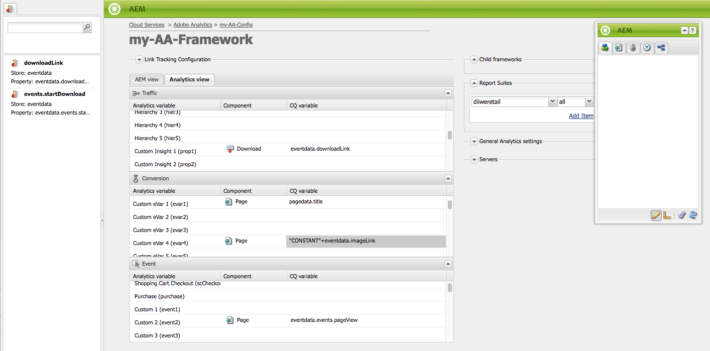

# Asignación de datos de componentes con propiedades de Adobe Analytics{#mapping-component-data-with-adobe-analytics-properties}

Agregue componentes a la estructura que recopilen los datos para enviarlos a Adobe Analytics. Los componentes diseñados para recopilar datos de análisis almacenan los datos en la variable **** CQ correspondiente. Cuando agrega un componente de este tipo a un marco, éste muestra la lista de variables de CQ para que pueda acceder a cada una de ellas a la variable **adecuada de** Analytics.

Cuando se abre la vista **de** AEM, las variables de Analytics aparecen en el buscador de contenido.

Puede asignar varias variables de Analytics con la misma variable **de** CQ.

Los datos asignados se envían a Adobe Analytics cuando se carga la página y se cumplen las siguientes condiciones:

* La página está asociada con la estructura.
* La página utiliza los componentes que se agregan al marco.

Siga el procedimiento siguiente para asignar variables de componentes de CQ con propiedades de informes de Adobe Analytics.

1. En la vista **de** AEM, arrastre un componente de seguimiento de la barra de tareas al marco. Por ejemplo, arrastre el componente **Página** desde la categoría **General** .

   

   Existen varios grupos de componentes predeterminados: **General**, **Comercio**, **Comunidades**, **Search&amp;Promote** y **Otros**. La instancia de AEM puede configurarse para mostrar diferentes grupos y componentes.

1. Para asignar variables de Adobe Analytics con variables definidas en el componente, arrastre una variable **de** Analytics desde el buscador de contenido a un campo del componente de seguimiento. Por ejemplo, arrastre `Page Name (pageName)` a `pagedata.title`.

   

   >[!NOTE]
   >
   >El ID del grupo de informes (RSID) seleccionado para la estructura determina las variables de Adobe Analytics que aparecen en el buscador de contenido.

1. Repita los dos pasos anteriores para otros componentes y variables.

   >[!NOTE]
   >
   >Puede asignar varias variables de Analytics (p. ej. `props`, `eVars`, `events`) a la misma variable de CQ (p. ej. `pagedata.title`)

   >[!CAUTION]
   >
   >Se recomienda encarecidamente que:
   >    
   >    * `eVars` y `props` se asignan a variables de CQ que comienzan por `pagedata.X` o `eventdata.X`
      >    
      >    
   * que los eventos deben asignarse a variables que empiecen por `eventdata.events.X`

1. Para que el marco esté disponible en la instancia de publicación de su sitio, abra la ficha **Página** de la barra de tareas y haga clic en **Activar marco.**

## Asignación de variables relacionadas con el producto {#mapping-product-related-variables}

AEM utiliza una convención para nombrar variables y eventos relacionados con el producto que están destinados a asignarse a propiedades relacionadas con el producto de Adobe Analytics:

| Variable CQ | Variable de Analytics | Descripción |
|---|---|---|
| `product.category` | `product.category` (variable de conversión) | Categoría del producto. |
| `product.sku` | `product.sku` (variable de conversión) | El sku del producto. |
| `product.quantity` | `product.quantity` (variable de conversión) | Número de productos que se compran. |
| `product.price` | `product.price` (variable de conversión) | El precio del producto. |
| `product.events.<eventName>` | Los eventos de éxito que se asociarán con el producto en el informe. | `product.events` es el prefijo de los eventos denominados *eventName.* |
| `product.evars.<eVarName>` | Las variables de conversión ( `eVar`) que se asociarán con el producto. | `product.evars` es el prefijo de las variables eVar denominadas *eVarName.* |

Varios componentes de AEM Commerce utilizan estos nombres de variables.

>[!NOTE]
>
>No asigne la propiedad Productos de Adobe Analytics a una variable de CQ. La configuración de asignaciones relacionadas con el producto como se describe en la tabla equivale a asignar la variable Productos.

### Comprobación de informes de Adobe Analytics {#checking-reports-on-adobe-analytics}

1. Inicie sesión en el sitio web de Adobe Analytics con las mismas credenciales proporcionadas a AEM.
1. Asegúrese de que el RSID seleccionado sea el utilizado en los pasos anteriores.
1. En **Informes** (en la parte izquierda de la página), seleccione Conversión **** personalizada, luego Conversión **personalizada 1-10** y seleccione la variable correspondiente a `eVar7`

1. Según la versión de Adobe Analytics que utilice, debe esperar un promedio de 45 minutos para que el informe se actualice con el término de búsqueda utilizado; Por ejemplo, berenjena en el ejemplo

## Uso de Content Finder (cf#) con marcos de trabajo de Adobe Analytics {#using-the-content-finder-cf-with-adobe-analytics-frameworks}

Al principio, cuando se abre un marco de Adobe Analytics, el buscador de contenido contiene variables de Analytics predefinidas en:

* Tráfico
* Conversión
* Sucesos

Cuando se selecciona un RSID, todas las variables que pertenecen a ese RSID se agregan a la lista.\
Se `cf#` necesita para asignar variables de Analytics a las variables de CQ presentes en los diferentes componentes de seguimiento. Consulte Configuración de un marco para el seguimiento básico.

Según la vista seleccionada para el marco, el buscador de contenido se rellenará con variables de Analytics (en la vista de AEM) o de CQ (en la vista de Analytics).

La lista se puede manipular de las siguientes formas:

1. En la vista **** AEM, la lista se puede filtrar según el tipo de variable seleccionado mediante los 3 botones de filtro:

   * Si *no hay ningún botón* seleccionado, la lista muestra la lista completa.
   * Si se selecciona el botón **Tráfico** , la lista solo mostrará las variables que pertenecen a la sección Tráfico.
   * Si se selecciona el botón **Conversión** , la lista solo mostrará las variables que pertenecen a la sección Conversión.
   * Si se selecciona el botón **Eventos** , la lista solo mostrará las variables que pertenecen a la sección Eventos.
   >[!NOTE]
   >
   >Solo se puede activar un botón de filtro a la vez.

   >[!NOTE]
   >
   >Las variables de Search&amp;Promote también pertenecen a la sección Conversión.

   1. La lista también tiene una función de búsqueda que filtra los elementos según el texto introducido en el campo de búsqueda.
   1. Si se activa una opción de filtro al buscar elementos en la lista, los resultados mostrados también se filtrarán según el botón activo.
   1. La lista se puede volver a cargar en cualquier momento con el botón de flechas giratorias.
   1. Si se seleccionan varios RSID en el marco, todas las variables de la lista se mostrarán con todas las etiquetas utilizadas dentro de los RSID seleccionados.

1. En la vista Adobe Analytics, Content Finder muestra todas las variables de CQ que pertenecen a los componentes de seguimiento arrastrados en la vista CQ.

   * Por ejemplo: si el componente **** Descargar es el *único arrastrado* en la vista CQ (que tiene dos variables asignables *eventdata.downloadLink* y *eventdata.events.startDownload*), el Buscador de contenido tendrá este aspecto al cambiar a la vista Adobe Analytics:
   

   * Las variables se pueden arrastrar y soltar en cualquier variable de Adobe Analytics que pertenezca a una de las tres secciones de variables (**Tráfico**, **Conversión** y **Eventos**).

   * Al arrastrar un nuevo componente de seguimiento al marco en la vista CQ, las variables de CQ que pertenecen al componente se agregan automáticamente al Buscador de contenido (cf#) en la vista Adobe Analytics.
   >[!NOTE]
   >
   >Solo se puede asignar una variable de CQ a una variable de Adobe Analytics a la vez

## Uso de la vista AEM y la vista Analytics {#using-aem-view-and-analytics-view}

En cualquier momento dado, los usuarios tienen la opción de cambiar entre dos formas de ver las asignaciones de Adobe Analytics en una página de marco. Las dos opiniones proporcionan una mejor visión general de las asignaciones dentro del marco, desde dos perspectivas distintas.

### AEM View {#aem-view}

Tomando la imagen anterior como ejemplo, la vista **de** AEM tiene las siguientes propiedades:

1. Esta es la vista predeterminada cuando se abre el marco.
1. Lado izquierdo: el buscador de contenido (cf#) se rellena con variables de Adobe Analytics basadas en los RSID seleccionados.
1. Encabezados de ficha (vista **** AEM y vista **** Analytics): utilice estos parámetros para cambiar entre las dos vistas.

1. **Vista AEM**:

   1. Si la estructura tiene componentes que se heredan de su principal, se enumerarán aquí, junto con las variables asignadas a los componentes.

      1. Los componentes heredados están bloqueados.
      1. Para desbloquear un componente heredado, haga doble clic en el cerrojo situado junto al nombre del componente
      1. Para revertir la herencia, debe eliminar el componente desbloqueado; después de lo cual recuperará su estado de bloqueo.
   1. **Arrastre los componentes aquí para incluirlos en el marco** de análisis: Los componentes se pueden arrastrar desde la barra de tareas y soltar aquí.
   1. Puede encontrar todos los componentes que se incluyen actualmente en el marco de análisis:

      1. Para agregar un componente, arrastre uno desde la ficha Componentes de la barra de tareas
      1. Para eliminar un componente y todas sus asignaciones, seleccione Eliminar en el menú contextual del componente y, a continuación, acepte la eliminación en el cuadro de diálogo de confirmación.
      1. Tenga en cuenta que un componente solo puede eliminarse del marco en el que se creó y no puede eliminarse de los marcos secundarios en el sentido tradicional (solo se pueden sobrescribir).

### Analytics View {#analytics-view}

1. Se puede acceder a esta vista si se cambia a la ficha de vista **de** Analytics en el marco.
1. Lado izquierdo: Buscador de contenido (cf#) rellenado por variables de CQ basadas en los componentes arrastrados al marco en la vista CQ.
1. Encabezados de ficha (vista **** AEM y vista **** Analytics): utilice estos parámetros para cambiar entre las dos vistas.

1. Las tres tablas (Tráfico, Conversión, Evento) enumeran todas las variables de Adobe Analytics disponibles. perteneciente a los RSID seleccionados. Las asignaciones que se muestran aquí deben ser las mismas que en la vista AEM:

   * **Tráfico**:

      * Variable de tráfico ( `prop1`) asignada a una variable de CQ ( `eventdata.downloadLink`)

      * Cuando el componente tiene un Padlock junto a él, significa que se hereda de un marco principal y, por tanto, no se puede editar
   * **Conversión**:

      * Variable de conversión ( `eVar1`) asignada a una variable de CQ ( `pagedata.title`)

      * Variable de conversión ( `eVar3`) asignada a una expresión de javascript agregada en línea haciendo doble clic en el campo de la variable CQ e introduciendo el código manualmente
   * **Evento**:

      * Variable de evento ( `event1`) asignada a un evento de CQ ( `eventdata.events.pageView`)

>[!NOTE]
>
>La columna de la variable CQ de cualquier tabla también se puede rellenar en línea, haciendo doble clic en el campo y agregándole texto. Estos campos aceptan javascript como entrada.
>
>* Por ejemplo, junto a `prop3` puede agregar
>* `'`* `Adobe:'+pagedata.title+':'+pagedata.sitesection`\
   >  *para enviar el* título *de una página concatenada con su* sección *de sitio mediante*: (dos puntos) y con el prefijo *Adobe* como `prop3`
>

>[!CAUTION]
>
>Solo se puede asignar una variable de CQ a una variable de Adobe Analytics en un momento dado.

