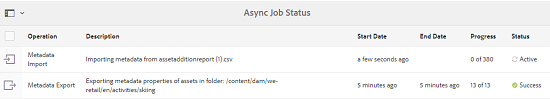

# Operaciones asincrónicas {#asynchronous-operations}

Para reducir el impacto negativo en el rendimiento, Adobe Experience Manager procesa de manera asincrónica determinadas operaciones de larga duración y que requieren gran cantidad de recursos. El procesamiento asincrónico implica poner en cola varios trabajos y ejecutarlos en serie, según la disponibilidad de los recursos del sistema.

Estas operaciones incluyen:

* Eliminar muchos recursos
* Desplazar muchos recursos o recursos con muchas referencias
* Exportar e importar metadatos de recursos de manera masiva
* Recuperar recursos que estén por encima del umbral establecido, desde una implementación remota de Experience Manager
* Desplegar Live Copies

Puede ver el estado de los trabajos asincrónicos desde el **[!UICONTROL Estado de trabajo asíncrono]** panel en **Navegación global** > **Herramientas** > **Operaciones** > **Trabajos**.

>[!NOTE]
>
>De manera predeterminada, los trabajos asincrónicos se ejecutan en paralelo. De manera predeterminada, si *`n`* es el número de núcleos de CPU, se pueden ejecutar en paralelo *`n/2`*. Para utilizar la configuración personalizada para la cola de trabajos, modifique la **[!UICONTROL Configuración predeterminada de cola de operaciones asincrónicas]** y la **Configuración de movimiento y despliegue de la página de operaciones asincrónicas** desde la consola web.
>
>Para obtener más información, consulte [configuraciones de cola](https://sling.apache.org/documentation/bundles/apache-sling-eventing-and-job-handling.html#queue-configurations).

## Supervisar el estado de las operaciones asincrónicas {#monitor-the-status-of-asynchronous-operations}

Siempre que AEM procese una operación de manera asincrónica, recibirá una notificación en la [bandeja de entrada](/help/sites-authoring/inbox.md) y por correo electrónico (si está activada).

Para ver en detalle el estado de las operaciones asincrónicas, vaya a la página **[!UICONTROL Estado del trabajo asincrónico]**.

1. En la interfaz de Experience Manager, haga clic en **[!UICONTROL Operaciones]** > **[!UICONTROL Trabajos]**.

1. En la página **[!UICONTROL Estado del trabajo asincrónico]**, revise los detalles de las operaciones.

   

   Para determinar el progreso de una operación en particular, consulte el valor en la columna **[!UICONTROL Estado]**. Según el progreso, se muestra uno de los siguientes estados:

   * **[!UICONTROL Activo]**: Se está procesando la operación

   * **[!UICONTROL Correcto]**: Se completó la operación

   * **[!UICONTROL Fallo]** o **[!UICONTROL Error]**: No se pudo procesar la operación

   * **[!UICONTROL Programado]**: La operación está programada para procesarse más tarde

1. Para detener una operación activa, selecciónela en la lista y haga clic en **[!UICONTROL Detener]** en la barra de herramientas.

   

1. Para ver detalles adicionales, como descripción y registros, seleccione la operación y haga clic en **[!UICONTROL Abrir]** en la barra de herramientas.

   

   Se muestra la página de los detalles del trabajo.

   

1. Para eliminar la operación de la lista, seleccione **[!UICONTROL Eliminar]** en la barra de herramientas. Para descargar los detalles en un archivo CSV, haga clic en **[!UICONTROL Descargar]**.

   >[!NOTE]
   >
   >No puede eliminar un trabajo si su estado es **Activo** o **En cola**.

## Purgar trabajos completados {#purging-completed-jobs}

AEM ejecuta un trabajo de depuración todos los días a la 01:00 para eliminar los trabajos asincrónicos completados que tengan más de un día de antigüedad.

Puede modificar la programación del trabajo de depuración y la duración por la cual se conservan los detalles de los trabajos completados antes de que se eliminen. También puede configurar el número máximo de trabajos completados para los que se conservan los detalles en cualquier momento.

1. En Navegación global, haga clic en **[!UICONTROL Herramientas]** > **[!UICONTROL Operaciones]** > **[!UICONTROL Consola web]**.
1. Abra el trabajo **[!UICONTROL Trabajo programado de depuración de trabajos asincrónicos de Adobe Granite]**.
1. Especifique:
   * El umbral de cantidad de días después de los cuales se eliminan los trabajos completados.
   * Número máximo de trabajos para los que se conservan detalles en el historial.
   * La expresión CRON para cuándo se debe ejecutar la depuración.

   

1. Guarde los cambios.

## Configuración del procesamiento asincrónico {#configuring-asynchronous-processing}

AEM Puede configurar el número de umbral de recursos, páginas o referencias para que los recursos se procesen de forma asíncrona para procesar una operación en particular y conmutar las notificaciones por correo electrónico cuando se procesen los trabajos.

### Configurar operaciones asincrónicas de eliminación de recursos {#configuring-synchronous-delete-operations}

Si el número de recursos o carpetas que se van a eliminar supera el número de umbral, la operación de eliminación se realiza de manera asincrónica.

1. En Navegación global, haga clic en **[!UICONTROL Herramientas]** > **[!UICONTROL Operaciones]** > **[!UICONTROL Consola web]**.
1. En la consola web, abra la  **[!UICONTROL Configuración de cola predeterminada del proceso asincrónico.]**
1. En el cuadro **[!UICONTROL Umbral de número de recursos]**, especifique el número de umbral de recursos o carpetas para el procesamiento asincrónico de las operaciones de eliminación.

   

1. Marque la opción **Habilitar notificación por correo electrónico** para recibir notificaciones por correo electrónico para este estado del trabajo. por ejemplo, success, failed.
1. Guarde los cambios.

### Configurar operaciones asincrónicas de movimiento de recursos {#configuring-asynchronous-move-operations}

Si el número de recursos, carpetas o referencias que se van a mover supera el número de umbral, la operación de movimiento se realiza de manera asincrónica.

1. En Navegación global, haga clic en **[!UICONTROL Herramientas]** > **[!UICONTROL Operaciones]** > **[!UICONTROL Consola web]**.
1. En la consola web, abra la **[!UICONTROL Configuración de procesamiento asincrónico de trabajos de operación de movimiento.]**
1. En el cuadro **[!UICONTROL Número de umbral de recursos/referencias]**, especifique el número de umbral de recursos, carpetas o referencias para el procesamiento asincrónico de operaciones de movimiento.

   

1. Marque la opción **Habilitar notificación por correo electrónico** para recibir notificaciones por correo electrónico para este estado del trabajo. por ejemplo, success, failed.
1. Guarde los cambios.

### Configurar operaciones asincrónicas de MSM {#configuring-asynchronous-msm-operations}

1. En Navegación global, haga clic en **[!UICONTROL Herramientas]** > **[!UICONTROL Operaciones]** > **[!UICONTROL Consola web]**.
1. En la consola web, abra la **[!UICONTROL Configuración de procesamiento asincrónico de trabajo de operación de movimiento de página.]**
1. Marque la opción **Habilitar notificación por correo electrónico** para recibir notificaciones por correo electrónico para este estado del trabajo. por ejemplo, success, failed.

   

1. Guarde los cambios.

>[!MORELIKETHIS]
>
>* [Crear y organizar páginas](/help/sites-authoring/managing-pages.md)
>* [Creación y sincronización de Live Copies](/help/sites-administering/msm-livecopy.md)
>* [Configuración del correo electrónico en el Experience Manager](/help/sites-administering/notification.md).
>* [Importar metadatos de recursos](/help/assets/metadata.md#import-metadata).
>* [Exportar metadatos de recursos](/help/assets/metadata.md#export-metadata).
>* [Utilice Recursos conectados para compartir recursos DAM desde implementaciones remotas](/help/assets/use-assets-across-connected-assets-instances.md).
