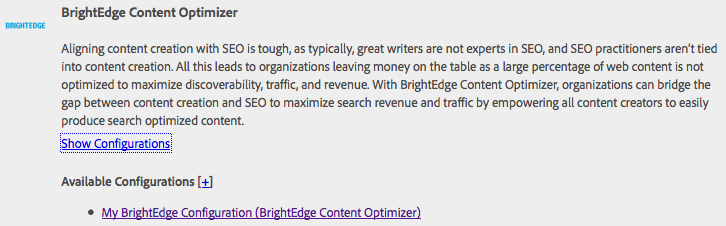

# Integración con el Optimizador de contenido de BrightEdge{#integrating-with-brightedge-content-optimizer}

AEM Cree una configuración de nube de BrightEdge para que se pueda conectar con las credenciales de su cuenta de BrightEdge. Puede crear varias configuraciones si utiliza varias cuentas.

Cuando cree la configuración, especifique un título. El título debe ser descriptivo para que los usuarios puedan correlacionar la configuración con la cuenta de BrightEdge. Cuando un autor de páginas o administrador asocia una página web con la cuenta de BrightEdge, este título se presenta en una lista desplegable.

1. En el carril, haga clic en Herramientas > Operaciones > Cloud > Cloud Service.
1. Haga clic en el vínculo que aparece en la sección Optimizador de contenido de BrightEdge. El texto del vínculo depende de si se ha creado una configuración de BrightEdge:

   * Configurar ahora: este vínculo aparece cuando no se ha creado ninguna configuración.
   * Mostrar configuraciones: este vínculo aparece cuando se han creado una o más configuraciones.

   

1. Si ha hecho clic en Mostrar configuraciones, haga clic en el vínculo + situado junto a Configuraciones disponibles.
1. Escriba un título para la configuración. De forma opcional, escriba un nombre para el nodo que se utiliza para almacenar la configuración en el repositorio. Haga clic en Crear.
1. En el cuadro de diálogo Configuración del Optimizador de contenido de BrightEdge, escriba el nombre de usuario y la contraseña de la cuenta de BrightEdge y, a continuación, haga clic en Aceptar.

## Edición de una configuración de BrightEdge {#editing-a-brightedge-configuration}

Modifique el nombre de usuario y la contraseña de una configuración de BrightEdge cuando sea necesario. Las modificaciones afectan a todas las páginas que utilizan la configuración.

1. En el carril, haga clic en Herramientas > Operaciones > Cloud > Cloud Service.
1. En la sección Optimizador de contenido de BrightEdge, haga clic en Mostrar configuraciones.

   

1. Haga clic en el nombre de la configuración que desee editar.
1. Haga clic en Editar, modifique los valores de las propiedades y, a continuación, haga clic en Aceptar.

## Asociación de páginas con una configuración de BrightEdge {#associating-pages-with-a-brightedge-configuration}

Asocie páginas con una configuración de BrightEdge para enviar datos de página al servicio BrightEdge para su análisis. Cuando asocia una página con una configuración, las páginas secundarias heredan la asociación. Normalmente, asocia la página principal del sitio para que los datos de todas las páginas se envíen a BrightEdge.

1. Abra la consola Sitios web clásica. ([http://localhost:4502/siteadmin#/content](http://localhost:4502/siteadmin#/content))
1. En el árbol Sitios web, seleccione la carpeta o página que contiene la página que desea asociar con la configuración de BrightEdge.
1. En la lista de páginas, haga clic con el botón derecho en la página para configurarla y haga clic en Properties.
1. En la pestaña Cloud Service, haga clic en el botón Agregar servicio y, en el cuadro de diálogo Cloud Service, seleccione Optimizador de contenido de BrightEdge y, a continuación, haga clic en Aceptar.
1. En la lista Optimizador de contenido de BrightEdge, seleccione la configuración de BrightEdge que desea asociar con la página y, a continuación, haga clic en Aceptar.

   

## Activación de una configuración de BrightEdge {#activating-a-brightedge-configuration}

Active una configuración de BrightEdge para replicarla en la instancia de publicación y permitir que las páginas publicadas interactúen con el servicio BrightEdge.

1. En el carril, haga clic en Sitios y, a continuación, busque y seleccione la página que asoció con la configuración de BrightEdge.
1. Haga clic en el icono Publicar y, a continuación, en Publicar.

   

1. En la lista de configuraciones que aparecen, asegúrese de que la configuración de BrightEdge esté seleccionada y, a continuación, haga clic en Publicar.

   
