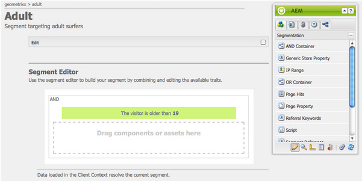

# Configuración de la segmentación {#configuring-segmentation}

>[!NOTE]
>
>Este documento cubre la configuración de la segmentación como se usa con Client Context. Para configurar segmentos con ContextHub mediante la IU táctil, consulte [Configuración de la segmentación con ContextHub](/help/sites-administering/segmentation.md).

La segmentación es una consideración clave al crear una campaña. Consulte [Glosario de segmentación](/help/sites-authoring/segmentation-overview.md) para obtener información sobre cómo funciona la segmentación y términos clave.

En función de la información que ya haya recopilado acerca de los visitantes del sitio y los objetivos que quiera lograr, deberá definir los segmentos y las estrategias necesarios para el contenido de destino.

Estos segmentos se utilizan para proporcionar a un visitante contenido dirigido específicamente. Este contenido se mantiene en la variable [Campañas](/help/sites-classic-ui-authoring/classic-personalization-campaigns.md) del sitio web. Las páginas de teaser definidas aquí se pueden incluir como párrafos de teaser en cualquier página y definir para qué segmento del visitante se aplica el contenido especializado.

AEM le permite crear y actualizar fácilmente segmentos, teasers y campañas. También le permite verificar los resultados de sus definiciones.

La variable **Editor de segmentos** le permite definir fácilmente un segmento:

Puede **Editar** cada segmento para especificar un **Título**, **Descripción** y **Aumento** factor. Con la barra de tareas, puede agregar **Y** y **O** contenedores para definir la variable **Lógica de segmento** y, a continuación, añada el **Características del segmento** para definir los criterios de selección.

## Factor de ampliación {#boost-factor}

Cada segmento tiene un **Aumento** parámetro que se utiliza como factor de ponderación; un número mayor indica que el segmento se seleccionará con preferencia sobre un segmento con un número menor.

* Valor mínimo: `0`
* Valor máximo: `1000000`

## Lógica de segmento {#segment-logic}

Los siguientes contenedores de lógica están disponibles de forma predeterminada y le permiten construir la lógica de su selección de segmentos. Se pueden arrastrar desde la barra de tareas al editor:

<table>
 <tbody>
  <tr>
   <td> Contenedor Y  </td>
   <td> El operador boolean AND.  </td>
  </tr>
  <tr>
   <td> Contenedor O  </td>
   <td> El operador boolean OR.</td>
  </tr>
 </tbody>
</table>

## Características del segmento {#segment-traits}

Las siguientes características de segmento están disponibles de forma predeterminada: se pueden arrastrar desde la barra de tareas al editor:

<table>
 <tbody>
  <tr>
   <td> Rango de IP  </td>
   <td>Define un rango de direcciones IP que el visitante puede tener.  </td>
  </tr>
  <tr>
   <td> Visitas de la página  </td>
   <td>La frecuencia con la que se ha solicitado la página.   </td>
  </tr>
  <tr>
   <td> Propiedad de página  </td>
   <td>Cualquier propiedad de la página visitada.  </td>
  </tr>
  <tr>
   <td> Palabras clave de referencia  </td>
   <td>Palabras clave que coinciden con la información del sitio web de referencia.   </td>
  </tr>
  <tr>
   <td> Script</td>
   <td>Expresión de JavaScript que se va a evaluar.  </td>
  </tr>
  <tr>
   <td> Referencia del segmento   </td>
   <td>Referencia a otra definición de segmento.  </td>
  </tr>
  <tr>
   <td> Nube de etiquetas  </td>
   <td>Etiquetas que se compararán con las de las páginas visitadas.  </td>
  </tr>
  <tr>
   <td> Edad del usuario  </td>
   <td>Tomado del perfil de usuario.  </td>
  </tr>
  <tr>
   <td> Propiedad de usuario  </td>
   <td>Cualquier otra información disponible en el perfil del usuario. </td>
  </tr>
 </tbody>
</table>

Puede combinar estos rasgos con los operadores booleanos OR y AND (consulte [Creación de un nuevo segmento](#creating-a-new-segment)) para definir el escenario exacto para seleccionar este segmento.

Cuando toda la instrucción se evalúa como verdadera, este segmento se ha resuelto. En caso de que se apliquen varios segmentos, el factor **[Aumento](/help/sites-administering/campaign-segmentation.md#boost-factor)** también se utiliza.

>[!CAUTION]
>
>El editor de segmentos no comprueba la existencia de referencias circulares. Por ejemplo, el segmento A hace referencia a otro segmento B, que a su vez hace referencia al A. Debe asegurarse de que los segmentos no contengan ninguna referencia circular.

>[!NOTE]
>
>Propiedades con la variable **_i18n** Los sufijos se establecen mediante un script que forma parte de la clientlib de la interfaz de usuario de la personalización. Todos los clientlibs relacionados con la interfaz de usuario se cargan en Author solo porque la interfaz de usuario no es necesaria en la publicación.
>
>Por lo tanto, al crear un segmento con estas propiedades, normalmente es necesario confiar en **browserFamily** por ejemplo, en lugar de **browserFamily_i18n**.

### Creación de un nuevo segmento {#creating-a-new-segment}

Para definir el nuevo segmento:

1. En el carril , elija **Herramientas > Operaciones > Configuración**.
1. Haga clic en el **Segmentación** en el panel izquierdo y vaya a la ubicación requerida.
1. Cree un [nueva página](/help/sites-authoring/editing-content.md#creatinganewpage) usando la variable **Segmento** plantilla.
1. Abra la nueva página para ver el editor de segmentos:

   

1. Utilice la barra de tareas o el menú contextual (normalmente, haga clic con el botón derecho del ratón y, a continuación, seleccione **Nuevo...** para abrir la ventana Insertar nuevo componente ) y encontrar el rasgo de segmento que necesita. A continuación, arrástrela al **Editor de segmentos** aparecerá en el valor predeterminado **Y** contenedor.
1. Haga doble clic en el nuevo rasgo para editar los parámetros específicos; por ejemplo, la posición del ratón:

   

1. Haga clic en **OK** para guardar la definición:
1. Puede **Editar** la definición del segmento para darle una **Título**, **Descripción** y **[Aumento](#boost-factor)** factor:

   

1. Agregue más características si es necesario. Puede formular expresiones booleanas utilizando la variable **Contenedor AND** y **Contenedor O** componentes encontrados en **Lógica de segmento**. Con el editor de segmentos puede eliminar características o contenedores que ya no se necesitan, o arrastrarlos a nuevas posiciones dentro de la instrucción.

### Uso de contenedores AND y OR {#using-and-and-or-containers}

Puede construir segmentos complejos en AEM. Es importante tener en cuenta algunos puntos básicos:

* El nivel superior de la definición es siempre el contenedor AND que se crea inicialmente; esto no se puede cambiar, pero no afecta al resto de la definición del segmento.
* Asegúrese de que tenga sentido anidar el contenedor. Los contenedores pueden verse como los corchetes de su expresión boolean.

El ejemplo siguiente se utiliza para seleccionar visitantes que:

Hombre y entre los 16 y 65 años

O

Mujeres y entre los 16 y los 62 años

Como el operador principal es O necesita comenzar con un **Contenedor O**. Dentro de esto tiene 2 instrucciones AND, para cada una de ellas se necesita un **Contenedor AND**, a la que se pueden añadir los rasgos individuales.

## Prueba de la aplicación de un segmento {#testing-the-application-of-a-segment}

Una vez definido el segmento, se pueden probar los resultados potenciales con la ayuda de la variable **[ClientContext](/help/sites-administering/client-context.md)**:

1. Seleccione el segmento que desea probar.
1. Press **[Ctrl-Alt-C](/help/sites-authoring/page-authoring.md#keyboardshortcuts)** para abrir el **[ClientContext](/help/sites-administering/client-context.md)**, que muestra los datos que se han recopilado. Para fines de prueba, puede **Editar** determinados valores, o **Cargar** otro perfil para ver el impacto allí.

1. Dependiendo de los rasgos definidos, los datos disponibles para la página actual pueden o no coincidir con la definición del segmento. El estado de la coincidencia se muestra debajo de la definición.

Por ejemplo, una definición de segmento simple puede basarse en la edad y el sexo del usuario. La carga de un perfil específico muestra que el segmento se ha resuelto correctamente:

O no:

>[!NOTE]
>
>Todos los rasgos se resuelven inmediatamente, aunque la mayoría solo cambia al volver a cargar la página. Los cambios en la posición del ratón son visibles inmediatamente, por lo que son útiles para realizar pruebas.

Estas pruebas también se pueden realizar en páginas de contenido y en combinación con **Teaser** componentes.

Si pasa el ratón por encima de un párrafo de teaser, se mostrarán los segmentos aplicados, tanto si se resuelven actualmente como por qué se ha seleccionado la instancia de teaser actual:

### Uso del segmento {#using-your-segment}

Los segmentos se utilizan actualmente en [Campañas](/help/sites-classic-ui-authoring/classic-personalization-campaigns.md). Se utilizan para dirigir el contenido real que ven las audiencias objetivo específicas. Consulte [Explicación de los segmentos](/help/sites-authoring/segmentation-overview.md) para obtener más información.
