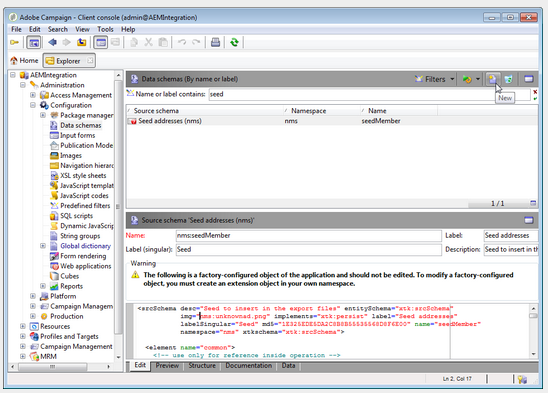
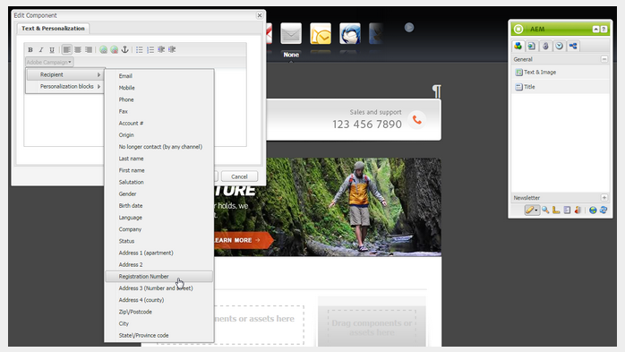

# Integración con Adobe Campaign Classic{#integrating-with-adobe-campaign-classic}

>[!NOTE]
>
>En esta documentación se describe cómo integrar AEM con Adobe Campaign Classic, la solución local. Si utiliza Adobe Campaign Standard, consulte [Integración con Adobe Campaign Standard](/help/sites-administering/campaignstandard.md) para obtener estas instrucciones.

Adobe Campaign permite administrar el contenido y los formularios de entrega por correo electrónico directamente en Adobe Experience Manager.

Para utilizar ambas soluciones al mismo tiempo, primero debe configurarlas para conectarse entre sí. Esto implica pasos de configuración tanto en Adobe Campaign como en Adobe Experience Manager. Estos pasos se describen en detalle en este documento.

El trabajo con Adobe Campaign en AEM incluye la posibilidad de enviar correo electrónico a través de Adobe Campaign y se describe en [Uso de Adobe Campaign](/help/sites-authoring/campaign.md). También incluye el uso de formularios en páginas de AEM para manipular datos.

Además, los siguientes temas pueden ser de interés al integrar AEM con [Adobe Campaign](https://helpx.adobe.com/support/campaign/classic.html):

* [Prácticas recomendadas para plantillas de correo electrónico](/help/sites-administering/best-practices-for-email-templates.md)
* [Solución de problemas de la integración de Adobe Campaign](/help/sites-administering/troubleshooting-campaignintegration.md)

Si está ampliando su integración con Adobe Campaign, es posible que desee ver las páginas siguientes:

* [Creación de extensiones personalizadas](/help/sites-developing/extending-campaign-extensions.md)
* [Creación de asignaciones de formularios personalizados](/help/sites-developing/extending-campaign-form-mapping.md)

## Flujo de trabajo de integración de AEM y Adobe Campaign {#aem-and-adobe-campaign-integration-workflow}

En esta sección se describe un flujo de trabajo típico entre AEM y Adobe Campaign al crear campañas y distribuir contenido.

El flujo de trabajo típico incluye lo siguiente y se describe en detalle:

1. Empiece a crear la campaña (tanto en Adobe Campaign como en AEM).
1. Antes de vincular el contenido y la entrega, personalice el contenido en AEM y cree una entrega en Adobe Campaign.
1. Vincular contenido y entrega en Adobe Campaign.

### Comenzar a crear la campaña {#start-building-your-campaign}

Empiece a crear una campaña en cualquier momento. Antes de vincular el contenido, AEM y AC son independientes. Esto significa que los especialistas en marketing pueden empezar a crear sus campañas y objetivos en Adobe Campaign, mientras que los creadores de contenido están trabajando en el diseño en AEM.

### Antes de vincular contenido y envío {#before-linking-content-and-delivery}

Antes de vincular el contenido y crear un mecanismo de entrega, debe hacer lo siguiente:

**En AEM**

* Personalización mediante los campos de personalización del componente **Texto y personalización**

**En Adobe Campaign**

* Crear una entrega de tipo **aemContent**

### Vinculación de contenido y configuración de la entrega {#linking-content-and-setting-delivery}

Después de preparar el contenido para la vinculación y la entrega, determina exactamente cómo y dónde se debe vincular el contenido.

Todos estos pasos se completan en Adobe Campaign.

1. Especifique la instancia de AEM que se va a usar.
1. Para sincronizar el contenido, haga clic en el botón Sincronizar.
1. Abra el selector de contenido para elegir el contenido.

### Si es nuevo en AEM {#if-you-are-new-to-aem}

Si es nuevo en AEM, puede que le resulten útiles los siguientes vínculos para comprender AEM:

* [Inicio de AEM](/help/sites-deploying/deploy.md)
* [Explicación de los agentes de replicación](/help/sites-deploying/replication.md)
* [Búsqueda y trabajo con archivos de registro](/help/sites-deploying/monitoring-and-maintaining.md#working-with-audit-records-and-log-files)
* [Introducción a la plataforma AEM](/help/sites-deploying/platform.md)

## Configuración de Adobe Campaign {#configuring-adobe-campaign}

La configuración de Adobe Campaign implica lo siguiente:

1. Instalación del paquete de integración de AEM en Adobe Campaign.
1. Configuración de una cuenta externa.
1. Comprobando que AEMResourceTypeFilter está configurado correctamente.

Además, hay configuraciones avanzadas que puede realizar, entre las que se incluyen:

* Administración de bloques de contenido
* Gestión de campos de personalización

Consulte Configuraciones [avanzadas](#advanced-configurations).

>[!NOTE]
>
>Para realizar estas operaciones, debe tener la función de **administración** en Adobe Campaign.

### Requisitos previos {#prerequisites}

Asegúrese de que tiene los siguientes elementos de antemano:

* [Una instancia de creación de AEM](/help/sites-deploying/deploy.md#getting-started)
* [Una instancia de publicación de AEM](/help/sites-deploying/deploy.md#author-and-publish-installs)
* [Una instancia](https://helpx.adobe.com/support/campaign/classic.html) de Adobe Campaign Classic, que incluye un cliente y un servidor
* Internet Explorer 11

>[!NOTE]
>
>Si está ejecutando una versión anterior a la versión 8640 de Adobe Campaign Classic, consulte la documentación [de](https://docs.campaign.adobe.com/doc/AC6.1/en/PRO_Updating_Adobe_Campaign_Upgrading.html) actualización para obtener más información. Tenga en cuenta que tanto el cliente como la base de datos deben actualizarse a la misma compilación.

>[!CAUTION]
>
>Las operaciones detalladas en las secciones [Configuración de Adobe Campaign](#configuring-adobe-campaign) y [Configuración de Adobe Experience Manager](#configuring-adobe-experience-manager) son necesarias para que las funcionalidades de integración entre AEM y Adobe Campaign funcionen correctamente.

### Instalación del paquete de integración de AEM {#installing-the-aem-integration-package}

Debe instalar el paquete de integración **de** AEM en Adobe Campaign. Para ello:

1. Vaya a la instancia de Adobe Campaign que desee vincular con AEM.
1. *Seleccione* Herramientas *>* Avanzadas *>* Importar paquete... .

   

1. Haga clic en **Instalar un paquete** estándar y, a continuación, seleccione el paquete de integración **de** AEM.

   

1. Haga clic en **Siguiente** y, a continuación, en **Iniciar**.

   Este paquete contiene el operador **aemserver** que se utilizará para conectar el servidor AEM a Adobe Campaign.

   >[!CAUTION]
   >
   >De forma predeterminada, no hay ninguna zona de seguridad configurada para este operador. Para conectarse a Adobe Campaign mediante AEM, debe seleccionar una.
   >
   >En el archivo **serverConf.xml** , el atributo **allowUserPassword** de la zona de seguridad seleccionada debe establecerse en **true** para autorizar a AEM a conectar Adobe Campaign mediante inicio de sesión o contraseña.
   >
   >Recomendamos encarecidamente crear una zona de seguridad dedicada a AEM para evitar problemas de seguridad. Para obtener más información sobre esto, consulte la guía [Instalación](https://docs.campaign.adobe.com/doc/AC/en/INS_Additional_configurations_Configuring_Campaign_server.html).

   

### Configuración de una cuenta externa de AEM {#configuring-an-aem-external-account}

Debe configurar una cuenta externa que le permita conectar Adobe Campaign con su instancia de AEM.

>[!NOTE]
>
>* Al instalar el paquete de integración **de** AEM, se crea una cuenta de AEM externa. Puede configurar la conexión a su instancia de AEM desde ella o crear una nueva.
>* En AEM, asegúrese de establecer la contraseña para el usuario remoto de la campaña. Debe establecer esta contraseña para conectar Adobe Campaign con AEM. Inicie sesión como administrador y, en la consola de administración de usuarios, busque el usuario remoto de la campaña y haga clic en **Establecer contraseña**.
>


Para configurar una cuenta externa de AEM:

1. Vaya al nodo **Administración** > **Plataforma** > Cuentas **** externas.
1. Cree una nueva cuenta externa y seleccione el tipo de **AEM** .
1. Introduzca los parámetros de acceso para la instancia de creación de AEM: la dirección del servidor, así como el ID y la contraseña utilizados para conectarse a esta instancia. La contraseña de la cuenta de usuario de campaign-api es la misma que la del usuario remoto de campaña para el que se ha establecido una contraseña en AEM.

   >[!NOTE]
   >
   >Asegúrese de que la dirección del servidor **no termina** en una barra diagonal final. Por ejemplo, introduzca `https://yourserver:4502` en lugar de `https://yourserver:4502/`

    

1. Asegúrese de que la casilla de verificación **Habilitado** está seleccionada.

### Verificación de la opción AEMResourceTypeFilter {#verifying-the-aemresourcetypefilter-option}

La opción **AEMResourceTypeFilter** se utiliza para filtrar los tipos de recursos de AEM que se pueden usar en Adobe Campaign. Esto permite que Adobe Campaign recupere contenido de AEM diseñado específicamente para utilizarse solo en Adobe Campaign.

Esta opción debe estar preconfigurada; sin embargo, si cambia esta opción, puede provocar que la integración no funcione.

Para verificar que la opción **AEMResourceTypeFilter** está configurada:

1. Vaya a **Plataforma** >**Opciones**.
1. En la opción **AEMResourceTypeFilter** , compruebe que las rutas son correctas. Este campo debe contener el valor:

   **mcm/campaign/components/newsletter,mcm/campaign/components/campaign_newsletterpage,mcm/neolane/components/newsletter**

   O, en algunos casos, el valor es el siguiente:

   **mcm/campaign/components/newsletter**

   

## Configuring Adobe Experience Manager {#configuring-adobe-experience-manager}

Para configurar AEM, debe hacer lo siguiente:

* Configure la replicación entre instancias.
* Conecte AEM a Adobe Campaign a través de Cloud Services.
* Configure el externalizador.

### Configuración de la replicación entre instancias de AEM {#configuring-replication-between-aem-instances}

El contenido creado a partir de la instancia de creación de AEM se envía primero a la instancia de publicación. Debe publicar para que las imágenes de la newsletter estén disponibles en la instancia de publicación y para los destinatarios de la newsletter. Por lo tanto, el agente de replicación debe configurarse para replicarse desde la instancia de creación de AEM a la instancia de publicación de AEM.

>[!NOTE]
>
>Si no desea utilizar la URL de replicación, sino la URL pública, puede establecer la URL **** pública en la siguiente configuración en OSGi (logotipo **de** AEM > icono **Herramientas** > **Operaciones** > Consola **** web > Configuración de OSGi > Integración de configuración de AEM> Integración de configuración **** **** de AEM):
**** Dirección URL pública: com.day.cq.mcm.campaign.impl.IntegrationConfigImpl#aem.mcm.campaign.publicUrl

Este paso también es necesario para replicar determinadas configuraciones de instancias de creación en la instancia de publicación.

Para configurar la replicación entre instancias de AEM:

1. En la instancia de creación, seleccione **AEM logo**> **Herramientas** > **Implementación** > **Replicación** > **Agentes en el autor****** y, a continuación, haga clic en Agente predeterminado.

   

   >[!NOTE]
   Evite utilizar localhost (es decir, una copia local de AEM) al configurar su integración con Adobe Campaign, a menos que la instancia de publicación y de autor se encuentre en el mismo equipo.

1. Toque o haga clic en **Editar** y, a continuación, seleccione la ficha **Transporte** .
1. Configure el URI reemplazando **localhost** por la dirección IP o la dirección de la instancia de publicación de AEM.

   

### Conexión de AEM a Adobe Campaign {#connecting-aem-to-adobe-campaign}

Antes de poder utilizar AEM y Adobe Campaign juntos, debe establecer el vínculo entre ambas soluciones para que puedan comunicarse.

1. Conéctese a la instancia de creación de AEM.
1. Seleccione el logotipo **de** AEM > icono **Herramientas** > **Implementación** > **Cloud Services** y, a continuación, **Configurar ahora** en la sección Adobe Campaign.

   

1. Cree una nueva configuración introduciendo un **Título** y haga clic en **Crear**, o elija la configuración existente que desee vincular con la instancia de Adobe Campaign.
1. Edite la configuración para que coincida con los parámetros de la instancia de Adobe Campaign.

   * **Nombre de usuario**: **aemserver**, el operador de paquete de integración AEM de Adobe Campaign que se utiliza para establecer el vínculo entre las dos soluciones.
   * **Contraseña**: Contraseña del operador aemserver de Adobe Campaign. Es posible que tenga que volver a especificar la contraseña para este operador directamente en Adobe Campaign.
   * **Punto** final de API: URL de instancia de Adobe Campaign.

1. Seleccione **Conectar a Adobe Campaign** y haga clic en **Aceptar**.

   

   >[!NOTE]
   Después de [crear el correo electrónico y publicarlo](/help/sites-authoring/campaign.md), debe volver a publicar la configuración en la instancia de publicación.

   

>[!NOTE]
Si la conexión falla, asegúrese de comprobar lo siguiente:
* Puede encontrar un problema de certificado al usar una conexión segura con una instancia de Adobe Campaign (https). Deberá agregar el certificado de instancia de Adobe Campaign al archivo **cacerts** del JDK de su instancia de AEM.
* Se debe configurar una zona de seguridad para el operador [aemserver](#connecting-aem-to-adobe-campaign) en Adobe Campaign. Además, en el archivo **serverConf.xml** , el atributo **allowUserPassword** de la zona de seguridad debe establecerse en **true** para autorizar la conexión de AEM a Adobe Campaign mediante el modo de inicio de sesión o contraseña.

Además, consulte [Solución de problemas de la integración](/help/sites-administering/troubleshooting-campaignintegration.md)de AEM/Adobe Campaign.

### Configuración del externalizador {#configuring-the-externalizer}

Debe [configurar el externalizador](/help/sites-developing/externalizer.md) en AEM en la instancia de creación. Externalizador es un servicio OSGi que permite transformar una ruta de recursos en una dirección URL externa y absoluta. Este servicio proporciona un lugar central para configurar esas direcciones URL externas y generarlas.

Consulte [Configurar el externalizador](/help/sites-developing/externalizer.md) para obtener instrucciones generales. Para la integración de Adobe Campaign, asegúrese de configurar el servidor de publicación `https://<host>:<port>/system/console/configMgr/com.day.cq.commons.impl.ExternalizerImpl`no en un punto `localhost:4503` sino en un servidor al que se pueda acceder desde la consola de Adobe Campaign.

Si señala a `localhost:4503` otro servidor al que Adobe Campaign no puede acceder, las imágenes no aparecerán en la consola de Adobe Campaign.


## Configuraciones avanzadas {#advanced-configurations}

También puede realizar algunas configuraciones avanzadas, a saber:

* Administre campos y bloques de personalización.
* Desactivar un bloque de personalización.
* Administre los datos de extensión de destino.

### Administración de campos y bloques de personalización {#managing-personalization-fields-and-blocks}

Adobe Campaign administra los campos y los bloques disponibles para añadir personalización al contenido de su correo electrónico en AEM.

Se proporciona una lista predeterminada, pero se puede modificar. También puede agregar u ocultar campos y bloques de personalización.

#### Adición de un campo de personalización {#adding-a-personalization-field}

Para agregar un nuevo campo de personalización a los que ya están disponibles, tiene que ampliar el esquema **nms:foundationMember** de Adobe Campaign de la siguiente manera:

>[!CAUTION]
El campo que debe agregar ya debe haberse agregado mediante una extensión de esquema de destinatario (**nms:destinatario**). Para obtener más información, consulte la guía [Configuración](https://docs.campaign.adobe.com/doc/AC6.1/en/CFG_Editing_schemas_Editing_schemas.html) .

1. Vaya al nodo **Administración** > **Configuración** > Esquemas **de datos** en la navegación de Adobe Campaign.
1. Seleccione **Nuevo**.

   

1. En la ventana emergente, seleccione **Extender los datos de la tabla utilizando un esquema** de extensión y haga clic en **Siguiente**.

   

1. Introduzca los diferentes parámetros del esquema ampliado:

   * **Esquema**: seleccione el esquema **nms:inicializaciónMember** . Los demás campos de la ventana se completan automáticamente.
   * **Espacio** de nombres: personalice el espacio de nombres del esquema ampliado.

1. Edite el código XML del esquema para especificar el campo que desea agregar allí. Para obtener más información sobre la ampliación de esquemas en Adobe Campaign, consulte la guía [Configuración](https://docs.campaign.adobe.com/doc/AC6.1/en/CFG_Editing_schemas_Extending_a_schema.html).
1. Guarde el esquema y, a continuación, actualice la estructura de la base de datos de Adobe Campaign mediante el menú **Herramientas** > **Avanzadas** > **Actualizar estructura** de base de datos en la consola.
1. Desconecte y vuelva a conectarse a la consola de Adobe Campaign para guardar los cambios. El nuevo campo aparece ahora en la lista de campos de personalización disponibles en AEM.

#### Ejemplo {#example}

Para agregar un campo Número **de** registro, debe tener los siguientes elementos:

* La extensión de esquema **nms:Recipient** denominada **cus:Recipient** contiene:

```xml
<element desc="Recipient table (profiles)" img="nms:recipient.png" label="Recipients" labelSingular="Recipient" name="recipient">

  <attribute dataPolicy="smartCase" desc="Recipient registration number"
  label="Registration Number"
  length="50" name="registrationNumber" type="string"/>

</element>
```

La extensión de esquema **nms:semillaMember** denominada **cus:semillaMember** contiene:

```xml
<element desc="Seed to insert in the export files" img="nms:unknownad.png" label="Seed addresses" labelSingular="Seed" name="seedMember">

  <element name="custom_nms_recipient">
    <attribute name="registrationNumber"
    template="cus:recipient:recipient/@registrationNumber"/>
  </element>

</element>
```

El campo Número **de** registro ahora forma parte de los campos de personalización disponibles:



#### Ocultar un campo de personalización {#hiding-a-personalization-field}

Para ocultar un campo de personalización entre los que ya están disponibles, debe ampliar el esquema **nms:foundationMember** de Adobe Campaign tal como se detalla en la sección [Adición de un campo](#adding-a-personalization-field) de personalización. Siga estos pasos:

1. Copie el campo que desea tomar del esquema **nms:semillaMember** en el esquema extendido (por ejemplo,**cus:semillaMember** ).
1. Agregue el atributo XML **advanced=&quot;true&quot;** al campo. Ya no aparece en la lista de campos de personalización disponibles en AEM.

   Por ejemplo, para ocultar el campo Nombre **** medio, el esquema **cud:semillaMember** debe contener el siguiente elemento:

   ```xml
   <element desc="Seed to insert in the export files" img="nms:unknownad.png" label="Seed addresses" labelSingular="Seed" name="seedMember">
   
     <element name="custom_nms_recipient">
       <attribute advanced="true" name="middleName"/>
     </element>
   
   </element>
   ```

### Desactivación de un bloque de personalización {#deactivating-a-personalization-block}

Para desactivar un bloque de personalización entre los disponibles:

1. Vaya al nodo **Recursos** > Administración **de** campañas > Bloques **de** personalización en la navegación de Adobe Campaign.
1. Seleccione el bloque de personalización que desea desactivar en AEM.
1. Desactive la casilla **Visible en los menús** de personalización y guarde los cambios. El bloque ya no aparece en la lista de bloques de personalización disponibles en Adobe Campaign.

   

### Administración de datos de extensión de destino {#managing-target-extension-data}

También puede insertar datos de extensión de destino para la personalización. Los datos de extensión de Target (también llamados &#39;Datos de Target&#39;) provienen de enriquecer o agregar datos en una consulta en un flujo de trabajo de campaña, por ejemplo. Para obtener más información, consulte las secciones [Creación de consultas](https://docs.campaign.adobe.com/doc/AC/en/PTF_Creating_queries_About_queries_in_Campaign.html) y [Enriquecimiento de datos](https://docs.campaign.adobe.com/doc/AC/en/WKF_Use_cases_Enriching_data.html) .

>[!NOTE]
Los datos del destino solo están disponibles si el contenido de AEM está sincronizado con una entrega de Adobe Campaign. See [Synchronizing content created in AEM with a delivery from Adobe Campaign](/help/sites-authoring/campaign.md#synchronizing-content-created-in-aem-with-a-delivery-from-adobe-campaign-classic).


