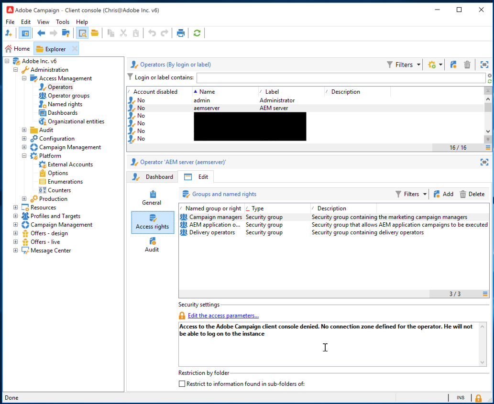

# AEM Integración de 6.5 con Adobe Campaign Classic {#integrating-campaign-classic}

AEM Al integrar los con Adobe Campaign Classic AEM (ACC), puede administrar la entrega de correo electrónico, el contenido y los formularios directamente en la interfaz de usuario de la aplicación de correo electrónico de. Los pasos de configuración tanto en Adobe Campaign Classic AEM como en la son necesarios para habilitar la comunicación bidireccional entre las soluciones.

AEM Esta integración permite que la integración de los segmentos de datos y de Adobe Campaign Classic se utilice de forma independiente. Los especialistas en marketing pueden crear campañas y utilizar la segmentación en Adobe Campaign AEM, mientras que los creadores de contenido en paralelo pueden trabajar en el diseño de contenido en el área de la distribución de contenido de la aplicación de forma. AEM Gracias a esta integración, el contenido y el diseño de la campaña creada en la pueden segmentarse y enviarse desde Adobe Campaign.

>[!INFO]
>
>Este documento detalla cómo integrar Adobe Campaign Classic AEM con la versión 6.5 de. Para otras integraciones de Campaign, consulte el documento [AEM Integración de 6.5 con Adobe Campaign.](campaign.md)

## Pasos de integración {#integration-steps}

AEM La integración entre y Campaign requiere varios pasos en ambas soluciones.

1. [AEM Instalación del paquete de integración de la en Campaign.](#install-package)
1. [AEM Creación de un operador para la creación de segmentos en Campaign](#create-operator)
1. [AEM Configuración de la integración de Campaign en](#campaign-integration)
1. [AEM Configuración del externalizador de](#externalizer)
1. [AEM Configuración del usuario remoto de la campaña en la interfaz de usuario de](#configure-user)
1. [AEM Configuración de la cuenta externa de la en Campaign](#acc-setup)

Este documento le guía en detalle por cada uno de estos pasos.

## Requisitos previos {#prerequisites}

* Acceso de administrador a Adobe Campaign Classic
   * Para realizar la integración, necesita una instancia de Adobe Campaign Classic en funcionamiento, incluida una base de datos configurada.
   * Si necesita más información sobre cómo configurar Adobe Campaign Classic, consulte la [Documentación de Adobe Campaign Classic,](https://experienceleague.adobe.com/docs/campaign-classic/using/campaign-classic-home.html) especialmente la guía Instalación y configuración.
* AEM Acceso de administrador a la

## AEM Instalación del paquete de integración de en Campaign {#install-package}

El **AEM Integración de** El paquete de en Adobe Campaign AEM incluye varias configuraciones estándar necesarias para conectarse a la aplicación de forma rápida y sencilla

1. Inicie sesión como administrador en la instancia de Adobe Campaign mediante la consola del cliente.

1. Seleccionar **Herramientas** > **Avanzadas** > **Importar paquete...**.

   

1. Clic **Instalación de un paquete estándar** y luego haga clic en **Siguiente**.

1. Compruebe la **AEM Integración de** paquete.

   

1. Clic **Siguiente**, y luego **Inicio** para iniciar la instalación.

   

1. Clic **Cerrar** cuando finalice la instalación.

El paquete de integración ya está instalado.

## AEM Creación del operador para su uso en en Campaign {#create-operator}

El paquete de integración crea automáticamente el `aemserver` AEM operador que utiliza el para conectarse a Adobe Campaign. Defina una zona de seguridad para este operador y establezca su contraseña.

1. Inicie sesión en Adobe Campaign como administrador mediante la consola del cliente.

1. Seleccionar **Herramientas** > **Explorer** en la barra de menús.

1. En el explorador, vaya a **Administration** > **Administración de acceso** > **Operadores** nodo.

1. Seleccione el `aemserver` operador.

1. En el **Editar** del operador, seleccione la pestaña **Derechos de acceso** y, a continuación, haga clic en la **Editar los parámetros de acceso...** vínculo.

   

1. Seleccione la zona de seguridad adecuada y defina la máscara IP de confianza según sea necesario.

1. Haga clic en **Guardar**.

1. Cierre la sesión del cliente de Adobe Campaign.

1. En el sistema de archivos del servidor de Adobe Campaign, vaya a la ubicación de instalación de Campaign y edite la `serverConf.xml` archivo como administrador. Este archivo suele encontrarse en:
   * `C:\Program Files\Adobe\Adobe Campaign Classic v7\conf` en Windows.
   * `/usr/local/neolane/nl6/conf/eng` en Linux.

1. Buscar por `securityZone` AEM y asegúrese de que los siguientes parámetros están configurados para la zona de seguridad del operador de la.

   * `allowHTTP="true"`
   * `sessionTokenOnly="true"`
   * `allowUserPassword="true"`.

1. Guarde el archivo.

1. Asegúrese de que la zona de seguridad no se sobrescribe con la configuración correspondiente en la `config-<server name>.xml` archivo.

   * Si el archivo de configuración contiene una configuración de zona de seguridad independiente, cambie la `allowUserPassword` atribuir a `true`.

1. Si desea cambiar el puerto del servidor de Adobe Campaign Classic, sustituya `8080` con el puerto deseado.

   >[!CAUTION]
   >
   >De forma predeterminada, no hay ninguna zona de seguridad configurada para el operador. AEM Para conectarse a Adobe Campaign, debe seleccionar una zona tal como se detalla en los pasos anteriores.
   >
   >El Adobe AEM recomienda encarecidamente crear una zona de seguridad específica para el área de seguridad con el fin de evitar problemas de seguridad. Para obtener más información, consulte la [Documentación de Adobe Campaign Classic.](https://experienceleague.adobe.com/docs/campaign-classic/using/installing-campaign-classic/additional-configurations/security-zones.html)

1. En el cliente de Campaign, vuelva a la `aemserver` y seleccione el **General** pestaña.

1. Haga clic en **Restablecer contraseña...** vínculo.

1. Especifique una contraseña y guárdela en una ubicación segura para su uso futuro.

1. Clic **OK** para guardar la contraseña de `aemserver` operador.

## AEM Configuración de la integración de Campaign en la {#campaign-integration}

AEM usos de la [el operador ya configurado en Campaign.](#create-operator) para comunicarse con Campaign

1. AEM Inicie sesión en la instancia de creación de la como administrador.

1. En el carril lateral de navegación global, seleccione **Herramientas** > **Cloud Service** > **Cloud Service heredados** > **Adobe Campaign**, luego haga clic en **Configurar ahora**.

   

1. En el cuadro de diálogo, cree una configuración de servicio de Campaign introduciendo una **Título** y haga clic en **Crear**.

   

1. Se abre una nueva ventana y un cuadro de diálogo para editar la configuración. Proporcione la información necesaria.

   * **Nombre de usuario** - Esto es [el operador del paquete de integración de Adobe Campaign AEM creado en el paso anterior.](#create-operator) De forma predeterminada, es `aemserver`.
   * **Contraseña** - Esta es la contraseña para [el operador del paquete de integración de Adobe Campaign AEM creado en el paso anterior.](#create-operator)
   * **Punto final de API** : es la URL de instancia de Adobe Campaign.

   

1. Seleccionar **Conectar con Adobe Campaign** para comprobar la conexión y haga clic en **OK**.

AEM Ahora se puede comunicar con Adobe Campaign.

>[!NOTE]
>
>Asegúrese de que el servidor de Adobe Campaign esté accesible a través de Internet. AEM No se puede acceder a redes privadas.

## AEM Configuración de replicación para publicar instancias de forma {#replication}

AEM El contenido de la campaña lo crean los autores de contenido en la instancia de creación de la. Esta instancia solo suele estar disponible internamente en su organización. Para que el contenido, como las imágenes y los recursos, sea accesible a los destinatarios de la campaña, debe publicarlo.

AEM El agente de replicación es responsable de publicar el contenido de la instancia de autor de la en la instancia de publicación y debe configurarse para que la integración funcione correctamente. Este paso también es necesario para replicar determinadas configuraciones de instancia de creación en la instancia de publicación.

AEM Para configurar la replicación desde la instancia de autor de la a la instancia de publicación:

1. AEM Inicie sesión en la instancia de creación de la como administrador.

1. En el carril lateral de navegación global, seleccione **Herramientas** > **Implementación** > **Replicación** > **Agentes en el autor**, luego haga clic en **Agente predeterminado (publicar)**.

   

1. Clic **Editar** a continuación, seleccione **Transporte** pestaña.

1. Configure las variables **URI** reemplazando el valor predeterminado `localhost` AEM con la dirección IP de la instancia de publicación de la.

   

1. Clic **OK** para guardar los cambios en la configuración del agente.

AEM Ha configurado la replicación en la instancia de publicación de la para que los destinatarios de la campaña puedan acceder al contenido.

>[!NOTE]
>
>Si no desea utilizar la URL de replicación, sino utilizar la URL pública, puede establecer la URL pública en la siguiente configuración mediante OSGi
>
>En el carril lateral de navegación global, seleccione **Herramientas** > **Operaciones** > **Consola web** > **Configuración de OSGi** y buscar **AEM Integración de Campaign: configuración**. Edite la configuración y cambie el campo **URL pública** (`com.day.cq.mcm.campaign.impl.IntegrationConfigImpl#aem.mcm.campaign.publicUrl`).

## AEM Configuración del externalizador de {#externalizer}

[El externalizador](/help/sites-developing/externalizer.md) AEM AEM es un servicio OSGi en la que transforma una ruta de recursos en una dirección URL externa y absoluta, que es necesaria para que los usuarios puedan publicar contenido que puede utilizar Campaign para la publicación de contenido en la red de distribución de contenido (OSGi). Configúrela para que la integración de Campaign funcione.

1. AEM Inicie sesión en la instancia de creación de la como administrador.
1. En el carril lateral de navegación global, seleccione **Herramientas** > **Operaciones** > **Consola web** > **Configuración de OSGi** y buscar **Externalizador de vínculos CQ de día**.
1. De forma predeterminada, la última entrada de la **Domains** Este campo está diseñado para la instancia de publicación. Cambie la dirección URL de la predeterminada `http://localhost:4503` a la instancia de publicación disponible públicamente.

   

1. Haga clic en **Guardar**.

Ha configurado el externalizador y Adobe Campaign puede acceder a su contenido.

>[!NOTE]
>
Se debe poder acceder a la instancia de publicación desde el servidor de Adobe Campaign. Si apunta a `localhost:4503` Para cualquier otro servidor al que Adobe Campaign AEM no pueda acceder, las imágenes de las que no se haya podido acceder no aparecerán en la consola de Adobe Campaign.

## AEM Configuración del usuario remoto de la campaña en la interfaz de usuario de {#configure-user}

AEM Para que Campaign se comunique con los usuarios de, debe establecer una contraseña para la cuenta de usuario de, que es la contraseña de la cuenta de usuario de, que es la contraseña de `campaign-remote` AEM usuario en la lista de.

1. AEM Inicie sesión en el servicio de administración de.
1. En la consola de navegación principal, y haga clic en **Herramientas** en el carril izquierdo.
1. Luego haga clic en **Seguridad** > **Usuarios** para abrir la consola de administración de usuarios.
1. Busque el `campaign-remote` usuario.
1. Seleccione el `campaign-remote` y haga clic en **Propiedades** para editar el usuario.
1. En el **Editar configuración de usuario** , haga clic en **Cambiar contraseña**.
1. Proporcione una nueva contraseña para el usuario y anote la contraseña en una ubicación segura para uso futuro.
1. Clic **Guardar** para guardar el cambio de contraseña.
1. Clic **Guardar y cerrar** para guardar los cambios en `campaign-remote` usuario.

## AEM Configuración de la cuenta externa de en Campaign {#acc-setup}

Cuándo [instalación del **AEM Integración de** paquete en Campaign,](#install-package) AEM se crea una cuenta externa para la. Al configurar esta cuenta externa, Adobe Campaign AEM puede conectarse a la red de soluciones de, lo que permite una comunicación bidireccional entre las soluciones de, lo que le permite establecer una conexión con la red de redes de archivos de la red.

1. Inicie sesión en Adobe Campaign como administrador mediante la consola del cliente.

1. Seleccionar **Herramientas** > **Explorer** en la barra de menús.

1. En el explorador, vaya a **Administration** > **Plataforma** > **Cuentas externas** nodo.

   

1. AEM Localice la cuenta externa de. De forma predeterminada, tiene los siguientes valores:

   * **Tipo** - `AEM`
   * **Etiqueta** - `AEM Instance`
   * **Nombre interno** - `aemInstance`

1. En el **General** de esta cuenta, introduzca la información de usuario que definió en la [Establecer contraseña de usuario remoto de Campaign](#set-campaign-remote-password) paso.

   * **Servidor** AEM - La dirección del servidor de creación de la
      * AEM Se debe poder acceder al servidor de creación de la instancia de Adobe Campaign Classic.
      * Asegúrese de que la dirección del servidor sí **no** terminar en una barra diagonal.
   * **Cuenta** - De forma predeterminada, esta es la variable `campaign-remote` AEM usuario que ha configurado en la lista de usuarios de la interfaz de usuario de [Establecer contraseña de usuario remoto de Campaign](#set-campaign-remote-password) paso.
   * **Contraseña** - Esta contraseña es la misma que la `campaign-remote` AEM usuario que ha configurado en la lista de usuarios de la interfaz de usuario de [Establecer contraseña de usuario remoto de Campaign](#set-campaign-remote-password) paso.

1. Seleccione el **Habilitado** casilla de verificación

1. Haga clic en **Guardar**.

Adobe Campaign AEM ahora puede comunicarse con los usuarios de la red de.

## Pasos siguientes {#next-steps}

La integración ya se ha completado tanto con Adobe Campaign Classic AEM como con la configuración de la.

Ahora puede aprender a crear una newsletter en Adobe Experience Manager continuando con [este documento.](/help/sites-authoring/campaign.md)
