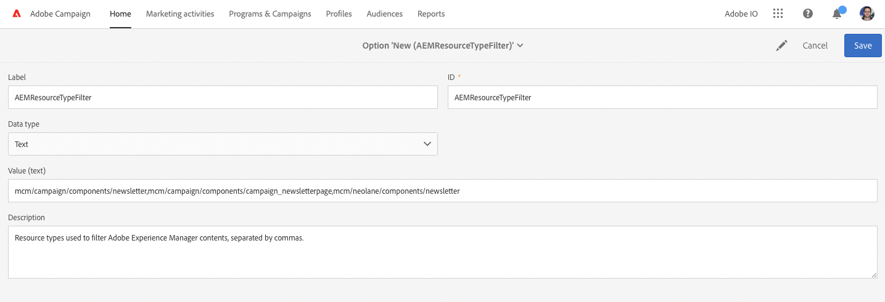

# AEM Integración de 6.5 con Adobe Campaign Standard {#integrating-with-adobe-campaign-standard}

AEM Al integrar la versión 6.5 de con Adobe Campaign Standard AEM (ACS), puede administrar la entrega de correo electrónico, el contenido y los formularios directamente en la interfaz de usuario de. Los pasos de configuración tanto en Adobe Campaign Standard AEM como en la son necesarios para habilitar la comunicación bidireccional entre las soluciones.

AEM Esta integración permite que la integración de los segmentos de datos y de Adobe Campaign Standard se utilice de forma independiente. Los especialistas en marketing pueden crear campañas y utilizar la segmentación en Adobe Campaign AEM, mientras que los creadores de contenido en paralelo pueden trabajar en el diseño de contenido en el área de la distribución de contenido de la aplicación de forma. AEM Gracias a esta integración, el contenido y el diseño de la campaña creada en la pueden segmentarse y enviarse desde Adobe Campaign.

>[!INFO]
>
>Este documento detalla cómo integrar Adobe Campaign Standard AEM con la versión 6.5 de. Para otras integraciones de Campaign, consulte el documento [AEM Integración de 6.5 con Adobe Campaign.](campaign.md)

## Pasos de integración {#integration-steps}

AEM La configuración de la integración entre y Adobe Campaign Standard requiere una serie de pasos en ambas soluciones.

1. [Configure las variables ](#aemserver-user)
1. [Compruebe el ](#resource-type-filter)
1. [AEM Creación de una plantilla de envíos de correo electrónico específica de un en Campaign](#aem-email-delivery-template)
1. [AEM Configuración de la integración de Campaign en la](#campaign-integration)
1. [AEM Configuración de replicación para publicar instancias de forma](#replication)
1. [AEM Configuración del externalizador de](#externalizer)
1. [Configure las variables ](#campaign-remote-user)
1. [AEM Configuración de la cuenta externa de en Campaign](#acc-external-user)

Este documento le guía en detalle por cada uno de estos pasos.

## Requisitos previos {#prerequisites}

* Acceso de administrador a Adobe Campaign Standard
   * Si necesita más información sobre cómo configurar Adobe Campaign Standard, consulte la [Documentación de Adobe Campaign Standard.](https://experienceleague.adobe.com/docs/campaign-standard/using/campaign-standard-home.html)
* AEM Acceso de administrador a la

## Configuración del usuario de aemserver en Campaign {#aemserver-user}

Adobe Campaign Standard incluye de forma predeterminada un `aemserver` AEM usuario que utiliza el para conectarse a Adobe Campaign. Debe asignar un grupo de seguridad apropiado para este usuario y establecer su contraseña.

1. Inicie sesión en Adobe Campaign como administrador.

1. Pulse o haga clic en el logotipo de Adobe Campaign en la parte superior izquierda de la barra de menús para abrir la navegación global y, a continuación, seleccione **Administration** > **Usuarios y seguridad** > **Usuarios** en el menú de navegación.

1. Haga clic o pulse en `aemserver` usuario en la consola de usuarios.

1. Asegúrese de que la variable `aemserver` el usuario está asignado como mínimo a un grupo de seguridad que tiene la función `deliveryPrepare` asignado a él. De forma predeterminada, el grupo `Standard Users` tiene esta función.

   

1. Pulse o haga clic en **Guardar** para guardar los cambios.

Su `aemserver` AEM El usuario de ahora tiene los derechos necesarios para que pueda utilizarla para comunicarse con el usuario de Adobe Campaign.

AEM Sin embargo, antes de que pueda usar la variable, puede usar la siguiente `aemserver` usuario, se debe establecer su contraseña. Esto no se puede hacer a través de Adobe Campaign. Debe ser realizado por un ingeniero de soporte de Adobe. [Envíe un ticket al Servicio de atención al cliente de Adobe](https://experienceleague.adobe.com/?support-tab=home&amp;lang=es#support) para solicitar el restablecimiento de `aemserver` contraseña. Una vez que tenga la contraseña del Servicio de atención al cliente de Adobe, manténgala en una ubicación segura.

## Verificación de AEMResourceTypeFilter en Campaign {#resource-type-filter}

El `AEMResourceTypeFilter` es una opción de Adobe Campaign AEM que se utiliza para filtrar los recursos de la que se pueden utilizar en Adobe Campaign. AEM Debido a que contiene gran cantidad de contenido, esta opción actúa como un filtro que permite a Adobe Campaign AEM recuperar únicamente el contenido de los tipos diseñados específicamente para su uso en Adobe Campaign.

Esta opción está preconfigurada. AEM Sin embargo, es posible que tenga que actualizarla si ha personalizado los componentes de Campaign de la. Para verificar que la variable `AEMResourceTypeFilter` , siga estos pasos.

1. Inicie sesión en Adobe Campaign como administrador.

1. Pulse o haga clic en el logotipo de Adobe Campaign en la parte superior izquierda de la barra de menús para abrir la navegación global y, a continuación, seleccione **Administration** > **Configuración de aplicación** > **Opciones** en el menú de navegación.

1. Haga clic o pulse en `AEMResourceTypeFilter` en la consola opciones.

1. Confirme la configuración del `AEMResourceTypeFilter`. Las rutas están delimitadas por comas y contienen, de forma predeterminada:

   * `mcm/campaign/components/newsletter`
   * `mcm/campaign/components/campaign_newsletterpage`
   * `mcm/neolane/components/newsletter`

   

1. Pulse o haga clic en **Guardar** para guardar los cambios.

Su `AEMResourceTypeFilter` AEM ahora está configurado para recuperar el contenido correcto de los recursos de la red de distribución de.

## AEM Creación de una plantilla de envíos de correo electrónico específica de un en Campaign {#aem-email-delivery-template}

AEM De forma predeterminada, la opción no está activada en las plantillas de correo electrónico de Adobe Campaign. AEM Debe configurar una nueva plantilla de envíos de correo electrónico que se pueda utilizar para crear correos electrónicos con contenido de la lista de distribución de correo electrónico de la lista de distribución de correo electrónico de. AEM Para crear una plantilla de envíos de correo electrónico específica de la, siga estos pasos.

1. Inicie sesión en Adobe Campaign como administrador.

1. Pulse o haga clic en el logotipo de Adobe Campaign en la parte superior izquierda de la barra de menús para abrir la navegación global y, a continuación, seleccione **Recursos** > **Plantillas** > **Plantillas de envío** en el menú de navegación.

1. En la consola de plantillas de envío, busque la plantilla de correo electrónico predeterminada **Enviar por correo electrónico (correo electrónico)** y pase el ratón sobre la tarjeta (o línea) que la representa para mostrar las opciones. Clic **Duplicar elemento**.

   

1. En el **Confirmación** , haga clic en **Confirmar** para duplicar la plantilla.

   

1. El editor de plantillas se abre con la copia del **Enviar por correo electrónico (correo electrónico)** plantilla. Haga clic en **Editar propiedades** en la parte superior derecha de la ventana.

   

1. En la ventana de propiedades, cambie el **Etiqueta** AEM para que sea descriptivo de la nueva plantilla de.

1. Haga clic en **Contenido** para expandirlo y seleccione **Adobe Experience Manager** en el **Fuente de contenido** menú desplegable.

1. Esto revela lo siguiente **cuenta de Adobe Experience Manager** field. Utilice la lista desplegable para seleccionar **Instancia de Adobe Experience Manager (aemInstance)** usuario. AEM Este es el usuario externo predeterminado para la integración de.

1. Clic **Confirmar** para guardar los cambios en las propiedades.

1. En el editor de plantillas, haga clic en **Guardar** AEM para guardar la copia modificada de la plantilla de correo electrónico y utilizarla con el usuario de la plantilla de correo electrónico de.

AEM Ahora tiene una plantilla de correo electrónico que puede utilizar contenido de.

## AEM Configuración de la integración de Campaign en la {#campaign-integration}

AEM Se comunica con Adobe Campaign mediante una integración integrada de y la `aemserver` usuario que configuró en Adobe Campaign. Siga estos pasos para configurar esta integración.

1. AEM Inicie sesión en la instancia de creación de la como administrador.

1. En el carril lateral de navegación global, seleccione **Herramientas** > **Cloud Service** > **Cloud Service heredados** > **Adobe Campaign**, luego haga clic en **Configurar ahora**.

   

1. En el cuadro de diálogo, cree una configuración de servicio de Campaign introduciendo una **Título** y haga clic en **Crear**.

   

1. Se abre una nueva ventana y un cuadro de diálogo para editar la configuración. Proporcione la información necesaria.

   * **Nombre de usuario** - Esto es [el `aemserver` usuario de Adobe Campaign que configuró en un paso anterior.](#aemserver-user) De forma predeterminada, es `aemserver`.
   * **Contraseña** - Esta es la contraseña para [el `aemserver` usuario de Adobe Campaign que solicitó al Servicio de atención al cliente de Adobe en un paso anterior.](#aemserver-user)
   * **Punto final de API** : es la URL de instancia de Adobe Campaign.

   

1. Seleccionar **Conectar con Adobe Campaign** para comprobar la conexión y haga clic en **OK**.

AEM Ahora se puede comunicar con Adobe Campaign.

>[!NOTE]
>
>Asegúrese de que el servidor de Adobe Campaign esté accesible a través de Internet. AEM No se puede acceder a redes privadas.

## AEM Configuración de replicación para publicar instancias de forma {#replication}

AEM El contenido de la campaña lo crean los autores de contenido en la instancia de creación de la. Esta instancia solo suele estar disponible internamente en su organización. Para que el contenido, como las imágenes y los recursos, sea accesible a los destinatarios de la campaña, debe publicarlo.

AEM El agente de replicación es responsable de publicar el contenido de la instancia de autor de la en la instancia de publicación y debe configurarse para que la integración funcione correctamente. Este paso también es necesario para replicar determinadas configuraciones de instancia de creación en la instancia de publicación.

AEM Para configurar la replicación desde la instancia de autor de la a la instancia de publicación:

1. AEM Inicie sesión en la instancia de creación de la como administrador.

1. En el carril lateral de navegación global, seleccione **Herramientas** > **Implementación** > **Replicación** > **Agentes en el autor**, luego toque o haga clic en **Agente predeterminado (publicar)**.

   

1. Haga clic o pulse **Editar** a continuación, seleccione **Transporte** pestaña.

1. Configure las variables **URI** reemplazando el valor predeterminado `localhost` AEM con la dirección IP de la instancia de publicación de la.

   

1. Haga clic o pulse **OK** para guardar los cambios en la configuración del agente.

AEM Ha configurado la replicación en la instancia de publicación de la para que los destinatarios de la campaña puedan acceder al contenido.

>[!NOTE]
>
>Si no desea utilizar la URL de replicación, sino utilizar la URL pública, puede establecer la URL pública en la siguiente configuración mediante OSGi
>
>En el carril lateral de navegación global, seleccione **Herramientas** > **Operaciones** > **Consola web** > **Configuración de OSGi** y buscar **AEM Integración de Campaign: configuración**. Edite la configuración y cambie el campo **URL pública** (`com.day.cq.mcm.campaign.impl.IntegrationConfigImpl#aem.mcm.campaign.publicUrl`).

## AEM Configuración del externalizador de {#externalizer}

[El externalizador](/help/sites-developing/externalizer.md) AEM AEM es un servicio OSGi en la que transforma una ruta de recursos en una dirección URL externa y absoluta, que es necesaria para que los usuarios puedan publicar contenido que puede utilizar Campaign para la publicación de contenido en la red de distribución de contenido (OSGi). Debe configurarlo para que funcione la integración de Campaign.

1. AEM Inicie sesión en la instancia de creación de la como administrador.
1. En el carril lateral de navegación global, seleccione **Herramientas** > **Operaciones** > **Consola web** > **Configuración de OSGi** y buscar **Externalizador de vínculos CQ de día**.
1. De forma predeterminada, la última entrada de la **Domains** Este campo está diseñado para la instancia de publicación. Cambie la dirección URL de la predeterminada `http://localhost:4503` a la instancia de publicación disponible públicamente.

   

1. Haga clic o pulse **Guardar**.

Ha configurado el externalizador y Adobe Campaign puede acceder a su contenido.

>[!NOTE]
>
Se debe poder acceder a la instancia de publicación desde el servidor de Adobe Campaign. Si apunta a `localhost:4503` Para cualquier otro servidor al que Adobe Campaign AEM no pueda acceder, las imágenes de las que no se haya podido acceder no aparecerán en la consola de Adobe Campaign.

## AEM Configuración del usuario remoto de la campaña en la interfaz de usuario de {#campaign-remote-user}

Del mismo modo que necesita un usuario en Adobe Campaign que pueda utilizar para comunicarse con Adobe Campaign, Adobe Campaign AEM AEM también necesita un usuario en la comunicación con el que se pueda establecer la comunicación con los usuarios de AEM, que también puede usar para comunicarse con los usuarios de. De forma predeterminada, la integración de Campaign crea el `campaign-remote` AEM usuario en la lista de. Siga estos pasos para configurar este usuario.

1. AEM Inicie sesión en el servicio de administración de.
1. En la consola de navegación principal, haga clic en **Herramientas** en el carril izquierdo.
1. Luego haga clic en **Seguridad** > **Usuarios** para abrir la consola de administración de usuarios.
1. Busque el `campaign-remote` usuario.
1. Seleccione el `campaign-remote` y haga clic en **Propiedades** para editar el usuario.
1. En el **Editar configuración de usuario** , haga clic en **Cambiar contraseña**.
1. Proporcione una nueva contraseña para el usuario y anote la contraseña en una ubicación segura para uso futuro.
1. Clic **Guardar** para guardar el cambio de contraseña.
1. Clic **Guardar y cerrar** para guardar los cambios en `campaign-remote` usuario.

## AEM Configuración de la cuenta externa de en Campaign {#acc-external-user}

Cuando usted [AEM ha creado una plantilla de envíos de correo electrónico específica de la,](#aem-email-delivery-template) ha especificado que la plantilla debe utilizar el `aemInstance` AEM cuenta externa con la que comunicarse a los usuarios de la cuenta de. Para habilitar la comunicación bidireccional entre ambas soluciones, debe configurar esta cuenta en Adobe Campaign.

1. Inicie sesión en Adobe Campaign como administrador.

1. Pulse o haga clic en el logotipo de Adobe Campaign en la parte superior izquierda de la barra de menús para abrir la navegación global y, a continuación, seleccione **Administration** > **Configuración de aplicación** > **Cuentas externas** en el menú de navegación.

1. Haga clic o pulse en **Instancia de Adobe Experience Manager (aemInstance)** usuario en la consola de usuarios.

1. Asegúrese de que el usuario tenga **Adobe Experience Manager** como el **Tipo**.

1. En el **Conexión** , defina los siguientes campos:

   1. AEM Servidor: es la dirección URL del servidor de creación de. Esto no debe terminar en una barra oblicua.
   1. Cuenta: Esta es la `campaign-remote` usuario usted [AEM previamente configurado en la.](#campaign-remote-user)
   1. Contraseña: Esta es la contraseña de `campaign-remote`usuario usted [AEM previamente configurado en la.](#campaign-remote-user)

   

1. Asegúrese de que la variable **Habilitado** y, a continuación, haga clic en **Guardar** para guardar los cambios.

Felicitaciones. AEM ¡Ha completado la integración entre y Adobe Campaign Standard!

## Pasos siguientes {#next-steps}

La integración ya se ha completado tanto con Adobe Campaign Classic AEM como con la configuración de la.

Ahora puede aprender a crear una newsletter en Adobe Experience Manager continuando con [este documento.](/help/sites-authoring/campaign.md)
