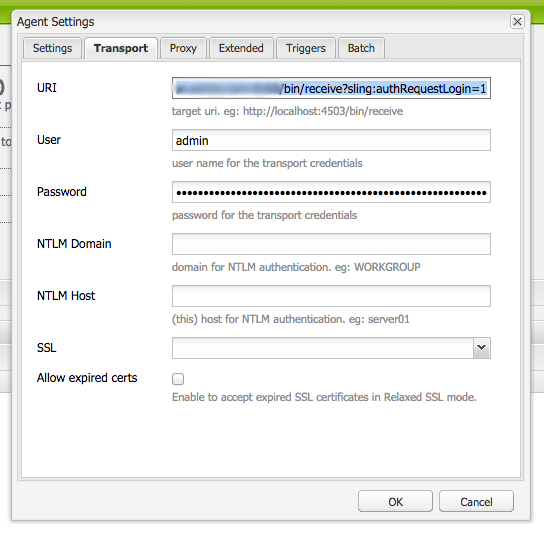

# Integración con Adobe Campaign Standard{#integrating-with-adobe-campaign-standard}

>[!NOTE]
>
>En esta documentación se describe cómo integrar AEM con Adobe Campaign Standard, la solución basada en suscripciones. Si utiliza Adobe Campaign 6.1, consulte [Integración con Adobe Campaign 6.1](/help/sites-administering/campaignonpremise.md) para estas instrucciones.

Adobe Campaign permite administrar el contenido y los formularios de entrega por correo electrónico directamente en Adobe Experience Manager.

Para utilizar ambas soluciones juntas al mismo tiempo, primero debe configurarlas para conectarse entre sí. Esto implica pasos de configuración tanto en Adobe Campaign como en Adobe Experience Manager. Estos pasos se describen en detalle en este documento.

El trabajo con Adobe Campaign en AEM incluye la capacidad de enviar correos electrónicos y formularios a través de Adobe Campaign y se describe en [Uso de Adobe Campaign](/help/sites-authoring/campaign.md).

Además, los siguientes temas pueden ser de interés al integrar AEM con [Adobe Campaign](https://docs.campaign.adobe.com/doc/standard/en/home.html):

* [Prácticas recomendadas para plantillas de correo electrónico](/help/sites-administering/best-practices-for-email-templates.md)
* [Resolución de problemas de integración de Adobe Campaign](/help/sites-administering/troubleshooting-campaignintegration.md)

Si amplía la integración con Adobe Campaign, es posible que desee ver las páginas siguientes:

* [Creación de extensiones personalizadas](/help/sites-developing/extending-campaign-extensions.md)
* [Creación de asignaciones de formularios personalizados](/help/sites-developing/extending-campaign-form-mapping.md)

## Configuración de Adobe Campaign {#configuring-adobe-campaign}

La configuración de Adobe Campaign implica lo siguiente:

1. Configuración de la variable **aemserver** usuario.
1. Creación de una cuenta externa dedicada.
1. Verificación de la opción AEMResourceTypeFilter .
1. Creación de una plantilla de envío dedicada.

>[!NOTE]
>
>Para realizar estas operaciones, debe tener la variable **administración** en Adobe Campaign.

### Requisitos previos {#prerequisites}

Asegúrese de tener los siguientes elementos previamente:

* [Una instancia de creación de AEM](/help/sites-deploying/deploy.md#getting-started)
* [Una instancia de publicación AEM](/help/sites-deploying/deploy.md#author-and-publish-installs)
* [Una instancia de Adobe Campaign](https://docs.adobe.com/content/docs/en/campaign/ACS.html)

>[!CAUTION]
>
>Operaciones detalladas en la [Configuración de Adobe Campaign](#configuring-adobe-campaign) y [Configuración de Adobe Experience Manager](#configuring-adobe-experience-manager) son necesarias para que las funcionalidades de integración entre AEM y Adobe Campaign funcionen correctamente.

### Configuración del usuario aemserver {#configuring-the-aemserver-user}

La variable **aemserver** El usuario debe estar configurado en Adobe Campaign. La variable **aemserver** es un usuario técnico que se utilizará para conectar el servidor de AEM a Adobe Campaign.

Vaya a **Administración** >  **Usuarios y seguridad** >  **Usuarios** y seleccione **aemserver** usuario. Haga clic en él para abrir la configuración de usuario.

* Debe establecer una contraseña para este usuario. Esto no se puede hacer a través de la interfaz de usuario de . Esta configuración debe realizarla en REST un administrador técnico.
* Puede asignar funciones específicas a este usuario, como **deliveryPrepare**, que permite al usuario crear y editar envíos.

### Configuración de una cuenta externa de Adobe Experience Manager {#configuring-an-adobe-experience-manager-external-account}

Debe configurar una cuenta externa que le permita conectar Adobe Campaign a la instancia de AEM.

>[!NOTE]
>
>En AEM, asegúrese de establecer la contraseña para el usuario remoto de la campaña. Debe establecer esta contraseña para conectar Adobe Campaign con AEM. Inicie sesión como administrador y, en la consola de administración de usuarios, busque el usuario remoto de la campaña y haga clic en **Establecer contraseña**.

Para configurar una cuenta externa AEM:

1. Vaya a **Administración** > **Ajustes de la aplicación** > **Cuentas externas**.

   

1. Seleccione el valor predeterminado **aemInstance** cuenta externa o cree una nueva haciendo clic en el botón **Crear** botón.
1. Select **Adobe Experience Manager** i en el **Tipo** e introduzca los parámetros de acceso utilizados para la instancia de creación de AEM: dirección del servidor, nombre de cuenta y contraseña.

   >[!NOTE]
   >
   >Asegúrese de no añadir un final **/** la barra diagonal al final de la dirección URL o la conexión no funcionará.

1. Asegúrese de que la variable **Habilitado** está seleccionada y, a continuación, haga clic en **Guardar** para guardar las modificaciones.

### Verificación de la opción AEMResourceTypeFilter {#verifying-the-aemresourcetypefilter-option}

La variable **AEMResourceTypeFilter** se utiliza para filtrar tipos de recursos de AEM que se pueden utilizar en Adobe Campaign. Esto permite a Adobe Campaign recuperar AEM contenido específicamente diseñado para utilizarse solo en Adobe Campaign.

Esta opción viene preconfigurada; sin embargo, si cambia esta opción, puede provocar que la integración no funcione.

Para verificar el **AEMResourceTypeFilter** está configurada:

1. Vaya a **Administración** > **Ajustes de la aplicación** > **Opciones**.
1. En la lista, puede asegurarse de que la variable **AEMResourceTypeFilter** y que las rutas son correctas.

### Creación de una plantilla de envíos de correo electrónico específica de AEM {#creating-an-aem-specific-email-delivery-template}

De forma predeterminada, la función AEM no está habilitada en las plantillas de correo electrónico de Adobe Campaign. Puede configurar una nueva plantilla de envío de correo electrónico que se utilizará para crear correos electrónicos con contenido AEM.

Para crear una plantilla de envío de correo electrónico específica de AEM:

1. Vaya a **Recursos** > **Plantillas** > **Plantillas de envío**.
1. **Habilitar selección** haciendo clic en la marca de verificación de la barra de acciones y seleccionando la **Correo electrónico estándar (correo)** plantilla predeterminada y, a continuación, duplíquela haciendo clic en el botón **Copiar** y haga clic en **Confirmar**.
1. Deshabilite el modo de selección haciendo clic en el botón **x** y abra el **Copia de correo electrónico estándar (correo)** plantilla y, a continuación, seleccione **Editar propiedades** desde la barra de acciones del panel de plantillas.

   Puede modificar el informe de **Etiqueta**.

1. En las propiedades **Contenido** , cambie la **Fuente de contenido** a **Adobe Experience Manager**. A continuación, seleccione la cuenta externa que se creó anteriormente y haga clic en **Confirmar**.

   Guarde las modificaciones haciendo clic en **Confirmar** y haga clic en **Guardar.**

   Las entregas de correo electrónico creadas a partir de esta plantilla tendrán habilitada la función de contenido AEM.

   

## Configuración de Adobe Experience Manager {#configuring-adobe-experience-manager}

Para configurar AEM, debe hacer lo siguiente:

* Configure la replicación entre instancias.
* Conecte AEM a Adobe Campaign.
* Configure el externalizador.

### Configuración de la replicación entre instancias AEM {#configuring-replication-between-aem-instances}

El contenido creado a partir de la instancia de creación de AEM se envía primero a la instancia de publicación. A continuación, esta instancia de publicación transfiere el contenido a Adobe Campaign. Por lo tanto, el agente de replicación debe configurarse para replicarse desde la instancia de creación de AEM a la instancia de publicación de AEM.

>[!NOTE]
>
>Si no desea utilizar la URL de replicación y, en su lugar, utiliza la URL de cara al público, puede establecer la variable **URL pública** en el siguiente ajuste de configuración en OSGi (**Herramientas** > **Consola web** > **Configuración de OSGi > Integración AEM Campaign - Configuración**):
**URL pública:** com.day.cq.mcm.campaign.impl.IntegrationConfigImpl#aem.mcm.campaign.publicUrl

Este paso también es necesario para replicar ciertas configuraciones de instancia de creación en la instancia de publicación.

Para configurar la replicación entre instancias de AEM:

1. En la instancia de creación, seleccione **Logotipo de AEM**> **Herramientas** > **Implementación** > **Replicación** > **Agentes en autor** y haga clic en **Agente predeterminado**.

   

   >[!NOTE]
   Evite utilizar localhost (es decir, una copia local de AEM) al configurar la integración con Adobe Campaign a menos que la instancia de publicación y de autor estén en el mismo equipo.

1. Haga clic en **Editar** a continuación, seleccione la **Transporte** pestaña .
1. Configure el URI reemplazando **localhost** con la dirección IP o la dirección de la instancia de publicación de AEM.

   

### Conexión de AEM a Adobe Campaign {#connecting-aem-to-adobe-campaign}

Antes de poder usar AEM y Adobe Campaign juntos, debe establecer el vínculo entre ambas soluciones para que puedan comunicarse.

1. Conéctese a la instancia de creación de AEM.
1. Select **Herramientas** > **Operaciones** > **Cloud** > **Cloud Services**, luego **Configurar ahora** en la sección Adobe Campaign .

   

1. Cree una nueva configuración introduciendo una **Título** y haga clic en **Crear** o elija la configuración existente que desea vincular con la instancia de Adobe Campaign.
1. Edite la configuración para que coincida con los parámetros de la instancia de Adobe Campaign.

   * **Nombre de usuario**: **aemserver**, el operador de paquete de integración de Adobe Campaign AEM se utiliza para establecer el vínculo entre las dos soluciones.
   * **Contraseña**: Contraseña del operador de Adobe Campaign aemserver. Es posible que tenga que volver a especificar la contraseña de este operador directamente en Adobe Campaign.
   * **Punto final de API**: URL de instancia de Adobe Campaign.

1. Select **Conectarse a Adobe Campaign** y haga clic en **OK**.

   

   >[!NOTE]
   Tras [cree su correo electrónico y publíquelo](/help/sites-authoring/campaign.md), debe volver a publicar la configuración en la instancia de publicación.

   

>[!NOTE]
Si la conexión falla, asegúrese de comprobar lo siguiente:
* Puede encontrar un problema de certificado al utilizar una conexión segura a una instancia de Adobe Campaign (https). Deberá añadir el certificado de instancia de Adobe Campaign al archivo **cacerts **de su JDK.
* Además, consulte [Resolución de problemas de integración de AEM/Adobe Campaign](/help/sites-administering/troubleshooting-campaignintegration.md).
>

### Configuración del externalizador {#configuring-the-externalizer}

Debe [configurar el externalizador](/help/sites-developing/externalizer.md) en AEM en la instancia de autor. El externalizador es un servicio OSGi que permite transformar una ruta de recurso en una dirección URL externa y absoluta. Este servicio proporciona un lugar central para configurar esas direcciones URL externas y crearlas.

Consulte [Configuración del externalizador](/help/sites-developing/externalizer.md) para instrucciones generales. Para la integración con Adobe Campaign, asegúrese de configurar el servidor de publicación en `https://<host>:<port>/system/console/configMgr/com.day.cq.commons.impl.ExternalizerImpl` no apunte a `localhost:4503` pero a un servidor al que se pueda acceder desde la consola de Adobe Campaign.

Si señala a `localhost:4503` o cualquier otro servidor al que Adobe Campaign no pueda acceder, las imágenes no aparecerán en la consola de Adobe Campaign.

