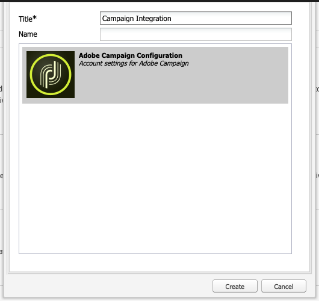
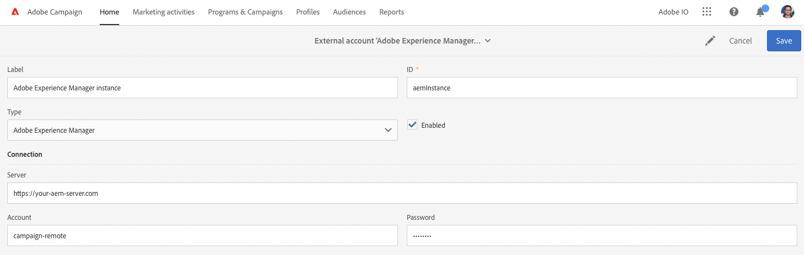

# Integración con Adobe Campaign Standard {#integrating-with-adobe-campaign-standard}

Al integrar AEM con Adobe Campaign, puede administrar la entrega de correo electrónico, el contenido y los formularios directamente en AEM. Se necesitan pasos de configuración tanto en Adobe Campaign Standard como en AEM para habilitar la comunicación bidireccional entre soluciones.

Esta integración permite utilizar AEM y Adobe Campaign Standard de forma independiente. Los especialistas en marketing pueden crear campañas y utilizar la segmentación en Adobe Campaign, mientras que los creadores de contenido en paralelo pueden trabajar en el diseño de contenido en AEM. Con la integración, el contenido y el diseño de la campaña creada en AEM pueden ser dirigidos y entregados por Adobe Campaign.

## Pasos de la integración {#integration-steps}

La configuración de la integración entre AEM y Adobe Campaign Standard requiere una serie de pasos en ambas soluciones.

1. [Configure las variables ](#aemserver-user)
1. [Compruebe el ](#resource-type-filter)
1. [Creación de una plantilla de envío de correo electrónico específica de AEM en Campaign](#aem-email-delivery-template)
1. [Configuración de la integración de Campaign en AEM](#campaign-integration)
1. [Configurar la replicación en la instancia de publicación de AEM](#replication)
1. [Configuración del AEM externalizador](#externalizer)
1. [Configure las variables ](#campaign-remote-user)
1. [Configuración de la cuenta externa de AEM en Campaign](#acc-external-user)

Este documento le guía por cada uno de estos pasos en detalle.

## Requisitos previos {#prerequisites}

* Acceso de administrador a Adobe Campaign Standard
   * Si necesita más información sobre cómo configurar y configurar Adobe Campaign Standard, consulte la [Documentación de Adobe Campaign Standard.](https://experienceleague.adobe.com/docs/campaign-standard/using/campaign-standard-home.html)
* Acceso de administrador a AEM

## Configuración del usuario de aemserver en Campaign {#aemserver-user}

De forma predeterminada, Adobe Campaign Standard incluye un `aemserver` usuario que AEM utiliza para conectarse a Adobe Campaign. Debe asignar un grupo de seguridad adecuado para este usuario y establecer su contraseña.

1. Inicie sesión en Adobe Campaign como administrador.

1. Toque o haga clic en el logotipo de Adobe Campaign en la parte superior izquierda de la barra de menús para abrir la navegación global y, a continuación, seleccione **Administración** > **Usuarios y seguridad** > **Usuarios** en el menú de navegación.

1. Toque o haga clic en el botón `aemserver` en la consola de usuarios.

1. Asegúrese de que la variable `aemserver` el usuario se asigna como mínimo a un grupo de seguridad que tenga la función `deliveryPrepare` se le asigna. De forma predeterminada, el grupo `Standard Users` tiene esta función.

   

1. Toque o haga clic **Guardar** para guardar los cambios.

Su `aemserver` El usuario tiene ahora los derechos necesarios para que AEM pueda utilizarlo para comunicarse con Adobe Campaign.

Sin embargo, antes de AEM puede usar la variable `aemserver` usuario, se debe establecer su contraseña. Esto no se puede hacer a través de Adobe Campaign. Debe ser realizado por un ingeniero de soporte de Adobe. [Envíe un ticket al Servicio de atención al cliente de Adobe](https://experienceleague.adobe.com/?support-tab=home&amp;lang=es#support) para solicitar el restablecimiento del `aemserver` contraseña. Una vez que tenga la contraseña del Servicio de atención al cliente de Adobe, manténgala en una ubicación segura.

## Verificar el AEMResourceTypeFilter en Campaign {#resource-type-filter}

La variable `AEMResourceTypeFilter` es una opción de Adobe Campaign que se utiliza para filtrar AEM recursos que se pueden utilizar en Adobe Campaign. Como AEM contiene mucho contenido, esta opción actúa como un filtro que permite a Adobe Campaign recuperar únicamente el contenido AEM de tipos específicamente diseñados para utilizarse en Adobe Campaign.

Esta opción viene preconfigurada. Sin embargo, es posible que tenga que actualizarla si ha personalizado los componentes de campaña de AEM. Para verificar que la variable `AEMResourceTypeFilter` está configurada, siga estos pasos.

1. Inicie sesión en Adobe Campaign como administrador.

1. Toque o haga clic en el logotipo de Adobe Campaign en la parte superior izquierda de la barra de menús para abrir la navegación global y, a continuación, seleccione **Administración** > **Configuración de la aplicación** > **Opciones** en el menú de navegación.

1. Toque o haga clic en el botón `AEMResourceTypeFilter` en la consola de opciones.

1. Confirme la configuración de la variable `AEMResourceTypeFilter`. Las rutas están delimitadas con comas y contienen de forma predeterminada:

   * `mcm/campaign/components/newsletter`
   * `mcm/campaign/components/campaign_newsletterpage`
   * `mcm/neolane/components/newsletter`

   

1. Toque o haga clic **Guardar** para guardar los cambios.

Su `AEMResourceTypeFilter` ahora está configurado para recuperar el contenido correcto de AEM.

## Creación de una plantilla de envío de correo electrónico específica de AEM en Campaign {#aem-email-delivery-template}

De forma predeterminada, AEM no está habilitado en las plantillas de correo electrónico de Adobe Campaign. Debe configurar una nueva plantilla de envío de correo electrónico que se pueda utilizar para crear correos electrónicos con contenido AEM. Para crear una plantilla de envío de correo electrónico específica del AEM, siga estos pasos.

1. Inicie sesión en Adobe Campaign como administrador.

1. Toque o haga clic en el logotipo de Adobe Campaign en la parte superior izquierda de la barra de menús para abrir la navegación global y, a continuación, seleccione **Recursos** > **Plantillas** > **Plantillas de envío** en el menú de navegación.

1. En la consola de plantillas de envío, busque la plantilla de correo electrónico predeterminada **Enviar por correo electrónico (correo)** y pase el ratón sobre la tarjeta (o línea) que la representa para mostrar las opciones. Haga clic en **Duplicar elemento**.

   

1. En el **Confirmación** cuadro de diálogo, haga clic en **Confirmar** para duplicar la plantilla.

   

1. El editor de plantillas se abre con su copia de la variable **Enviar por correo electrónico (correo)** plantilla. Haga clic en el **Editar propiedades** en la parte superior derecha de la ventana.

   

1. En la ventana de propiedades, cambie la **Etiqueta** para que sea descriptivo de la nueva plantilla de AEM.

1. Haga clic en el **Contenido** encabezado para expandirlo y seleccionar **Adobe Experience Manager** en el **Fuente de contenido** lista desplegable.

1. Esto revela el **Cuenta de Adobe Experience Manager** campo . Utilice la lista desplegable para seleccionar **Instancia de Adobe Experience Manager (aemInstance)** usuario. Es el usuario externo predeterminado para la integración de AEM.

1. Haga clic en **Confirmar** para guardar los cambios en las propiedades.

1. En el editor de plantillas, haga clic en **Guardar** para guardar la copia modificada de la plantilla de correo electrónico y utilizarla con AEM.

Ahora tiene una plantilla de correo electrónico que puede utilizar AEM contenido.

## Configuración de la integración de Campaign en AEM {#campaign-integration}

AEM se comunica con Adobe Campaign mediante una integración integrada y la función `aemserver` usuario configurado en Adobe Campaign. Siga estos pasos para configurar esta integración.

1. Inicie sesión en la instancia de creación de AEM como administrador.

1. En el carril lateral de navegación global, seleccione **Herramientas** > **Cloud Services** > **Cloud Services heredados** > **Adobe Campaign** y haga clic en **Configurar ahora**.

   

1. En el cuadro de diálogo, cree una configuración de servicio de Campaign introduciendo una **Título** y haga clic en **Crear**.

   

1. Se abre una nueva ventana y un cuadro de diálogo para editar la configuración. Proporcione la información necesaria.

   * **Nombre de usuario** - Esto es [el `aemserver` en Adobe Campaign que configuró en un paso anterior.](#aemserver-user) De forma predeterminada, es `aemserver`.
   * **Contraseña** - Esta es la contraseña de [el `aemserver` en Adobe Campaign que solicitó al Servicio de atención al cliente de Adobe en un paso anterior.](#aemserver-user)
   * **Punto final de API** : Esta es la URL de instancia de Adobe Campaign.

   

1. Select **Conectarse a Adobe Campaign** para verificar la conexión y, a continuación, haga clic en **OK**.

AEM ahora puede comunicarse con Adobe Campaign.

>[!NOTE]
>
>Asegúrese de que el servidor de Adobe Campaign esté disponible a través de Internet. AEM puede acceder a redes privadas.

## Configurar la replicación en la instancia de publicación de AEM {#replication}

El contenido de la campaña lo crean los autores de contenido en la instancia de creación de AEM. Esta instancia solo suele estar disponible internamente en su organización. Para que los destinatarios de la campaña puedan acceder a contenido como imágenes y recursos, debe publicar ese contenido.

El agente de replicación es responsable de publicar el contenido desde la instancia de autor de AEM a la instancia de publicación y debe configurarse para que la integración funcione correctamente. Este paso también es necesario para replicar ciertas configuraciones de instancia de creación en la instancia de publicación.

Para configurar la replicación de la instancia de autor de AEM a la instancia de publicación:

1. Inicie sesión en la instancia de creación de AEM como administrador.

1. En el carril lateral de navegación global, seleccione **Herramientas** > **Implementación** > **Replicación** > **Agentes en autor** y, a continuación, toque o haga clic en **Agente predeterminado (publicar)**.

   

1. Toque o haga clic **Editar** a continuación, seleccione la **Transporte** pestaña .

1. Configure las variables **URI** reemplazando el valor predeterminado `localhost` con la dirección IP de la instancia de publicación de AEM.

   

1. Toque o haga clic **OK** para guardar los cambios en la configuración del agente.

Ha configurado la replicación en la instancia de publicación de AEM para que los destinatarios de la campaña puedan acceder al contenido.

>[!NOTE]
>
>Si no desea utilizar la URL de replicación, sino utilizar la URL de cara al público, puede establecer la URL pública en la siguiente configuración a través de OSGi
>
>En el carril lateral de navegación global, seleccione **Herramientas** > **Operaciones** > **Consola web** > **Configuración de OSGi** y busque **Integración de AEM Campaign: Configuración**. Editar la configuración y cambiar el campo **URL pública** (`com.day.cq.mcm.campaign.impl.IntegrationConfigImpl#aem.mcm.campaign.publicUrl`).

## Configuración del AEM externalizador {#externalizer}

[El externalizador](/help/sites-developing/externalizer.md) es un servicio OSGi en AEM que transforma una ruta de recurso en una URL externa y absoluta, que es necesario para que AEM el contenido que Campaign puede utilizar. Debe configurarlo para que funcione la integración de Campaign.

1. Inicie sesión en la instancia de creación de AEM como administrador.
1. En el carril lateral de navegación global, seleccione **Herramientas** > **Operaciones** > **Consola web** > **Configuración de OSGi** y busque **Externalizador de vínculos de CQ de día**.
1. De forma predeterminada, la última entrada de la variable **Dominios** está diseñado para la instancia de publicación. Cambiar la dirección URL de la predeterminada `http://localhost:4503` a su instancia de publicación disponible públicamente.

   

1. Haga clic o pulse **Guardar**.

Ha configurado el externalizador y Adobe Campaign ahora puede acceder al contenido.

>[!NOTE]
Se debe poder acceder a la instancia de publicación desde el servidor de Adobe Campaign. Si señala a `localhost:4503` Para otro servidor al que Adobe Campaign no pueda acceder, las imágenes de AEM no aparecerán en la consola de Adobe Campaign.

## Configuración del usuario remoto de la campaña en AEM {#campaign-remote-user}

Del mismo modo que necesita un usuario en Adobe Campaign que AEM pueda utilizar para comunicarse con Adobe Campaign, Adobe Campaign también necesita un usuario en AEM para comunicarse con AEM. De forma predeterminada, la integración de Campaign crea la variable `campaign-remote` usuario en AEM. Siga estos pasos para configurar este usuario.

1. Inicie sesión en AEM como administrador.
1. En la consola de navegación principal, haga clic en **Herramientas** en el carril izquierdo.
1. A continuación, haga clic en **Seguridad** > **Usuarios** para abrir la consola de administración de usuarios.
1. Busque la variable `campaign-remote` usuario.
1. Seleccione el `campaign-remote` usuario y haga clic en **Propiedades** para editar el usuario.
1. En el **Editar configuración de usuario** ventana, haga clic en **Cambiar contraseña**.
1. Proporcione una nueva contraseña para el usuario y anote la contraseña en una ubicación segura para uso futuro.
1. Haga clic en **Guardar** para guardar el cambio de contraseña.
1. Haga clic en **Guardar y cerrar** para guardar los cambios en la variable `campaign-remote` usuario.

## Configuración de la cuenta externa de AEM en Campaign {#acc-external-user}

Cuando [se ha creado una plantilla de envío de correo electrónico específica de AEM,](#aem-email-delivery-template) especificó que la plantilla debería utilizar la variable `aemInstance` cuenta externa para comunicarse con AEM. Para habilitar la comunicación bidireccional entre ambas soluciones, debe configurar esta cuenta en Adobe Campaign.

1. Inicie sesión en Adobe Campaign como administrador.

1. Toque o haga clic en el logotipo de Adobe Campaign en la parte superior izquierda de la barra de menús para abrir la navegación global y, a continuación, seleccione **Administración** > **Ajustes de la aplicación** > **Cuentas externas** en el menú de navegación.

1. Toque o haga clic en el botón **Instancia de Adobe Experience Manager (aemInstance)** en la consola de usuarios.

1. Asegúrese de que el usuario tiene **Adobe Experience Manager** como el **Tipo**.

1. En el **Conexión** , defina los campos siguientes:

   1. Servidor: Esta es la URL del servidor de creación de AEM. Esto no debe terminar en una barra oblicua.
   1. Cuenta: Esta es la `campaign-remote` usuario [configurado anteriormente en AEM.](#campaign-remote-user)
   1. Contraseña: Esta es la contraseña para la variable `campaign-remote`usuario [configurado anteriormente en AEM.](#campaign-remote-user)

   

1. Asegúrese de que la variable **Habilitado** está seleccionada y, a continuación, haga clic en **Guardar** para guardar los cambios.

¡Enhorabuena! ¡Ha completado la integración entre AEM y Adobe Campaign Standard!

## Pasos siguientes {#next-steps}

Con Adobe Campaign Classic y AEM configurados, la integración ya se ha completado.

Ahora puede aprender a crear una newsletter en Adobe Experience Manager continuando con [este documento.](/help/sites-authoring/campaign.md)
