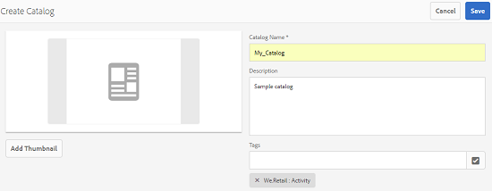

# Catalog Producer{#catalog-producer}

Descubra cómo usar Catalog Producer en AEM Assets para generar catálogos de productos con sus recursos digitales.

Con Adobe Experience Manager (AEM) Assets Catalog Producer, puede crear catálogos para sus productos de marca mediante plantillas de InDesign importadas desde una aplicación de InDesign. Para importar plantillas de InDesign, primero integre AEM Assets con un servidor de InDesign.

## Integración con el servidor InDesign {#integrating-with-indesign-server}

Como parte del proceso de integración, configure el flujo de trabajo **Recurso de actualización de DAM**, que es adecuado para la integración con InDesign. Además, configure un programa de trabajo proxy para el servidor de InDesign. Para obtener más información, consulte [Integración de AEM Assets con InDesign Server](/help/assets/indesign.md).

>[!NOTE]
>
>Puede generar plantillas de InDesign a partir de archivos de InDesign antes de importarlas a AEM Assets. Para obtener más información, consulte [Uso de archivos y plantillas](https://helpx.adobe.com/indesign/using/files-templates.html).
>
>Puede asignar los elementos de las plantillas de InDesign a las etiquetas XML. Las etiquetas asignadas se muestran como propiedades al asignar propiedades de producto con propiedades de plantilla en Catalog Producer. Para obtener más información sobre el etiquetado XML en archivos InDesign, consulte [Etiquetado de contenido para XML](https://helpx.adobe.com/indesign/using/tagging-content-xml.html).

>[!NOTE]
>
>Solo se utilizan como plantillas los archivos InDesign (.indd). Los archivos con la extensión .indt no son compatibles.

## Creación de un catálogo {#creating-a-catalog}

Catalog Producer utiliza datos de administración de la información del producto (PIM) para asignar propiedades del producto con las propiedades XML que se muestran en la plantilla. Para crear un catálogo, siga estos pasos:

1. En la interfaz de usuario de Assets, toque o haga clic en el logotipo **AEM** y vaya a **Recursos > Catálogos**.
1. En la página **Catálogos**, toque o haga clic **Crear** en la barra de herramientas y, a continuación, seleccione **Catálogo** en la lista.
1. En la página **Crear catálogo**, escriba un nombre y una descripción (opcional) para el catálogo y especifique las etiquetas, si las hay. También puede añadir una imagen en miniatura para el catálogo.

   

1. Toque o haga clic en **Guardar**. Un cuadro de diálogo de confirmación notifica que se ha creado el catálogo. Toque o haga clic **Listo** para cerrar el cuadro de diálogo.
1. Para abrir el catálogo que ha creado, toque o haga clic en él desde la página **Catálogos**.

   >[!NOTE]
   >
   >Para abrir el catálogo, también puede tocar/hacer clic **Abrir** en el cuadro de diálogo de confirmación mencionado en el paso anterior.

1. Para agregar páginas al catálogo, toque o haga clic en **Crear** desde la barra de herramientas y, a continuación, elija la opción **Nueva página**.
1. En el asistente, seleccione una plantilla de InDesign para la página. A continuación, toque o haga clic en **Siguiente**.
1. Especifique un nombre para la página y una descripción opcional. Especifique las etiquetas, si las hay.
1. Toque o haga clic en **Crear** desde la barra de herramientas. A continuación, toque o haga clic en **Abrir** desde el cuadro de diálogo. Las propiedades del producto se muestran en el panel izquierdo. Las propiedades predefinidas para la plantilla de InDesign aparecen en el panel derecho.
1. En el panel izquierdo, arrastre las propiedades del producto a las propiedades de la plantilla de InDesign y cree una asignación entre ellas.

   Para vista de cómo aparece la página en tiempo real, toque o haga clic en la ficha **Previsualización** del panel derecho.

1. Para crear más páginas, repita los pasos 6 a 9. Para crear páginas similares para otros productos, seleccione la página y toque o haga clic en el icono **Crear páginas similares** de la barra de herramientas.

   

   >[!NOTE]
   >
   >Solo puede crear páginas similares para productos con una estructura similar.

   Toque o haga clic en el icono Añadir, seleccione productos en el selector de productos y, a continuación, toque o haga clic en **Seleccionar** en la barra de herramientas.

   

1. En la barra de herramientas, toque o haga clic en **Crear**. Toque o haga clic **Listo** para cerrar el cuadro de diálogo. El catálogo incluye páginas similares.
1. Para agregar cualquier archivo de InDesign existente al catálogo, toque o haga clic en **Crear** desde la barra de herramientas y elija la opción **Añadir a la página existente**.
1. Seleccione el archivo InDesign y toque o haga clic **Añadir** en la barra de herramientas. A continuación, toque o haga clic **Aceptar** para cerrar el cuadro de diálogo.

   Si se modifican los metadatos de los productos a los que hace referencia en las páginas del catálogo, los cambios no se reflejan automáticamente en las páginas del catálogo. En las imágenes del producto se muestra una pancarta con la etiqueta **Stale**, que indica que los metadatos de los productos a los que se hace referencia no están actualizados.

   

   Para asegurarse de que las imágenes del producto reflejan los cambios más recientes en los metadatos, seleccione la página en la consola Catálogo y toque o haga clic en el icono **Actualizar página** de la barra de herramientas.

   

   >[!NOTE]
   >
   >Para cambiar los metadatos de un producto al que se hace referencia, vaya a la consola Productos (**Logotipo de AEM** > **Comercio** > **Productos**) y seleccione el producto. A continuación, toque o haga clic en el icono **Propiedades de la Vista** de la barra de herramientas y edite los metadatos en la página Propiedades del recurso.

1. Para reorganizar las páginas del catálogo, toque o haga clic en el icono **Crear** de la barra de herramientas y, a continuación, elija **Combinar** en el menú. En el asistente, el carrusel de la parte superior le permite reordenar las páginas arrastrándolas. También puede eliminar páginas.

1. Toque o haga clic **Siguiente**. Para agregar un archivo de InDesign existente como página de portada, toque o haga clic **Examinar** al lado del cuadro **Elegir página de portada** y especifique la ruta de la plantilla de portada.
1. Toque o haga clic en **Guardar** y, a continuación, toque o haga clic en **Listo** para cerrar el cuadro de diálogo de confirmación.
Al seleccionar la opción **Listo**, se abre un cuadro de diálogo para seleccionar si desea la representación en .pdf.
   
pdfSi se selecciona la opción Acrobat(PDF), se crea una representación en PDF en   **/jcr:content/** renditionsademás de la representación de indesign. Puede descargar todas las representaciones seleccionando la casilla &quot;Representaciones&quot; en el cuadro de diálogo de descarga.

1. Para generar una previsualización para el catálogo que ha creado, selecciónela en la consola **Catálogos** y, a continuación, haga clic en el icono **Previsualización** de la barra de herramientas.

   

   Revise las páginas del catálogo en la previsualización. Toque o haga clic **Cerrar** para cerrar la previsualización.

