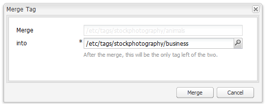

# Consola de etiquetado de IU clásica{#classic-ui-tagging-console}

Esta sección es para la consola de etiquetado de la IU clásica.

La consola de etiquetado de IU táctil está [aquí](/help/sites-administering/tags.md#tagging-console).

Para acceder a la consola de etiquetado de la IU clásica:

* en autor
* iniciar sesión con privilegios administrativos
* buscar en la consola
por ejemplo, [https://localhost:4502/tagging](https://localhost:4502/tagging)

## Creación de tags y espacios de nombres {#creating-tags-and-namespaces}

1. Según el nivel desde el que comience, puede crear una etiqueta o un espacio de nombres con **Nuevo**:

   Si selecciona **Etiquetas**, puede crear un espacio de nombres:

   

   Si selecciona un espacio de nombres (por ejemplo **Demo**), puede crear una etiqueta dentro de ese espacio de nombres:

   

1. En ambos casos, introduzca

   * **Título**
(
*Requerido*) El título para mostrar de la etiqueta. Mientras se puede introducir cualquier carácter,
se recomienda no utilizar estos caracteres especiales:

      * `colon (:)` - delimitador de Área de nombres
      * `forward slash (/)` - delimitador de subetiqueta

      Estos caracteres no se mostrarán si se introducen.

   * **Nombre**
(
*Requerido*) El nombre de nodo de la etiqueta.

   * **Descripción**
(
*Opcional*) Una descripción para la etiqueta.

   * seleccionar **Crear**

## Edición de tags {#editing-tags}

1. En el panel de la derecha, seleccione la etiqueta que desee editar.
1. Haga clic en **Editar**.
1. Puede modificar el **Título** y la **Descripción**.
1. Haga clic en **Guardar** para cerrar el cuadro de diálogo.

## Eliminación de tags {#deleting-tags}

1. En el panel derecho, seleccione la etiqueta que desee eliminar.
1. Haga clic en **Eliminar**.
1. Haga clic en **Sí** para cerrar el cuadro de diálogo.

   La etiqueta ya no debería aparecer en la lista.

## Activación y desactivación de tags {#activating-and-deactivating-tags}

1. En el panel derecho, seleccione la Área de nombres o la etiqueta que desee activar (publicar) o desactivar (cancelar la publicación).
1. Haga clic en **Activar** o **Desactivar** según sea necesario.

## Lista - mostrar el lugar donde se hace referencia a los tags  {#list-showing-where-tags-are-referenced}

**Lista** abre una nueva ventana donde se muestran las rutas de todas las páginas mediante la etiqueta resaltada:

## Movimiento de tags {#moving-tags}

Para ayudar a los administradores y desarrolladores de etiquetas a limpiar la taxonomía o a cambiar el nombre de un ID de etiqueta, es posible mover una etiqueta a una nueva ubicación:

1. Abra la consola **Tagging**.
1. Seleccione la etiqueta y haga clic en **Mover...** en la barra de herramientas superior (o en el menú contextual).
1. En el cuadro de diálogo **Mover etiqueta**, defina:

   * **hasta**, el nodo de destino.
   * **Cambiar nombre a**, el nuevo nombre del nodo.

1. Haga clic en **Mover**.

El cuadro de diálogo **Mover etiqueta** tiene el siguiente aspecto:

>[!NOTE]
>
>Los autores no deben mover etiquetas ni cambiar el nombre de un ID de etiqueta. Cuando sea necesario, los autores solo deben [cambiar los títulos de las etiquetas](#editing-tags).

## Combinación de tags {#merging-tags}

Se pueden combinar etiquetas cuando una taxonomía tiene duplicados. Cuando la etiqueta A se combina con la etiqueta B, todas las páginas etiquetadas con la etiqueta A se etiquetarán con la etiqueta B y la etiqueta A ya no está disponible para los autores.

Para combinar una etiqueta con otra:

1. Abra la consola **Tagging**.
1. Seleccione la etiqueta y haga clic en **Combinar...** en la barra de herramientas superior (o en el menú contextual).
1. En el cuadro de diálogo **Combinar etiqueta**, defina:

   * **en**, el nodo de destino.

1. Haga clic en **Combinar**.

El cuadro de diálogo **Combinar etiqueta** tiene el siguiente aspecto:

## Recuento de uso de tags {#counting-usage-of-tags}

Para ver cuántas veces se está usando una etiqueta:

1. Abra la consola **Tagging**.
1. Haga clic en **Uso de recuento** en la barra de herramientas superior: en la columna Recuento se muestra el resultado.

## Administración de tags en distintos idiomas  {#managing-tags-in-different-languages}

La propiedad opcional `title`de una etiqueta puede traducirse a varios idiomas. La etiqueta `titles` se puede mostrar según el idioma del usuario o el idioma de la página.

### Definición de títulos de tags en varios idiomas {#defining-tag-titles-in-multiple-languages}

El siguiente procedimiento muestra cómo traducir la `title`etiqueta **Animals** al inglés, alemán y francés:

1. Vaya a la consola **Etiquetado**.
1. Edite la etiqueta **Animals** debajo de **Tags** > **Stock Photography**.
1. Agregue las traducciones en los siguientes idiomas:

   * **Inglés**: Animals
   * **Alemán**: Tiere
   * **Francés**: Animaux

1. Guarde los cambios.

El cuadro de diálogo tiene este aspecto:

La consola Etiquetado utiliza la configuración de idioma del usuario, por lo que para la etiqueta Animal se muestra &#39;Animaux&#39; para un usuario que establece el idioma en francés en las propiedades del usuario.

Para agregar un nuevo idioma al cuadro de diálogo, consulte la sección [Añadir un nuevo idioma al cuadro de diálogo Editar etiqueta](/help/sites-developing/building.md#adding-a-new-language-to-the-edit-tag-dialog) en la sección **Etiquetado para desarrolladores**.

### Visualización de títulos de etiquetas en propiedades de página en un idioma especificado {#displaying-tag-titles-in-page-properties-in-a-specified-language}

De forma predeterminada, la etiqueta `titles`en las propiedades de la página se muestra en el idioma de la página. El cuadro de diálogo de etiquetas en las propiedades de página tiene un campo de idioma que permite mostrar la etiqueta `titles`en un idioma diferente. El siguiente procedimiento describe cómo mostrar la etiqueta `titles`en francés:

1. Consulte la sección anterior para agregar la traducción al francés a **Animals** debajo de **Tags** > **Stock Photography**.
1. Abra las propiedades de página correspondientes a la página **Products** en la rama en inglés del sitio **Geometrixx**.
1. Abra el cuadro de diálogo **Etiquetas/Palabras clave** (seleccionando el menú desplegable a la derecha del área de visualización Etiquetas/Palabras clave) y seleccione el idioma **Francés** en el menú desplegable en la esquina inferior derecha.
1. Desplácese con las flechas izquierda-derecha hasta que pueda seleccionar la ficha **Fotografía de almacenamiento**

   Seleccione la etiqueta **Animals** (**Animaux**) y seleccione fuera del cuadro de diálogo para cerrarla y agregar la etiqueta a las propiedades de la página.

   

De forma predeterminada, el cuadro de diálogo Propiedades de la página muestra la etiqueta `titles`según el idioma de la página.

En general, el idioma de la etiqueta se toma del idioma de la página si el idioma de la página está disponible. Cuando se utiliza la [ `tag` utilidad](/help/sites-developing/building.md#tagging-on-the-client-side) en otros casos (por ejemplo, en formularios o en diálogos), el idioma de la etiqueta depende del contexto.

>[!NOTE]
>
>La nube de etiquetas y las palabras clave meta del componente de página estándar utilizan la etiqueta localizada `titles`en función del idioma de la página, si está disponible.