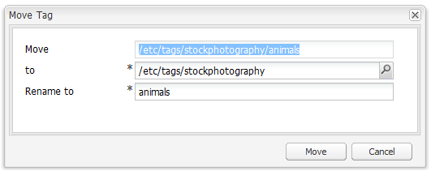

# Consola de etiquetado de IU clásica{#classic-ui-tagging-console}

Esta sección es para la consola de etiquetado de la IU clásica.

La consola de etiquetado de IU táctil está [aquí](/help/sites-administering/tags.md#tagging-console).

Para acceder a la consola de etiquetado de la IU clásica:

* en autor
* iniciar sesión con privilegios administrativos
* vaya a la consola, por ejemplo, [https://localhost:4502/tagging](https://localhost:4502/tagging)

## Creación de tags y espacios de nombres {#creating-tags-and-namespaces}

1. Según el nivel desde el que comience, puede crear una etiqueta o un espacio de nombres con **Nuevo**:

   Si selecciona **Etiquetas**, puede crear un espacio de nombres:

   

   Si selecciona un espacio de nombres (por ejemplo **Demo**), puede crear una etiqueta dentro de ese espacio de nombres:

   

1. En ambos casos, introduzca

   * **Título**(*obligatorio*) El título que se muestra para la etiqueta. Aunque se puede introducir cualquier carácter, se recomienda no utilizar estos caracteres especiales:

      * `colon (:)` - delimitador de espacio de nombres
      * `forward slash (/)` - delimitador de subetiqueta
      Estos caracteres no se mostrarán si se introducen.

   * **Nombre**(*obligatorio*) El nombre de nodo de la etiqueta.

   * **Descripción**(*opcional*) Descripción de la etiqueta.

   * select **Create**

## Edición de tags {#editing-tags}

1. En el panel de la derecha, seleccione la etiqueta que desee editar.
1. Haga clic en **Editar**.
1. Puede modificar el **Título** y la **Descripción**.
1. Haga clic en **Guardar** para cerrar el cuadro de diálogo.

## Eliminación de tags {#deleting-tags}

1. En el panel derecho, seleccione la etiqueta que desee eliminar.
1. Haga clic en **Eliminar**.
1. Click **Yes** to close the dialog.

   La etiqueta ya no debería aparecer en la lista.

## Activación y desactivación de tags {#activating-and-deactivating-tags}

1. En el panel derecho, seleccione el espacio de nombres o la etiqueta que desea activar (publicar) o desactivar (cancelar la publicación).
1. Haga clic en **Activar** o **Desactivar** según sea necesario.

## Lista - mostrar el lugar donde se hace referencia a los tags {#list-showing-where-tags-are-referenced}

**Lista** abre una nueva ventana donde se muestran las rutas de todas las páginas mediante la etiqueta resaltada:

## Movimiento de tags {#moving-tags}

Para ayudar a los administradores y desarrolladores de etiquetas a limpiar la taxonomía o a cambiar el nombre de un ID de etiqueta, es posible mover una etiqueta a una nueva ubicación:

1. Abra la consola **Tagging**.
1. Seleccione la etiqueta y haga clic en **Mover...** en la barra de herramientas superior (o en el menú contextual).
1. En el cuadro de diálogo **Mover etiqueta**, defina:

   * **hasta**, el nodo de destino.
   * **Cambiar nombre a**, el nuevo nombre del nodo.

1. Haga clic en **Mover**.

El cuadro de diálogo **Mover etiqueta** tiene el siguiente aspecto:

>[!NOTE]
>
>Los autores no deben mover etiquetas ni cambiar el nombre de un ID de etiqueta. Cuando sea necesario, los autores solo deben [cambiar los títulos](#editing-tags)de las etiquetas.

## Combinación de tags {#merging-tags}

Se pueden combinar etiquetas cuando una taxonomía tiene duplicados. Cuando la etiqueta A se combina con la etiqueta B, todas las páginas etiquetadas con la etiqueta A se etiquetarán con la etiqueta B y la etiqueta A ya no está disponible para los autores.

Para combinar una etiqueta con otra:

1. Abra la consola **Tagging**.
1. Seleccione la etiqueta y haga clic en **Combinar...** en la barra de herramientas superior (o en el menú contextual).
1. En el cuadro de diálogo **Combinar etiqueta**, defina:

   * **en**, el nodo de destino.

1. Haga clic en **Combinar**.

The **Merge Tag** dialog looks as follows:

## Recuento de uso de tags {#counting-usage-of-tags}

Para ver cuántas veces se está usando una etiqueta:

1. Abra la consola **Tagging**.
1. Haga clic en **Uso de recuento** en la barra de herramientas superior: en la columna Recuento se muestra el resultado.

## Administración de tags en distintos idiomas {#managing-tags-in-different-languages}

La `title`propiedad opcional de una etiqueta puede traducirse a varios idiomas. Tag `titles` can then be displayed according to the user language or to the page language.

### Definición de títulos de tags en varios idiomas {#defining-tag-titles-in-multiple-languages}

The following procedure shows how to translate the `title`of the tag **Animals** into English, German and French:

1. Go to the **Tagging** console.
1. Edit the tag **Animals** below **Tags** > **Stock Photography**.
1. Agregue las traducciones en los siguientes idiomas:

   * **Inglés**: Animals
   * **Alemán**: Tiere
   * **Francés**: Animaux

1. Guarde los cambios.

El cuadro de diálogo tiene este aspecto:

La consola Etiquetado utiliza la configuración de idioma del usuario, por lo que para la etiqueta Animal se muestra &#39;Animaux&#39; para un usuario que establece el idioma en francés en las propiedades del usuario.

To add a new language to the dialog, please refer to the section [Adding a New Language to the Edit Tag Dialog](/help/sites-developing/building.md#adding-a-new-language-to-the-edit-tag-dialog) in the **Tagging for Developers** section.

### Visualización de títulos de etiquetas en propiedades de página en un idioma específico {#displaying-tag-titles-in-page-properties-in-a-specified-language}

By default the tag `titles`in the page properties are displayed in the page language. The tag dialog in the page properties has a language field that enables the display of tag `titles`in a different language. The following procedure describes how to display the tag `titles`in French:

1. Refer to the previous section to add the French translation to the **Animals** below **Tags** > **Stock Photography**.
1. Abra las propiedades de página correspondientes a la página **Products** en la rama en inglés del sitio **Geometrixx**.
1. Abra el cuadro de diálogo **Etiquetas/Palabras clave** (seleccionando el menú desplegable a la derecha del área de visualización Etiquetas/Palabras clave) y seleccione el idioma **francés** en el menú desplegable en la esquina inferior derecha.
1. Desplácese con las flechas izquierda-derecha hasta que pueda seleccionar la ficha **Fotografía** de almacenamiento

   Seleccione la etiqueta **Animals** (**Animaux**) y seleccione fuera del cuadro de diálogo para cerrarla y agregar la etiqueta a las propiedades de la página.

   

By default, the Page Properties dialog displays the tag `titles`according to the page language.

En general, el idioma de la etiqueta se toma del idioma de la página si el idioma de la página está disponible. When the [ `tag` widget](/help/sites-developing/building.md#tagging-on-the-client-side) is used in other cases (for example in forms or in dialogs), the tag language depends on the context.

>[!NOTE]
>
>The tag cloud and the meta keywords in the standard page component use the localized tag `titles`based on the page language, if available.