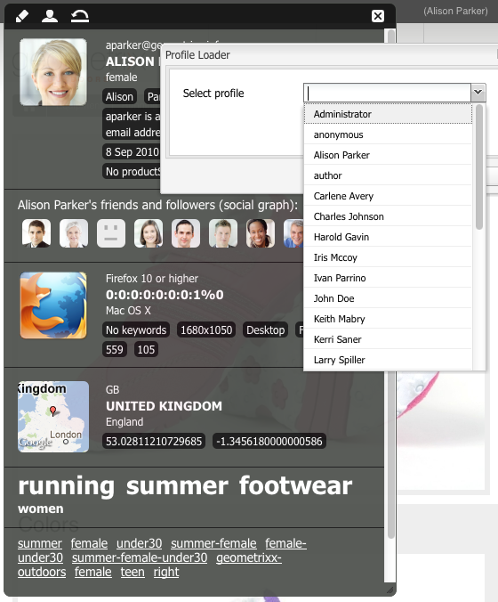
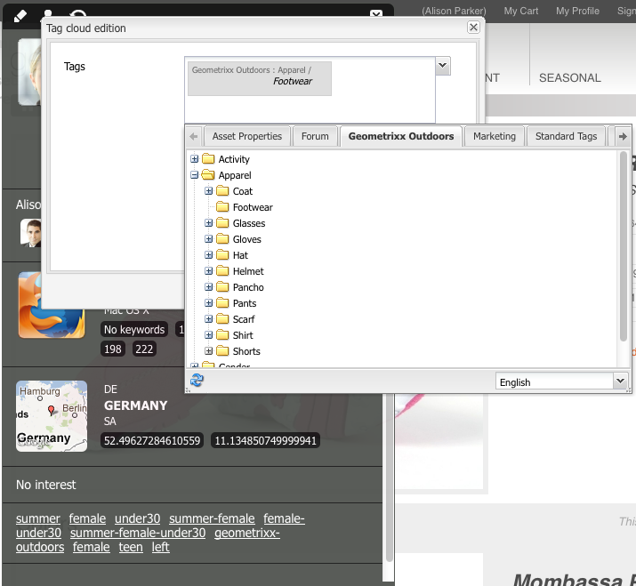

# ClientContext{#client-context}

>[!NOTE]
>
>Context del cliente ha sido reemplazado por ContextHub. Para obtener más información, consulte la [configuración](/help/sites-administering/contexthub-config.md) relacionada y la documentación del [desarrollador](/help/sites-developing/contexthub.md) .

Client Context es un mecanismo que le proporciona cierta información sobre la página y el visitante actuales. Se puede abrir con **Ctrl-Alt-c** (windows) o **control-opción-c** (Mac):

Tanto en el entorno de [publicación como en el de autor, se muestra información](#propertiesavailableintheclientcontext) sobre:

* El visitante; en función de la instancia, se solicita o deriva cierta información.
* Etiquetas de página y el número de veces que el visitante actual ha accedido a estas etiquetas (esto se muestra al mover el ratón sobre una etiqueta específica).
* Información de la página.
* Información sobre el entorno técnico; como la dirección IP, el navegador y la resolución de pantalla.
* Cualquier segmento que se encuentre resuelto en este momento.

Los iconos (solo disponibles en el entorno de creación) permiten configurar los detalles del contexto de cliente:

* **Editar** Se abrirá una nueva página que le permitirá [editar, agregar o quitar una propiedad](#editingprofiledetails)de perfil.

* **Cargar** Puede [seleccionar entre una lista de perfiles y cargar el perfil](#loading-a-new-user-profile) que desee probar.

* **Restablecer** Puede [restablecer el perfil](#resetting-the-profile-to-the-current-user) al del usuario actual.

## Componentes de ClientContext disponibles {#available-client-context-components}

ClientContext puede mostrar las siguientes propiedades ([según lo que se haya seleccionado con Editar](#adding-a-property-component)):

**Información** del surfista Muestra la siguiente información del lado del cliente:

* la dirección **IP**
* **palabras clave** utilizadas para la referencia del motor de búsqueda
* el **explorador** que se está utilizando
* el **SO** (sistema operativo) que se utiliza
* la **resolución de pantalla**
* la posición X **del** ratón
* la posición **Y** del ratón

**Flujo** de actividadProporciona información sobre la actividad social del usuario en varias plataformas; por ejemplo, los foros de AEM, los blogs, las clasificaciones, etc.

**Campaña** Permite a los autores simular una experiencia específica para una campaña. Este componente anula la resolución de campaña normal y la selección de experiencias para habilitar la prueba de varias permutaciones.

La resolución de campaña se basa normalmente en la propiedad priority de la campaña. La experiencia se selecciona normalmente en función de la segmentación.

**Carro** de compras Muestra la información del carro de compras, incluyendo las entradas de productos (título, cantidad, precioFormateado, etc.), las promociones resueltas (título, mensaje, etc.) y vales (código, descripción, etc.).

El almacén de sesiones del carro de compras también notifica al servidor los cambios de promoción resueltos (según los cambios de segmentación) mediante ClientContextCartServlet.

**Generic Store** Es un componente genérico que muestra el contenido de una tienda. Es una versión de nivel inferior del componente Propiedades genéricas de la tienda.

El almacén genérico debe configurarse con un procesador JS que muestre los datos de forma personalizada.

**Generic Store Properties** Es un componente genérico que muestra el contenido de una tienda. Es una versión de nivel superior del componente Tienda genérica.

El componente Propiedades genéricas de la tienda incluye un procesador predeterminado que enumera las propiedades configuradas (junto con una miniatura).

**Geolocalización** Muestra la latitud y la longitud del cliente. Utiliza la API de geolocalización HTML5 para consultar la ubicación actual en el navegador. De este modo, se muestra una ventana emergente al visitante, donde el explorador le pregunta si está de acuerdo con compartir su ubicación.

Cuando se muestra en Context Cloud, el componente utiliza una API de Google para mostrar un mapa como miniatura. El componente está sujeto a los límites [de](https://developers.google.com/maps/documentation/staticmaps/intro#Limits)uso de la API de Google.

>[!NOTE]
>
>En AEM 6.1, el almacén de geolocalización ya no proporciona la función de geocodificación inversa. Por lo tanto, el almacén de ubicación geográfica ya no recupera detalles sobre la ubicación actual, como el nombre de la ciudad o el código de país. Los segmentos que utilizan estos datos de almacenamiento no funcionarán correctamente. El almacén de geolocalización solo contiene la latitud y la longitud de una ubicación.

**Tienda** JSONP Un componente que muestra contenido que depende de la instalación.

El estándar JSONP es un complemento de JSON que permite eludir la misma política de origen (lo que hace imposible que una aplicación web se comunique con servidores que están en otro dominio). Consiste en envolver el objeto JSON en una llamada a una función para poder cargarlo como un `<script>` dominio del otro dominio (que es una excepción permitida a la misma política de origen).

La tienda JSONP es como cualquier otra tienda, pero carga información que proviene de otro dominio sin necesidad de tener un proxy para esa información en el dominio actual. Consulte el ejemplo en [Almacenamiento de datos en contexto de cliente mediante JSONP](/help/sites-administering/client-context.md#storing-data-in-client-context-via-jsonp).

>[!NOTE]
>
>La tienda JSONP no almacena en caché la información de la cookie, pero recupera esos datos en cada carga de página.

**Datos** de perfil Muestra información recopilada en el perfil del usuario. Por ejemplo: sexo, edad, dirección de correo electrónico, entre otros.

**Segmentos** resueltos Muestra qué segmentos se resuelven actualmente (a menudo según otra información mostrada en el contexto del cliente). Esto es de interés al configurar una campaña.

Por ejemplo, si el ratón está actualmente sobre la parte izquierda o derecha de la ventana. Este segmento se utiliza principalmente para pruebas, ya que los cambios se pueden ver inmediatamente.

**Gráfico** social Muestra el gráfico social de los amigos y seguidores del usuario.

>[!NOTE]
>
>Actualmente, se trata de una función de demostración que se basa en conjuntos de datos preconfigurados en los nodos de perfil de nuestros usuarios de demostración. Por ejemplo, consulte:
>
>`/home/users/geometrixx/aparker@geometrixx.info/profile` => propiedad de amigos

**Tag Cloud** Muestra las etiquetas configuradas en la página actual y las recopiladas al navegar por el sitio. Al mover el ratón sobre una etiqueta se muestra el número de veces que el usuario actual ha accedido a páginas que contienen esa etiqueta específica.

>[!NOTE]
Las etiquetas establecidas en los recursos DAM que se muestran en las páginas visitadas no se contarán.

**Almacenamiento** de tecnográficos Este componente depende de la instalación.

**Productos vistos** : realiza un seguimiento de los productos que el comprador ha visto. Se puede consultar el producto visto más recientemente o el producto visto más recientemente que no se encuentra en el carro de compras.

Este almacén de sesiones no tiene un componente de contexto de cliente predeterminado.

Para obtener más información, consulte Contexto [del cliente en detalle](/help/sites-developing/client-context.md).

>[!NOTE]
Los datos de página ya no están en el contexto del cliente como componente predeterminado. Si es necesario, puede agregarlo editando el contexto de cliente, agregando el componente Propiedades **de tienda** genéricas y, a continuación, configurándolo para definir la **Tienda** como `pagedata`.

## Cambio del perfil de contexto de cliente {#changing-the-client-context-profile}

Client Context le permite cambiar de forma interactiva los detalles:

* Si cambia el perfil que se utiliza en ClientContext, podrá ver las diferentes experiencias que verán los distintos usuarios en la página actual.
* Además de cambiar el perfil de usuario, puede cambiar algunos detalles del perfil para ver cómo difiere la experiencia de la página en varias condiciones.

### Carga de un nuevo perfil de usuario {#loading-a-new-user-profile}

Puede cambiar el perfil mediante:

* [uso del icono de carga](#loading-a-new-visitor-profile-with-the-load-profile-icon)
* [uso del deslizador de selección](#loadinganewvisitorprofilewiththeselectionslider)

Cuando haya terminado, puede [restablecer el perfil](#resetting-the-profile-to-the-current-user).

#### Carga de un nuevo perfil de visitante con el icono Cargar perfil {#loading-a-new-visitor-profile-with-the-load-profile-icon}

1. Haga clic en el icono Cargar perfil:

   

1. Se abrirá el cuadro de diálogo, donde puede seleccionar el perfil que desea cargar:

   

1. Click **OK** to load.

#### Carga de un nuevo perfil de usuario con el control deslizante de selección {#loading-a-new-user-profile-with-the-selection-slider}

También puede seleccionar un perfil con el control deslizante de selección:

1. Haga doble clic en el icono que representa al usuario actual. Se abrirá el selector, usará las flechas para navegar y ver los perfiles disponibles:

   

1. Haga clic en el perfil que desee cargar. Cuando se hayan cargado los detalles, haga clic fuera del selector para cerrar.

#### Restablecer el perfil al usuario actual {#resetting-the-profile-to-the-current-user}

1. Use el icono Restablecer para devolver el perfil en Client Context al del usuario actual:

   

### Cambio de la plataforma del explorador {#changing-the-browser-platform}

1. Haga doble clic en el icono que representa la plataforma del explorador. Se abrirá el selector, usará las flechas para navegar y ver las plataformas y los navegadores disponibles:

   

1. Haga clic en el navegador de plataforma que desee cargar. Cuando se hayan cargado los detalles, haga clic fuera del selector para cerrar.

### Cambio de la geolocalización {#changing-the-geolocation}

1. Haga doble clic en el icono de geolocalización. Se abrirá un mapa expandido, donde puede arrastrar el marcador a una nueva ubicación:

   

1. Haga clic fuera del mapa para cerrar.

### Cambio de la selección de etiquetas {#changing-the-tag-selection}

1. Haga doble clic en la sección Nube de etiquetas de Client Context. Se abrirá el cuadro de diálogo, donde puede seleccionar etiquetas:

   

1. Haga clic en Aceptar para cargar en Client Context.

## Edición del contexto de cliente {#editing-the-client-context}

La edición de un contexto de cliente se puede utilizar para establecer (o restablecer) los valores de ciertas propiedades, agregar una nueva propiedad o quitar una que ya no sea necesaria.

### Edición de detalles de propiedad {#editing-property-details}

La edición de un contexto de cliente se puede utilizar para establecer (o restablecer) los valores de ciertas propiedades. Esto le permite probar escenarios específicos (especialmente útiles para [segmentación](/help/sites-administering/campaign-segmentation.md) y [campañas](/help/sites-classic-ui-authoring/classic-personalization-campaigns.md)).

### Adición de un componente de propiedad {#adding-a-property-component}

Después de abrir la página **de diseño de** ClientContext, también puede **agregar** una propiedad completamente nueva mediante los componentes disponibles (los componentes aparecen en la barra de tareas o en el cuadro de diálogo **Insertar nuevo componente** que se abre después de hacer doble clic en el cuadro **Arrastrar componentes o recursos aquí** ):

### Eliminación de un componente de propiedad {#removing-a-property-component}

Después de abrir la página **de diseño de** ClientContext, también puede **quitar** una propiedad si ya no es necesario. Esto incluye las propiedades suministradas de forma predeterminada; **Restablecer** los restablecerá si se han eliminado.

## Almacenamiento de datos en el contexto del cliente mediante JSONP {#storing-data-in-client-context-via-jsonp}

Siga este ejemplo para utilizar el componente de almacén de contexto de la tienda JSONP para agregar datos externos a ClientContext. A continuación, cree un segmento basado en la información de esos datos. El ejemplo utiliza el servicio JSONP que proporciona WIPmania.com. El servicio devuelve información de geolocalización basada en la dirección IP del cliente web.

Este ejemplo utiliza el sitio web de muestra de Geometrixx Outdoors para acceder a Client Context y probar el segmento creado. Puede utilizar un sitio web diferente siempre y cuando la página haya habilitado ClientContext. (Consulte [Adición de contexto de cliente a una página](/help/sites-developing/client-context.md#adding-client-context-to-a-page)).

### Agregar el componente de la tienda JSONP {#add-the-jsonp-store-component}

Agregue el componente Tienda JSONP a Client Context y úselo para recuperar y almacenar información de geolocalización sobre el cliente web.

1. Abra la página de inicio en inglés del sitio Geometrixx Outdoors en la instancia de creación de AEM. ([https://localhost:4502/content/geometrixx-outdoors/en.html](https://localhost:4502/content/geometrixx-outdoors/en.html)).
1. Para abrir Client Context, pulse Ctrl-Alt-c (windows) o control-opción-c (Mac).
1. Haga clic en el icono Editar en la parte superior de Client Context para abrir ClientContext Designer.

   

1. Arrastre el componente Tienda JSONP a Client Context.

   

1. Haga doble clic en el componente para abrir el cuadro de diálogo de edición.
1. En el cuadro URL del servicio JSONP, introduzca la siguiente URL y, a continuación, haga clic en Buscar tienda:

   `https://api.wipmania.com/jsonp?callback=${callback}`

   El componente llama al servicio JSONP y enumera todas las propiedades que contienen los datos devueltos. Las propiedades de la lista son las que estarán disponibles en Client Context.

   

1. Haga clic en Aceptar.
1. Vuelva a la página de inicio de Geometrixx Outdoors y actualice la página. ClientContext ahora incluye la información del componente Tienda JSONP.

   

### Crear el segmento {#create-the-segment}

Utilice los datos del almacén de sesiones que ha creado con el componente de almacén JSONP. El segmento utiliza la latitud del almacén de sesiones y la fecha actual para determinar si es invierno en la ubicación del cliente.

1. Abra la consola Herramientas en el navegador web (`https://localhost:4502/miscadmin#/etc`).
1. En el árbol de carpetas, haga clic en la carpeta Herramientas/Segmentación y, a continuación, haga clic en Nuevo > Nueva carpeta. Especifique los siguientes valores de propiedad y haga clic en Crear:

   * Nombre: mysegments
   * Título: Mis segmentos

1. Seleccione la carpeta Mis segmentos y haga clic en Nuevo > Nueva página:

   1. Para el título, escriba Invierno.
   1. Seleccione la plantilla Segmento.
   1. Haga clic en Crear.

1. Haga clic con el botón secundario en el segmento de invierno y haga clic en Abrir.
1. Arrastre la propiedad Generic Store al contenedor AND predeterminado.

   

1. Haga doble clic en el componente para abrir el cuadro de diálogo de edición, especifique los siguientes valores de propiedad y, a continuación, haga clic en Aceptar:

   * Tienda: wipmania
   * Nombre de propiedad:latitude
   * Operador: es mayor que
   * Valor de propiedad: 30

1. Arrastre el componente Script al mismo contenedor AND y abra su cuadro de diálogo de edición. Agregue la siguiente secuencia de comandos y haga clic en Aceptar:

   `3 < new Date().getMonth() < 12`

