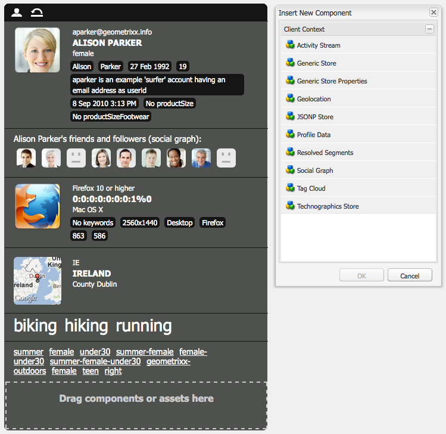

# Client Context{#client-context}

>[!NOTE]
>
>ContextHub ha reemplazado a Client Context. Para obtener más información, consulte la [configuración](/help/sites-developing/ch-configuring.md) y [promotor](/help/sites-developing/contexthub.md) documentación.

Client Context es un mecanismo que proporciona determinada información sobre la página y el visitante actuales. Se puede abrir utilizando **Ctrl-Alt-c** (Windows) o **control-option-c** (Mac):

Tanto en el entorno de publicación como de creación muestra información sobre:

* El visitante; según la instancia, se solicita o se deriva cierta información.
* Etiquetas de página y el número de veces que el visitante actual ha accedido a estas etiquetas (esto se muestra cuando mueve el ratón sobre una etiqueta específica)
* Información de página.
* Información sobre el entorno técnico; como la dirección IP, el explorador y la resolución de pantalla.
* Cualquier segmento que esté resuelto actualmente.

Los iconos (solo disponibles en el entorno de creación) permiten configurar los detalles del contexto del cliente:

* **Editar**
Se abrirá una nueva página para permitirle lo siguiente [edición, adición o eliminación de una propiedad de perfil](#editingprofiledetails).

* **Cargar**
Puede [seleccione de una lista de perfiles y cargue el perfil](#loading-a-new-user-profile) desea realizar la prueba.

* **Restablecer**
Puede [restablecimiento del perfil](#resetting-the-profile-to-the-current-user) a la del usuario actual.

## Componentes de Client Context disponibles {#available-client-context-components}

Client Context puede mostrar las siguientes propiedades ([en función de lo que se haya seleccionado utilizando Editar](#adding-a-property-component)):

**Información del internauta** Muestra la siguiente información del lado del cliente:

* el **Dirección IP**
* **palabras clave** se utiliza para referencia de motor de búsqueda
* el **explorador** en uso
* el **SO** (sistema operativo) en uso
* la pantalla **resolution**
* el **mouse X** position
* el **Y de ratón** position

**Flujo de actividad** AEM Esto proporciona información sobre la actividad social del usuario en varias plataformas; por ejemplo, los foros, blogs, clasificaciones, etc. de la.

**Campaign** Permite a los autores simular una experiencia específica para una campaña. Este componente anula la resolución normal de la campaña y la selección de experiencias para habilitar la prueba de varias permutaciones.

La resolución de la campaña se basa normalmente en la propiedad priority de la campaña. La experiencia se selecciona normalmente en función de la segmentación.

**Carrito** Muestra información del carro de compras, incluidas las entradas de producto (título, cantidad, precio, con formato, etc.), las promociones resueltas (título, mensaje, etc.) y cupones (código, descripción, etc.).

El almacén de sesiones del carro de compras también notifica al servidor acerca de los cambios de promoción resueltos (según los cambios de segmentación) mediante ClientContextCartServlet.

**Almacenamiento genérico** Es un componente genérico que muestra el contenido de un almacén. Es una versión de nivel inferior del componente Propiedades de almacenamiento genérico.

El almacén genérico debe configurarse con un procesador de JS que muestre los datos de forma personalizada.

**Propiedades de almacenamiento genérico** Es un componente genérico que muestra el contenido de un almacén. Es una versión de nivel superior del componente Almacenamiento genérico.

El componente Propiedades de almacenamiento genérico incluye un procesador predeterminado que enumera las propiedades configuradas (junto con una miniatura).

**Geolocalización** Muestra la latitud y longitud del cliente. Utiliza la API de geolocalización de HTML5 para consultar la ubicación actual en el explorador. Esto hace que se muestre una ventana emergente al visitante, donde el explorador le preguntará si acepta compartir su ubicación.

Cuando se muestra en Context Cloud, el componente utiliza una API de Google para mostrar un mapa como miniatura. El componente está sujeto a la API de Google [límites de uso](https://developers.google.com/maps/documentation/staticmaps/intro#Limits).

>[!NOTE]
>
>AEM En la versión 6.1, el almacén de geolocalización ya no proporciona la función de geocodificación inversa. Por lo tanto, el almacén de geolocalización ya no recupera detalles sobre la ubicación actual, como el nombre de la ciudad o el código de país. Los segmentos que utilicen estos datos de almacén no funcionarán correctamente. El almacén de geolocalización solo contiene la latitud y longitud de una ubicación.

**Almacenamiento JSONP** Componente que muestra contenido que depende de la instalación.

El estándar JSONP es un complemento de JSON que permite eludir la misma política de origen (lo que impide que una aplicación web se comunique con servidores que están en otro dominio). Consiste en ajustar el objeto JSON en una llamada a una función para poder cargarlo como un `<script>` del otro dominio (que es una excepción permitida en la misma directiva de origen).

El Almacén JSONP es como cualquier otro almacén, pero carga información que proviene de otro dominio sin necesidad de tener un proxy para esa información en el dominio actual. Consulte el ejemplo en [Almacenamiento de datos en Client Context mediante JSONP](/help/sites-administering/client-context.md#storing-data-in-client-context-via-jsonp).

>[!NOTE]
>
>El Almacenamiento JSONP no almacena en caché la información de la cookie, pero recupera esos datos en cada carga de página.

**Datos de perfil** Muestra información recopilada en el perfil de usuario. Por ejemplo: sexo, edad, dirección de correo electrónico, entre otros.

**Segmentos resueltos** Muestra los segmentos que se resuelven actualmente (a menudo en función de otra información mostrada en el contexto del cliente). Esto es de interés al configurar una campaña.

Por ejemplo, si el ratón se encuentra actualmente sobre la parte izquierda o derecha de la ventana. Este segmento se utiliza principalmente para pruebas, ya que los cambios se pueden ver inmediatamente.

**Gráfico social** Muestra el gráfico social de los amigos y seguidores del usuario.

>[!NOTE]
>
>Actualmente, esta es una función de demostración que depende de datos preconfigurados establecidos en los nodos de perfil de los usuarios de demostración. Por ejemplo, consulte:
>
>`/home/users/geometrixx/aparker@geometrixx.info/profile` => propiedad de amigos

**Nube de etiquetas** Muestra las etiquetas configuradas en la página actual y las recopiladas al navegar por el sitio. Al mover el ratón sobre una etiqueta, se muestra el número de veces que el usuario actual ha accedido a páginas que contienen esa etiqueta específica.

>[!NOTE]
>
Las etiquetas configuradas en recursos DAM que se muestran en las páginas visitadas no se contarán.

**Almacenamiento tecnográfico** Este componente depende de la instalación.

**Productos vistos** Realiza un seguimiento de los productos que el comprador ha visto. Se puede consultar el producto visualizado más recientemente o el producto visualizado más recientemente que no está aún en el carro de compras.

Este almacén de sesión no tiene ningún componente de contexto de cliente predeterminado.

Para obtener más información, consulte [Client Context en detalle](/help/sites-developing/client-context.md).

>[!NOTE]
>
Los datos de página ya no están en el contexto de cliente como componente predeterminado. Si es necesario, puede agregarlo editando el contexto de cliente y agregando el **Propiedades de almacenamiento genérico** y, a continuación, configure para definir el componente **Almacenar** as `pagedata`.

## Cambio del perfil de ClientContext {#changing-the-client-context-profile}

Client Context permite cambiar los detalles de forma interactiva:

* Cambiar el perfil que se utiliza en Client Context le permite ver las diferentes experiencias que los distintos usuarios verán para la página actual.
* Además de cambiar el perfil de usuario, puede cambiar algunos detalles del perfil para ver cómo difiere la experiencia de la página en diversas condiciones.

### Carga de un nuevo perfil de usuario {#loading-a-new-user-profile}

Para cambiar el perfil, haga lo siguiente:

* [uso del icono de carga](#loading-a-new-visitor-profile-with-the-load-profile-icon)
* [uso del regulador de selección](#loadinganewvisitorprofilewiththeselectionslider)

Cuando termine, puede [restablecimiento del perfil](#resetting-the-profile-to-the-current-user).

#### Carga de un nuevo perfil del visitante con el icono de carga de perfil {#loading-a-new-visitor-profile-with-the-load-profile-icon}

1. Haga clic en el icono Cargar perfil:

   

1. Se abrirá el cuadro de diálogo, donde puede seleccionar el perfil que desea cargar:

   

1. Clic **OK** para cargar.

#### Carga de un nuevo perfil de usuario con el regulador de selección {#loading-a-new-user-profile-with-the-selection-slider}

También puede seleccionar un perfil con el control deslizante de selección:

1. Haga doble clic en el icono que representa al usuario actual. Se abrirá el selector, utilice las flechas para navegar y ver los perfiles disponibles:

   

1. Haga clic en el perfil que desee cargar. Una vez cargados los detalles, haga clic fuera del selector para cerrar.

#### Restablecimiento del perfil al usuario actual {#resetting-the-profile-to-the-current-user}

1. Utilice el icono de restablecimiento para devolver el perfil de Client Context al del usuario actual:

   

### Cambio de la plataforma del explorador {#changing-the-browser-platform}

1. Haga doble clic en el icono que representa la plataforma del explorador. Se abrirá el selector, utilice las flechas para navegar y ver las plataformas o exploradores disponibles:

   

1. Haga clic en el explorador de la plataforma que desee cargar. Una vez cargados los detalles, haga clic fuera del selector para cerrar.

### Cambio de la geolocalización {#changing-the-geolocation}

1. Haga doble clic en el icono de geolocalización. Se abrirá un mapa expandido, donde puede arrastrar el marcador a una nueva ubicación:

   

1. Haga clic fuera del mapa para cerrar.

### Cambio de la selección de etiquetas {#changing-the-tag-selection}

1. Haga doble clic en la sección Nube de etiquetas de Client Context. Se abrirá el cuadro de diálogo, donde puede seleccionar las etiquetas:

   

1. Haga clic en Aceptar para cargar en Client Context.

## Edición de Client Context {#editing-the-client-context}

La edición de un contexto de cliente se puede utilizar para establecer (o restablecer) los valores de determinadas propiedades, añadir una nueva propiedad o eliminar una que ya no sea necesaria.

### Edición de detalles de propiedad {#editing-property-details}

La edición de un contexto de cliente se puede utilizar para establecer (o restablecer) los valores de determinadas propiedades. Esto permite probar escenarios específicos (especialmente útiles para [segmentación](/help/sites-administering/campaign-segmentation.md) y [campañas](/help/sites-classic-ui-authoring/classic-personalization-campaigns.md)).

### Añadir un componente de propiedad {#adding-a-property-component}

Después de abrir el **página de diseño del ClientContext**, también puede **Añadir** una propiedad completamente nueva que utilice los componentes disponibles (los componentes se enumeran en la barra de tareas o en el **Insertar nuevo componente** que se abre después de hacer doble clic en el **Arrastre componentes o recursos aquí** cuadro):

### Eliminación de un componente de propiedad {#removing-a-property-component}

Después de abrir el **página de diseño del ClientContext**, también puede **Eliminar** una propiedad si ya no es necesaria. Esto incluye propiedades proporcionadas de forma predeterminada; **Restablecer** restablecerá estos si se han eliminado.

## Almacenamiento de datos en Client Context mediante JSONP {#storing-data-in-client-context-via-jsonp}

Siga este ejemplo para utilizar el componente de almacén de contexto JSONP Store para agregar datos externos a Client Context. A continuación, cree un segmento basado en la información de esos datos. El ejemplo utiliza el servicio JSONP que proporciona WIPmania.com. El servicio devuelve información de geolocalización basada en la dirección IP del cliente web.

En este ejemplo se utiliza el sitio web de ejemplo Geometrixx Outdoors para acceder a Client Context y probar el segmento creado. Puede utilizar un sitio web diferente siempre y cuando la página tenga habilitado Client Context. (Consulte [Adición de Client Context a una página](/help/sites-developing/client-context.md#adding-client-context-to-a-page).)

### Añadir el componente de tienda JSONP {#add-the-jsonp-store-component}

Agregue el componente Almacenamiento JSONP a Client Context y utilícelo para recuperar y almacenar información de geolocalización sobre el cliente web.

1. Abra la página de inicio en inglés del sitio de Geometrixx Outdoors AEM en la instancia de autor de la. ([https://localhost:4502/content/geometrixx-outdoors/en.html](https://localhost:4502/content/geometrixx-outdoors/en.html)).
1. Para abrir Client Context, pulse Ctrl-Alt-c (Windows) o control-opción-c (Mac).
1. Haga clic en el icono de edición en la parte superior de Client Context para abrir el Diseñador de Client Context.

   

1. Arrastre el componente Almacenamiento JSONP a Client Context.

   

1. Haga doble clic en el componente para abrir el cuadro de diálogo de edición.
1. En el cuadro URL del servicio JSONP, escriba la siguiente dirección URL y, a continuación, haga clic en Recuperar almacén:

   `https://api.wipmania.com/jsonp?callback=${callback}`

   El componente llama al servicio JSONP y enumera todas las propiedades que contienen los datos devueltos. Las propiedades de la lista son las que estarán disponibles en Client Context.

   

1. Haga clic en Aceptar.
1. Vuelva a la página principal de los Geometrixx Outdoors y actualice la página. Client Context ahora incluye la información del componente Tienda JSONP.

   

### Creación del segmento {#create-the-segment}

Utilice los datos del almacén de sesiones que ha creado con el componente de almacén JSONP. El segmento utiliza la latitud del almacén de sesiones y la fecha actual para determinar si es invierno en la ubicación del cliente.

1. Abra la consola Herramientas en el explorador web (`https://localhost:4502/miscadmin#/etc`).
1. En el árbol de carpetas, haga clic en la carpeta Herramientas/Segmentación y, a continuación, haga clic en Nueva > Nueva carpeta. Especifique los siguientes valores de propiedad y haga clic en Crear:

   * Nombre: mysegments
   * Título: Mis segmentos

1. Seleccione la carpeta Mis segmentos y haga clic en Nueva > Nueva página:

   1. En Título, escriba Invierno.
   1. Seleccione la Plantilla de segmentos.
   1. Haga clic en Crear.

1. Haga clic con el botón derecho en el segmento Invierno y haga clic en Abrir.
1. Arrastre la Propiedad de almacenamiento genérico al contenedor AND predeterminado.

   

1. Haga doble clic en el componente para abrir el cuadro de diálogo de edición, especifique los siguientes valores de propiedad y, a continuación, haga clic en Aceptar:

   * Tienda: wipmania
   * Nombre de la propiedad: latitude
   * Operador: is greater than
   * Valor de la propiedad: 30

1. Arrastre el componente Script al mismo contenedor AND y abra su cuadro de diálogo de edición. Añada la siguiente secuencia de comandos y haga clic en Aceptar:

   `3 < new Date().getMonth() < 12`
