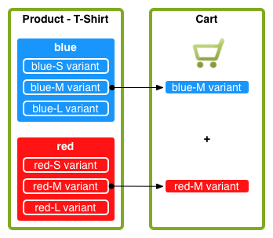
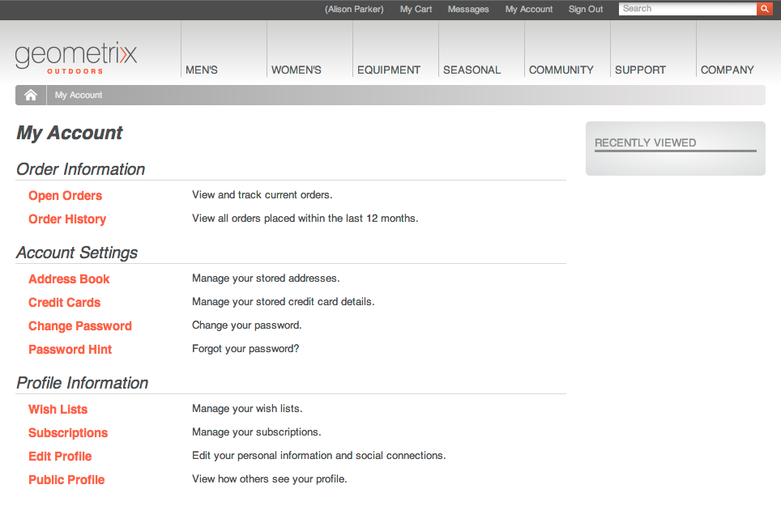

#  Conceptos{#concepts}

El marco de integración proporciona los mecanismos y componentes para:

* conexión a un motor de comercio electrónico
* extracción de datos en AEM
* mostrar esos datos y recopilar las respuestas del comprador
* devolver detalles de transacción
* buscar los datos de ambos sistemas

Esto significa que:

* Los compradores pueden registrarse y comprar sin esperar.
* Los cambios en los precios serán vistos por los compradores sin demora.
* Los productos se pueden agregar según sea necesario.

>[!NOTE]
>
>El marco de comercio electrónico se puede utilizar con:
>
>* [Magento](https://www.adobe.io/apis/experiencecloud/commerce-integration-framework/integrations.html#!AdobeDocs/commerce-cif-documentation/master/integrations/02-AEM-Magento.md)
>* [SAP Commerce Cloud](/help/sites-administering/sap-commerce-cloud.md)
>* [Salesforce Commerce Cloud](https://github.com/adobe/commerce-salesforce)
>

>[!CAUTION]
>
>El marco [de integración de](https://www.adobe.com/solutions/web-experience-management/commerce.html) eCommerce es un complemento de AEM.
>
>Su representante de ventas podrá dar detalles completos, según el motor apropiado.

>[!CAUTION]
>
>El marco proporciona los requisitos básicos para su propio proyecto.
>
>Siempre se necesita una cierta cantidad de trabajo de desarrollo para adaptar el marco a sus especificaciones.

>[!CAUTION]
>
>La instalación estándar de AEM incluye la implementación genérica de comercio electrónico de AEM (JCR).
>
>Actualmente, se ha diseñado para fines de demostración o como base básica de una implementación personalizada según sus necesidades.

Para optimizar el funcionamiento, tanto AEM como el motor de comercio electrónico se concentran en su propio área de experiencia. La información se transfiere entre los dos en tiempo real; por ejemplo:

* AEM puede:

   * Solicitar:

      * Información del producto del motor de comercio electrónico.
   * Proporcione:

      * Vistas del usuario para obtener información sobre el producto, el carro de compras y el cierre de compra.
      * Carro de compras e información de cierre de compra al motor de comercio electrónico.
      * Optimización de motores de búsqueda (SEO).
      * Funcionalidad de la comunidad.
      * Interacciones de marketing no estructuradas.

* El motor de comercio electrónico puede:

   * Proporcione:

      * Información del producto de la base de datos.
      * Administración de variantes de productos.
      * Administración de pedidos.
      * ERP (planificación de recursos institucionales).
      * Busque dentro de la información del producto.
   * Proceso:

      * El carro de compras.
      * El cierre de compra.
      * Cumplimiento de pedidos.

>[!NOTE]
>
>Los detalles exactos dependerán del motor de comercio electrónico y de la implementación del proyecto.

Se proporcionan varios componentes de AEM integrados para utilizar la capa de integración. En la actualidad se incluyen:

* Información del producto
* Carro de compras
* Cierre de compra
* Mi cuenta

También hay varias opciones de búsqueda disponibles.

## Arquitectura {#architecture}

El marco de integración proporciona la API, una serie de componentes para ilustrar la funcionalidad y varias extensiones para proporcionar ejemplos de métodos de conexión:

La estructura le permite acceder a funciones como:

### Implementaciones {#implementations}

AEM eCommerce se implementa con un motor de comercio electrónico:

* El marco de integración de eCommerce se ha creado para que pueda integrar fácilmente un motor de comercio electrónico con AEM. El motor de comercio electrónico creado específicamente controla los datos del producto, los carros de compras, el cierre de compra y el cumplimiento de pedidos, mientras que AEM controla la visualización de datos y las campañas de marketing.

>[!NOTE]
>
>La instalación estándar de AEM incluye la implementación genérica de comercio electrónico de AEM (JCR).
>
>Actualmente, se ha diseñado para fines de demostración o como base básica de una implementación personalizada según sus necesidades.
>
>El comercio electrónico de AEM implementado en AEM mediante el uso de un desarrollo genérico basado en JCR es:
>
>* Un ejemplo de comercio electrónico independiente y nativo de AEM que ilustra el uso de la API. Esto se puede utilizar para controlar los datos del producto, los carros de compras y el cierre de compra junto con la visualización de datos y las campañas de marketing existentes. En este caso, la base de datos de productos se almacena en el repositorio nativo de AEM (implementación de [JCR](https://docs.adobe.com/content/docs/en/spec/jcr/2.0/index.html)por parte de Adobe).
   >  La instalación estándar de AEM contiene los conceptos básicos de la implementación [genérica de comercio electrónico](/help/sites-administering/generic.md).
>

### Proveedores de comercio {#commerce-providers}

Al importar datos desde un motor de comercio a su sitio de comercio electrónico de AEM, se utiliza un proveedor de comercio para proporcionar datos a los importadores. Un proveedor de comercio puede admitir varios importadores.

Un proveedor de comercio es un código AEM personalizado para:

* interfaz a un motor de comercio back-end
* implementar un sistema de comercio en la parte superior del repositorio JCR

Actualmente hay dos proveedores de comercio de ejemplo disponibles para AEM:

* una para geometrixx-hybris
* otro para geometrixx-generic (JCR)

Aunque normalmente un proyecto necesitará desarrollar su propio proveedor de comercio personalizado específico a su PIM y esquema de datos de producto.

>[!NOTE]
>
>Los importadores de geometrixx utilizan archivos CSV; hay una descripción del esquema aceptado (con las propiedades personalizadas permitidas) en los comentarios sobre su implementación.

ProductServicesManager [mantiene (a través de](https://helpx.adobe.com/experience-manager/6-5/sites/developing/using/reference-materials/javadoc/com/adobe/cq/commerce/pim/api/ProductServicesManager.html) OSGi [)una lista de implementaciones de las interfaces](/help/sites-deploying/configuring.md#osgi-configuration-settings)ProductImporter [y](https://helpx.adobe.com/experience-manager/6-5/sites/developing/using/reference-materials/javadoc/com/adobe/cq/commerce/pim/api/ProductImporter.html) CatalogBlueprintImporter  . Se enumeran en el campo desplegable **Importador/Proveedor** de comercio del asistente de importación (con la `commerceProvider` propiedad como nombre).

Cuando un importador o proveedor de comercio específico está disponible en la lista desplegable, los datos complementarios que necesita deben definirse (según el tipo de importador) en:

* `/apps/commerce/gui/content/catalogs/importblueprintswizard/importers`
* `/apps/commerce/gui/content/products/importproductswizard/importers`

La carpeta de la `importers` carpeta correspondiente debe coincidir con el nombre del importador; por ejemplo:

* `.../importproductswizard/importers/geometrixx/.content.xml`

El importador define el formato del archivo de importación de origen. O el importador puede establecer una conexión (por ejemplo, WebDAV o http) con el motor de comercio.

## Funciones {#roles}

El sistema integrado se ocupa de las siguientes funciones para mantener los datos:

* Usuario de Administración de Información del Producto (PIM) que mantiene:

   * Información del producto.
   * Taxonomía, categorización, aprobación.
   * Interactúa con la administración de recursos digitales.
   * Precios - a menudo esto viene de un sistema ERP y no se mantiene explícitamente en el sistema comercial.

* Autor o administrador de marketing que mantiene:

   * Contenido de marketing para todos los canales.
   * Promociones.
   * Cupones.
   * Campañas.

* Surfista/comprador que:

   * Visualiza la información del producto.
   * Coloca los artículos en el carro de compras.
   * Comprueba sus pedidos.
   * Se espera el cumplimiento del pedido.

Aunque la ubicación real puede depender de la implementación; por ejemplo, genérico o con un motor de comercio electrónico:

## Productos {#products}

### Datos del producto frente a datos de marketing {#product-data-versus-marketing-data}

#### Categorías estructurales y de marketing {#structural-versus-marketing-categories}

Si se pueden diferenciar las dos categorías siguientes, esto le permite aclarar las direcciones URL con una estructura significativa (árboles de `cq:Page` nodos) y, por lo tanto, muy próximas a la administración de contenido clásica de AEM):

* *Categorías *estructurales

   El árbol de categorías que define *qué es un producto*; por ejemplo:

   `/products/mens/shoes/sneakers`

* *Categorías de mercadotecnia*

   Todas las demás categorías a las que puede pertenecer un *producto*; por ejemplo:

   `/special-offers/christmas/shoes`)

### Datos del producto {#product-data}

Para presentar y administrar su producto, querrá tener una amplia gama de información sobre ellos.

Los datos del producto pueden ser:

* mantenido directamente en AEM (genérico).
* mantenido en el motor de comercio electrónico y disponible en AEM.

   Según el tipo de datos, se [sincroniza](#catalog-maintenance-data-synchronization) según sea necesario o se accede directamente a ellos; por ejemplo: los datos críticos y altamente volátiles, como los precios de los productos, se recuperan del motor de comercio electrónico en cada solicitud de página para garantizar que siempre estén actualizados.

En cualquier caso, cuando los datos del producto se han introducido o importado en AEM, se pueden ver desde la consola **Productos** . Aquí, las vistas de tarjeta y lista de un producto muestran información como:

* la imagen
* el código de SKU
* cuando se modificó por última vez

### Variantes del producto {#product-variants}

Para los productos adecuados también se puede obtener información sobre las variantes. Por ejemplo, para los artículos de ropa, los diferentes colores disponibles se mantienen como variantes:

### Atributos del producto {#product-attributes}

Los atributos individuales de cada producto pueden depender del motor de comercio electrónico que se utilice y de la implementación de AEM. Están disponibles (según corresponda) al ver páginas de productos o al editar la información de productos y pueden incluir:

* **Imagen**

   Imagen del producto.

* **Título**

   El nombre del producto.

* **Descripción**

   Descripción textual del producto.

* **Etiquetas**

   Etiquetas utilizadas para agrupar productos relacionados.

* **Categoría de recursos predeterminada**

   Categoría predeterminada para los recursos.

* **Datos de ERP**

   Información sobre planificación de los recursos institucionales.

   * **SKU**

      Información de la unidad de almacenamiento (SKU).

   * **Color**
   * **Tamaño**
   * **Precio**

      El precio unitario del producto.

* **Resumen**

   Un resumen de las características del producto.

* **Características**

   Detalles más completos de las características del producto.

### Recursos del producto {#product-assets}

Se puede mantener una selección de recursos para productos individuales. Normalmente, se incluyen imágenes y vídeos.

## Catálogos {#catalogs}

Un catálogo agrupa los datos del producto para facilitar la administración y la representación al comprador. A menudo, un catálogo se estructura según atributos como idioma, área geográfica, marca, temporada, pasatiempo, deporte, entre muchos otros.

### Estructura del catálogo {#catalog-structure}

#### Catálogos en varios idiomas {#catalogs-in-multiple-languages}

AEM admite el contenido del producto en varios idiomas. Al solicitar datos, el marco de integración recupera el idioma del árbol actual (por ejemplo, `en_US` para las páginas en `/content/geometrixx-outdoors/en_US`).

Para una tienda multilingüe, puede importar el catálogo para cada árbol de idiomas de forma individual (o copiarlo mediante [MSM](/help/sites-administering/msm.md)).

#### Catálogos para varias marcas {#catalogs-for-multiple-brands}

Al igual que en el caso de los idiomas, las grandes empresas multinacionales pueden necesitar atender a múltiples marcas.

#### Catálogos por etiquetas {#catalogs-by-tags}

Las etiquetas también se pueden usar para agrupar productos en un catálogo. Pueden utilizarse para catálogos más dinámicos, como ofertas de temporada.

### Configuración del catálogo (importación inicial) {#catalog-setup-initial-import}

Según la implementación, puede importar los datos de producto necesarios para el catálogo base en AEM desde:

* un archivo CSV (para la implementación genérica)
* el motor de comercio electrónico

### Mantenimiento del catálogo (Sincronización de datos) {#catalog-maintenance-data-synchronization}

Será inevitable realizar más cambios en los datos del producto:

* para la implementación genérica, se pueden administrar con el editor de [productos](/help/sites-administering/generic.md#editing-product-information)
* cuando se utiliza un motor de [comercio electrónico, los cambios deben sincronizarse](#data-synchronization-with-an-ecommerce-engine-ongoing)

#### Sincronización de datos con un motor de comercio electrónico (en curso) {#data-synchronization-with-an-ecommerce-engine-ongoing}

Después de la importación inicial, los cambios en los datos del producto son inevitables.

Al utilizar un motor de comercio electrónico, los datos del producto se mantienen allí y deben estar disponibles en AEM. Los datos de este producto deben sincronizarse al realizar las actualizaciones.

Esto puede depender del tipo de datos:

* Se utiliza una sincronización [periódica junto con una fuente de datos de cambios](/help/sites-developing/sap-commerce-cloud.md#product-synchronization-and-publishing).

   Además de esto, puede seleccionar actualizaciones específicas para una actualización rápida.

* Los datos muy volátiles, como la información de precios, se recuperan del motor de comercio para cada solicitud de página, para garantizar que siempre estén actualizados.

### Catálogos: rendimiento y escala {#catalogs-performance-and-scaling}

La importación de un catálogo grande con un número elevado de productos (normalmente más de 100.000) desde un motor de comercio electrónico (PIM) puede afectar al sistema debido al gran número de nodos. También puede ralentizar la instancia de creación si los productos tienen recursos asociados (por ejemplo, imágenes de productos). Esto se debe al hecho de que el postprocesamiento de estos recursos requiere una gran cantidad de CPU y memoria.

Existen varias estrategias que puede elegir para solucionar estos problemas:

* [Agrupación](#bucketing) : para cubrir el gran número de nodos
* [Descarga del posprocesamiento de recursos a una instancia dedicada](#offload-asset-post-processing-to-a-dedicated-instance)
* [Sólo importar datos de productos](#only-import-product-data)
* [Importar Throttling y lotes guardados](#import-throttling-and-batch-saves)
* [Prueba de rendimiento](#performance-testing)
* [Rendimiento - Varios](#performance-miscellaneous)

#### Atasco {#bucketing}

Si un nodo JCR tiene muchos nodos secundarios directos (por ejemplo, 1000 o más), se requieren bloques (carpetas fantasma) para garantizar que el rendimiento no se vea afectado. Se generan según un algoritmo al importar.

Estos bloques toman la forma de carpetas fantasma que se introducen en la estructura del catálogo, pero que se pueden configurar para que no se muestren en las direcciones URL públicas.

#### Descarga del posprocesamiento de recursos a una instancia dedicada {#offload-asset-post-processing-to-a-dedicated-instance}

Este escenario implica la configuración de dos instancias de autor:

1. Instancia de autor maestro

   Importa datos de producto desde PIM, en los que el posprocesamiento de las rutas de recursos está desactivado.

1. Instancia de autor de DAM dedicada

   Importa y postprocesa recursos de producto desde el PIM y, a continuación, los replica en la instancia de creación maestra para su uso.

#### Sólo importar datos de productos {#only-import-product-data}

En los casos en que los productos no contienen recursos (imágenes) que se van a importar, puede importar los datos del producto sin que se vean afectados por el posprocesamiento de los recursos.

<!--delete
#### Import Throttling and Batch Saves {#import-throttling-and-batch-saves}

[Import throttling](/help/sites-deploying/scaling.md#import-throttling) and [batch saves](/help/sites-deploying/scaling.md#batch-saves) are two general [scaling](/help/sites-deploying/scaling.md) mechanisms that can help when importing large volumes of data.-->

#### Prueba de rendimiento {#performance-testing}

Las pruebas de rendimiento deben tenerse en cuenta en las implementaciones de comercio electrónico de AEM:

* Entorno de creación:

   La actividad en segundo plano (por ejemplo, la importación) puede producirse al mismo tiempo que la actividad normal del usuario (por ejemplo, la edición de páginas) e incluso si el rendimiento en primer plano tiene (en general) una prioridad mayor, el mal rendimiento que ven los autores en línea puede provocar frustraciones que puedan bloquear una decisión de lanzamiento.

* Entorno de publicación:

   La replicación es un proceso crítico para garantizar que el contenido se publique de manera rápida y confiable. Esto puede verse afectado por la forma en que el autor agrupa el contenido que se va a publicar.

* Parte delantera:

   La combinación de invalidaciones de caché y de front-end puede generar posibles sorpresas en el rendimiento. La prueba ayuda a evitarlos.

Tenga en cuenta que esta prueba de rendimiento requiere conocimientos y análisis de su objetivo:

* Volúmenes de contenido

   * Recursos
   * Productos y SKU localizados de I18ned

* Actividad del usuario:

   * Edición masiva
   * Publicación masiva
   * Solicitudes de búsqueda intensas

* Procesos de antecedentes

   * Importaciones
   * Actualizaciones de sincronización (por ejemplo, precios)

* Requisitos de mantenimiento (copia de seguridad, optimización de Tar PM, recolección de elementos no utilizados del almacén de datos, etc.)

#### Rendimiento - Varios {#performance-miscellaneous}

En todas las implementaciones se pueden tener en cuenta los siguientes puntos:

* Como producto, las unidades y categorías de almacenamiento pueden ser numerosas, intente utilizar el menor número posible de nodos para modelar el contenido.

   Cuantos más nodos tenga, más flexible será su contenido (por ejemplo, parsys). Sin embargo, todo es una solución y ¿necesita flexibilidad individual (de forma predeterminada) al manipular (por ejemplo) productos de 30.000 rpm?

* Evite la duplicación tanto como pueda (consulte localización) o, cuando lo haga, piense en cuántos nodos conducirá la duplicación.
* Intente etiquetar el contenido tanto como pueda para preparar la optimización de la consulta.

   Por ejemplo:

   `/content/products/france/fr/shoe/reebok/pump/46 SKU`

   debe tener una etiqueta por nivel de contenido (es decir, país, idioma, categoría, marca, producto). Buscando

   `//element(*,my:Sku)[@country=’france’ and @language=’fr’`

   y

   `@category=’shoe’ and @brand=’reebok’ and @product=’pump’]`

   será drásticamente más rápido que buscar

   `/jcr:root/content/france/fr/shoe/reebok/pump/element(*,my:Sku)`

* En la pila técnica, planifique servicios y modelos de acceso a contenido muy factorizados. Se trata de una práctica recomendada general, pero es aún más importante para ella, ya que en las fases de optimización puede agregar cachés de aplicación para datos que se leen con mucha frecuencia (y que no desea rellenar la caché del paquete).

   Por ejemplo, la administración de atributos es con mucha frecuencia un buen candidato para el almacenamiento en caché, ya que se refiere a datos que se actualizan mediante la importación de productos.
* Considere el uso de páginas proxy.

### Páginas de sección de catálogo {#catalog-section-pages}

Las secciones del catálogo le proporcionan, por ejemplo:

* una introducción (imagen y/o texto) a la categoría; esto también se puede usar para pancartas y teasers para promocionar ofertas especiales
* vínculos a productos individuales de esa categoría
* vínculos a otras categorías

### Páginas de producto {#product-pages}

Las páginas de productos proporcionan información completa sobre productos individuales. También se reflejan las actualizaciones dinámicas de; por ejemplo, los cambios de precios registrados en el motor de comercio electrónico.

Las páginas de producto son páginas de AEM que utilizan el componente **Producto** ; por ejemplo, dentro de la plantilla Producto **de** comercio:

El componente Producto proporciona:

* Información general sobre el producto; incluyendo texto e imágenes.
* Precios; esto generalmente se recupera desde el motor de comercio electrónico cada vez que se muestra o actualiza la página.
* Información sobre la variante del producto; por ejemplo, color y tamaño.

Esta información permite al comprador seleccionar lo siguiente al agregar un elemento a su cesta:

* Variantes de color y tamaño
* Cantidad

#### Páginas de aterrizaje del producto {#product-landing-pages}

Son páginas de AEM que proporcionan información principalmente estática; por ejemplo, una introducción y una descripción general con vínculos a las páginas de productos subyacentes.

### Componente del producto {#product-component}

El componente **Producto** se puede agregar a cualquier página con una página principal que ofrezca los metadatos requeridos (es decir, las rutas a `cartPage` y `cartObject`). En el lugar de la demostración, Geometrixx Outdoors, este servicio es suministrado por `UserInfo.jsp`.

El componente **Producto** también puede personalizarse según sus necesidades individuales.

### Páginas proxy {#proxy-pages}

Las páginas proxy se utilizan para simplificar la estructura del repositorio y optimizar el almacenamiento para los catálogos grandes.

La creación de un catálogo utilizará diez nodos por producto, ya que proporciona componentes individuales para cada producto que puede actualizar y personalizar en AEM. Este gran número de nodos puede convertirse en un problema si el catálogo contiene cientos o incluso miles de productos. Para evitar problemas, puede crear el catálogo con páginas proxy.

Las páginas proxy utilizan una estructura de dos nodos ( `cq:Page` y `jcr:content`) que no contiene ningún contenido real del producto. El contenido se genera, a petición, haciendo referencia a los datos del producto y a la página de plantilla.

Sin embargo, hay una compensación. No podrá personalizar la información del producto dentro de AEM; se utilizará una plantilla estándar (definida para su sitio).

>[!NOTE]
>
>No tendrá ningún problema si importa un catálogo grande sin páginas proxy.
>
>Puede convertir de una metodología a la otra en cualquier momento. También puede convertir una subsección del catálogo.

## Promociones y cupones {#promotions-and-vouchers}

### Cupones {#vouchers}

Los cupones son un método probado para ofrecer descuentos que atraen a los compradores a realizar una compra o recompensar la lealtad del cliente.

* Suministro de cupones:

   * Código de asiento (que el comprador debe escribir en el carro de compras).
   * Una etiqueta de asiento (que se mostrará después de que el comprador la haya introducido en el carro de compras).
   * Una ruta de promoción (que define la acción a la que se aplica la licencia).

* Los motores de comercio externo también pueden suministrar vales.

En AEM:

* Una licencia es un componente basado en páginas que se crea o edita con la consola Sitios web.
* El componente **Cupón** proporciona:

   * Un procesador para la administración de vales; esto muestra los asientos que hay actualmente en el carro de compras.
   * Los cuadros de diálogo de edición (formulario) para la administración (adición/eliminación) de las licencias.
   * Las acciones necesarias para agregar/quitar asientos al carro de compras o desde él.

* Los cupones no tienen su propia fecha/hora de inicio y de salida, pero utilizan las de sus campañas principales.

>[!NOTE]
>
>AEM utiliza el término **Cupón**, que es sinónimo del término **Cupón**.

### Promociones {#promotions}

Las promociones, junto con los vales, le permiten realizar situaciones como:

* Una empresa proporciona precios personalizados para los empleados, que es una lista de usuarios creada a mano.
* Los clientes a largo plazo reciben descuentos en todos los pedidos.
* Precio de venta ofrecido durante un período de tiempo bien definido.
* Un cliente recibe un asiento cuando su pedido anterior excede una cantidad específica.
* A un cliente que compra *product-X* se le ofrece un descuento en *product-Y* (productos de par).

Normalmente, los administradores de información de productos no se encargan de mantener las promociones, pero sí de los administradores de marketing:

* Una promoción es un componente basado en páginas que se crea o edita con la consola Sitios web. ``
* Oferta de promociones:

   * Una prioridad
   * Una ruta del controlador de promoción

* Puede conectar las promociones a una campaña para definir la fecha y hora de activación y de desactivación.
* Puede conectar las promociones a una experiencia para definir sus segmentos.
* Las promociones que no están conectadas a una experiencia no se activan por sí solas, sino que pueden ser activadas por un cupón.
* El componente Promoción contiene:

   * PROCESADORES y diálogos para la administración de promociones
   * subcomponentes para procesar y editar parámetros de configuración específicos de los controladores de promoción

En AEM, las promociones también se integran en la administración de [campañas](/help/sites-authoring/personalization.md):

* una [campaña](/help/sites-authoring/personalization.md) especifica los tiempos de activación y desactivación
* [las experiencias](/help/sites-authoring/personalization.md) *dentro* de la campaña se utilizan para agrupar recursos (teaserpages, promociones, etc.) según el segmento de audiencia al que corresponden

Una promoción se puede realizar en una experiencia o directamente en la campaña:

* Si una promoción se realiza en una experiencia, se puede aplicar automáticamente a un segmento de audiencia.

   Por ejemplo, en el sitio de muestra de geometrixx-outdoors, la promoción:

   `/content/campaigns/geometrixx-outdoors/big-spender/ordervalueover100/free-shipping`

   está en una experiencia, por lo que se activa automáticamente cada vez que se resuelve el segmento ( `ordervalueover100`).

* Si una promoción no aparece en una experiencia (solo en la campaña), no se puede aplicar automáticamente a una audiencia. Sin embargo, se puede seguir activando si el comprador introduce un cupón en el carro de compras y ese asiento hace referencia a la promoción.

   Por ejemplo, la promoción:

   `/content/campaigns/geometrixx-outdoors/article/10-bucks-off`

   está fuera de una experiencia, por lo que nunca se activa automáticamente (por ejemplo: en función de la segmentación). Sin embargo, las licencias hacen referencia a él, que se puede encontrar en varias de las experiencias de la campaña de artículos. Si se introducen esos códigos de asiento en el carro de compras, se activará la promoción.

>[!NOTE]
>
>[las promociones](https://www.hybris.com/modules/promotion) de híbris y los [vales](https://www.hybris.com/en/modules/voucher) de híbris cubren todo lo que influye en el carro de compras y está relacionado con los precios. El contenido de marketing específico de la promoción (como titulares, etc.) no forma parte de la promoción de híbridos.

## Personalización {#personalization}

### Registro de clientes y cuentas {#customer-registration-and-accounts}

Cuando se registra un comprador, es necesario sincronizar los detalles de la cuenta entre AEM y el motor de comercio electrónico. Los datos confidenciales se conservan de forma independiente, pero los perfiles se comparten:

El mecanismo exacto puede depender del escenario:

1. Las cuentas de usuario existen en ambos sistemas:

   1. No se requiere ninguna acción.

1. La cuenta de usuario solo existe en AEM:

   1. El usuario se creará en el motor de comercio electrónico con el mismo ID de cuenta y una contraseña aleatoria que se almacenarán en AEM.
   1. La contraseña aleatoria es necesaria, ya que AEM intenta iniciar sesión en el motor de comercio electrónico en la primera llamada (por ejemplo, cuando se solicita una página de producto y se hace referencia al motor de comercio electrónico para el precio). Como esto sucede después del inicio de sesión de AEM, la contraseña no está disponible.

1. La cuenta de usuario solo existe en el motor de comercio electrónico:

   1. La cuenta se creará en AEM con el mismo ID de cuenta y contraseña.

Al utilizar un motor de comercio electrónico, AEM solo almacena el ID de cuenta y la contraseña (opcionalmente, un grupo de usuarios). El resto de la información se almacena en el motor de comercio electrónico.

>[!NOTE]
>
>Al utilizar un motor de comercio electrónico, debe asegurarse de que las cuentas creadas para los usuarios que inician sesión en una instancia de AEM se replican (por ejemplo, mediante flujos de trabajo) en cualquier otra instancia de AEM que se comunique con dicho motor.
>
>De lo contrario, estas otras instancias de AEM también intentarán crear cuentas para los mismos usuarios en el motor. Estas acciones fallarán con una `DuplicateUidException` salida del motor.

### Registro del cliente {#customer-sign-up}

A menudo se requiere el registro para que el comprador tenga acceso al carro de compras. Esto requiere registrarse (Crear cuenta) para poder crear una cuenta específica del cliente.

>[!NOTE]
>
>También se admite un carro de compras y un cierre de compra anónimos.

### Inicio de sesión de cliente {#customer-sign-in}

Después de registrarse, el comprador puede iniciar sesión con su cuenta para poder realizar un seguimiento de sus acciones y cumplir sus pedidos.

### Inicio de sesión único {#single-sign-on}

Se proporciona el inicio de sesión único (SSO) para que los autores sean conocidos tanto en AEM como en el sistema de comercio electrónico sin tener que iniciar sesión dos veces.

### myAccount {#myaccount}

Los datos de transacción del motor de comercio electrónico se combinan con la información personal sobre el comprador. AEM utiliza algunos de estos datos como datos de perfil. La acción de un formulario en AEM devuelve información al motor de comercio electrónico.

Existe una página que le permite administrar fácilmente la información de su cuenta. Puede acceder a ella haciendo clic en **Mi cuenta** en la parte superior de una página de geometrixx o navegando hasta `/content/geometrixx-outdoors/en/user/account.html`.

### Libreta de direcciones {#address-book}

Su sitio deberá almacenar una selección de direcciones; incluidas la entrega, la facturación y las direcciones alternativas. Esto se puede implementar mediante formularios basados en el formato de dirección predeterminado o puede utilizar el componente Libreta de direcciones proporcionado por AEM.

Este componente de Libreta de direcciones permite:

* editar direcciones en el libro
* seleccionar una dirección de la libreta para la dirección de envío
* seleccionar una dirección del libro para la dirección de facturación

Puede elegir la dirección que desee de forma predeterminada.

Se puede acceder al componente de libreta de direcciones desde la página **Mi cuenta** haciendo clic en **Libreta** de direcciones o navegando hasta `/content/geometrixx-outdoors/en/user/account/address-book.html`.

**Puede hacer clic en** Agregar nueva dirección... para agregar una nueva dirección en la libreta de direcciones. Se abre un formulario que se puede rellenar y, a continuación, se hace clic en **Agregar dirección**.

>[!NOTE]
>
>Puede introducir varias direcciones en la Libreta de direcciones.

La Libreta de direcciones se utiliza cuando cierra la compra:

Las direcciones se conservan a continuación `user_home/profile/addresses`.
Por ejemplo, para Alison Parker, estaría en /home/users/geometrixx/aparker@geometrixx.info/profile/address

Puede elegir la dirección que desee de forma predeterminada; esta información se mantiene en el perfil del comprador en lugar de en la dirección. La propiedad de perfil `address.default` se establece con la ruta de la dirección seleccionada para el valor.

### Precios específicos del cliente {#customer-specific-pricing}

El motor de comercio electrónico utiliza el contexto (básicamente la información del comprador) para determinar el precio que tiene y, a continuación, devuelve la información correcta a AEM.

## Carro de compras y pedidos {#shopping-cart-and-orders}

Al comprar, el comprador explorará las páginas de productos y seleccionará los artículos para colocarlos en el carro de compras. Cuando proceden al cierre de compra, se puede realizar un pedido.

### Compradores anónimos {#anonymous-shoppers}

Un cliente anónimo puede:

* Ver productos
* Agregar productos al carro de compras
* Realizar el cierre de compra para realizar el pedido

>[!NOTE]
>
>Dependiendo de la configuración de la información de dirección de instancia, o del registro de clientes, puede que sea necesario antes de la retirada.

### Compradores registrados {#registered-shoppers}

Un cliente registrado puede:

* Iniciar sesión en su cuenta
* Ver productos
* Agregar productos al carro de compras
* Realizar el cierre de compra para realizar el pedido
* Ver y rastrear pedidos anteriores

### Información general del contenido del carro de compras {#shopping-cart-content-overview}

El carro de compras proporciona:

* una descripción general de los elementos seleccionados
* vínculos a las páginas de producto de los elementos seleccionados
* la capacidad para:

   * actualizar el número/cantidad de artículos individuales
   * quitar elementos individuales

El carro de compras se guarda según el motor que se utilice:

* AEM generic almacena el carro en una cookie.
* Ciertos motores de comercio electrónico pueden almacenar el carro de compras en una sesión.

En cualquier caso, los elementos permanecen en el carro (y se pueden restaurar) a través del inicio de sesión o el cierre de sesión (pero solo en el mismo equipo o explorador). Por ejemplo:

* buscar `anonymous` y agregar productos al carro
* iniciar sesión como `Allison Parker` - su carro está vacío
* agregar productos al carro
* cerrar sesión: el carro mostrará los productos para `anonymous`

* vuelva a iniciar sesión como `Allison Parker` - sus productos se restauran

>[!NOTE]
>
>Un carro de compras anónimo solo se puede restaurar en el mismo equipo o explorador.

>[!NOTE]
>
>No se recomienda probar la restauración del contenido del carro de compras con la `admin` cuenta, ya que esto puede entrar en conflicto con la `admin` cuenta del motor de comercio electrónico (p. ej., hybris).

>[!NOTE]
>
>hybris se puede configurar para eliminar los carros de compras pendientes después de un período de tiempo definido.

Antes del cierre de compra, los cambios de precios se reflejan (en ambos sistemas) a medida que se producen.

### Información del pedido {#order-information}

Según la información de implementación sobre un pedido que se mantenga en el motor de comercio electrónico o en AEM, AEM procesa esta información.

Se almacena una variedad de información, que puede incluir:

* **ID de pedido**

   El número de referencia del pedido.

* **Realizado**

   La fecha en que se realizó el pedido.

* **Estado**

   Estado de la orden; por ejemplo, Enviado.

* **Moneda**

   La moneda del pedido.

* **Elementos de contenido**

   Una lista de elementos ordenados.

* **Subtotal**

   Costo total de los artículos pedidos.

* **Impuestos**

   Importe de cualquier impuesto adeudado en el pedido.

* **Envío**

   Gastos de envío.

* **Total**

   El valor total del pedido; artículos pedidos, impuestos y compras.

* **Dirección de facturación**

   La dirección a la que debe enviarse la factura.

* **Testigo de pago**

   El método de pago.

* **Estado de pago**

   Estado del pago.

* **Dirección de envío**

   La dirección a la que deben enviarse las mercancías.

* **Método de envío**

   El método de envío; por ejemplo, tierra, mar o aire.

* **Número de seguimiento**

   Cualquier número de seguimiento utilizado por la empresa de envío.

* **Vínculo de seguimiento**

   Vínculo utilizado para rastrear el pedido mientras se envía.

>[!NOTE]
>
>Los campos utilizados en el asistente para crear orden dependen de que haya un andamiaje táctil para la ubicación. En el ejemplo genérico, se encuentra en:
>`/etc/scaffolding/geometrixx-outdoors/order/jcr:content/cq:dialog`

Cuando el pedido se realiza en AEM, la consola Orden muestra lo siguiente para cada pedido:

* el número de elementos del carro de compras
* el valor total del pedido
* cuándo se realizó el pedido
* el estado

### Seguimiento de pedidos {#order-tracking}

Después de realizar un pedido, los compradores suelen regresar a:

* Comprobar el estado de su pedido
* Eliminar productos del pedido
* Agregar productos al pedido

Después de recibir la entrega del pedido, es posible que los compradores también deseen ver el historial de pedidos realizados durante un período de tiempo.

El despacho y seguimiento de pedidos generalmente son administrados por el motor de comercio electrónico. AEM puede mostrar información mediante el componente Historial de pedidos, que muestra todos los detalles relevantes, incluidos los comprobantes y las promociones aplicadas. Por ejemplo:

## Cierre de compra {#checkout}

El cierre de compra se implementa con los formularios estándar de AEM. Esto permite al administrador de marketing personalizar la experiencia con el contenido de marketing.

A continuación, eCommerce administra el proceso de cierre de compra con los datos introducidos en los formularios de AEM.

### Seguridad de pago {#payment-security}

Los detalles de pago, incluida la información de la tarjeta de crédito, suelen ser administrados por el motor de comercio electrónico. AEM reenvía dicha información de transacción al motor (desde donde se reenvía a un servicio de procesamiento de pagos).

Se puede lograr la conformidad con la industria de tarjetas de pago (PCI).

### Confirmación del pedido {#confirmation-of-order}

El pedido se confirma en pantalla y se puede rastrear con el seguimiento de [pedidos](#order-tracking).

## Búsqueda {#search-features}

Dado que AEM utiliza páginas estándar para productos, puede utilizar el componente de búsqueda estándar para crear una página de búsqueda.

Si necesita una implementación más exhaustiva, puede:

* Amplíe el componente de búsqueda predeterminado con la funcionalidad que necesite.
* Implemente el método de búsqueda en su página `CommerceService` y luego utilice el componente de búsqueda de comercio electrónico en la página de búsqueda.

Al utilizar un motor de comercio electrónico, la API de búsqueda de comercio electrónico se puede implementar completamente en la solución del motor de comercio electrónico, de modo que puede utilizar el componente de búsqueda de comercio electrónico que se proporciona de forma predeterminada. La búsqueda por facetas permite buscar en JCR o en el motor:

