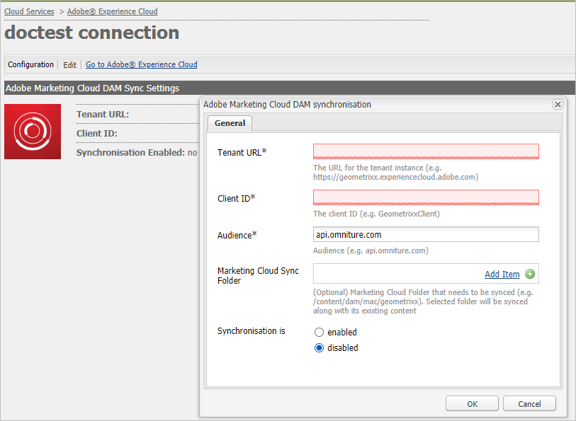

# Configurar la integración de AEM Assets con el Experience Cloud {#configure-aem-assets-integration-with-experience-cloud-and-creative-cloud}

Si es cliente de Adobe Experience Cloud, puede sincronizar los recursos dentro de Adobe Experience Manager Assets con Adobe Creative Cloud y viceversa. También puede sincronizar los recursos con el Experience Cloud y viceversa. Puede configurar esta sincronización mediante [!DNL Adobe I/O]. El nombre actualizado de [!DNL Adobe Marketing Cloud] es [!DNL Adobe Experience Cloud].

El flujo de trabajo para configurar esta integración es:

1. Cree una autenticación en [!DNL Adobe I/O] mediante una puerta de enlace pública y obtenga un ID de aplicación.
1. Cree un perfil en la instancia de AEM Assets con el ID de la aplicación.
1. Utilice esta configuración para sincronizar los recursos.

En el servidor back-end, el servidor AEM autentica el perfil con la puerta de enlace y, a continuación, sincroniza los datos entre Assets y el Experience Cloud.

>[!NOTE]
>
>Esta función está en desuso en AEM Assets. Busque reemplazos en [AEM y prácticas recomendadas de integración del Creative Cloud](/help/assets/aem-cc-integration-best-practices.md). Si tiene alguna consulta, [póngase en contacto con el Servicio de atención al cliente de Adobe](https://www.adobe.com/account/sign-in.supportportal.html).

<!-- Hiding this for now via cqdoc-16834.

>[!NOTE]
>
>Sharing assets between Adobe Experience Cloud and Adobe Creative Cloud requires administrator privileges on the AEM instance.
-->

## Crear una aplicación {#create-an-application}

1. Acceda a la interfaz de puerta de enlace del desarrollador de Adobe iniciando sesión en [https://legacy-oauth.cloud.adobe.io](https://legacy-oauth.cloud.adobe.io/).

   >[!NOTE]
   >
   >Se necesitan privilegios de administrador para crear un ID de aplicación.

1. En el panel izquierdo, vaya a **[!UICONTROL Herramientas para desarrolladores]** > **[!UICONTROL Aplicaciones]** para ver una lista de aplicaciones.
1. Haga clic en **[!UICONTROL Add]**  para crear una aplicación.
1. En la lista **[!UICONTROL Credenciales de cliente]**, seleccione **[!UICONTROL Cuenta de servicio (JWT Assertion)]**, que es un servicio de comunicación servidor a servidor para la autenticación de servidor.

   

1. Especifique un nombre para la aplicación y una descripción opcional.
1. En la lista **[!UICONTROL Organización]**, seleccione la organización para la que desea sincronizar los recursos.
1. En la lista **[!UICONTROL Scope]**, seleccione **[!UICONTROL dam-read]**, **[!UICONTROL dam-sync]**, **[!UICONTROL dam-write]** y **[!UICONTROL cc-share]**.
1. Haga clic en **[!UICONTROL Crear]**. Un mensaje notifica que se ha creado la aplicación.

   

1. Copie el **[!UICONTROL Application ID]** que se genera para la nueva aplicación.

   >[!CAUTION]
   >
   >Asegúrese de no copiar inadvertidamente el **[!UICONTROL Secreto de la aplicación]** en lugar del **[!UICONTROL ID de la aplicación]**.

## Agregar una nueva configuración al Experience Cloud {#add-a-new-configuration}

1. Haga clic en el logotipo de AEM en la interfaz de usuario de la instancia local de AEM Assets y vaya a **[!UICONTROL Tools]** > **[!UICONTROL Cloud Services]** > **[!UICONTROL Legacy Cloud Services]**.

1. Busque el servicio **[!UICONTROL Adobe Experience Cloud]**. Si no existen configuraciones, haga clic en **[!UICONTROL Configurar ahora]**. Si existen configuraciones, haga clic en **[!UICONTROL Mostrar configuraciones]** y haga clic en `+` para agregar una configuración nueva.

   >[!NOTE]
   >
   >Utilice una cuenta de Adobe ID con privilegios de administrador para la organización.

1. En el cuadro de diálogo **[!UICONTROL Crear configuración]**, especifique un título y un nombre para la nueva configuración y haga clic en **[!UICONTROL Crear]**.

   

1. En el campo **[!UICONTROL URL del inquilino]**, especifique la URL para AEM Assets. En el pasado, si la URL se definió como `https://<tenant_id>.marketing.adobe.com`, cámbiela por `https://<tenant_id>.experiencecloud.adobe.com`.

   1. Vaya a **Herramientas > Cloud Services > Servicios de nube heredados**. En Adobe Experience Cloud, haga clic en **Mostrar configuraciones**.
   1. Seleccione la configuración existente que desea editar. Edite la configuración y reemplace `marketing.adobe.com` por `experiencecloud.adobe.com`.
   1. Guarde la configuración. Pruebe los agentes de replicación MAC-sync.

1. En el campo **[!UICONTROL Client ID]**, pegue el ID de aplicación que ha copiado al final del procedimiento [crear una aplicación](#create-an-application).

   

1. En **[!UICONTROL Synchronization]** seleccione **[!UICONTROL Enabled]** para habilitar la sincronización y haga clic en **[!UICONTROL OK]**. Si selecciona **disabled**, la sincronización funciona en una sola dirección.

1. En la página de configuración, haga clic en **[!UICONTROL Mostrar clave pública]** para mostrar la clave pública generada para la instancia. También puede hacer clic en **[!UICONTROL Descargar clave pública para la puerta de enlace de OAuth]** para descargar el archivo que contiene la clave pública. A continuación, abra el archivo para mostrar la clave pública.

## Activar sincronización {#enable-synchronization}

1. Muestre la clave pública utilizando uno de los siguientes métodos mencionados en el último paso del procedimiento [añadir una nueva configuración al Experience Cloud](#add-a-new-configuration). Haga clic en **[!UICONTROL Mostrar clave pública]**.

1. Copie la clave pública y péguela en el campo **[!UICONTROL Public Key]** de la interfaz de configuración de la aplicación que ha creado en [crear una aplicación](#create-an-application).

   

1. Haga clic en **[!UICONTROL Update]**. Sincronice los recursos con la instancia de AEM Assets ahora.

## Probar la sincronización {#test-the-synchronization}

1. Haga clic en el logotipo de AEM en la interfaz de usuario de la instancia local de AEM Assets y vaya a **[!UICONTROL Tools]**> **[!UICONTROL Deployment]**> **[!UICONTROL Replication]* para localizar los perfiles de replicación creados para la sincronización.
1. En la página **[!UICONTROL Replication]**, haga clic en **[!UICONTROL Agents on author]**.
1. En la lista de perfiles, haga clic en el perfil de replicación predeterminado para que su organización lo abra.
1. En el cuadro de diálogo, haga clic en **[!UICONTROL Probar conexión]**.

   

1. Cuando se complete el resto de la replicación, compruebe si aparece un mensaje de éxito al final de los resultados de la prueba.

## Agregar usuarios al Experience Cloud {#add-users-to-experience-cloud}

1. Inicie sesión en el Experience Cloud con las credenciales del administrador.
1. Desde los carriles, vaya a **[!UICONTROL Administration]** y haga clic en **[!UICONTROL Launch Enterprise Dashboard]**.
1. En el carril , haga clic en **[!UICONTROL Usuarios]** para abrir la página **[!UICONTROL Administración de usuarios]**.
1. En la barra de herramientas, haga clic en **Add** .
1. Agregue uno o varios usuarios para poder compartir recursos con el Creative Cloud.

<!-- TBD: Check.
   >[!NOTE]
   >
   >Only the users that you add to Experience Cloud can share assets from AEM Assets to Creative Cloud.

-->

## Intercambiar recursos entre AEM Assets y el Experience Cloud {#exchange-assets-between-aem-and-experience-cloud}

1. Inicie sesión en AEM Assets.
1. En la consola Recursos, cree una carpeta y cargue algunos recursos en ella. Por ejemplo, cree una carpeta **mc-demo** y cargue un recurso en ella.
1. Seleccione la carpeta y haga clic en **Compartir** .
1. En el menú, seleccione **[!UICONTROL Adobe Experience Cloud]** y haga clic en **[!UICONTROL Compartir]**. Un mensaje notifica que la carpeta se comparte con el Experience Cloud.

   >[!NOTE]
   >
   >El uso compartido de una carpeta de recursos del tipo `sling:OrderedFolder` no se admite en el contexto del uso compartido en Adobe Experience Cloud. Si desea compartir una carpeta, al crearla en AEM Assets, no seleccione la opción **[!UICONTROL Pedido]**.

1. Actualice la interfaz de usuario de AEM Assets. La carpeta que ha creado en la consola Recursos de la instancia local de AEM Assets se copia en la interfaz de usuario del Experience Cloud. El recurso que se carga en la carpeta en AEM Assets aparece en la copia de la carpeta en el Experience Cloud después de que el servidor de AEM lo procese.
1. También puede cargar un recurso en la copia duplicada de la carpeta en el Experience Cloud . Una vez procesado, el recurso aparece en la carpeta compartida de AEM Assets.

<!-- Removing as per PM guidance via https://jira.corp.adobe.com/browse/CQDOC-16834?focusedCommentId=22881523&page=com.atlassian.jira.plugin.system.issuetabpanels:comment-tabpanel#comment-22881523.

## Exchange assets between AEM Assets and Creative Cloud {#exchange-assets-between-aem-assets-and-creative-cloud}

>[!CAUTION]
>
>The AEM to Creative Cloud Folder Sharing feature is deprecated. Customers are strongly advised to use newer capabilities, like [Adobe Asset Link](https://helpx.adobe.com/enterprise/using/adobe-asset-link.html) or [AEM desktop app](https://helpx.adobe.com/experience-manager/desktop-app/aem-desktop-app.html). Learn more in [AEM and Creative Cloud Integration Best Practices](/help/assets/aem-cc-integration-best-practices.md).

AEM Assets lets you share folders containing assets with Adobe Creative Cloud users.

1. In the Assets console, select the folder to share with Creative Cloud.
1. From the toolbar, click **[!UICONTROL Share]** .
1. From the list, select the **[!UICONTROL Adobe Creative Cloud]** option.

   >[!NOTE]
   >
   >The options are available for users with read permissions on the root. Users must have the required permission to access the replication agent information of Marketing Cloud.

1. In the **[!UICONTROL Creative Cloud Sharing]** page, add the user to share the folder with and choose a role for the user. Click **[!UICONTROL Save]** and click **[!UICONTROL OK]**.

1. Log on to Creative Cloud with the credentials of the user you shared the folder with. The shared folder is available in Creative Cloud.

The AEM Assets-Marketing Cloud synchronization is designed in a way that the user machine instance from where the asset is uploaded retains the right to modify the asset. Only these changes are propagated to the other instance.

For example, if an asset is uploaded from an AEM Assets (on premises) instance, the changes to the asset from this instance are propagated to the Marketing Cloud instance. However, the changes done from the Marketing Cloud instance to the same asset aren’t propagated to the AEM instance and vice versa for asset uploaded from Marketing Cloud.
-->

>[!MORELIKETHIS]
>
>* [Prácticas recomendadas para la integración de recursos y Creative Cloud](/help/assets/aem-cc-integration-best-practices.md)
>* [Prácticas recomendadas de uso compartido de recursos en carpetas de Creative Cloud](/help/assets/aem-cc-folder-sharing-best-practices.md)

