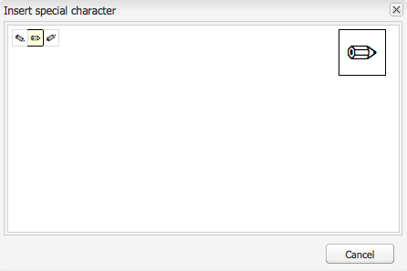

# Configuración de los complementos del Editor de texto enriquecido {#configure-the-rich-text-editor-plug-ins}

Las funcionalidades de RTE están disponibles a través de una serie de complementos, cada uno con propiedad de características. Puede configurar la propiedad de funciones para habilitar o deshabilitar, una o más características de RTE. Este artículo describe cómo configurar específicamente los complementos RTE.

Para obtener más información sobre las otras configuraciones de RTE, consulte [Configuración del editor de texto enriquecido](/help/sites-administering/rich-text-editor.md).

>[!NOTE]
>
>Al trabajar con CRXDE Lite, se recomienda guardar los cambios con regularidad mediante [!UICONTROL Guardar todo] .

## Activar un complemento y configurar la propiedad de funciones {#activateplugin}

Para activar un complemento, siga estos pasos. Algunos pasos solo son necesarios cuando configura un complemento por primera vez, ya que los nodos correspondientes no existen.

De forma predeterminada, `format`, `link`, `list`, `justify`y `control` Los complementos y todas sus características están activados en RTE.

>[!NOTE]
>
>Las `rtePlugins` el nodo se denomina `<rtePlugins-node>` para evitar duplicaciones en este artículo.

1. Con el CRXDE Lite , busque el componente de texto del proyecto.
1. Cree el nodo principal de `<rtePlugins-node>` si no existe, antes de configurar cualquier complemento RTE:

   * Según el componente, los nodos principales son:

      * `config: .../text/cq:editConfig/cq:inplaceEditing/config`
      * un nodo de configuración alternativo: `.../text/cq:editConfig/cq:inplaceEditing/inplaceEditingTextConfig`
      * `text: .../text/dialog/items/tab1/items/text`
   * Son del tipo: **jcr:primaryType** `cq:Widget`
   * Ambas tienen la siguiente propiedad:

      * **Nombre** `name`
      * **Tipo** `String`
      * **Valor** `./text`


1. En función de la interfaz para la que esté configurando, cree un nodo `<rtePlugins-node>`, si no existe:

   * **Nombre** `rtePlugins`
   * **Tipo** `nt:unstructured`

1. A continuación, cree un nodo para cada complemento que desee activar:

   * **Tipo** `nt:unstructured`
   * **Nombre** el ID del complemento requerido

Después de activar un complemento, siga estas directrices para configurar la variable `features` propiedad.

|  | Habilitar todas las funciones | Habilitar algunas funciones específicas | Deshabilitar todas las funciones |
|---|---|---|---|
| Nombre | características | características | características |
| Tipo | Cadena | Cadena[] (cadena múltiple; establezca Type en String y haga clic en Multi in CRXDE Lite) | Cadena |
| Valor | `*` (un asterisco) | se establece en uno o varios valores de función | - |

## Comprender el complemento Findreplace {#findreplace}

La variable `findreplace` no necesita ninguna configuración. Funciona de forma predeterminada.

Al utilizar la funcionalidad de reemplazo, la cadena de reemplazo que se va a reemplazar debe introducirse al mismo tiempo que la cadena de búsqueda. Sin embargo, puede hacer clic en Buscar para buscar la cadena antes de reemplazarla. Si se introduce la cadena de reemplazo después de hacer clic en Buscar, la búsqueda se restablecerá al principio del texto.

El cuadro de diálogo buscar y reemplazar se volverá transparente cuando se haga clic en buscar y se volverá opaco cuando se haga clic en reemplazar. Esto permitirá al autor revisar el texto que reemplazará. Si los usuarios hacen clic en reemplazar todo, el cuadro de diálogo se cerrará y mostrará el número de reemplazos realizados.

## Configuración de los modos de pegado {#paste-modes}

Al utilizar RTE, los autores pueden pegar contenido en uno de los tres modos siguientes:

* **Modo de explorador**: Pegue texto con la implementación de pegado predeterminada del explorador. No es un método recomendado, ya que puede introducir marcas no deseadas.

* **Modo de texto sin formato**: Pegue el contenido del portapapeles como texto sin formato. Elimina todos los elementos de estilo y formato del contenido copiado antes de insertarlos en [!DNL Experience Manager] componente.

* **Modo MS Word**: Pegue el texto, incluidas las tablas, con formato al copiar desde MS Word. No se admite la copia y el pegado de texto desde otro origen, como una página web o MS Excel, y solo se conserva el formato parcial.

### Configurar las opciones de pegado disponibles en la barra de herramientas de RTE  {#configure-paste-options-available-on-the-rte-toolbar}

Puede proporcionar algunos, todos o ninguno de estos tres iconos a sus autores en la barra de herramientas de RTE:

* **[!UICONTROL Pegar (Ctrl+V)]**: Se puede preconfigurar para que se corresponda con uno de los tres modos de pegado anteriores.

* **[!UICONTROL Pegar como texto]**: Proporciona funcionalidad de modo de texto sin formato.

* **[!UICONTROL Pegar desde Word]**: Proporciona funcionalidad de modo MS Word.

Para configurar RTE para que muestre los iconos necesarios, siga estos pasos.

1. Vaya al componente, por ejemplo `/apps/<myProject>/components/text`.
1. Vaya al nodo `rtePlugins/edit`. Consulte [activar un complemento](#activateplugin) si el nodo no existe.
1. Cree la variable `features` en la variable `edit` y agregue una o más de las funciones. Guarde todos los cambios.

### Configuración del comportamiento del icono y el acceso directo Pegar (Ctrl+V) {#configure-the-behavior-of-the-paste-ctrl-v-icon-and-shortcut}

Puede preconfigurar el comportamiento de la variable **[!UICONTROL Pegar (Ctrl+V)]** mediante los pasos siguientes. Esta configuración también define el comportamiento del método abreviado de teclado Ctrl+V que utilizan los autores para pegar contenido.

La configuración permite los tres tipos de casos de uso siguientes:

* Pegue texto con la implementación de pegado predeterminada del explorador. No es un método recomendado, ya que puede introducir marcas no deseadas. Configurado con `browser` más abajo.

* Pegue el contenido del portapapeles como texto sin formato. Elimina todos los elementos de estilo y formato del contenido copiado antes de insertarlos en AEM componente. Configurado con `plaintext` más abajo.

* Pegue el texto, incluidas las tablas, con formato al copiar desde MS Word. No se admite la copia y el pegado de texto desde otro origen, como una página web o MS Excel, y solo se conserva el formato parcial. Configurado con `wordhtml` más abajo.

1. En el componente, vaya a `<rtePlugins-node>/edit` nodo . Cree los nodos si no existen. Para obtener más información, consulte [activar un complemento](#activateplugin).
1. En el `edit` cree una propiedad mediante los siguientes detalles:

   * **Nombre** `defaultPasteMode`
   * **Tipo** `String`
   * **Valor** Uno de los modos de pegado necesarios `browser`, `plaintext`o `wordhtml`.

### Configurar los formatos permitidos al pegar contenido {#pasteformats}

Pegar como Microsoft-Word (`paste-wordhtml`) se puede configurar aún más para que pueda definir explícitamente qué estilos se permiten al pegar en AEM desde otro programa, como Microsoft Word.

Por ejemplo, si solo se deben permitir formatos y listas en negrita al pegar en AEM, puede filtrar los demás formatos. Esto se denomina filtrado de pegado configurable, que se puede hacer para ambos:

* [Texto](#paste-modes)
* [Vínculos](#linkstyles)

Para los vínculos, también puede definir los protocolos que se aceptan automáticamente.

Para configurar qué formatos se permiten al pegar texto en AEM desde otro programa:

1. En el componente, vaya al nodo . `<rtePlugins-node>/edit`. Cree los nodos si no existen. Para obtener más información, consulte [activar un complemento](#activateplugin).
1. Cree un nodo en el `edit` para guardar las reglas de pegado del HTML:

   * **Nombre** `htmlPasteRules`
   * **Tipo** `nt:unstructured`

1. Cree un nodo en `htmlPasteRules`, para incluir detalles de los formatos básicos permitidos:

   * **Nombre** `allowBasics`
   * **Tipo** `nt:unstructured`

1. Para controlar los formatos individuales aceptados, cree una o varias de las siguientes propiedades en la variable `allowBasics` nodo:

   * **Nombre** `bold`
   * **Nombre** `italic`
   * **Nombre** `underline`
   * **Nombre** `anchor` (para vínculos y anclajes con nombre)
   * **Nombre** `image`

   Todas las propiedades son de **Tipo** `Boolean`, de modo que en el **Valor** puede seleccionar o quitar la marca de verificación para habilitar o deshabilitar la funcionalidad.

   >[!NOTE]
   >
   >Si no se define explícitamente, se utiliza el valor predeterminado de true y se acepta el formato .

1. También se pueden definir otros formatos utilizando una serie de otras propiedades o nodos, aplicados también a la variable `htmlPasteRules` nodo . Guarde todos los cambios.

Puede utilizar las siguientes propiedades para `htmlPasteRules`.

| Propiedad | Tipo | Descripción |
|---|---|---|
| `allowBlockTags` | Cadena | Define la lista de etiquetas de bloque permitidas. Algunas etiquetas de bloque posibles son: <ul> <li>encabezados (h1, h2, h3)</li> <li>párrafos p)</li> <li>listas (ol, ul)</li> <li>tablas (tabla)</li> </ul> |
| `fallbackBlockTag` | Cadena | Define la etiqueta de bloque utilizada para cualquier bloque que tenga una etiqueta de bloque no incluida en `allowBlockTags`. `p` es suficiente en la mayoría de los casos. |
| tabla | nt:unstructured | Define el comportamiento al pegar tablas. Este nodo debe tener la propiedad `allow` (escriba Boolean) para definir si se permite pegar tablas. Si allow está configurado como `false`, debe especificar la propiedad `ignoreMode` (escriba String) para definir cómo se gestiona el contenido de la tabla pegada. Valores válidos para `ignoreMode` son: <ul> <li>`remove`: Quita el contenido de la tabla.</li> <li>`paragraph`: Convierte celdas de tabla en párrafos.</li> </ul> |
| list | nt:unstructured | Define el comportamiento al pegar listas. Debe tener la propiedad `allow` (escriba Boolean) para definir si se permite pegar listas. If `allow` está configurado como `false`, debe especificar la propiedad `ignoreMode` (escriba String) para definir cómo gestionar el contenido de la lista pegado. Valores válidos para `ignoreMode` son: <ul><li> `remove`: Elimina el contenido de la lista.</li> <li>`paragraph`: Convierte los elementos de la lista en párrafos.</li> </ul> |

Un ejemplo de una `htmlPasteRules` estructura a continuación.

```xml
"htmlPasteRules": {
    "allowBasics": {
        "italic": true,
        "link": true
    },
    "allowBlockTags": [
        "p", "h1", "h2", "h3"
    ],
    "list": {
        "allow": false,
        "ignoreMode": "paragraph"
    },
    "table": {
        "allow": true,
        "ignoreMode": "paragraph"
    }
}
```

## Configuración de estilos de texto {#textstyles}

Los autores pueden aplicar Estilos para cambiar el aspecto de una parte del texto. Los estilos se basan en clases CSS predefinidas en la hoja de estilos CSS. El contenido estilizado se incluye en `span` etiquetas que utilizan la variable `class` para hacer referencia a la clase CSS. Por ejemplo, `<span class=monospaced>Monospaced Text Here</span>`.

Cuando el complemento Estilos está habilitado por primera vez, no hay estilos predeterminados disponibles. La lista emergente está vacía. Para proporcionar a los autores estilos, haga lo siguiente:

* Habilite el selector desplegable Estilo .
* Especifique la ubicación de las hojas de estilo.
* Especifique los estilos individuales que se pueden seleccionar en la lista desplegable Estilo .

Para configuraciones posteriores, por ejemplo, para agregar más estilos, siga solamente las instrucciones para hacer referencia a una nueva hoja de estilo y especificar los estilos adicionales.

>[!NOTE]
>
>Puede definir Estilos para [tablas o celdas de tabla](/help/sites-administering/configure-rich-text-editor-plug-ins.md#tablestyles). Estas configuraciones requieren procedimientos separados.

### Habilitar la lista de selector desplegable Estilo {#styleselectorlist}

Esto se hace habilitando el complemento de estilos.

1. En el componente, vaya al nodo . `<rtePlugins-node>/styles`. Cree los nodos si no existen. Para obtener más información, consulte [activar un complemento](#activateplugin).
1. Cree la variable `features` en la variable `styles` nodo:

   * **Nombre** `features`
   * **Tipo** `String`
   * **Valor** `*` (asterisco)

1. Guarde todos los cambios.

>[!NOTE]
>
>Una vez habilitado el complemento Estilos, la lista desplegable Estilo se muestra en el cuadro de diálogo de edición. Sin embargo, la lista está vacía ya que no se ha configurado ningún estilo.

### Especificar la ubicación de la hoja de estilo {#locationofstylesheet}

A continuación, especifique la ubicación de las hojas de estilo a las que desea hacer referencia:

1. Vaya al nodo raíz del componente de texto, por ejemplo `/apps/<myProject>/components/text`.
1. Añadir la propiedad `externalStyleSheets` al nodo principal de `<rtePlugins-node>`:

   * **Nombre** `externalStyleSheets`
   * **Tipo** `String[]` (cadena múltiple; click **Multi** en CRXDE)
   * **Valores** Ruta y nombre de archivo de cada hoja de estilo que desee incluir. Utilice rutas de repositorio.

   >[!NOTE]
   >
   >Puede agregar referencias a hojas de estilo adicionales más adelante.

1. Guarde todos los cambios.

>[!NOTE]
>
>Al utilizar RTE en un cuadro de diálogo (IU clásica), es posible que desee especificar las hojas de estilo optimizadas para la edición de texto enriquecido. Debido a restricciones técnicas, el contexto de CSS se pierde en el editor, por lo que puede que desee emular este contexto para mejorar la experiencia WYSIWYG.
>
>El Editor de texto enriquecido utiliza un elemento DOM de contenedor con un ID de `CQrte` que pueden utilizarse para proporcionar distintos estilos de visualización y edición:
>
>`#CQ td {`
>` // defines the style for viewing }`
>
>`#CQrte td {`
>` // defines the style for editing }`

### Especifique los estilos disponibles en la lista emergente {#stylesindropdown}

1. En la definición del componente, vaya al nodo `<rtePlugins-node>/styles`, tal como se crea en [Activación del selector desplegable de estilo](#styleselectorlist).
1. Bajo el nodo `styles`, cree un nuevo nodo (también denominado `styles`) para que la lista esté disponible:

   * **Nombre** `styles`
   * **Tipo** `cq:WidgetCollection`

1. Cree un nuevo nodo en el `styles` para representar un estilo individual:

   * **Nombre**, puede especificar el nombre, pero debería ser adecuado para el estilo
   * **Tipo** `nt:unstructured`

1. Añadir la propiedad `cssName` a este nodo para hacer referencia a la clase CSS:

   * **Nombre** `cssName`
   * **Tipo** `String`
   * **Valor** El nombre de la clase CSS (sin un &#39;.&#39; anterior); por ejemplo, `cssClass` en lugar de `.cssClass`)

1. Añadir la propiedad `text` al mismo nodo; esto define el texto mostrado en el cuadro de selección:

   * **Nombre** `text`
   * **Tipo** `String`
   * **Valor** Descripción del estilo; aparece en el cuadro de selección desplegable Estilo .

1. Guarde los cambios.

   Repita los pasos anteriores para cada estilo necesario.

### Configurar RTE para saltos de palabras óptimos en japonés {#jpwordwrap}

Los autores que utilizan AEM para crear contenido en japonés pueden aplicar un estilo a los caracteres para evitar un salto de línea cuando no sea necesario un salto. Esto permite a los autores dejar que las frases rompan en la posición deseada. El estilo de esta funcionalidad se basa en la clase CSS predefinida en la hoja de estilos CSS.

>[!NOTE]
>
>Esta función requiere al menos AEM 6.5 Service Pack 1.

Para crear el estilo que los autores pueden aplicar al texto en japonés, siga estos pasos:

1. Cree un nuevo nodo en el nodo de estilos. Consulte [especificar un nuevo estilo](#stylesindropdown).
   * Nombre: `jpn-word-wrap`
   * Tipo: `nt:unstructure`

1. Añadir la propiedad `cssName` al nodo para hacer referencia a la clase CSS. Este nombre de clase es un nombre reservado para la función de ajuste de palabras en japonés.
   * Nombre: `cssName`
   * Tipo: `String`
   * Valor: `jpn-word-wrap` (sin precedente `.`)

1. Agregue el texto de la propiedad al mismo nodo. El valor es el nombre del estilo que los autores ven al seleccionar el estilo.
   * Nombre: `text`
*Tipo: 
`String`
   * Valor: `Japanese word-wrap`

1. Cree una hoja de estilo y especifique su ruta. Consulte [especificar la ubicación de la hoja de estilo](#locationofstylesheet). Agregue el siguiente contenido a la hoja de estilo. Cambie el color de fondo como desee.

   ```css
   .text span.jpn-word-wrap {
       display:inline-block;
   }
   .is-edited span.jpn-word-wrap {
       background-color: #ffddff;
   }
   ```

   

## Configuración de los formatos de párrafo {#paraformats}

Cualquier texto creado en RTE se coloca dentro de una etiqueta de bloque; el valor predeterminado es `<p>`. Al habilitar la variable `paraformat` , puede especificar etiquetas de bloque adicionales que se pueden asignar a los párrafos mediante una lista desplegable de selección. Los formatos de párrafo determinan el tipo de párrafo asignando la etiqueta de bloque correcta. El autor puede seleccionarlos y asignarlos mediante el selector de formato. Las etiquetas de bloque de ejemplo incluyen, entre otras, el párrafo estándar &lt;p> y encabezados &lt;h1>, &lt;h2>, etc.

>[!CAUTION]
>
>Este complemento no es adecuado para contenido con estructura compleja, como listas o tablas.

>[!NOTE]
>
>Si una etiqueta de bloque es, por ejemplo, una &lt;hr> , no se puede asignar a un párrafo, no es un caso de uso válido para un complemento de formato.

Cuando el complemento Formatos de párrafo está habilitado por primera vez, no hay disponibles formatos de párrafo predeterminados. La lista emergente está vacía. Para proporcionar a los autores formatos de párrafo, haga lo siguiente:

* Active la lista de selector desplegable Formato .
* Especifique las etiquetas de bloque que se pueden seleccionar como formatos de párrafo desde la lista desplegable.

Para las configuraciones posteriores (re-), digamos para añadir más formatos, siga solamente la parte relevante de las instrucciones.

### Activación del selector desplegable Formato {#formatselectorlist}

Primero habilite el complemento paraformat :

1. En el componente, vaya al nodo . `<rtePlugins-node>/paraformat`. Cree los nodos si no existen. Para obtener más información, consulte [activar un complemento](#activateplugin).
1. Cree la variable `features` en la variable `paraformat` nodo:

   * **Nombre** `features`
   * **Tipo** `String`
   * **Valor** `*` (asterisco)

>[!NOTE]
Si el complemento no está configurado, se habilitan los siguientes formatos predeterminados:
* Párrafo ( `<p>`)
* Encabezado 1 ( `<h1>`)
* Encabezado 2 ( `<h2>`)
* Encabezado 3 ( `<h3>`)
>


>[!CAUTION]
Al configurar los formatos de párrafo de RTE, no elimine la etiqueta de párrafo &lt;p> como opción de formato. Si la variable `<p>` se elimina, el autor del contenido no puede seleccionar la etiqueta **Formatos de párrafo** incluso si hay otros formatos configurados.

### Especificar los formatos de párrafo disponibles {#paraformatsindropdown}

Los formatos de párrafo pueden seleccionarse mediante:

1. En la definición del componente, vaya al nodo `<rtePlugins-node>/paraformat`, tal como se crea en [Activación del selector desplegable de formato](#styleselectorlist).
1. En el `paraformat` crear un nodo nuevo, para guardar la lista de formatos:

   * **Nombre** `formats`
   * **Tipo** `cq:WidgetCollection`

1. Cree un nuevo nodo en el `formats` , contiene detalles de un formato individual:

   * **Nombre**, puede especificar el nombre, pero debería ser adecuado para el formato (por ejemplo, myParagraph, myheader1).
   * **Tipo** `nt:unstructured`

1. A este nodo, añada la propiedad para definir la etiqueta de bloque utilizada:

   * **Nombre** `tag`
   * **Tipo** `String`
   * **Valor** La etiqueta de bloque del formato; por ejemplo: p, h1, h2, etc.

      No es necesario introducir los corchetes angulares delimitadores.

1. Al mismo nodo agregue otra propiedad para que el texto descriptivo aparezca en la lista desplegable:

   * **Nombre** `description`
   * **Tipo** `String`
   * **Valor** Texto descriptivo para este formato; por ejemplo, Párrafo, Encabezado 1, Encabezado 2, etc. Este texto se muestra en la lista de selección Formato.

1. Guarde los cambios.

   Repita los pasos para cada formato necesario.

>[!CAUTION]
Si define formatos personalizados, los formatos predeterminados (`<p>`, `<h1>`, `<h2>`y `<h3>`). Volver a crear `<p>` ya que es el formato predeterminado.

## Configuración de caracteres especiales {#spchar}

En una instalación de AEM estándar, cuando la variable `misctools` está habilitado para caracteres especiales (`specialchars`) una selección predeterminada está disponible inmediatamente para su uso; por ejemplo, los símbolos copyright y marca comercial.

Puede configurar el RTE para que su propia selección de caracteres esté disponible; definiendo caracteres distintos o una secuencia completa.

>[!CAUTION]
Al añadir sus propios caracteres especiales, se anula la selección predeterminada. Si es necesario, (vuelva a)definir estos caracteres en su propia selección.

### Definir un solo carácter {#definesinglechar}

1. En el componente, vaya al nodo . `<rtePlugins-node>/misctools`. Cree los nodos si no existen. Para obtener más información, consulte [activar un complemento](#activateplugin).
1. Cree la variable `features` en la variable `misctools` nodo:

   * **Nombre** `features`
   * **Tipo** `String[]`
   * **Valor** `specialchars`

          (o `String / *` si se aplican todas las funciones de este complemento)

1. En `misctools` cree un nodo para mantener las configuraciones de caracteres especiales:

   * **Nombre** `specialCharsConfig`
   * **Tipo** `nt:unstructured`

1. En `specialCharsConfig` cree otro nodo para guardar la lista de caracteres:

   * **Nombre** `chars`
   * **Tipo** `nt:unstructured`

1. En `chars` agregue un nuevo nodo para mantener una definición de carácter individual:

   * **Nombre** puede especificar el nombre, pero debe reflejar el carácter; por ejemplo, la mitad.
   * **Tipo** `nt:unstructured`

1. A este nodo agregue la siguiente propiedad:

   * **Nombre** `entity`
   * **Tipo** `String`
   * **Valor** la representación del HTML del carácter requerido; por ejemplo, `&189;` para la fracción una mitad.

1. Guarde los cambios.

En CRXDE, una vez guardada la propiedad, se muestra el carácter representado. Consulte a continuación el ejemplo de la mitad. Repita los pasos anteriores para que los autores tengan más caracteres especiales disponibles.


### Definir un rango de caracteres {#definerangechar}

1. Utilice los pasos del 1 al 3 desde [Definición de un solo carácter](#definesinglechar).
1. En `chars` agregue un nuevo nodo para mantener la definición del rango de caracteres:

   * **Nombre** puede especificar el nombre, pero debe reflejar el intervalo de caracteres; por ejemplo, lápices.
   * **Tipo** `nt:unstructured`

1. Bajo este nodo (cuyo nombre depende del rango de caracteres especial), agregue las dos propiedades siguientes:

   * **Nombre** `rangeStart`

      **Tipo** `Long`
      **Valor** el [Unicode](https://unicode.org/) representación (decimal) del primer carácter del rango

   * **Nombre** `rangeEnd`

      **Tipo** `Long`
      **Valor** el [Unicode](https://unicode.org/) representación (decimal) del último carácter del rango

1. Guarde los cambios.

   Por ejemplo, si define un intervalo de 9998 a 1000, obtendrá los siguientes caracteres.

   

   *Figura: En CRXDE, defina un rango de caracteres para que estén disponibles en RTE*

   

## Configuración de estilos de tabla {#tablestyles}

Los estilos se suelen aplicar al texto, pero también se puede aplicar un conjunto independiente de estilos en una tabla o en unas pocas celdas de la tabla. Estos estilos están disponibles para los autores del cuadro de selector Estilo de las propiedades Celda o Propiedades de tabla. Los estilos están disponibles al editar una tabla dentro de un componente de texto (o derivado) y no en el componente de tabla estándar.

>[!NOTE]
Puede definir estilos para tablas y celdas solo para la IU clásica.

>[!NOTE]
Copiar y pegar tablas en o desde el componente RTE depende del explorador. No es compatible de serie para todos los exploradores. Puede obtener resultados variados según la estructura de la tabla y el navegador. Por ejemplo, cuando copia y pega una tabla en un componente RTE en Mozilla Firefox en la IU clásica y la IU táctil, no se conserva el diseño de la tabla.

1. Dentro del componente, vaya al nodo `<rtePlugins-node>/table`. Cree los nodos si no existen. Para obtener más información, consulte [activar un complemento](#activateplugin).
1. Cree la variable `features` en la variable `table` nodo:

   * **Nombre** `features`
   * **Tipo** `String`
   * **Valor** `*` (asterisco)

   >[!NOTE]
   Si no desea habilitar todas las funciones de la tabla, puede crear la variable `features` como:
   * **Tipo** `String[]`
   * **Valor** s) una, o ambas, de las siguientes, según sea necesario:
      * `table` permitir la edición de las propiedades de la tabla; incluidos los estilos.
      * `cellprops` para permitir la edición de propiedades de celda, incluidos los estilos.


1. Defina la ubicación de las hojas de estilo CSS para consultarlas. Consulte [Especificación de la ubicación de la hoja de estilo](#locationofstylesheet) ya que esto es lo mismo que al definir [estilos para texto](#textstyles). La ubicación se puede definir si ha definido otros estilos.
1. En el `table` cree los siguientes nodos nuevos (según sea necesario):

   * Definición de estilos para toda la tabla (disponible en **Propiedades de tabla**):

      * **Nombre** `tableStyles`
      * **Tipo** `cq:WidgetCollection`
   * Definición de estilos para celdas individuales (disponibles en **Propiedades de celda**):

      * **Nombre** `cellStyles`
      * **Tipo** `cq:WidgetCollection`


1. Cree un nuevo nodo (en la sección `tableStyles` o `cellStyles` como corresponda) para representar un estilo individual:

   * **Nombre** puede especificar el nombre, pero debe reflejar el estilo.
   * **Tipo** `nt:unstructured`

1. En este nodo, cree las propiedades:

   * Definición del estilo CSS al que se hace referencia

      * **Nombre** `cssName`
      * **Tipo** `String`
      * **Valor** el nombre de la clase CSS (sin un `.`, por ejemplo, `cssClass` en lugar de `.cssClass`)
   * Definición de un texto descriptivo para que aparezca en el selector desplegable

      * **Nombre** `text`
      * **Tipo** `String`
      * **Valor** el texto que aparecerá en la lista de selección


1. Guarde todos los cambios.

Repita los pasos anteriores para cada estilo necesario.

### Configuración de encabezados ocultos en tablas para accesibilidad {#hiddenheader}

A veces, puede crear tablas de datos sin texto visual en el encabezado de una columna suponiendo que el propósito del encabezado esté implícito en la relación visual de la columna con otras columnas. En este caso, es necesario proporcionar texto interno oculto dentro de la celda en la celda del encabezado para permitir que los lectores de pantalla y otras tecnologías de asistencia ayuden a los lectores con distintas necesidades a comprender el propósito de la columna.

Para mejorar la accesibilidad en estos escenarios, RTE admite celdas de encabezado ocultas. Además, proporciona ajustes de configuración relacionados con encabezados ocultos en tablas. Esta configuración le permite aplicar estilos CSS en encabezados ocultos en los modos de edición y previsualización. Para ayudar a los autores a identificar encabezados ocultos en el modo de edición, incluya los siguientes parámetros en el código:

* `hiddenHeaderEditingCSS`: Especifica el nombre de la clase CSS que se aplica en la celda de encabezado oculto, cuando se edita RTE.
* `hiddenHeaderEditingStyle`: Especifica una cadena de estilo que se aplica en la celda de encabezado oculto cuando se edita RTE.

Si especifica la CSS y la cadena Estilo en el código, la clase CSS tiene prioridad sobre la cadena de estilo y puede sobrescribir cualquier cambio de configuración que realice la cadena Estilo.

Para ayudar a los autores a aplicar CSS en encabezados ocultos en el modo de vista previa, puede incluir los siguientes parámetros en el código:

* `hiddenHeaderClassName`: Especifica el nombre de la clase CSS que se aplica en la celda de encabezado oculto en el modo de vista previa.
* `hiddenHeaderStyle`: Especifica una cadena Style que se aplica a la celda de encabezado oculto en el modo de vista previa.

Si especifica la CSS y la cadena Estilo en el código, la clase CSS tiene prioridad sobre la cadena de estilo y puede sobrescribir cualquier cambio de configuración que realice la cadena Estilo.

## Agregar diccionarios para el corrector ortográfico {#adddict}

Cuando se activa el complemento de revisión ortográfica, el RTE utiliza diccionarios para cada idioma adecuado. A continuación, se seleccionan según el idioma del sitio web tomando la propiedad de idioma del subárbol o extrayendo el idioma de la dirección URL; por ejemplo. el `/en/` la rama está marcada como Inglés, la variable `/de/` como alemán.

>[!NOTE]
El mensaje `Spell checking failed` se ve si se intenta realizar una comprobación para un idioma que no está instalado. Los diccionarios estándar se encuentran en `/libs/cq/spellchecker/dictionaries`, junto con los archivos Léame adecuados. No modifique los archivos.

Una instalación de AEM estándar incluye los diccionarios para inglés americano (`en_us`) e inglés británico (`en_gb`). Para agregar más diccionarios, siga estos pasos.

1. Vaya a la página [https://extensions.openoffice.org/](https://extensions.openoffice.org/).

1. Realice una de las siguientes acciones para encontrar el diccionario que elija:

   * Busque el diccionario de su elección de idioma. En la página de diccionario, busque el vínculo a la página web del autor o la fuente original. Busque los archivos de diccionario para v2.x en una página de este tipo.
   * Busque archivos de diccionario v2.x en [https://wiki.openoffice.org/wiki/User:Khirano/Dictionaries](https://wiki.openoffice.org/wiki/User:Khirano/Dictionaries).

1. Descargue el archivo con las definiciones ortográficas. Extraiga el contenido del archivo en su sistema de archivos.

   >[!CAUTION]
   Solo los diccionarios de la sección `MySpell` para OpenOffice.org v2.0.1 o anterior, son compatibles. Como los diccionarios ahora son archivos de archivo, se recomienda que verifique el archivo después de descargarlo.

1. Busque los archivos .aff y .dic . Mantener nombre de archivo en minúsculas. Por ejemplo, `de_de.aff` y `de_de.dic`.
1. Cargue los archivos .aff y .dic en el repositorio en `/apps/cq/spellchecker/dictionaries`.

>[!NOTE]
El corrector ortográfico RTE está disponible bajo demanda. No se ejecuta automáticamente cuando empieza a escribir texto. Para ejecutar el corrector ortográfico, haga clic en [!UICONTROL Corrector ortográfico] en la barra de herramientas. RTE comprueba la ortografía de las palabras y resalta las palabras mal escritas.
Si incorpora cualquier cambio que sugiera el corrector ortográfico, el estado del texto cambia y las palabras mal escritas ya no se resaltan. Para ejecutar el corrector ortográfico, toque o haga clic de nuevo en el botón corrector ortográfico.

## Configurar el tamaño del historial para acciones de deshacer y rehacer {#undohistory}

RTE permite a los autores deshacer o rehacer algunas de las últimas ediciones. De forma predeterminada, se almacenan 50 ediciones en el historial. Puede configurar este valor según sea necesario.

1. Dentro del componente, vaya al nodo `<rtePlugins-node>/undo`. Cree estos nodos si no existen. Para obtener más información, consulte [activar un complemento](#activateplugin).
1. En el `undo` crea la propiedad :

   * **Nombre** `maxUndoSteps`
   * **Tipo** `Long`
   * **Valor** número de pasos de deshacer que desea guardar en el historial. El valor predeterminado es 50. Uso `0` para desactivar/rehacer por completo.

1. Guarde los cambios.

## Configuración del tamaño de la pestaña {#tabsize}

Cuando se presiona el carácter de tabulación dentro de cualquier texto, se inserta un número predefinido de espacios. de forma predeterminada, se trata de tres espacios de no separación y un espacio.

Para definir el tamaño de la pestaña:

1. En el componente, vaya al nodo . `<rtePlugins-node>/keys`. Cree los nodos si no existen. Para obtener más información, consulte [activar un complemento](#activateplugin).
1. En el `keys` crea la propiedad :

   * **Nombre** `tabSize`
   * **Tipo** `String`
   * **Valor** el número de caracteres de espacio que se utilizarán en el tabulador

1. Guarde los cambios.

## Definir margen de sangría {#indentmargin}

Cuando la sangría está activada (opción predeterminada), puede definir el tamaño de la sangría:

>[!NOTE]
Este tamaño de guión solo se aplica a los párrafos (bloques) del texto; no afecta a la sangría de listas reales.

1. Dentro del componente, vaya al nodo `<rtePlugins-node>/lists`. Cree estos nodos si no existen. Para obtener más información, consulte [activar un complemento](#activateplugin).
1. En el `lists` crear el nodo `identSize` parámetro:

   * **Nombre**: `identSize`
   * **Tipo**: `Long`
   * **Valor**: número de píxeles necesarios para el margen de sangría.

## Configuración de la altura del espacio editable {#editablespace}

>[!NOTE]
Esto solo es aplicable cuando se utiliza el RTE en un cuadro de diálogo (no la edición in situ en la IU clásica).

Puede definir la altura del espacio editable que se muestra en el cuadro de diálogo del componente:

1. En el `../items/text` en la definición del cuadro de diálogo para el componente, cree una nueva propiedad:

   * **Nombre** `height`
   * **Tipo** `Long`
   * **Valor** la altura del lienzo de edición en píxeles.

   >[!NOTE]
   Esto no cambia la altura de la ventana de diálogo.

1. Guarde los cambios.

## Configuración de estilos y protocolos para vínculos {#linkstyles}

Al agregar vínculos en AEM, puede definir:

* Los estilos CSS que se van a utilizar
* Los protocolos aceptados automáticamente

Para configurar cómo se agregan vínculos en AEM desde otro programa, defina las reglas del HTML.

1. Con el CRXDE Lite , busque el componente de texto del proyecto.
1. Crear un nuevo nodo en el mismo nivel que `<rtePlugins-node>`, es decir, cree el nodo bajo el nodo principal de `<rtePlugins-node>`:

   * **Nombre** `htmlRules`
   * **Tipo** `nt:unstructured`

   >[!NOTE]
   La variable `../items/text` tiene la propiedad :
   * **Nombre** `xtype`
   * **Tipo** `String`
   * **Valor** `richtext`

   La ubicación de `../items/text` puede variar, dependiendo de la estructura del cuadro de diálogo; dos ejemplos son `/apps/myProject>/components/text/dialog/items/text` y `/apps/<myProject>/components/text/dialog/items/panel/items/text`.

1. En `htmlRules`, cree un nuevo nodo.

   * **Nombre** `links`
   * **Tipo** `nt:unstructured`

1. En el `links` define las propiedades según sea necesario:

   * Estilo CSS para vínculos internos:

      * **Nombre** `cssInternal`
      * **Tipo** `String`
      * **Valor** el nombre de la clase CSS (sin un &#39;.&#39; anterior); por ejemplo, `cssClass` en lugar de `.cssClass`)
   * Estilo CSS para vínculos externos

      * **Nombre** `cssExternal`
      * **Tipo** `String`
      * **Valor** el nombre de la clase CSS (sin un &#39;.&#39; anterior); por ejemplo, `cssClass` en lugar de `.cssClass`)
   * Matriz válida **protocolos**. Los protocolos admitidos son `http://`, `https://`, `file://`y `mailto:`.

      * **Nombre** `protocols`
      * **Tipo** `String[]`
      * **Valor** s) uno o más protocolos
   * **defaultProtocol** (propiedad del tipo **Cadena**): Protocolo que se utilizará si el usuario no especificó uno explícitamente.

      * **Nombre** `defaultProtocol`
      * **Tipo** `String`
      * **Valor**(s) uno o más protocolos predeterminados
   * Definición de cómo gestionar el atributo target de un vínculo. Cree un nuevo nodo:

      * **Nombre** `targetConfig`
      * **Tipo** `nt:unstructured`

      En el nodo `targetConfig`: defina las propiedades requeridas:

      * Especifique el modo de destino:

         * **Nombre** `mode`
         * **Tipo** `String`)
         * **Valor** s) :

            * `auto`: significa que se elige un objetivo automático

               (especificado por el `targetExternal` propiedad para vínculos externos o `targetInternal` para vínculos internos).

            * `manual`: no aplicable en este contexto
            * `blank`: no aplicable en este contexto
      * El objetivo para los vínculos internos:

         * **Nombre** `targetInternal`
         * **Tipo** `String`
         * **Valor** el destino de los vínculos internos (solo se utiliza cuando el modo es `auto`)
      * El destino de los vínculos externos:

         * **Nombre** `targetExternal`
         * **Tipo** `String`
         * **Valor** el destino de los vínculos externos (solo se usa cuando el modo es `auto`).


1. Guarde todos los cambios.
