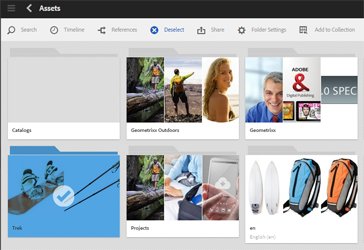

# Uso compartido de carpetas con Adobe Creative Cloud {#folder-sharing-with-adobe-creative-cloud}

>[!CAUTION]
>
>La función AEM to Creative Cloud Folder Sharing está en desuso. Se recomienda encarecidamente a los clientes que utilicen funciones más nuevas, como [Adobe Asset Link](https://helpx.adobe.com/enterprise/using/adobe-asset-link.html) o la aplicación [de escritorio](https://helpx.adobe.com/experience-manager/desktop-app/aem-desktop-app.html)AEM. Obtenga más información sobre las optimizaciones para la integración de [AEM y Creative Cloud](/help/assets/aem-cc-integration-best-practices.md).

Recursos Adobe Experience Manager (AEM) le permite compartir carpetas que contengan recursos con usuarios de Adobe Creative Cloud. Para obtener más información sobre cómo configurar Adobe Marketing Cloud para que pueda compartir recursos con Adobe Creative Cloud, consulte [Configuración de la integración](/help/sites-administering/configure-assets-cc-integration.md)de Assets-Creative Cloud.

1. En la consola Recursos, seleccione una carpeta para compartir con Creative Cloud.

   

1. En la barra de herramientas, haga clic en **Compartir**.

   

1. En la lista, seleccione la opción **Adobe Creative Cloud** .

   

1. En la página Uso compartido **de** Creative Cloud, agregue el usuario para compartir la carpeta y, a continuación, haga clic en **Guardar**.

   

1. Haga clic en **Aceptar** para cerrar el mensaje de confirmación.
1. Inicie sesión en Creative Cloud con las credenciales del usuario con el que ha compartido la carpeta. La carpeta compartida está disponible en Creative Cloud.